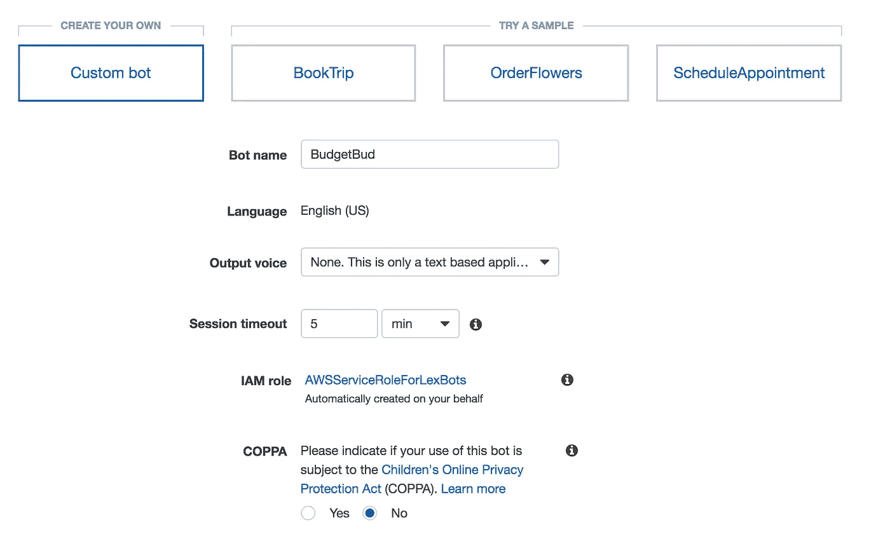
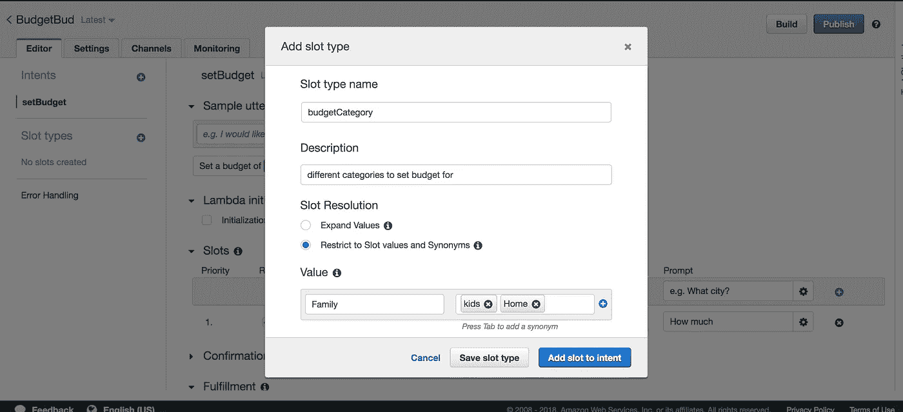
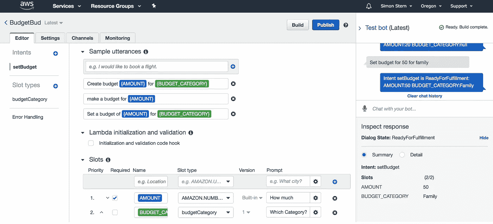
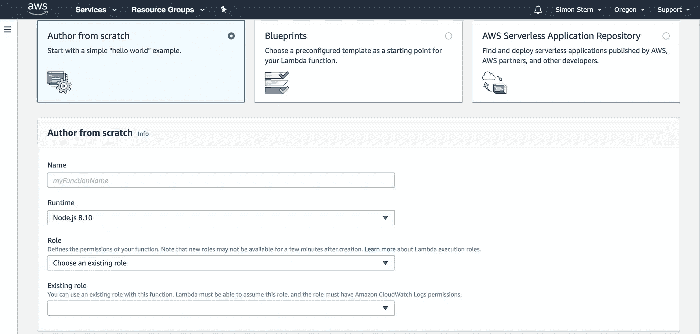
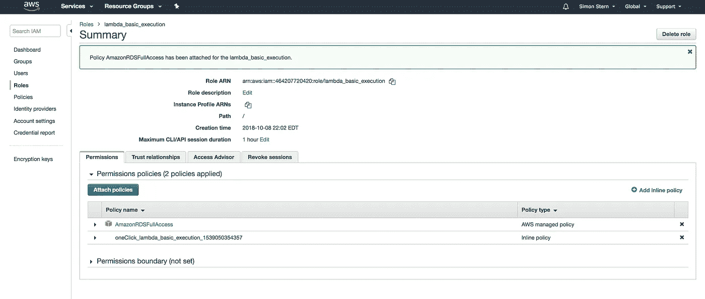
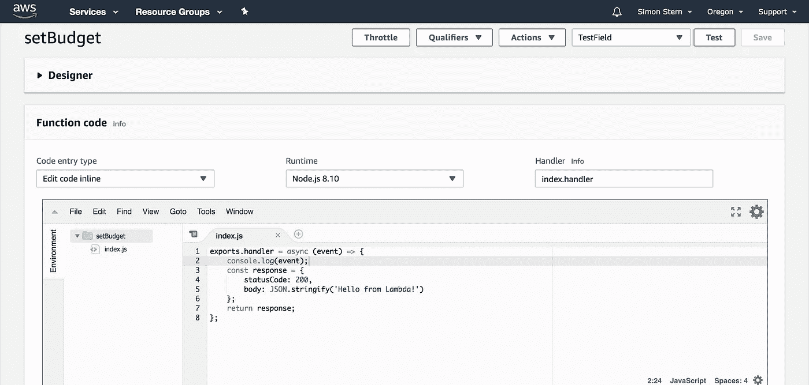
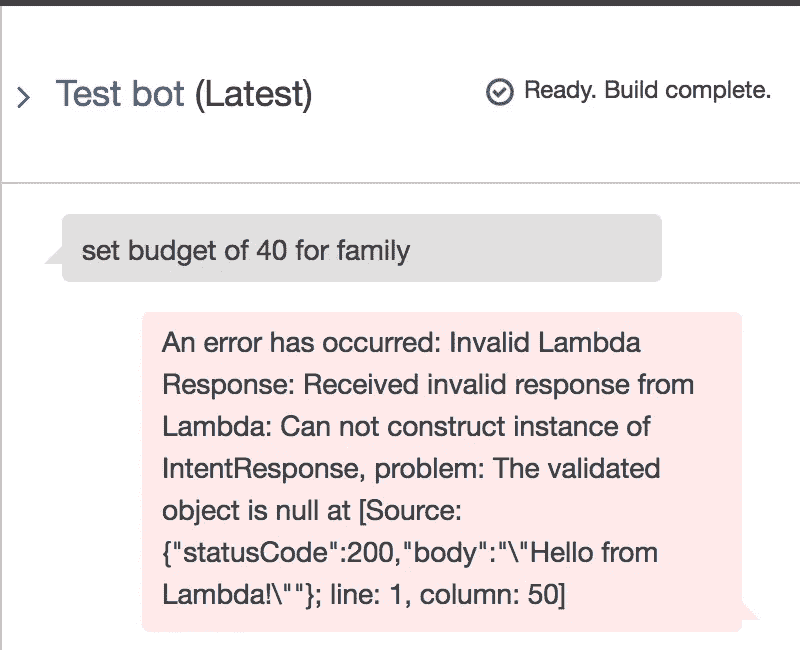
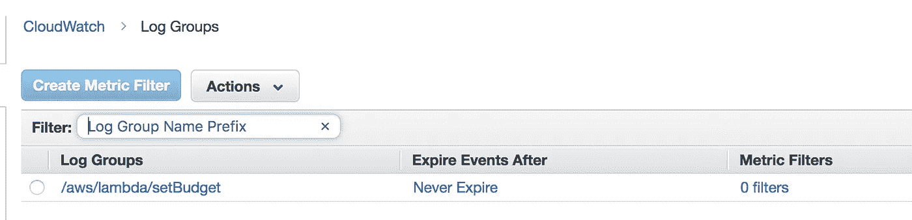
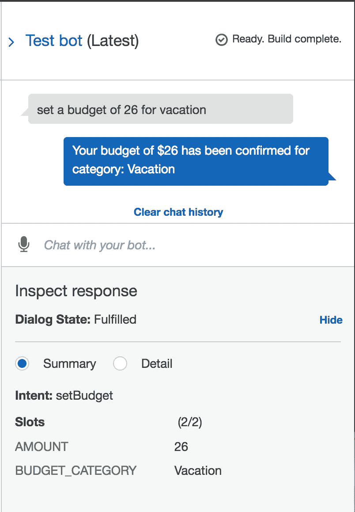

# 用 AWS Lex、Lambda 和 Amazon Aurora 构建一个无服务器聊天机器人:第 1 部分。

> 原文：<https://medium.com/hackernoon/building-a-serverless-chatbot-with-aws-lex-lambda-and-amazon-aurora-part-1-5406e8db6123>

*订阅*[*https://easy aws . ca*](https://www.easyaws.ca/signup)*获取更多好玩的 AWS 教程和资源！*

无服务器技术将长期存在，[无服务器架构对您的应用或产品的好处是巨大的。在本教程中，我们将使用 AWS Lex 部署一个小型聊天机器人来帮助用户设置各种预算，并检查他们的预算。我们将在这里探讨 AWS 服务的组合，以及如何将它们缝合在一起以创建一个强大的、可伸缩的和安全的应用程序。要完成本教程，您需要:一个 AWS 帐户，AWS UI 的基本知识，以及对 node/express 的一些基本了解。](https://martinfowler.com/articles/serverless.html)

# 步骤 1:部署 Lex bot

在你的 AWS 控制台中，找到 Amazon Lex 并点击它。单击蓝色的 **Get Started** 按钮，然后在下一个屏幕上，单击 **Custom Bot。**请注意，如果您愿意探索，这里还有其他示例！



在下一个屏幕上，您将看到一个**创造意向的机会。**意图**是用户想要实现的目标或动作。把意图想象成用户想要向你的机器人发送消息的特定原因。让我们创建一个意向，称之为 SetBudget。一旦我们这样做了，迎接我们的是另一个屏幕，有一大堆输入选项。让我们首先关注**插槽**。**

插槽是 Lex 的变量。如果有人点了一份披萨，那么要包含的位置应该是像{SIZE}、{PIZZA_TYPE}和{DELIVERY_ADDRESS}这样的内容。对于我们的聊天机器人，我们将有两个插槽。{金额}和{预算 _ 类别}。关于插槽和不同的插槽类型有很多要讨论的，所以我鼓励你在定义自己的插槽之前看看 amazon 已经提供了什么。

1.  创建一个名为 AMOUNT 的槽。将插槽类型设置为 AMAZON。数字，选中所需的复选框，对于提示，键入“您想要设置的最大预算是多少？”。如果这个时隙出现在意图的样本话语中，那么如果他们没有提供 AMOUNT 的值，则提示将出现。在我们的例子中，我们将需要这个值，所以包含一个提示并确保这是必需的是一个重要的步骤！

2.在仪表板的左侧，您会看到一个创建**插槽类型**的选项。点击它，并填写值，用我们将要设置的值创建一个新的**插槽变量。**



Note that you can add synonyms for values, and the **expand values** option. Expand Values lets Lex use machine learning to add similar words to your slot list, letting it grow beyond your list of associated words.

设置几个你希望包含在广告位中的预算。我已经包括了家庭、假期、存款和汽车。注意**扩展值**和**限制为槽值和同义词**复选框。Expand Values 允许您让 Lex 使用其自然语言处理和 amazons 机器学习来填充您认为应该包含的单词。出于我们的目的，我们不需要它，但它是一个重要的特性，随着应用程序的增长，它会派上用场。

1.  创建另一个名为 BUDGET_CATEGORY 的插槽，并将插槽类型设置为新的 budgetCategory 插槽类型。请注意插槽和插槽类型之间的差异。诀窍在于 NLP 需要识别一个值是一个槽，并解析该槽的实际值。令人惊讶的是，它大部分时间都是正确的！
2.  现在我们已经定义了我们的插槽，让我们返回并创建一个意图。根据您的意图添加以下内容:

```
Set a budget of ​{AMOUNT}​ for ​{BUDGET_CATEGORY}​
Create budget ​{AMOUNT}​ for ​{BUDGET_CATEGORY}​
make a budget for ​{AMOUNT}​ 
```

加入你能想到的任何其他的话语变体，但是保持它相对短到 2-3 个不同的变体。请注意，我在最后一句话中没有包括 BUDGET_CATEGORY。如果不包括这个变量，我们将在“一般”类别下创建一个预算。

3.如果您愿意，可以添加一个**确认提示**。我没有包括一个，但是根据你意图的性质，这可能是重要的。

4.对于 **Fulfillment，**您可以选择将意图发送给 lambda 函数，或者将参数返回给客户端。现在，让我们单击**将参数返回到客户端**并单击保存。在转移到亚马逊 Lambda 并创建聊天机器人的业务逻辑之前，我们将检查我们的机器人。向下滚动并保存您的意图。

5.现在来点好玩的！在仪表板的右上角，点击**构建。这将初始化您的聊天机器人，并允许您开始测试它。屏幕右侧应该会弹出一个聊天窗口。试试吧！**



As you can see, Amount for 50 and Category of Family is successfully captured by the chatbot. Wow! Make sure to try with the required prompts as well to validate they are being requested.

太棒了，我们的莱克斯聊天机器人已经准备好了。我们的下一步是给它附加一个 **Lambda** 函数。对于本教程的其余部分，我们将简单地接收 lambda 中的槽及其值，并以 Lex 理解的方式返回它们。**本教程的第二部分**将包括一个无服务器的 Amazon Aurora 数据库来存储数据，以及一个事件警报来触发另一个 lambda 函数，如果他们设置的预算非常高的话。第二个 lambda 函数会将用户添加到一个我们可能会纠缠以向其出售商品的豪赌者列表中。不过，出于我们的目的，它将演示 Lambda 函数的链接和无服务器中的许多模式之一。

# 步骤 2:部署 Lambda 函数

在你的 AWS 控制台中，进入 **Amazon Lambda** 并选择**从头构建一个功能。**在下一个屏幕中，您可以选择构建自定义功能或选择蓝图。蓝图是很好的例子，我强烈推荐你去看看，以增强你的知识。



Choose a name for your function, a runtime (we will be using Node.js 8.10) and select “New role” when specifying the role.

出于我们的目的，从头开始选择**作者**，并在表单中填写您的函数名、运行时环境(对于本教程为 Node.js 8.10)和**角色。**这是一个很好的时机来提及 Lambda 函数是没有权限的。为了允许您的 lambda 函数与其他 AWS 服务交互，您需要为该函数选择一个角色。对于我们的 setBudget 函数，您将需要一个可以对 RDS 进行读/写的自定义角色，因此我们将快速创建该角色！

按照说明创建角色，并将其分配给此功能。完成后，打开一个新的标签，前往服务，并寻找我。在 IAM 中，找到 roles dashboard，您应该会看到您创建的新角色。将允许完全 RDS 访问的策略附加到此角色。



Lambda Functions take on an IAM Role during execution. This role can have specific policies attached outlining exactly which AWS services it can interact with and how. Don’t forget Roles and IAM users always start off with **zero permissions.**

一旦创建了您的角色并附加了策略，请检查您的 Lambda 函数。现在，您应该能够从下拉列表中选择该角色来创建您的函数了！

在下一个屏幕上，您将看到 lambda 函数、设计工具和一些用于测试和监控您的函数的仪表板项目。第一次点击 **Test** 时，您将被要求提供一个 JSON 片段来描述测试输入应该是什么。



For our purposes, lets focus on the **Test** function in the top right corner which allows us to invoke our function. We can also edit the index.js document which contains the entirety of the function and modify it as we need. Note the function appears very similar to a standard express endpoint, returning a JSON response with a status code (200) and a stringified JSON body.

现在，我们要做的就是添加以下内容:

```
console.log(event)
```

作为我们函数的第一行。`event`变量包括我们从 lex 接收的数据，所以我们将记录它，看看它是什么样子！

现在我们的函数创建好了，它有了需要的角色，它可以返回一个响应，我们看起来不错！让我们检查一下我们的 Lex 仪表板，重新审视我们的 setBudget 意图。

如果我们向下滚动 **setBudget Intent** 至 fulfillment，我们现在可以选择 AWS Lambda 函数并选择我们的 setBudget 函数。确保您的版本/别名设置为最新，否则您可能看不到更新！(这是一个可怕的错误，我不希望它发生在任何人身上)。构建机器人，让我们测试我们的集成！

输入一个意向，让我们看看会得到什么。



Oh no! Our Lambda has returned an invalid response!

哦不！如你所见，出现了一个错误，我们没有收到 Lex 可以解释的 Lambda 的正确响应。我们要纠正这一点！但是首先，让我们也在 cloudwatch 上检查一下，看看我们的**意图**，以及它(希望)填充的**槽**，在 lambda 中实际上是什么样子。

1.  转到 cloudwatch，点击日志。您应该看到 setBudget Lambda 函数的日志组。



2.单击该日志组，然后单击最新的日志，将向您显示我们的 lambda 函数的最新输出。 **Cloudwatch 捕捉一切**，是一个非常强大的工具，可以确保您适当地优化您的 lambda 和无服务器架构。在下一篇教程中，我们将更多地使用 Cloudwatch 集成。

3.注意，我们有类似于`Start Request ID:`和`End Request ID:`的行。它们代表 Lambda 调用的开始和结束，每次调用的所有日志记录都夹在这两行之间。

4.由于我们将`event`值记录到了控制台，我们现在可以在 cloudwatch 中看到它。它应该是这样的:

```
{ messageVersion: '1.0',
invocationSource: 'FulfillmentCodeHook',
userId: 'bn0r1odqm2ce0ayze5n5xrlfo6lkeno1',
sessionAttributes: {},
requestAttributes: null,
bot: { name: 'BudgetBud', alias: '$LATEST', version: '$LATEST' },
outputDialogMode: 'Text',
currentIntent: 
{ name: 'setBudget',
slots: { AMOUNT: '40', BUDGET_CATEGORY: 'Family' },
slotDetails: { AMOUNT: [Object], BUDGET_CATEGORY: [Object] },
confirmationStatus: 'None' },
inputTranscript: 'set budget of 40 for family' }
```

啊哈！这就是我们的 Lex 意图，以及一些漂亮的补充数据，包括我们使用的意图版本、userId(稍后将详细介绍)、botname 和 currentIntent。如您所见，current intent 解析我们的槽和槽类型，因此我们有一个定义的金额键和值，以及一个 budget_category 键/值。我们的数据是友好的 JSON 格式，现在我们可以用它做更多的事情。

让我们通过向 Lex 返回一个有意义的响应来结束，我们将为第二部分**保存所有的数据库内容。**

[根据 AWS 文档](https://docs.aws.amazon.com/lex/latest/dg/lambda-input-response-format.html)，响应需要采用以下格式:

```
{     
   "sessionAttributes": {
      "key1": "value1",
      "key2": "value2"
    },   
    "dialogAction": {     
        "type": "Close",
        "fulfillmentState": "*Fulfilled*",
        "message": {       
           "contentType": "*PlainText*",
           "content": "*Your budget has been confirmed.*"
        },    
     } 
}
```

让我们试着把它作为响应对象放入 lambda 函数，看看会发生什么。作为参考，您的 lambda 函数现在应该是这样的:

```
exports.handler = async (event) => {
    console.log(event);
    let lambda_response = {     
   "sessionAttributes": {
      "amount":  event.currentIntent.slots.AMOUNT,
      "current_budget": event.currentIntent.slots.BUDGET_CATEGORY
    },   
    "dialogAction": {     
        "type": "Close",
        "fulfillmentState": "Fulfilled",
        "message": {       
           "contentType": "PlainText",
           "content": "Your budget of " + event.currentIntent.slots.AMOUNT + " has been confirmed for category " + event.currentIntent.slots.BUDGET_CATEGORY
        },    
     } 
    }
    return lambda_response;
};
```

如您所见，我们的响应有 **sessionAttributes、**将上下文返回给 lex，还有一个**对话框。** DialogAction 可用于从用户处获得进一步的提示和响应，因此请务必查看其众多选项类型。出于我们的目的，我们将简单地向用户返回一条明文消息，让他们知道他们的预算已经设置为正确的金额。一旦您保存了 lambda 函数的版本，请返回 lex 并运行一个查询。如果一切正常，您应该看到以下内容:



> 太美了。

回顾一下，我们设置了一个 Amazon Lex bot，带有一个**意图**(设置预算)和**槽位**(金额、类别)。这个意图被交给一个 **Lambda** 函数，该函数可以解析 JSON 中这些槽的值，并向 Lambda 返回一个响应对象。IAM 用于为 lambda 函数创建执行角色，Cloudwatch 用于日志记录。

在本教程的第二部分中，我们将添加一个无服务器的 Amazon Aurora 数据库来存储和查询这些数据，另一个 intent+lambda 函数来查看我们的预算，以及一些有趣的架构。如果时间允许，我可能会包括一个**第三部分** React Native 教程来展示如何将它直接集成到一个应用程序中，敬请关注！

【https://www.easyaws.ca/signup】[](https://www.easyaws.ca/signup)**订阅更多好玩的 AWS 教程和资源！**

**如果您对构建聊天机器人或任何其他类型的应用程序感兴趣，请通过 simon@apricotstudios.ca 或通过*[*www . apricotstudios . ca*](http://www.apricotstudios.ca)联系我*