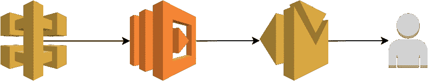
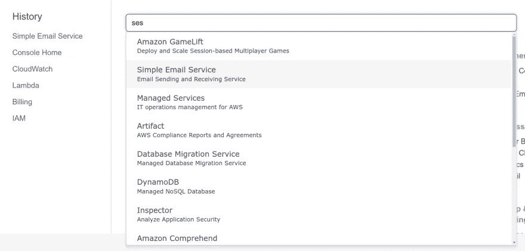
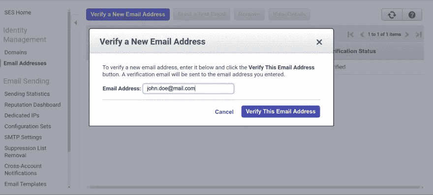
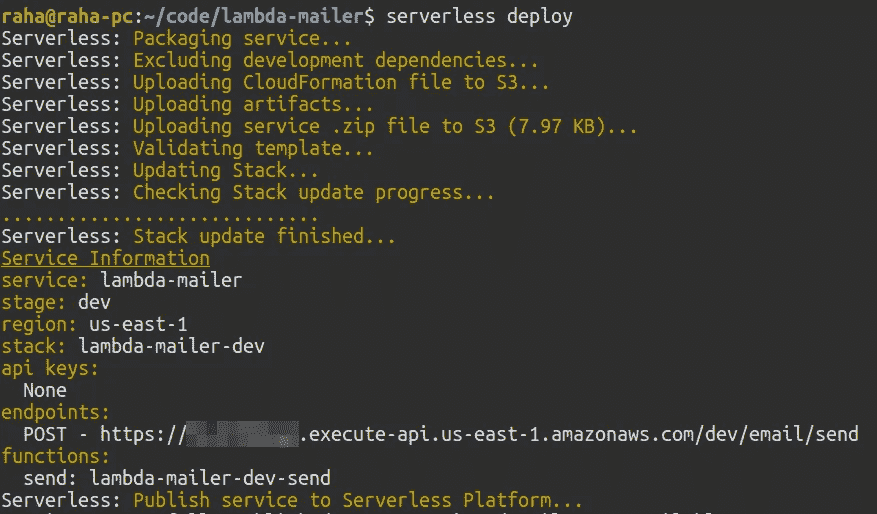
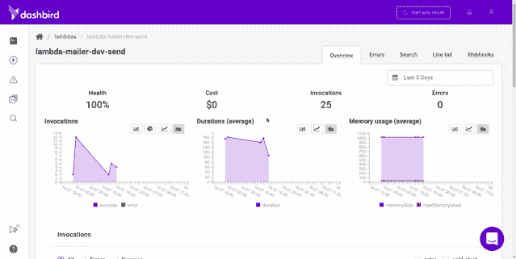

# 使用 AWS Lambda 和 AWS SES 构建无服务器联系人表单

> 原文：<https://medium.com/hackernoon/building-a-serverless-contact-form-with-aws-lambda-and-aws-ses-fbf01d523678>


如果我告诉你它可以零依赖地完成呢？希望你能接受挑战，因为这正是我们要做的。

本教程将涵盖使用普通 JavaScript 的前端联系表单和托管在 [AWS Lambda](https://aws.amazon.com/lambda/) 上的无服务器后端的基础知识。 [AWS SES](https://aws.amazon.com/ses/) 是你用来发送实际电子邮件的服务，相信我，它非常简单，配置只需 13 秒。是的，我给自己计时。😁

那好吧。让我们跳进来吧！

# TL；速度三角形定位法(dead reckoning)

为了确保你对我们今天所做的有一个大概的了解，这里有一个简短的 TL；博士你可以跳到你感兴趣的部分，严重伤害我的感情，或者就从这里继续读下去。你挑吧…我不会默默地评判你。😐

*   我们在建造什么？
*   配置 [AWS SES](https://aws.amazon.com/ses/)
*   用[无服务器框架](https://serverless.com/)构建 API
*   将 API 部署到 [AWS Lambda](https://aws.amazon.com/lambda/)
*   用 [Dashbird](https://dashbird.io/) 测试 API
*   构建表单

***注*** *:我把这个* [*代码*](https://github.com/adnanrahic/lambda-mailer) *变成了一个* [*npm 模块*](https://www.npmjs.com/package/lambda-mailer) *以便于重用，所以当你需要一个快速联系表单时，你不需要自己写所有的代码。*

# 我们在建造什么？

总体思路是建立一个可以添加到静态网站的联系表单。我们希望在不管理任何服务器的情况下添加它，并且最好不要为它的运行支付任何费用。这里有一个 AWS Lambda 的惊人用例。

我们想要构建的结构非常简单。我们有一个简单的表单，用一小段 JavaScript 来解析 JSON 的参数，并将它们发送给 API 端点。

端点是一个 [AWS API 网关](https://aws.amazon.com/api-gateway/)事件，它将触发一个 AWS Lambda 函数。该功能将告诉 AWS SES 向您的电子邮件地址发送一封包含相关内容的电子邮件。从那里，你可以继续与填写表格的人交换电子邮件。简单吧？



API Diagram

开始黑吧！

# 配置 AWS SES

为了使用 AWS 提供的简单电子邮件服务发送电子邮件，您需要验证将用于发送电子邮件的电子邮件地址。就像导航到 AWS 控制台并搜索**简单电子邮件服务**一样简单。



点击左侧导航中的**电子邮件地址**链接。你会看到一个名为**的蓝色大按钮，用于验证新的电子邮件地址**。按下它并添加您的电子邮件地址。



AWS 现在将向您发送一封验证电子邮件到该地址。去验证一下吧。差不多就是这样。准备好写代码了吗？

# 用无服务器框架构建 API

构建实际的 API 有几个主要步骤。第一件事，一如既往，是配置。

## 1.安装无服务器框架

为了让无服务器开发**不**成为绝对的折磨，继续安装[无服务器框架](https://serverless.com/)。

```
$ npm i -g serverless
```

***注意:*** *如果您使用的是 Linux，您可能需要以 sudo 的身份运行该命令。*

一旦全局安装到您的机器上，您就可以在终端的任何地方使用这些命令。但是为了让它与您的 AWS 帐户通信，您需要配置一个 IAM 用户。跳过[这里的解释](https://docs.aws.amazon.com/IAM/latest/UserGuide/id_users_create.html)，然后返回并使用提供的键运行下面的命令。

```
$ serverless config credentials \ 
    --provider aws \ 
    --key xxxxxxxxxxxxxx \ 
    --secret xxxxxxxxxxxxxx
```

现在，当您运行任何终端命令时，您的无服务器安装知道要连接到哪个帐户。让我们来看看它是如何工作的。

## 2.创建服务

创建一个新目录来存放您的无服务器应用程序服务。在那里启动一个终端。现在您已经准备好创建一个新的服务了。

你问的服务是什么？把它当成一个项目。但也不尽然。在这里定义 AWS Lambda 函数、触发它们的事件以及它们需要的任何 AWS 基础设施资源，所有这些都在一个名为 **serverless.yml** 的文件中。

回到您的终端，键入:

```
$ serverless create --template aws-nodejs --path contact-form-api
```

create 命令将创建一个新的**服务**。修卡！但有趣的部分来了。我们需要为函数选择一个运行时。这被称为**模板**。传入`aws-nodejs`会将运行时设置为 Node.js .这正是我们想要的。路径将为服务创建一个文件夹。

## 3.使用代码编辑器浏览服务目录

用你最喜欢的代码编辑器打开 **contact-form-api** 文件夹。这里应该有三个文件，但是现在，我们只关注 **serverless.yml** 。它包含此服务的所有配置设置。您可以在这里指定常规配置设置和每个功能的设置。您的 **serverless.yml** 将充满样板代码和注释。请随意删除它，并粘贴这个。

属性列出了服务中的所有函数。不过，我们只需要一个功能来处理电子邮件的发送。**处理程序**引用它是哪个函数。

看一下`iamRoleStatements`，它们指定 Lambda 有权限触发**简单邮件服务**。

我们在顶部还有一个`custom`部分。这是一种将环境变量安全加载到服务中的方法。稍后通过使用`${self:custom.secrets.<environment_var>}`来引用它们，实际值保存在一个名为`secrets.json`的简单文件中。

厉害！

## 4.添加机密文件

我们都知道把私钥推给 GitHub 会害死小狗。请不要这样做。用无服务器框架处理这个问题很简单。添加一个`secrets.json`文件并将这些值粘贴进去。

在测试时，您可以将域保持为`'*'`，但是，请确保在生产中将其更改为您的实际域。`EMAIL`字段应该包含您通过 AWS SES 验证的电子邮件。

## 5.编写业务逻辑

至此，让我们来编写实际的代码。总而言之，代码本身相当简单。我们需要 [SES](https://aws.amazon.com/ses/) 模块，创建电子邮件参数并用`.sendMail()`方法发送它们。在底部，我们导出函数，确保它在`serverless.yml`中可用。

就是这样，全部 60 行左右的代码，绝对没有依赖。太棒了。

# 将 API 部署到 AWS Lambda

简单的部分来了。部署 API 就像运行一个命令一样简单。

```
$ serverless deploy
```



您可以看到端点被记录到控制台。这是您发送请求的地方。

# 用 Dashbird 测试 API

测试 API 最简单的方法是使用 CURL。让我们创建一个简单的 CURL 命令，并向端点发送一个 JSON 有效负载。

```
$ curl --header "Content-Type: application/json" \ 
  --request POST \ 
  --data '{"email":"john.doe@email.com","name":"John Doe","content":"Hey!"}' \ 
[https://{id}.execute-api.{region}.amazonaws.com/{stage}/email/send](https://{id}.execute-api.{region}.amazonaws.com/{stage}/email/send)
```

如果一切正常，你会很快收到一封电子邮件。如果不是，那么你就不走运了。在这种情况下，我默认使用 [Dashbird](https://dashbird.io/register/) 来调试正在发生的事情。它是免费的，不需要信用卡来设置。



我这边的日志显示都是绿色的，所以它工作得很好！这就是完成的 API 部分。让我们继续联系表单本身。

# 构建联系人表单

因为我不是世界上最好的 CSS 大师，我将完全跳过这一部分，并向您展示如何让它工作。😁

让我们从 HTML 标记开始。

这是一个非常简单的表单，有三个字段和一个按钮。让我们继续看 JavaScript。

再过 50 行，客户端逻辑就完成了。请随意将它放到您的网站中，将`url`常量更改为您在上面部署的 API 端点。嘿，很快，你的无服务器联系表单就完成了，可以投入生产了！

# 包扎

现在你有了，一个快速简单的方法来添加一个无服务器的联系表单到一个网站。像这样对奇怪的、孤立的端点使用无服务器是很棒的。绝对没有你需要担心的服务器。只需部署代码，并保证它会工作。如果有什么东西坏了，你会有仪表板鸟在背后看着你，如果有什么不对劲，它会提醒你。该死，我喜欢松散的集成。

无论如何，我花时间从上面的代码中创建了一个 [npm 模块](https://www.npmjs.com/package/lambda-mailer)，所以在未来，没有人需要写两次。只需安装软件包，不到一分钟，您的 contact form endpoint 就会启动并运行。如果你想看的话，可以在 [GitHub repo](https://github.com/adnanrahic/lambda-mailer) 中找到说明。如果你想让更多的人在 GitHub 上看到它，给它一颗星吧。

如果你想阅读我以前的一些无服务器思考，请前往[我的简介](https://dev.to/adnanrahic)或[加入我的时事通讯！](https://upscri.be/b6f3d5/)

或者，马上看看我的几篇文章:

*   [Express 和 MongoDB 的无服务器 API 速成班](https://hackernoon.com/a-crash-course-on-serverless-apis-with-express-and-mongodb-77774f7730fe)
*   [使用无服务器和 MongoDB 解决不可见的扩展问题](https://hackernoon.com/solving-invisible-scaling-issues-with-serverless-and-mongodb-1a065b5a6465)
*   [如何使用无服务器将 Node.js 应用程序部署到 AWS Lambda](https://dev.to/adnanrahic/how-to-deploy-a-nodejs-application-to-aws-lambda-using-serverless-2nc7)
*   [AWS Lambda 和 Node.js 入门](https://hackernoon.com/getting-started-with-aws-lambda-and-node-js-4ce3259c6dfd)
*   [用 JSON web 令牌保护无服务器 API 的速成班](https://medium.freecodecamp.org/a-crash-course-on-securing-serverless-apis-with-json-web-tokens-ff657ab2f5a5)
*   [将 Node.js REST API 迁移到无服务器](https://hackernoon.com/migrating-your-node-js-rest-api-to-serverless-d2a170e0856c)
*   [用 Node.js 和 MongoDB 构建无服务器 REST API](https://hackernoon.com/building-a-serverless-rest-api-with-node-js-and-mongodb-2e0ed0638f47)
*   [node . js 无服务器速成班](https://hackernoon.com/a-crash-course-on-serverless-with-node-js-632b37d58b44)

希望你们喜欢读这篇文章，就像我喜欢写这篇文章一样。如果你喜欢的话，拍一下那个小小的拍手，这样更多的人会在 Medium 上看到这个教程。下次见，保持好奇，玩得开心。

*最初发表于*[*dev . to*](https://dev.to/adnanrahic/building-a-serverless-contact-form-with-aws-lambda-and-aws-ses-4jm0)*。*