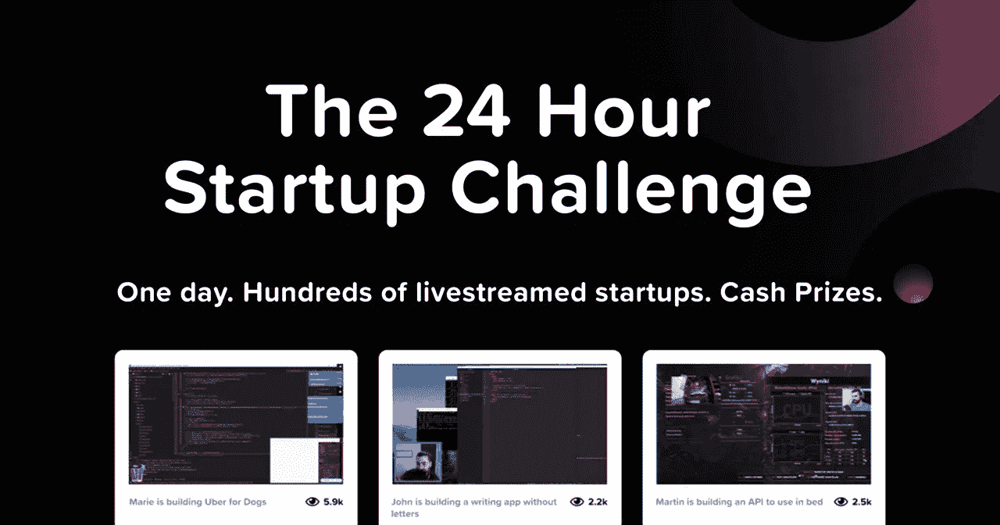

# 在 24 小时内创建一家新公司——24 小时创业运动

> 原文：<https://medium.com/hackernoon/building-a-startup-in-24-hours-the-24hrstartup-movement-4ba6f0e2f209>

## 为世界各地的制造商创造一个机会，在 24 小时内制造出令人惊叹的东西

The 24 Hour Startup Challenge in Action

大约一个月前，我在 24 小时内启动了一家初创公司，并在 Twitch 上直播了整个事件。没想到，第二天我就在产品搜索上找到了[的第一名，在 HN](https://www.producthunt.com/posts/you-don-t-need-wordpress) 上找到了[的第一名。](https://news.ycombinator.com/item?id=18077446)

在注意到这种吸引力后，我意识到我已经激励了一群新的创客来采用我的方法来启动，并在 24 小时内发展一家初创公司。

在与[阿明](https://twitter.com/arminulrich)、[梅勒妮](https://twitter.com/_feloidea)和一个由专注的创客组成的强大社区合作之后，我们创立了 [24 小时创业挑战](https://24hrstartup.com)——目的是帮助鼓励其他人开始创业！🚀

# 关于活动

24 小时启动挑战很简单。制造商可以注册参加这项挑战，并有一天的时间尽可能地制造出优秀的产品(当然中间会有一些休息)。

所有参与者必须从头开始，并从头到尾直播他们的产品的创作。此外，在活动结束后，所有的初创公司都应该向公众开放，以激励其他制造商推出他们的产品。

挑战提供了在公众中建立的机会，并帮助您围绕您的产品预发布开发一个社区。感谢我们的赞助商，我们将向此次挑战中最具生产力和积极性的 10 名制造商提供总额为 3000 美元的奖金。

这些奖项是为了帮助激发制造商在流之后继续他们的项目，并允许他们继续建造令人敬畏的产品！

# 我们为什么要这么做？

当我在 24 小时内创建我的创业公司时，我已经在我面前创建了一个充满激情的创客社区，他们渴望拥有和我一样的创业方式。

我们希望在#24hrstartup 挑战赛中复制这一点，并建立一个全球分布式制造商社区，他们对制造伟大的产品充满热情。我们希望宣传这样一种形象，即每个人本质上都是独立制作人，无论你是编码员、非编码员、设计师还是销售人员，你都可以参与其中。我们的参与者涵盖了不同的行业，从技术人员，到旅游，到食品和酒店。

我们也希望帮助减轻对发布的恐惧，改变人们追求产品发布的方式。通过在公共场合进行构建，你可以从那些可以改进你的产品的人那里获得宝贵的用户反馈和见解。我们希望每个人都能享受到这一好处，并传达这样一个信息:你可以在 24 小时内制作并发布一些令人惊叹的东西，供其他人使用。

最后，我们对独立制作人可能产生的巨大影响充满热情。独立创客正在开发创业的未来！我们想告诉大家，如果你开始一项技术业务，你的目标可以只是财务独立，而不是成为独角兽。

我们希望帮助提升这一形象，并在此过程中帮助独立制作人的专业和个人成长！

# 我们在快速成长！

不到一周前，我开始与阿明和 T2、梅勒妮一起构思这个创意，并决定将这个活动限制在 50 人以内，目的是随着活动吸引力的增加而扩大规模。

然而，令我惊讶的是，几个小时内就有超过 50 家制造商注册，很明显，我们正在追求的东西将彻底改变人们看待产品发布的方式。

由于高需求，我们决定扩大我们的计划，以支持 100 人，但积极的制造商继续注册，我们最终取消了限制。

现在我们已经有 **500 人注册了挑战**和一个有洞察力的 Telegram 用户社区，他们在他们的产品、最佳实践和发布技巧上进行合作。

为了使该计划得以实施，我们还决定邀请一些赞助商，他们可以为参与者提供支持，并为最终的奖金做出贡献。经过大量的艰苦工作，我们与创客社区中一些最大的组织——Remote OK、Baremetrics 和 MakerPad 等——建立了有意义的赞助关系。

# 加入# 24hr 启动运动

如果你准备好加入历史上最大的生活化创业活动之一，你可以在这里注册，并在我的 [Twitter](https://twitter.com/thepatwalls) 上找到更新。

请务必填写您的个人资料，详细介绍您自己和您的项目，并在周五结束前提交，以便参加挑战。

挑战于美国东部时间 2018 年 11 月 17 日上午 12:01 开始。

如果您不能参加，但仍想参与活动，您可以查看我们的[参与者名单](https://24hrstartup.com/participants)，并在活动期间提供帮助！你甚至可以帮助推广其他制造商的产品流，或者只是[收听](https://24hrstartup.com/tv)，观看各种各样的人创造伟大的产品。

这个纪念性的事件将代表创客社区所能提供的最好的东西，并且应该激励非创客们出来做一些酷的东西！我们希望你能和成千上万的其他人一起愉快地运输，并在这个过程中创造一些很酷的东西！

*感谢* [*詹姆斯·加拉格尔*](https://twitter.com/jamesg_oca) *帮我写这个:)*