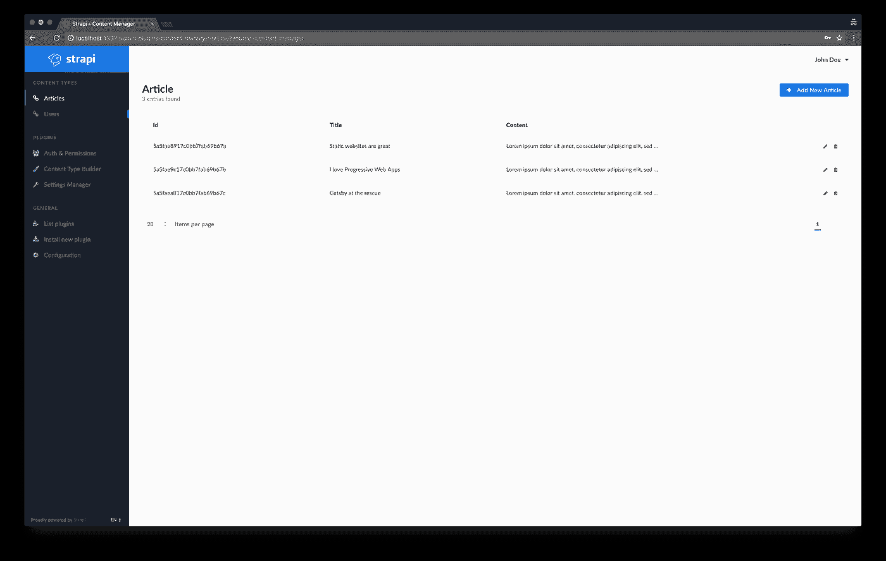

# 📝使用 Gatsby 和 Strapi 构建静态博客

> 原文：<https://medium.com/hackernoon/building-a-static-blog-using-gatsby-and-strapi-8b5acfc82ad8>


静态网站包含具有固定内容的网页。从技术上讲，它是一个简单的 HTML 文件列表，向每个访问者显示相同的信息。与动态网站不同，它们不需要任何后端编程或数据库。发布一个静态网站很容易:文件被上传到一个简单的网络服务器或存储提供商。静态网站的两个主要优势是安全性和速度:没有数据库，所以它不会被黑客攻击，也不需要为每个请求呈现一个页面，这使得网页浏览速度更快。

为了让他们的创作更容易，大量开源的静态网站生成器可用: [Jekyll](https://jekyllrb.com/) 、 [Hugo](https://gohugo.io/) 、 [Hexo](https://hexo.io/) 等。大多数时候，内容是通过静态(最好是降价)文件或内容 API 来管理的。然后，生成器请求内容，将其注入到开发人员定义的模板中，并生成一堆 HTML 文件。

渐进式网络应用程序(PWA)是高度基于 JavaScript 的网络应用程序，可靠、快速且吸引人。由于 PWA 使网页浏览速度更快，提供了更好的用户体验，它已经成为构建网页界面的默认方式。因此，在过去几年中出现了许多令人惊叹的前端框架:Angular、Vue 和最近的 React。

> *盖茨比:当静态网站遇到进步的网络应用*

静态网站和 PWA 都有很强的优势，这使得我们渴望在同一个项目中使用它们！幸运的是，我们有工具来弥合他们之间的差距，我们最近听说的一个肯定是盖茨比。所以，我们决定给你一个完整的例子，告诉你如何从盖茨比开始。一个静态网站需要一个内容源:在这个例子中，我们将使用一个用 Strapi 构建的 API 来交付它。

## 盖茨比是什么？

[盖茨比](https://www.gatsbyjs.org/)是一个*风驰电掣* ***网站框架*** *为 React* 。它允许开发者在几分钟内建立基于 React 的网站。无论你想开发一个博客还是一个企业网站，盖茨比都会满足你的需求。


因为它是基于 React 的，所以网页不会被重新加载，这使得生成的网站非常快。大量的插件可以让开发者节省时间并从任何来源(Markdown 文件、CMS 等)获取数据。).盖茨比强烈基于[“节点”接口](https://www.gatsbyjs.org/docs/node-interface/)，它是盖茨比数据系统的中心。

该项目由[凯尔·马修斯](https://twitter.com/kylemathews)创建，于 2017 年 7 月正式[发布，并且已经](https://www.gatsbyjs.org/blog/gatsby-v1/)[被数十家公司](https://github.com/gatsbyjs/gatsby#showcase)使用。

## 什么是 Strapi？

[Strapi](https://strapi.io/) 是*最先进的* ***Node.js 无头内容管理系统*** *。*


由于其可扩展的插件系统，它提供了大量的内置功能:管理面板，认证和权限管理，内容管理，API 生成器等。

与其他 CMS 不同， **Strapi 是 100%开源的**，这意味着:

*   **斯特拉皮完全自由了。**
*   你可以把它放在你自己的服务器上，这样你就拥有了数据。
*   多亏了插件系统，它完全是可定制和可扩展的。

# API 设置

为了创造奇迹，让我们创建一个 Strapi API 并添加一些内容。

## 创建一个 Strapi 项目

安装 Strapi

*要求:请确保* [*节点 8*](https://nodejs.org/en/download/) *(或更高版本)和*[*MongoDB*](https://docs.mongodb.com/manual/installation/)*已经安装并运行在您的机器上。*

使用 npm 安装 Strapi:

```
$ npm i strapi@alpha -g
```

*注:Strapi v3 还是 alpha 版本，不过对于本教程来说就没问题了。*

生成一个 Strapi 项目

创建一个名为`gatsby-strapi-tutorial`的目录:

```
$ mkdir gatsby-strapi-tutorial
```

通过一个命令行在其中搭建您的 API:

```
$ cd gatsby-strapi-tutorial
$ strapi new api
```

启动服务器

在项目的文件夹中输入:

```
$ cd api
```

启动 Node.js 服务器:

```
$ strapi start
```

从现在开始，您应该能够访问项目的管理面板:[http://localhost:1337/admin](http://localhost:1337/admin)。

## 创建您的第一个用户

从[注册页面](http://localhost:1337/admin/plugins/users-permissions/auth/register)添加您的第一个用户。


## 创建内容类型

Strapi APIs 基于一种叫做内容类型的数据结构(相当于框架中的模型和 Wordpress 中的内容类型)。

[创建一个名为`article`的内容类型](http://localhost:1337/admin/plugins/content-type-builder/)，包含四个字段:

*   `title`(类型`string`)
*   `content`(类型`text`)
*   `image`(类型`media`)
*   `author`(类型`relation`，一个用户多条)


## 插入一些条目

在数据库中添加一些文章。为此，请遵循以下说明:

1.  访问[文章列表页面](http://localhost:1337/admin/plugins/content-type-builder/models/article)。
2.  点击`Add New Article`。
3.  插入值，链接到作者并提交表单。
4.  创建另外两篇文章。



## 允许访问

出于安全原因，默认情况下， [API 访问](http://localhost:1337/article)是受限制的。要允许访问，请访问来宾角色的[授权和权限部分，选择`Article - find`操作并保存。此时，您应该能够](http://localhost:1337/admin/plugins/users-permissions/roles)[请求文章列表](http://localhost:1337/articles)。

作者 API 访问权限也受到限制。通过选择`find`(在“用户&权限”部分)动作并保存表单来授权匿名访问。


# 静态网站开发

干得好，我们的 API 已经准备好了！我们可以开始开发静态网站。

## 安装盖茨比

首先，安装 Gatsby CLI:

```
$ npm install --global gatsby-cli
```

## 生成一个盖茨比项目

在您之前创建的文件夹`gatsby-strapi-tutorial`中，生成您的全新博客:

```
$ gatsby new blog
```

## 以开发模式开始

在项目的文件夹中输入:

```
$ cd blog
```

启动服务器:

```
$ gatsby develop
```

至此，您应该已经能够通过这个地址访问您的 Gatsby 网站: [http://localhost:8000](http://localhost:8000/) 。

## 安装 Strapi 源代码插件

当你管理一个静态网站时，你的数据可能来自不同的来源:Markdown 文件、CSV 文件、WordPress 网站(使用 JSON REST API 插件)等。

盖茨比很明白这一点。所以它的创造者决定建立一个特定的、独立的层:数据层。整个系统由 GraphQL 提供强大的支持。

要将 Gatsby 连接到一个新的数据源，您必须[开发一个新的数据源插件](https://www.gatsbyjs.org/docs/create-source-plugin)。幸运的是，[几个源码插件已经存在了](https://www.gatsbyjs.org/docs/plugins)，所以其中的一些应该可以满足你的需求。

在这个例子中，我们使用的是 Strapi。显然，我们需要一个 Strapi APIs 的源代码插件。好消息:[我们为你建造了它](https://github.com/strapi/gatsby-source-strapi)！

让我们安装它:

```
$ npm install --save gatsby-source-strapi
```

这个插件需要一些配置。将`gatsby-config.js`的内容替换为:

*路径:*

然后，重启服务器，让 Gatsby 考虑这些更新。

## 文章列表

首先，我们要显示文章列表。为此，请在现有主页文件中添加以下内容:

*路径:* `*src/pages/index.js*`

我们在这里做什么？

在文件的结尾，我们导出了`pageQuery`，这是一个 GraphQL 查询，请求文章的完整列表。如您所见，由于精确的 GraphQL 查询语言，我们只需要`id`、`title`和`content`字段。

然后，我们将`{ data }`析构对象作为`IndexPage`的参数进行传递，并对其`allStrapiArticles`对象进行循环以显示数据。


提示:在几秒钟内生成您的 GraphQL 查询！

Gatsby 包含了一个有用的 GraphiQL 接口。它使得 GraphQL 查询的开发方式更加简单和直观。[查看它](http://localhost:8000/___graphql)并尝试创建一些查询。

## 添加图像

要添加图像，我们需要从默认安装的包`gatsby-image`中导入`Img`。用以下内容替换`src/pages/index.js`的内容:

路径:`src/pages/index.js`


## 文章视图

我们的网站现在开始看起来像一个博客，这是一件好事。然而，仍然缺少一个重要的部分:文章的详细信息页面。

让我们创建包含特定 GraphQL 请求并定义显示内容的模板:

*路径:* `*src/templates/article.js*`

这看起来不错，但是此时，Gatsby 不知道何时应该显示这个模板。每篇文章都需要一个特定的 URL。因此，我们将通过`[createPage](https://www.gatsbyjs.org/docs/creating-and-modifying-pages)` [函数](https://www.gatsbyjs.org/docs/creating-and-modifying-pages)通知 Gatsby 我们需要的新 URL。

首先，我们将编写一个名为`makeRequest`的新函数来执行 GraphQL 请求。然后，我们导出一个名为`createPages`的函数，在这个函数中，我们获取文章列表，并为每篇文章创建一个页面。结果如下:

*路径:*

重启 Gatsby 服务器。

从现在开始，您应该可以通过点击主页上显示的 URL 来访问详细页面。


## 作者视图

文章是作者写的。他们应该有一个专门的页面。

创建作者视图和文章页面的过程非常相似。首先，我们创建模板:

*路径:*

其次，我们更新`gatsby-node.js`文件来创建 URL:

*路径:*

最后，重启服务器，从文章视图的链接访问作者页面。


# 结论

恭喜你。您已经成功构建了一个超级快速且易于维护的博客！

因为内容是由 Strapi 管理的，所以作者可以通过一个很好的 UI 来写文章，开发人员只需要重新构建 Gatsby 博客来更新内容。

***下一步何去何从？***

请继续这个项目，发现盖茨比和斯特拉皮的优点。这里有一些你可以添加的特性:作者列表，文章类别，以及带有 Strapi API 或 Disqus 的评论系统。你也可以创建其他类型网站(电子商务商店、公司网站等)。).

当您的项目完成后，您可能会想要部署它。盖茨比生成的静态网站可以[轻松发布在存储提供商](https://www.gatsbyjs.org/docs/deploy-gatsby/)上:Netlify、S3/Cloudfront、GitHub pages、GitLab pages、Heroku 等。Strapi API 只不过是一个简单的 Node.js API，因此它可以托管在 Heroku 或任何安装了 Node.js 的 Linux 实例上。

本教程的[代码源可在 GitHub](https://github.com/strapi/strapi-examples/tree/master/gatsby-strapi-tutorial) 上获得。要实时观看，克隆存储库，运行`npm run setup`，启动 Strapi 服务器(`cd api && strapi start`)和 Gatsby 服务器(`cd blog && npm run develop`)。

我们希望你喜欢这个教程。请随意评论它，分享它，并让我们知道您是如何创建用 React 构建的站点并管理它们的内容的。