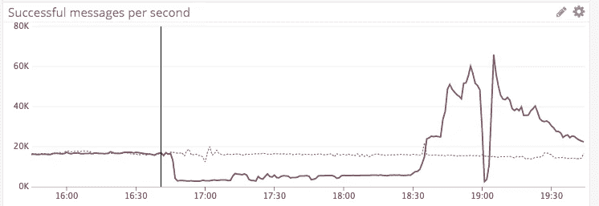

# 构建一个交付数十亿日常事件的系统

> 原文：<https://medium.com/hackernoon/building-a-system-to-deliver-billions-of-daily-events-c3a56be47fc2>


## 由[Calvin French-Owen](https://twitter.com/calvinfo),[分部的联合创始人。](https://goo.gl/qerTet)

> 这篇文章最初出现在 [Segment 博客](https://bit.ly/2J0mhcp)上，探讨了 Segment 如何每天向数百个公共 API 可靠地发送数十亿条消息，以及用于在生产中运行它的数据模型。Hacker Noon 的每周赞助商 [Segment](https://segment.com/?utm_source=hacker%20noon%20blog%20post) ，目前提供 90 天免费试用——发送电子邮件至 friends@segment，并提及 Hacker Noon 进行兑换。

今天，我们很高兴与大家分享离心机的架构——Segment 的系统每天向数百个公共 API 可靠地发送数十亿条消息。这篇文章探讨了离心机解决的问题，以及我们在生产中使用的数据模型。

# 离心机问题

在[细分市场](https://segment.com/)，我们的核心产品每秒收集、处理和交付数十万个分析事件。这些事件由用户操作组成，如查看页面、从 Amazon 购买商品或喜欢朋友的播放列表。无论事件是什么，它几乎总是互联网上某个人*做* *某事的结果。*

我们将这些传入事件转发给数百个下游端点，如 [Google Analytics](https://analytics.google.com/analytics/web/) 、 [Salesforce](https://www.salesforce.com/) 和每客户 [Webhooks](https://en.wikipedia.org/wiki/Webhook) 。

在任何时间点，许多这样的端点都将处于故障状态。我们将看到响应延迟增加 10 倍，5xx 状态代码激增，以及对单个大客户的激进速率限制。

为了让您感受一下，这里是我今天早些时候从我们的内部监控中提取的各种延迟和正常运行时间。


在最好的情况下，这些 API 故障会导致延迟。在最坏的情况下，数据丢失。

事实证明，在一个有问题的环境中调度这么多请求是一个复杂的问题。你得好好考虑公平问题(你应该优先考虑哪些数据？)，缓冲语义(应该如何对数据进行排队？)，以及重试行为(现在重试是否会给系统增加不必要的负载？).

纵观所有文献，我们找不到很多在高故障环境中可靠地传递消息的好的“现有技术”。最接近的是[网络调度和路由](http://linux-ip.net/articles/Traffic-Control-HOWTO/classless-qdiscs.html)，但是那个学科有*非常*不同的关于缓冲分配(非常小)和[背压](https://en.wikipedia.org/wiki/Back_pressure)策略(自适应的，并且通常路由到单个地方)的策略。

因此，我们决定构建自己的通用的、完全分布式的作业调度器，以便可靠地调度和执行 HTTP 请求。我们称之为离心机。

您可以将离心机视为位于我们的基础设施和外部世界之间的一层，它是负责将数据发送到我们所有客户目的地的系统。当第三方 API 失败时，离心机可以吸收流量。

在正常操作下，离心机有三个职责:向第三方端点传递消息，失败时重试消息，以及存档任何未传递的消息。

我们写了第一篇文章，作为理解离心机解决的问题、它的数据模型以及我们在生产中用来操作它的构件的指南。在随后的帖子中，我们将分享我们如何验证系统的正确性，并让它快得令人眼花缭乱。

让我们开始吧。

# 当队列停止工作时

在讨论离心机本身之前，您可能会想“为什么不在这里使用队列呢？构建一个完全分布式的作业调度器似乎有点过头了”。

我们也问过自己同样的问题。我们已经在 Segment 广泛使用 [Kafka](https://kafka.apache.org/) (我们每秒通过它传递近 100 万条消息)，它已经成为我们所有流媒体管道的核心构件。


使用任何一种队列的问题是，就如何访问数据而言，你从根本上受到了限制。毕竟一个队列只支持两种操作(push 和 pop)。

为了查看队列在哪里分解，让我们浏览一下我们在 Segment 实现的一系列队列拓扑。

# 架构 1:单个队列

首先，让我们先考虑一个简单的方法。我们可以运行一组从单个队列中读取作业的工人。

工人将从队列中读取一条消息，发送给任何需要的第三方 API，然后确认该消息。它似乎应该保护我们免于失败，对吗？


这在一段时间内工作正常，但是当我们开始看到单个端点变慢时会发生什么呢？不幸的是，它会对整个消息流产生反压力。


显然，这并不理想。如果一个*单个*端点可以关闭整个管道，并且每个端点每年都有一个小时的停机时间(99.9%可用)，那么对于 200 多个端点，我们每天将会看到一个小时的停机时间。

# 架构 2:每个目的地的队列

在看到我们的摄取管道一再变慢之后，我们决定重新架构。我们更新了我们的排队拓扑，根据事件将到达的下游端点将事件路由到单独的队列中。

为此，我们在每个队列前面添加了一个路由器。路由器只会将消息发布到目的地为特定 API 端点的队列。

假设您启用了三个目的地:Google Analytics、Mixpanel 和 Salesforce。路由器将发布三条消息，分别针对 Google Analytics、Mixpanel 和 Salesforce 的每个专用队列。

这种方法的好处是，单个失败的 API 将只影响去往单个端点的消息(这正是我们想要的！).


不幸的是，这种方法在实践中存在问题。如果我们看一下应该传递到单个端点的消息的分布，事情会变得稍微微妙一些。

Segment 是一个大型的多租户系统，因此一些数据源会比其他数据源产生更多的负载。正如您可能想象的那样，在我们的客户群中，这遵循一个相当一致的幂定律:


当这转化为队列中的消息时，分解看起来更像这样:


在这种情况下，我们有客户 A、B 和 C 的数据，它们都试图发送到同一个下游端点。客户 A 控制着负载，但是 B 和 C 有少量的呼叫混合在一起。

假设我们发送到的 API 端点被评定为每个客户每秒 1000 次调用。对于给定的客户 API 键，当端点在一秒钟内收到超过 1000 个调用时，它将使用 [429 HTTP 头](https://developer.mozilla.org/en-US/docs/Web/HTTP/Status/429)进行响应(超过速率限制)。

现在让我们假设客户 A 试图向 API 发送 50，000 条消息。这些消息在我们的队列中都是连续排序的。

此时，我们有几个选择:

*   我们可以尝试每秒发送 1，000 条消息，但这会使 B 和 C 的流量延迟 50 秒。
*   我们可以尝试向客户 A 的 API 发送更多的消息，但是我们会看到 429(超过速率限制)错误。我们想要重试那些失败的消息，这可能会导致 B 和 c 的速度更慢。
*   在第一秒为客户 A 发送 1，000 条消息后，我们可以检测到接近速率限制，因此我们可以将客户 A 接下来的 49，000 条消息复制到[死信队列](https://en.wikipedia.org/wiki/Dead_letter_queue)中，并允许 B 和 C 的流量继续进行。

这些选择都不理想。在单个客户发送大量数据的情况下，我们要么最终阻塞所有客户的队列，要么最终在死信队列之间复制万亿字节的数据。

# 理想状态:每个的队列

相反，我们想要一个看起来更像下图的架构，其中我们为每个**客户和端点*的组合拥有单独的队列。这种架构为我们提供了更好的隔离，以及基于每个客户动态调整吞吐量的能力。*

**

*但是，在大型多租户系统(如 Segment)中，这个数量的队列很难管理。*

*我们有成千上万个这样的源-目的地对。今天，我们有 42，000 个活动数据源发送到平均 2.1 个下游端点。我们希望支持的队列总数达到 88，000 个(而且我们还在快速增长)。*

*要实现完全隔离的每个源-目的地队列，我们需要成千上万个不同的队列。在 [Kafka](https://kafka.apache.org/) 、 [RabbitMQ](https://www.rabbitmq.com/) 、 [NSQ](http://nsq.io/) 或 [Kinesis](https://aws.amazon.com/kinesis/) 中，我们还没有看到任何队列支持简单缩放原语的基数水平。 [SQS](https://aws.amazon.com/sqs/) 是我们发现的唯一一个能够做到这一点的队列，但是成本太高了。我们需要一个新的原语来解决这个高基数隔离的问题。*

# *进入“虚拟”队列*

*我们现在有了理想的最终状态:成千上万的小队列。在这些队列中，我们可以很容易地决定以不同的速率使用来自客户 A、B 和 c 的消息。*

*但是当我们开始考虑实现时，我们实际上是如何管理那么多队列的呢？*

*我们从虚拟队列系统的几个核心需求开始:*

*1)提供每个客户的隔离*

*首先，我们需要提供每个客户的隔离。一个发送大量失败流量的客户不应该减慢任何其他数据传输。我们的系统必须在不降低全球交付率的情况下吸收失败。*

*2)允许我们对消息重新排序，而无需复制太字节的数据*

*我们的第二个约束是，我们的系统必须能够快速调整其交付顺序，而不需要通过网络复制太多的数据。*

*根据我们处理大型数据集的经验，能够立即对邮件进行重新排序以进行传递是至关重要的。我们经常遇到在数据处理中产生大量积压的情况，在这种情况下，我们的消费者在一系列持续失败的消息上打转。*

*传统上有两种方法来处理大量的坏消息。第一种方法是停止您的使用者，并在一段时间后重试同一组消息。这在多租户架构中显然是不可接受的，在这种架构中，仍然应该传递有效的消息。*

*第二种技术是将失败的消息发布到死信队列，并在以后重新使用它们。不幸的是，将带有相同事件副本的消息重新发布到死信队列或主题“层”会导致大量的存储和网络开销。*

*在这两种情况下，如果您的数据位于 Kafka 中，那么您的消息的交付顺序实际上是由生产者“设置”到主题的:*

**

*我们希望能够快速从错误中恢复，而不必在网络中传输数万亿字节的数据。所以这两种方法都不适合我们。*

*3)在许多不同的工人之间平均分配工作量*

*最后，我们需要一个能够随着事件量的增加而完全扩展的系统。我们不希望随着客户的增加而不断添加分区或进行额外的分片。我们的系统应该根据我们需要的流量吞吐量水平扩展。*

# *离心机中的数据*

*至此，我们对离心机解决的问题(可靠的消息传递)、各种队列拓扑的问题以及我们的核心需求有了很好的了解。因此，让我们看看离心机数据层，以了解我们是如何解决上面列出的约束条件的。*

*离心机的核心输送单元就是我们所说的作业。*

*作业既需要发送数据的有效负载，也需要指示数据发送目的地的端点。您可以选择提供标头来管理重试逻辑、消息编码和超时行为等内容。*

*在我们的例子中，作业是应该交付给合作伙伴 API 的单个事件。为了让您了解工作在实践中是什么样子，下面是一个细分工作示例:*

**

*回头看看我们的需求，我们想要一种方法来快速改变我们的作业的交付顺序，而不必创建作业本身的许多副本。*

*队列不会为我们就地解决这个问题。我们的消费者将不得不读取并重写我们新订单中的所有数据。但是一个数据库，另一方面，*做*。*

*通过将执行顺序存储在关系数据库中，我们可以通过运行一条 SQL 语句来立即改变[服务质量](https://en.wikipedia.org/wiki/Quality_of_service)。*

*类似地，每当我们想要更改消息的交付语义时，我们不必重新洗牌或双重发布到新的数据存储。相反，我们可以部署新版本的服务，它可以立即开始使用新的查询。*

*使用数据库给我们提供了队列极其缺乏的执行灵活性。*

*出于这个原因，我们决定将离心机数据存储在亚马逊的运行在 MySQL 上的 RDS 实例中。RDS 为我们提供了托管的数据存储，而 MySQL 为我们提供了重新排序作业的能力。*

# *队列式数据库*

*离心机数据库模型有几个核心属性，使其性能良好:*

*   *不可变的行:我们不希望频繁地更新行，而是在进入新状态时追加新的行。我们已经将所有的作业执行计划建模为完全不可变的，所以我们从不在数据库本身中运行更新。*
*   *没有数据库连接:不需要大量的协调，使用跨数据库或表的锁，离心机只需要在每个作业的基础上查询数据。这允许我们大规模并行化我们的数据库，因为我们从来不需要跨单独的作业连接数据。*
*   *主要是写负载，工作集很小:因为离心机主要是接受和传递新数据，我们不会从数据库中读取数据。相反，我们可以在内存中缓存大部分新条目，然后在条目提交时将它们从缓存中取出。*

*为了让您了解这三个属性是如何相互作用的，让我们仔细看看作业实际上是如何存储在我们的离心机数据库中的。*

## *工作表*

*首先，我们有 jobs 表。该表负责存储所有作业和有效负载，包括管理作业应如何交付的元数据。*

```
*mysql> describe jobs;
+----------------------+----------------+------+-----+---------+-------+
| Field                | Type           | Null | Key | Default | Extra |
+----------------------+----------------+------+-----+---------+-------+
| id                   | binary(27)     | NO   | PRI | NULL    |       |
| bucket               | varbinary(64)  | NO   |     | NULL    |       |
| endpoint             | varbinary(255) | NO   |     | NULL    |       |
| headers              | mediumblob     | NO   |     | NULL    |       |
| payload              | mediumblob     | NO   |     | NULL    |       |
| execution_timeout_ms | int(11)        | NO   |     | NULL    |       |
| backoff_min_delay_ms | int(11)        | NO   |     | NULL    |       |
| backoff_coefficient  | float          | NO   |     | NULL    |       |
| created_at           | datetime(6)    | NO   |     | NULL    |       |
| expire_at            | datetime(6)    | NO   |     | NULL    |       |
+----------------------+----------------+------+-----+---------+-------+*
```

*当`endpoint`、`payload`和`headers`字段管理消息传输时，`expire_at`字段用于指示给定作业何时应该归档。*

*通过将`expire_at`分割成一个单独的字段，我们的运营团队可以很容易地调整我们是否需要将大量失败的消息刷新到 S3，这样我们就可以带外处理它们。*

*查看 jobs 表的索引，我们已经小心地最小化了在每个字段上构建和维护索引的开销。我们在主键上只保留一个索引。*

```
*mysql> show indexes from jobs;
+-------+------------+----------+--------------+-------------+-----------+-------------+------------+
| Table | Non_unique | Key_name | Seq_in_index | Column_name | Collation | Cardinality | Index_type |
+-------+------------+----------+--------------+-------------+-----------+-------------+------------+
| jobs  |          0 | PRIMARY  |            1 | id          | A         |     2344484 | BTREE      | 
+-------+------------+----------+--------------+-------------+-----------+-------------+------------+*
```

*jobs 表的主键是一个 [KSUID](https://segment.com/blog/a-brief-history-of-the-uuid/) ，这意味着我们的 ID 都是可以通过时间戳进行排序的[，并且是全局唯一的](https://github.com/segmentio/ksuid#1-sortable-by-timestamp)。这让我们可以有效地一举两得——我们可以通过单个作业 ID 进行查询，也可以通过单个索引按照作业创建的时间进行排序。*

*由于单个作业的有效负载和设置的中值大小约为 5kb(可能高达 750kb)，我们已经尽了最大努力来限制对作业表的读取和更新。*

**

*在正常操作下，jobs 表是不可变的，并且只能追加。负责插入作业的 golang 进程(我们称之为 Director)在内存中保存有效负载和设置的缓存版本。大多数情况下，作业在交付后可以立即从内存中过期，从而保持我们的整体内存占用量较低。*

*在生产中，我们使用指数补偿策略，将作业设置为 4 小时后到期。*

```
*mysql> select id, endpoint, created_at, expire_at from jobs limit 5;
+-----------------------------+-------------------------------------------------------+----------------------------+----------------------------+
| id                          | endpoint                                              | created_at                 | expire_at                  |
+-----------------------------+-------------------------------------------------------+----------------------------+----------------------------+
| 14NKRmQSBbCB5p0LAXWRp47dN3F | centrifuge://integrations/v2/54efbf12db31d978f14aa8b5 | 2018-05-09 16:16:52.525000 | 2018-05-09 20:16:52.876976 |
| 14NKeihjmWdJLpyGi7L7GiJ9UgL | centrifuge://integrations/v2/54521fd725e721e32a72eec6 | 2018-05-09 16:18:34.426000 | 2018-05-09 20:18:35.041901 |
| 14NL91LEZG694NNQEF3UZMgA9yH | centrifuge://integrations/v2/54521fdc25e721e32a72ef04 | 2018-05-09 16:22:35.723000 | 2018-05-09 20:22:36.339480 |
| 14NLF682LBV5LQJWLJCwnBUYB8P | centrifuge://integrations/v2/54521fd525e721e32a72ee91 | 2018-05-09 16:23:24.365000 | 2018-05-09 20:23:25.353897 |
| 14NLQK7R4QfAON8w2pYp1FxkyEe | centrifuge://integrations/v2/54521fd725e721e32a72eec6 | 2018-05-09 16:24:54.317000 | 2018-05-09 20:24:54.857624 |
+-----------------------------+-------------------------------------------------------+----------------------------+----------------------------+*
```

*当然，我们还希望跟踪每个作业处于什么状态，是等待交付、正在执行还是等待重试。为此，我们使用一个单独的表，job_state_transitions 表。*

## *作业状态转换表*

*job_state_transitions 表负责记录单个作业可能经历的所有状态转换。*

*在数据库中，作业状态机如下所示:*

**

*作业首先进入`awaiting_scheduling`状态。它还没有被执行和交付到下游端点。*

*从那里，一个作业将开始`executing`，结果将转换到三个独立状态中的一个。*

*如果作业成功(并从端点接收到 [200 HTTP 响应)，离心机会将作业标记为`succeeded`。这里没有什么要做的，我们可以从内存缓存中终止它。](https://developer.mozilla.org/en-US/docs/Web/HTTP/Status/200)*

*类似地，如果作业失败(在 [400 HTTP 响应](https://developer.mozilla.org/en-US/docs/Web/HTTP/Status/400)的情况下)，那么离心机会将作业标记为`discarded`。即使我们尝试多次重新发送相同的作业，服务器也会拒绝它。所以我们到达了另一个终极状态。*

*然而，我们可能会遇到短暂的故障，如超时、网络断开或 [500 响应代码](https://developer.mozilla.org/en-US/docs/Web/HTTP/Status/500)。在这种情况下，重试实际上会提高我们收集的数据的交付率(我们看到整个用户群中大约 1.5%的数据会发生这种情况)，因此我们将重试交付。*

*最后，任何超过到期时间的作业都从`awaiting_retry`转换到`archiving`。一旦它们被成功地存储在 S3 上，这些作业最终被转换到终端`archived`状态。*

*如果我们更深入地观察转换，我们可以看到控制这个执行的字段:*

```
*mysql> describe job_state_transitions;
+-------------------------+---------------------------------------------------------------------------------------------------------+------+-----+---------+
| Field                   | Type                                                                                                    | Null | Key | Default |
+-------------------------+---------------------------------------------------------------------------------------------------------+------+-----+---------+
| id                      | bigint(20)                                                                                              | NO   | PRI | NULL    |
| job_id                  | binary(27)                                                                                              | NO   | PRI | NULL    |
| time                    | datetime(6)                                                                                             | NO   |     | NULL    |
| retry_at                | datetime(6)                                                                                             | NO   |     | NULL    |
| attempts                | smallint(6)                                                                                             | NO   |     | NULL    |
| state                   | enum('awaiting-scheduling','executing','succeeded','discarded','awaiting-retry','archiving','archived') | NO   |     | NULL    |
| error_type              | varbinary(128)                                                                                          | YES  |     | NULL    |
| error_response          | mediumblob                                                                                              | YES  |     | NULL    |
| error_response_encoding | varbinary(16)                                                                                           | YES  |     | NULL    |
+-------------------------+---------------------------------------------------------------------------------------------------------+------+-----+---------+*
```

*与 jobs 表一样，job_state_transitions 中的行也是不可变的，并且是仅追加的。每次进行新的尝试时，尝试次数都会增加。当作业执行失败时，由作业本身中指定的重试行为安排一个`retry_at`时间进行重试。*

*就索引策略而言，我们在两个字段上保留了一个复合索引:一个单调递增的 ID，以及正在执行的作业的 ID。*

```
*mysql> show indexes from job_state_transitions;
+-----------------------+------------+----------+--------------+-------------+-----------+-------------+----------+--------+------+------------+---------+---------------+
| Table                 | Non_unique | Key_name | Seq_in_index | Column_name | Collation | Cardinality | Sub_part | Packed | Null | Index_type | Comment | Index_comment |
+-----------------------+------------+----------+--------------+-------------+-----------+-------------+----------+--------+------+------------+---------+---------------+
| job_state_transitions |          0 | PRIMARY  |            1 | job_id      | A         |     5669206 |     NULL | NULL   |      | BTREE      |         |               |
| job_state_transitions |          0 | PRIMARY  |            2 | id          | A         |    11338413 |     NULL | NULL   |      | BTREE      |         |               |
+-----------------------+------------+----------+--------------+-------------+-----------+-------------+----------+--------+------+------------+---------+---------------+*
```

*您可以在我们的一个生产数据库中看到，序列中的第一个索引总是在 job_id 上，它保证是全局唯一的。从这里开始，递增的 ID 确保了单个作业执行的转换表中的每个条目都是连续的。*

*为了让您了解实际情况，这里有一个从生产中提取的单个作业的示例执行跟踪。*

```
*mysql> select id, job_id, attempts, state from job_state_transitions limit 7;
+--------+-----------------------------+----------+---------------------+
| id     | job_id                      | attempts | state               |
+--------+-----------------------------+----------+---------------------+
| 169361 | 14NKRmQSBbCB5p0LAXWRp47dN3F |        0 | awaiting-scheduling |
| 169362 | 14NKRmQSBbCB5p0LAXWRp47dN3F |        1 | executing           |
| 169363 | 14NKRmQSBbCB5p0LAXWRp47dN3F |        1 | awaiting-retry      |
| 169364 | 14NKRmQSBbCB5p0LAXWRp47dN3F |        2 | executing           |
| 169365 | 14NKRmQSBbCB5p0LAXWRp47dN3F |        2 | awaiting-retry      |
| 169366 | 14NKRmQSBbCB5p0LAXWRp47dN3F |        3 | executing           |
| 169367 | 14NKRmQSBbCB5p0LAXWRp47dN3F |        3 | awaiting-retry      |
+--------+-----------------------------+----------+---------------------+
7 rows in set (0.00 sec)*
```

*请注意，在快速转换到第一次交付尝试之前，作业首先从`awaiting-scheduling`状态开始。从那以后，工作总是失败，所以它在`executing`和`awaiting-retry`之间摇摆不定。*

*虽然这种跟踪对于内部调试肯定是有用的，但是它提供的主要好处是能够向最终客户实际展示给定事件的执行路径。(*敬请关注该功能，即将推出！*)*

# *与数据库交互:控制器*

*到目前为止，我们只关注我们工作的数据模型。我们已经展示了它们如何存储在 RDS 实例中，以及如何填充`jobs`表和`jobs_state_transitions`表。*

*但是我们仍然需要理解服务将数据写入数据库并实际执行我们的 HTTP 请求。我们称这项服务为离心机指导。*

*传统上，网络服务有许多读者和作者与一个单一的、集中的数据库交互。有一个无状态的应用层，它由任意数量的分片数据库支持。*

**

*请记住，该部分的工作负载看起来与传统的 web 服务非常不同。*

*我们的工作负载是非常重的写负载，没有读负载，并且不需要跨单独作业的连接或查询协调。相反，我们的目标是最大限度地减少不同写入程序之间的争用，以保持尽可能快的写入速度。*

*为此，我们采用了一种体系结构，其中单个控制器与给定的数据库进行交互。控制器管理其所有的缓存、锁定和进程内查询。因为控制器是唯一的写入者，所以它可以通过零协调来管理其所有的[缓存失效](https://en.wikipedia.org/wiki/Cache_invalidation)。*

*控制器唯一需要全局协调的是它要写入的特定数据库。我们将连接的数据库称为 JobDB，接下来是控制器如何协调获取和发送消息到 JobDB 的体系结构视图。*

**

*当控制器首次启动时，它遵循以下生命周期:*

*通过 Consul 获得一个备用 JobDB 开始运行；控制器首先进行查找，并获得针对给定 JobDB 的关键字的[咨询会话](https://www.consul.io/docs/internals/sessions.html)。如果另一个控制器已经持有锁，当前控制器将重试，直到找到可用的备用 JobDB。*

*协商会话确保给定数据库不会被多个控制器同时写入。它们是互斥的，由一个作者持有。会话还允许我们锁定整个密钥空间，以便控制器可以在 Consul 中自由地更新 JobDB 的状态，同时它继续持有锁。*

```
*import (
    ...
    "github.com/segmentio/consul-go"
 )// AcquireLock satisfies the centrifuge.Registry interface.
func (r *Registry) AcquireLock(ctx context.Context, locks ...string) (context.Context, context.CancelFunc) {
    lockKeys := make([]string, len(locks))
    for i, lock := range locks {
        lockKeys[i] = r.lockKey(lock)
    }
    sessionCtx, cancel := consul.WithSession(ctx, consul.Session{
        Name:      "centrifuge",
        Behavior:  consul.Delete,
        LockDelay: r.lockDelay,
        TTL:       r.lockTimeout,
    })
    lockCtx, unlock := r.locker.TryLockOne(sessionCtx, lockKeys...)
    if lockCtx.Err() != nil {
        return lockCtx, func() { unlock(); cancel() }
    }
    acquired := lockCtx.Value(consul.LocksKey).([]string)[0]
    for i, lockKey := range lockKeys {
        if lockKey == acquired {
            return context.WithValue(lockCtx, centrifuge.LockKey, locks[i]), func() { unlock(); cancel() }
        }
    }
    unlock()
    cancel()
    panic(fmt.Sprintf("BUG: the lock key acquired by the consul client was not found in the set of lock keys passed to TryLockOne (acquired lock = %s, candidates = %v)", acquired, lockKeys))
}*
```

*连接到作业数据库，并创建新表—一旦控制器连接到备用作业数据库，它需要在连接的数据库中创建必要的表。*

*我们没有使用 ORM 层，而是使用了标准的[数据库/sql](https://golang.org/pkg/database/sql/) golang 接口，由 [go-sql-driver/mysql](https://github.com/go-sql-driver/mysql) 实现提供支持。许多这些查询和准备好的语句都是通过 [go:generate](https://blog.golang.org/generate) 生成的，但也有一些是手写的。*

*开始侦听新作业并在 Consul 中注册—在 Director 创建完必要的表后，它会在 Consul 中注册，以便客户端可以开始向 Director 发送流量。*

*开始执行作业—一旦控制器完全运行，它就开始接受作业。这些作业首先被记录到配对的 JobDB 然后，控制器开始将每个作业交付给其指定的端点。*

*现在我们已经了解了 Directors 和 JobDBs 之间的关系，我们可以回顾一下系统的属性(不可变、工作集非常小、没有数据库连接的写负载)，并了解离心机是如何快速吸收流量的。*

*在正常操作下，控制器很少需要读取连接的 JobDB。因为所有作业都是不可变的，并且控制器是唯一的写入者，所以它可以将所有作业缓存在内存中，并在交付后立即使其过期。它唯一需要从数据库中读取的时间是从故障中恢复的时候。*

*查看我们的内存配置文件的 [pprof，我们可以看到很大一部分堆对象确实属于缓存作业的范畴:](https://blog.golang.org/profiling-go-programs)*

**

*多亏了缓存，我们的写操作控制了我们的读操作。这是我们从单个活动数据库中提取的示例 [Cloudwatch](https://aws.amazon.com/cloudwatch/) 指标。*

**

*由于所有的作业都非常短暂(通常只有几百毫秒的执行时间)，我们可以快速终止缓存中的作业。*

# *现在都在一起*

*退一步讲，我们现在可以将离心机数据模型的概念与 Director 和 JobDB 结合起来。*

**

*首先，主管负责通过 RPC 接受新的工作。当它收到 RPC 请求时，它将继续将这些作业记录到附加的 JobDB 中，并在作业成功持久化后用一个事务 ID 进行响应。*

*从那里，Director 向所有指定的端点发出请求，在必要时重试作业，并将所有状态转换记录到 JobDB。*

*如果 Director 在到期时间(在我们的例子中为 4 小时)后未能交付任何作业，它们将在 S3 上存档，以便稍后重新处理。*

# *随负载扩展*

*当然，单个控制器无法处理我们系统上的所有负载。*

*在生产中，我们运行许多独立的控制器，每个控制器可以处理一小部分流量。在过去的一个月里，我们一直在峰值负载下运行 80 到 300 个控制器。*

**

*像我们在细分市场的所有其他服务一样，控制器根据 CPU 的使用情况进行自我扩展。如果我们的系统开始在负载下运行， [ECS 自动扩展规则](https://docs.aws.amazon.com/AmazonECS/latest/developerguide/service-auto-scaling.html)将添加控制器。如果超出容量，ECS 会将其移除。*

*然而，离心机为我们创造了一种有趣的新运动。我们需要适当地上下扩展我们的存储层(单个作业数据库),以匹配我们的计算层(控制器容器的实例)的扩展。*

*为此，我们创建了一个名为 JobDB Manager 的独立二进制文件。经理的工作是不断调整数据库的数量以匹配控制器的数量。它保留了一个“备用”数据库池，以防我们突然需要扩展。它将在非高峰时段淘汰旧的数据库。*

*为了保持“小工作集”更小，我们大约每 30 分钟循环一次这些作业。当作业数据库的填充百分比数据目标即将超过可用 RAM 时，管理器会循环这些作业数据库。*

**

*数据库的这种循环确保了没有一个数据库会因为必须在 RAM 之外不断增加内存而变慢。*

*为了获得更好的性能，我们不再发出大量的随机删除，而是将这些删除批处理到一个`drop table`中。如果控制器退出并不得不重新启动，它只能将少量数据从 JobDB 读入内存。*

*30 分钟过去后，99.9%的事件要么失败，要么被提交，一小部分事件目前正在重试过程中。然后，管理器负责将一个小的 drainer 进程与每个 JobDB 配对，它会在完全删除现有表之前将当前正在重试的作业迁移到另一个数据库中。*

# *生产中*

*今天，我们使用离心机通过细分市场充分传递所有事件。这些数字意味着:*

*   *来自 5 名工程师的 800 项承诺*
*   *50000 行 Go 代码*
*   *9 个月的构建、正确性测试和生产部署*
*   *每秒 400，000 个出站 HTTP 请求*
*   *每秒 200 万个负载测试 HTTP 请求*
*   *上个月完成了 3400 亿份工作*

*平均而言，我们发现大约 1.5%的全局数据在重试时成功，而在第一次交付尝试时没有成功。*

*根据你的观点，1.5%听起来可能是也可能不是一个大数字。对于一个早期创业公司来说，1.5%的精度几乎没有意义。对于一家收入数十亿美元的大型零售商来说，1.5%的准确度意义非凡。*

*在下图中，您可以看到按“尝试次数”划分的所有成功重试次数。我们通常会在第二次尝试时传递大多数邮件(黄色大条)，但大约 50%的重试只有在第三次到第十次尝试时才会成功。*

**

*当然，看到系统在“稳态”下运行并不是离心机最有趣的部分。它旨在吸收高负载故障情况下的流量。*

*我们已经在试运行帐户中测试了许多这样的场景，但是还没有在生产中真正看到第三方宕机。全面展示一个月后，我们终于观察到系统在高故障状态下运行。*

*3 月 17 日下午 4:45，我们一个更受欢迎的集成开始报告高延迟和 500 秒的提升。在正常操作下，这个 API 每秒接收 16，000 个请求，这在我们的出站流量负载中占了相当大的一部分。*

*从下午 4:45 到 6:30，我们的监控看到了一个急剧下降，性能急剧下降。成功呼叫的百分比下降到正常流量负载的大约 15%。*

*在这里，您可以看到深红色的成功呼叫图，它是根据一周前的数据绘制的，用细虚线表示。*

**

*在此期间，离心机开始快速重试失败的请求。我们的指数回退策略开始生效，我们开始尝试重新发送任何失败的请求。*

*在这里，您可以看到对第三方端点的请求量。无可否认，这一策略仍需要一些调整——在峰值时，我们每秒钟向合作伙伴的 API 发送大约 100，000 个请求。*

**

*您可以看到请求在最初的几分钟内迅速开始重试，但是当它们达到指数级回退周期时就变得平稳了。*

*这次停机是我们第一次真正展示离心机的真正威力。在 90 分钟的时间里，我们设法在细分市场的基础设施中吸收了约 8500 万次分析事件。在中断后的 30 分钟内，系统成功地传送了所有排队的流量。*

*观看这一事件令人难以置信地令人信服。系统按照预期工作:它扩大规模，吸收负载，然后在 API 恢复后刷新它。更好的是，我们共同的客户几乎没有注意到。少数人在向第三方工具交付数据时出现延迟，但没有人出现数据丢失。*

*最重要的是，这一次中断不会影响我们支持的任何其他集成的数据交付！*

*总之，关于离心机，我们还有很多可以说的。这就是为什么我们要为以后的文章保留一些实现细节。*

*在本系列的下一篇文章中，我们计划分享:*

*   *我们如何在将作业移入离心机时验证正确性和一次性交付*
*   *我们如何优化系统以实现高性能和低成本写入*
*   *我们如何在离心机基础上启动一个即将到来的可视化项目*
*   *我们计划在未来的版本中重新考虑哪些选择和属性*

*在那之前，你可以期待离心机将继续发展。我们将继续追求不留任何数据。*

## *有兴趣加入我们的探索吗？我们在 [*招人。*](https://bit.ly/2L5qmMX)*

*离心机是 9 个月开发和推广期的结果。*

*Rick Branson 设计并构建了这个系统(并给它命名)。 [Achille Roussel](https://github.com/achille-roussel) 构建了大部分核心功能、QA 流程和性能优化。 [Maxence Charriere](https://github.com/maxence-charriere) 负责构建最初的 JobDB 管理器以及大量的集成测试和检查。 [Alexandra Noonan](https://github.com/anoonan) 建立了将排水器与工作数据库配对的功能，并帮助优化系统以满足我们的成本效率。汤姆·霍尔姆斯[编写了大部分的归档代码、过滤程序，并追踪了无数的边缘案例和错误。](https://github.com/tsholmes) [Julien Fabre](https://twitter.com/julien_fabre) 帮助设计和构建了我们的负载测试环境。*

*特别感谢 [James Cowling](https://www.linkedin.com/in/jcowling/) 对技术设计提出建议，并帮助我们思考两阶段提交语义。*

*最后，我们想分享一些开发和推广过程中的瞬间:*

*2017 年 6 月 23 日:Max、Rick 和 Achille 首次开始在生产流量的子集上测试离心机。他们很兴奋。*

**

*2017 年 9 月 22 日:Achille 获得了一些关于自行车数据库的令人兴奋的想法。狂热的白板随之而来。*

**

*2018 年 1 月 12 日:我们达到了 70%的流量流经系统的重要里程碑。汤姆对着照相机鞠躬。*

**

*2018 年 3 月 14 日:我们在我们的“黑洞”帐户中创造了每秒 2M 消息的新负载测试记录。*

**

*2018 年 5 月 22 日:汤姆、卡尔文、亚历山德拉和马克斯合影，因为我们之前忘记了。瑞克和阿奇尔正在旅行*

**

> *这篇文章最初出现在 [Segment 博客](https://bit.ly/2J0mhcp)上，探讨了 Segment 如何每天可靠地向数百个公共 API 发送数十亿条消息，以及用于在生产中运行它的数据模型。 [Segment](https://segment.com/?utm_source=hacker%20noon%20blog%20post) ，Hacker Noon 的每周赞助商，目前提供 90 天免费试用——发送电子邮件至 friends@segment，并提及 Hacker Noon 进行兑换。*