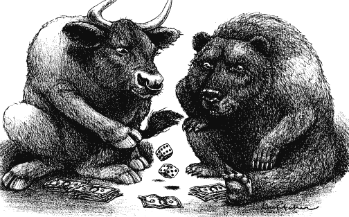

# 从头开始构建一个象征性的评估方法

> 原文：<https://medium.com/hackernoon/building-a-token-valuation-methodology-from-the-ground-up-be3ab5f22bfe>

“一个纯朴的预测者使用统计数据，就像一个醉汉使用灯柱一样——为了支持而不是为了照明”，安德鲁·朗(1912 年诺贝尔文学奖)

最近，我们 [**与法国巴黎银行(BNP Paribas)和 CDC Recherche 的研究人员一起发表了一份报告**](https://www.louisbachelier.org/wp-content/uploads/2018/11/cryptoasset_report-003.pdf) ，该报告确定了在构建令牌估值模型时的分析变量。该报告是关于这一主题的一系列报告中的第一份，但目标仍然是一样的——要建立一个象征性的估价模型，首先必须确定分析的变量。

在计算机科学中，垃圾输入，垃圾输出(GIGO)是一种表达方式，用来表达不正确或低质量的输入数据将产生错误输出或“垃圾”输出的概念。代币估价空间目前受到这个问题的困扰。自从过去几年推出代币销售或 ICO 以来，开发可以准确确定代币未来价格的估价方法的概念已经成为越来越感兴趣和争论的主题，一些专家试图改进股票估价模型，希望创建准确的代币价格预测模型。尽管这些努力对于这种新的投资工具来说是值得称赞和必要的，但它们存在多重缺陷。在回顾了现有文献和该领域正在进行的一些工作后，我们发现了以下情况:

首先，缺乏实证分析——建立任何类型的预测模型都需要严格的实证证据。大多数获得资助的 ico 仍在开发过程中。为了能够确定与现有产品/服务相比，使用基于令牌的解决方案的市场渗透率、客户采用曲线和利益权衡，我们需要跟踪和分析相关数据。由于其中一些项目要到 2019 年或 2020 年才会发布，所以今天进行估值是基于大量的假设。

其次，目前正在探索(和使用)的大多数估值模型本质上是股票估值模型的翻新版本——只是代币不是股票，不具有相同的特征。令牌空间中存在显著程度的多样性，这一事实进一步加剧了这一问题。如今，我们有工作令牌、实用令牌、安全令牌等..由于我们没有令牌的标准分类法，因此“一刀切”的估价模型是一种严重的过度简化，不尊重令牌的基本功能。因此，使用翻新的股票估值模型不适合这种新的投资工具。

第三，代币具有类似货币的属性和功能目标。加密资产和区块链的这一特征使其不同于其他类型的技术。虽然人工智能、虚拟现实、3D 生物打印机或任何其他类型的技术都有产生经济价值的功能目的，但技术与其产生的经济价值之间的区别是显而易见的。另一方面，加密资产具有内置于代币功能中的经济价值，这使得每个代币项目都类似于一个微型宏观经济，具有自己的货币供应和流通速度属性。

在构建估值模型时，加密资产的这种宏观经济视角往往没有被考虑在内，而且在大多数情况下，白皮书中也没有明确阐述。2018 年年中，当宾夕法尼亚大学的研究人员分析了 50 个票房最高的 ICO 的智能合约时，他们发现大多数代币发行者未能正确定义代币的供应动态(这直接影响其价格)，更少的人将这些动态编码到他们的智能合约中。下图总结了他们的结果:

作为这些问题的结果，再加上该空间中动荡的监管变化，代币的价格高度受制于市场的投机效应和邪恶行为者的相应行动。突出这一点的一个实践是[的“泵 n’Dump schemes](https://www.pymnts.com/cryptocurrency/2018/cryptocurrency-pump-dump-schemes/)，在这种情况下，一个边缘团体人为地抬高代币的价格，以便在短时间内快速获利。没有考虑到潜在的业务，因为价值被牺牲在轻松赚钱和 FOMO 的祭坛上。

Image source: [https://www.ccn.com/pump-dump-know-signs-trading-altcoins/](https://www.ccn.com/pump-dump-know-signs-trading-altcoins/):

这种行为，加上缺乏投资者的理解和不良的投资行为，使合法投资者的行为偏向不科学的行为，从而进一步影响代币的价格。说明这种联系的一个恰当的例子是技术分析或图表分析。大多数代币交易者(甚至股票交易者)使用术语“技术分析”来指根据他们在交易平台上看到的模式进行交易的行为，如[交易视图](http://www.tradingview.com/)。但是这种形式的分析是[一个自我实现的预言](https://www.nature.com/articles/srep04487)，它基于很少的科学事实。这方面的一个很好的例子是“呕吐骆驼模式”，该模式用于在市场变得熊市的假设下进行交易，这反过来会影响代币的价格。创造这个术语的人对这种现象做出了最好的解释(见下面的视频),并展示了当前技术分析定义的谬误以及它如何影响代币的价格:

**为代币估价构建模块化估价方法:**

鉴于上述问题，区块链机构群体需要认识到这样一个事实，即这种新兴投资工具需要一种新的估值模型。这种方法需要自己的框架、恰当的定义、行话，最重要的是，自己的一套变量。

任何建立估价模型的人都知道，用作模型输入的变量和相应数据决定了模型的准确性和可预测的有用性。第一个将这种方法的重要性具体化的人是本杰明·格拉哈姆，他是《证券分析》和《聪明的投资者》的作者，通常被认为是价值投资之父。

考虑到这些问题，我们决定从头开始，开发一种新的令牌估值方法。按照循序渐进的方法，我们从基础开始，解决了技术分析的问题，但有了新的定义—我们将技术分析定义为对 ICO 的技术特征的分析，重点关注智能合约，因为它们是 ICO 的治理模型，并直接影响令牌的供应和价格。我们的目标是重现本杰明·格拉哈姆的行为，他使我们能够将股票的内在价值与其投机价值分开。

我们的报告 [**“加密资产估值:识别分析变量”**](https://www.louisbachelier.org/wp-content/uploads/2018/11/cryptoasset_report-003.pdf) 详细介绍了投资者在分析 ICO 白皮书时需要考虑的技术变量。我们详细介绍了智能合约的局限性，并使用来自 [**ChainSecurity**](https://chainsecurity.com/) 和 [**Stratumn**](https://stratumn.com/) **，**的输入，提供了一个技术变量的汇编列表，可以帮助我们开始思考如何着手构建一个尊重令牌空间粒度的估值模型。我们的列表包括:

*   代码库的基本属性(语言和版本)
*   代币销售的身份管理系统
*   比例因子
*   符合 ERC20 标准
*   否定条件的存在
*   修饰语的使用
*   函数的极限
*   函数的返回值
*   溢出和溢出
*   重入和重排序攻击
*   GITHUB/Etherscan 相关变量等…

这份报告不是:它没有提供一个估值模型。相反，我们专注于我们认为在开始创建令牌估值模型的构件时需要考虑的内容。

这份报告是什么:

*   对当前估价方法的回顾以及它们之间的比较。
*   可用于构建上下文相关令牌评估模型的技术变量列表。

**向前移动:**

我们希望这份报告将激发建立一个新的象征性估价方法的倡议。然而，我们只是触及了表面。展望未来，我们目前关注的是进行象征性估值时需要考虑的宏观经济变量。如前所述，代币项目类似于宏观经济，因为代币具有类似货币的属性，代币项目有自己的货币流通考虑因素。因此，利用内生货币体系的进展，并借鉴货币和财政政策的研究结果，我们报告的第二部分将重点关注这些问题，并确定货币变量，以建立一个象征性的估值方法。

我们确定估值变量的最终目标是创建一个模块化的估值方法。由于代币可以根据其提供的服务类型拥有不同的功能，因此“一刀切”的估价模式是不明智的。我们需要的是一个模块化的估价模型以及一个广泛的变量列表，这将使我们能够根据所考虑的令牌类型选择正确的变量，并建立最符合令牌规格的估价模型。我们可以建立上下文相关的估价模型，而不是使用一刀切的方法，这将是在该领域建立标准分类法的第一步。

只有获得这样的输入并建立一个变量工具箱，我们才能:

*   开发令牌项目的分类。
*   创建考虑不同令牌类型的特定功能的估价模型。
*   让普通投资者有机会在不久的将来做出更好的投资决策。

**结论:**

代币投资本应是我们扩大新技术和新公司投资渠道的一种方式。然而，由于缺乏一个结构框架来帮助投资者确定一项投资是好是坏，大量的骗局扩大了这一空间，削弱了这一投资工具的潜力。那些有必要的手段和技能来执行受过教育的分析的人通常是大型机构投资者或风险投资者，他们不急于与社区分享他们的秘方。

这种知识二分法的结果是，对代币销售的信心开始减弱，风投凭借其更深入的知识和资源，正在发号施令。如今，大多数 ICO 投资都是握手交易，风险投资也在迅速发展。截至 2018 年 10 月，ICO 和传统风险投资基金持平(来自 ICO 和 VC 的 6 亿美元，合计 12 亿美元)，如下图所示:

*Source: Autonomous NEXT.*

为了解决目前这种失衡的情况，并让 ico 成为他们应该成为的民主投资工具，我们需要创建、测试和开发一个新的估价框架，让加密社区能够访问和理解。如果没有这种方法，我们就有回到过去孤立和集中的金融实践的风险，而这种技术本应粉碎这种金融实践。

ICO 需要被视为我们金融和经济困境的解毒剂…而不是伪装在象征性外衣下的孪生兄弟。

— — — — — — — — — — — — — — — — — — — — — — — — — — — — — — -

[***访问报告*** *。*](https://www.louisbachelier.org/wp-content/uploads/2018/11/cryptoasset_report-003.pdf)

*本文表达的所有观点仅代表作者的观点，不代表报告发起人的观点。*