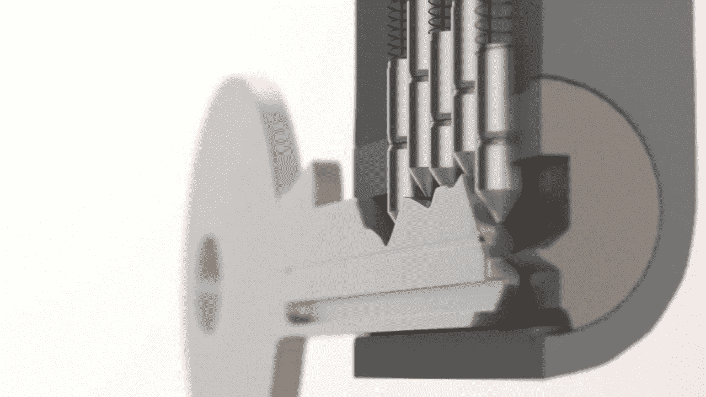
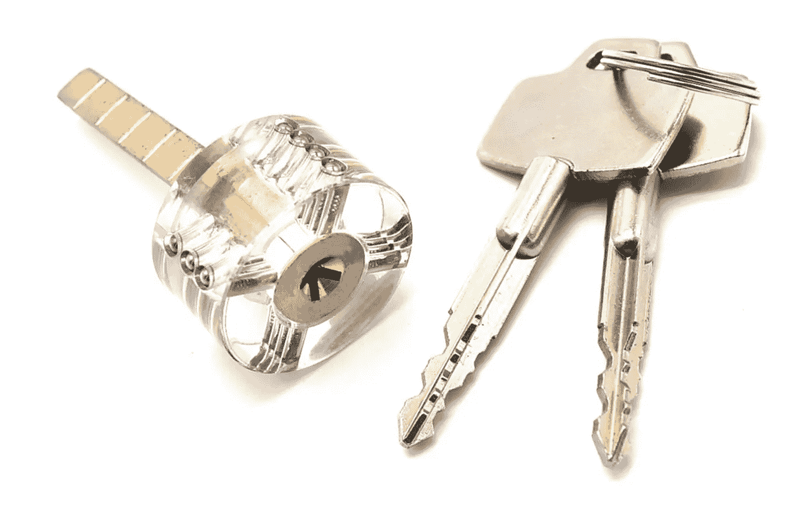

# 用分布式密钥生成器构建一个真正分散的系统

> 原文：<https://medium.com/hackernoon/building-a-truly-decentralized-system-with-a-distributed-key-generator-1cfe13af55e7>

任何仍然需要可信实体来保存秘密的系统本质上是不分散的，并且遭受许多弱点，包括:单点故障、易受拒绝服务攻击以及最糟糕的是秘密被窃取。

当我们着手为氦站的机器构建一个新的无线网络时，我们有许多设计目标，其中最关键的是在本质上实现真正的去中心化(其他目标包括无许可、拜占庭容错、有用的工作/身份证明、高确认交易率以及交易具有审查抵抗力。更多细节参见氦[白皮书](http://whitepaper.helium.com)。

由于集中式组织决定了网络成本和覆盖范围，我们认为分散式方法是一种有效的方式，可以为长距离的低功耗设备提供广泛、经济的无线覆盖。

为了构建我们的分散式机器网络，我们选择奖励我们的社区通过托管网关来提供无线网络覆盖。

为了确保社区成员提供有效的保险，我们创建了一个新的工作证明系统，我们称之为保险证明。覆盖范围证明是第一个利用无线电波来验证网络覆盖范围并使用它来实现物理区块链共识的证明协议。

提供网关覆盖的社区成员通过来自网络用户的采矿和交易费获得氦令牌作为奖励。

对于要挖掘的网关，它需要属于共识组。网关可以通过基于提供合法的无线覆盖获得分数而被选入共识组。

在 Helium 中，这个一致性组被临时分配运行一致性协议的任务，以接受事务并创建块。Helium consensus 协议需要使用门限加密来完成两项任务:同意下一个块的交易而不审查它们，以及提供一个“[公共硬币](https://eprint.iacr.org/2000/034.pdf)来打破协议中的死锁。这些类型的门限密码系统需要在共识组的所有成员之间共享一个密钥。显然，一方知道完整的密钥是一个很大的安全漏洞，所以这就是为什么我们需要建立一个分布式密钥生成器。

[分布式密钥生成器](https://eprint.iacr.org/2012/377.pdf)是一组节点在任何一方都不知道私钥(每个人都知道公钥)的情况下集体商定公钥/私钥对*的一种方式。这实际上很难实现，但它依赖于这样一个事实，即[拉格朗日插值份额](https://en.wikipedia.org/wiki/Lagrange_polynomial)是同态的(即使不知道全部值，也可以对份额执行操作)。例如，您可以添加一个{share1}+B{share1}以获得 C{share1}，您可以将它添加到其他人的 C{share2}中以获得 C 的*完整*值(假设 A 和 B 被分成两份)。*

我想以一种非技术观众可以理解的方式解释 DKG 是如何在基于[配对的密钥](https://en.wikipedia.org/wiki/Pairing-based_cryptography)上工作的。我玩过一些比喻，但是最接近它实际工作方式的一个是基于弹子锁的。

弹子锁的工作原理是钥匙将几个“钥匙销”推到正确的高度，使钥匙销和驱动销之间的剪切线与锁的旋转部分(锁芯)和锁的固定部分之间的剪切线对齐:

当插入正确的钥匙时，所有的销排成一行，因此剪切线是清晰的，并且芯可以旋转。即使有一根针错了，锁也打不开。

如果你愿意，和我一起想象我设计了一把锁(用相应的钥匙)。我知道钥匙上的每一个销需要多深的切口，但没人知道。我给我所有的同伴一份密钥 pin 信息，使得 T+1 (T+1 是*阈值*你需要重构原始数据的份额数)份密钥 pin 信息足以制造一把打开锁的钥匙。这叫做[秘密共享](https://en.wikipedia.org/wiki/Shamir%27s_Secret_Sharing)。

现在，如果每个人都相信我不会泄露我的密钥知识，那就没问题了。然而，如果我们想要的属性是*没有人*应该知道密钥看起来像什么，这是不够的，这就是*分布式*密钥生成器的用武之地。

除了“普通”弹子门锁之外，还存在带有“十字钥匙”的锁，其中钥匙有几个叶片，每个叶片带有一组相应的弹子:

‘Cross Key’ Keys require two sets of combination blades

现在，假设密钥有 N 个刀片(其中 N 是生成密钥的人数)。每个成员为他们的刀片*生成销栓配置，并如上所述共享它。然后，一旦每个人都分享了他们的刀片并收到了他们在其他刀片中的份额，我们现在就有了一把锁，没有人*知道如何打开它，但是 T+1 成员可以组合他们的份额来构造一把钥匙来打开它。这是分布式密钥生成。**

Blades combining to form a new key

在正常使用中，通常不恢复完整的密钥，而是密钥份额的持有者一起工作以在[门限密码系统](https://en.wikipedia.org/wiki/Threshold_cryptosystem)中执行操作(例如，N 个中的 T+1 个需要参与签署消息，或者 N 个中的 T+1 个需要参与解密消息)。

构建分布式密钥生成器是实现更安全系统的艰难但必要的工作，但这些挑战让团队兴奋不已，因为他们知道我们正在构建世界上第一个分散的机器网络。

要跟踪我们 dkg 工作的进展，请查看我们的 [github repo](https://github.com/helium/erlang-dkg) 。

