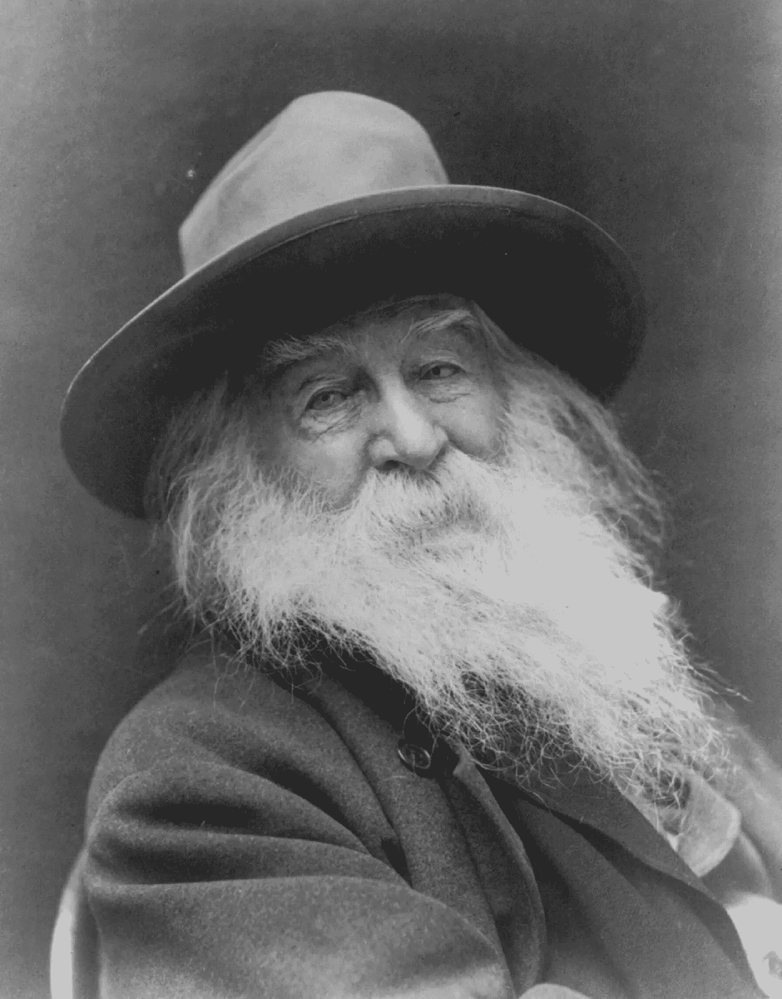
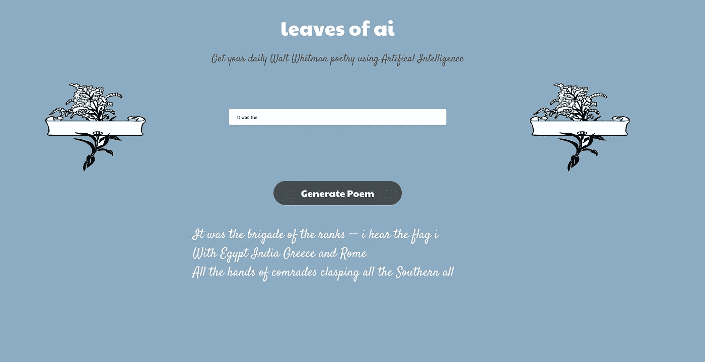

# 构建沃尔特·惠特曼诗歌生成器应用程序

> 原文：<https://medium.com/hackernoon/building-a-walt-whitman-poetry-generator-app-d49e40f80e61>

这是我关于使用深度学习生成沃尔特·惠特曼风格诗歌的文章的后续:[https://hacker noon . com/I-tryed-my-hand-at-Deep-Learning-and-made-some-poem-along-way-2e 350 c 33376 f](https://hackernoon.com/i-tried-my-hand-at-deep-learning-and-made-some-poetry-along-the-way-2e350c33376f)

由于我一直在开发应用程序，所以我想为什么不把这个模型也转换成一个应用程序呢。一旦你有了一个训练有素的深度学习模型，使用它来设置一个应用程序可能是一个简单的步骤。

我做这个项目最初的灵感来自于参加 NaNoGenMo 系列:【https://github.com/NaNoGenMo/2018

这是一项每年 11 月举行的竞赛，人们试图训练算法来写小说。不幸的是，我们还没有使用一种算法来破解这个难题，写出那么长时间值得一读的东西(尽管每年我们都更接近了！).

我决定创作诗歌，因为听起来更容易让人信服(为艺术欢呼)。那首诗…很有趣。用 app 就能看到:【https://leaves-of-ai.now.sh/ 

你可以给它一个词根或短语，它会以此为起点生成一首诗。相当整洁。

但这并没有就此结束。因为现在一切都设置好了，你可以很容易地改变数据集，得到一个全新的应用程序。假设你想得到一些莎士比亚生成的文本。你所要做的就是把数据集改成莎士比亚戏剧的数据集，你就有了一个人工智能罗密欧与朱丽叶应用程序。:)

fastai 的一个学生实际上用了我的应用程序，并把他自己的想法放在上面，做了一个 Elon Musk tweet 生成器！很好笑，而且可能比我的主意更好。

对这种应用程序有什么好主意吗？请在评论中告诉我。

这个项目是使用 fastai 库构建的(fastai 库是在 Pytorch 上构建的)。我使用了一个基于 AWD-LSTM 的 char-RNN 网络来生成我们的文本。

你可以在这里找到完整的代码:[https://github.com/btahir/leaves-of-ai](https://github.com/btahir/leaves-of-ai)