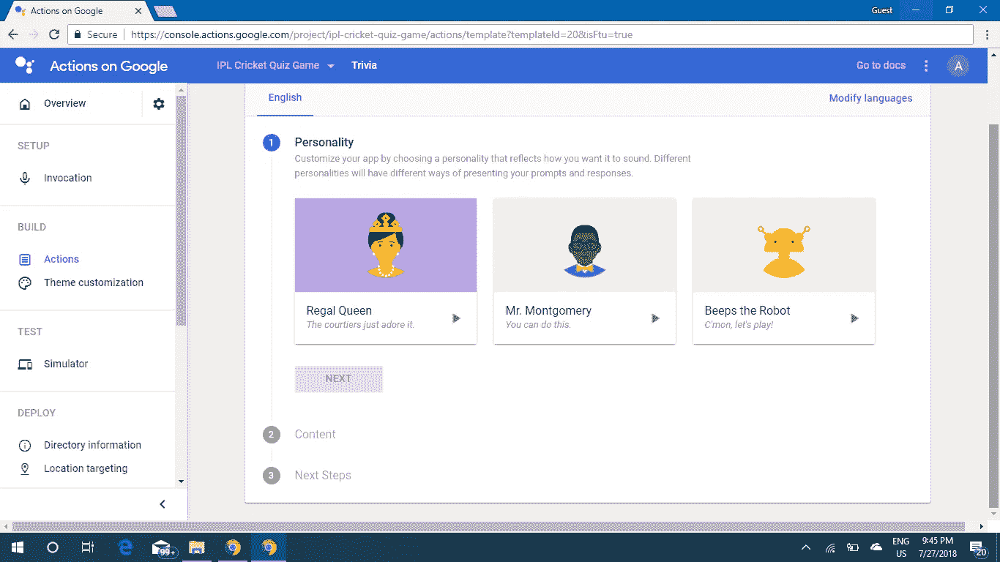
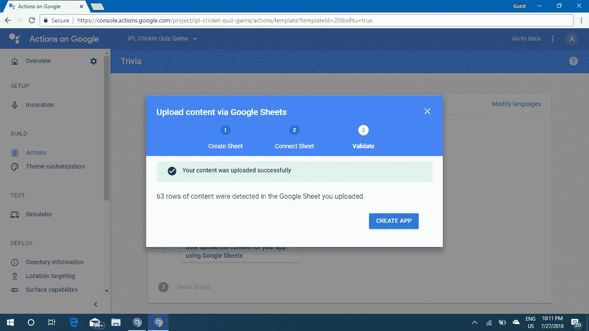

# 为 Google Assistant 构建动作(使用模板)

> 原文：<https://medium.com/hackernoon/building-actions-for-google-assistant-using-templates-31319402fff8>

在我的上一篇文章中，我们查看了为谷歌助手开发动作(或应用)的各个方面。你可以再次浏览那篇文章来刷新话题([https://goo.gl/DJhyK](https://goo.gl/DJhyK)Z)。在这篇文章中，我们可以使用预先构建的模板为 Google Assistant 开发一个简单的动作。如果能用 PC 代替智能手机就好了。
我们将使用模板建立一个简单的测验应用程序。

1.  首先，你需要访问动作控制台([https://console.actions.google.com/](https://console.actions.google.com/))。您需要使用您的 google 帐户登录。在那之后，你会到达一个像这样的页面。

Welcome page

在这里，您将看到转到文档、示例代码、概述视频等的选项。你可以在文档中读到同样的内容，但是方式不同。您也可以观看 over view 视频。显然，那些视频讲座很好看。

2.现在，您必须点击，添加/导入项目。在出现的弹出窗口中，您必须为您的项目(或应用程序)命名，该名称可用作您的应用程序的名称。(您可以稍后指定名称)。提供名称后，选择语言。它将默认为英文，没有必要改变它，因为我们正在使用模板。之后，选择你的国家。

3.现在，点击创建项目。您将被引导至如下所示的页面。

在这里，你会发现开发不同应用程序的各种主题。由于我们正在构建测验应用程序，我们可以选择游戏和娱乐(第一选项)，因为这定义了我们的应用程序(儿童和家庭也定义了我们的应用程序，但用户覆盖面会很低)。现在，继续选择游戏和娱乐。

4.现在你会看到 4 个选项。从精选小测验中(你也可以选择抽认卡。选花絮会比较好)。当你点击它时，你将被引导到如下所示的页面。

现在，我们可以熟悉页面中的各种选项。这是我们的发展页面。通过此页面，我们可以在发布行动/应用程序之前或之后对其进行管理。

我们现在站在概览部分。从这里我们可以看到我们行动的状态。在左侧，有许多选项，如调用(用于通过 Google Assistant 调用您的应用程序)、操作(创建操作的主要内容)、主题定制(您可以定制操作的声音)、模拟器(您可以在发布之前测试您的操作)、目录信息(必须输入操作的详细信息)、定位(可以提供可用操作的位置)、表面功能(您可以选择您的操作是可以在移动设备和 Google home 上使用还是只能在任何一个上使用)等。

现在我们可以回到谷歌助手的第一个动作的开发。

5.点击快速设置下方的“决定如何调用您的操作”。您将被定向到一个页面，在该页面上您将被要求提供显示名称。您可以在此处为您的应用命名。尽量保持你的名字简短。此名称也将用于调用您的应用程序。我提供了我的应用程序的名称为“IPL 板球问答”。

6.在那下面，你会发现一个改变谷歌助手语音的选项。有 4 个模型，其中两个是男声，另外两个是女声。你可以选择任何人。

7.现在，在右上角，您会发现一个名为“保存”的按钮。点击以保存您输入的信息。如果您提供的名称已经被其他人使用，将会显示一条错误消息。如果出现这种情况，请更改操作的显示名称。

8.现在回到概述页面。单击“构建您的操作”下的“添加操作”。你将被要求为你的行动选择一个个性。您可以点击播放图标，尝试 3 种不同的选项。你可以选择你最喜欢的个性。选择该选项，然后单击下一步。

9.现在，您将被要求通过 Google Sheets 批量上传内容。这将是你的应用程序的内容。我们必须通过谷歌电子表格提供内容。点击“批量上传内容”。现在，将出现一个弹出窗口，并显示一些说明。其中，将提供一个链接来创建一个预建的电子表格的副本。点击那个。

10.当您单击该链接时，您将被定向到一个页面，在该页面上将出现一个电子表格文档。我们不应对前 7 行进行任何更改。你可以删除之后的所有内容，用你自己的内容填充。确保包含至少 50 个问题，否则同一个问题会被频繁重复。您所做的所有更改都将自动保存。

11.如果您看一下页面的底部，您会发现一个切换到另一个名为 configuration 的页面的选项。转到该页面。你会发现那里有两行。将此处提供的名称更改为操作的显示名称。你也可以改变游戏中要问的问题数量。我通常选择 5，因为它既不长也不短。每场比赛它最多可以问 10 个问题。(包括尽可能多的问题。否则，将重复相同的问题)。每一个细节都会自动保存。

12.在右上角，您会发现一个共享文档的选项。点击它，获得一个可共享的链接。

13.现在回到动作控制台。单击“下一步”,将刚才复制的链接粘贴到提供的空白处。点击上传。如果您的电子表格中没有错误，您将被要求单击“创建应用程序”按钮。点击按钮。10-20 秒后，您的应用程序将被创建(如果没有错误)，并将被带回到您可以使用模拟器测试您的应用程序的地方。

现在，点击测试应用程序，检查你的行动是否正常。您将被带到模拟器页面，在这里您可以测试您的操作。你也可以使用你的手机(它应该有谷歌助理应用程序)或谷歌家庭设备，如果你已经为动作控制台使用了相同的谷歌帐户。你只需要说‘跟我的测试应用说话’。你可以使用手机、家庭设备或网络模拟器。检查完您的操作后，返回概览页面。

14.现在，单击“准备部署”下面的“输入在操作目录检查中列出您的操作所需的信息”。您将被带到一个页面，在这里您可以输入关于您的操作的介绍、描述和其他详细信息。

输入您的行动的所有细节(它是什么，为什么有用，等等)。

15.接下来，您必须输入示例调用。这里将给出一个调用示例。您最多可以添加总共 5 个示例调用。这是最重要的部分。有一些特定的短语，它们只能被使用。它们可以在这里找到:[https://developers . Google . com/actions/localization/languages-locales](https://developers.google.com/actions/localization/languages-locales)

开始调用的一些短语是，“Tallk to $appname”、“让我跟$appname 说话”、“跟$appname 说话”等。

16.接下来，您必须提供两个图像，一个用于背景，一个用于图标。背景图像的尺寸必须为 1920 x 1080，另一个应为 192 x 192。如果不符合大小要求，您将无法继续操作。您可以使用编辑器等创建自定义图像。

17.接下来，您将被要求提供开发人员的详细信息。只需提供您的姓名(这是可选的)和您的电子邮件 id，它们可用于联系您。

18.上传图片后，您将被要求提供隐私信息。点击那个。您将获得一个“了解更多”选项。点击那个。现在，会出现一个弹出窗口。将有一个链接，将引导您到一个预先建立的隐私政策内容。转到文档，复制说明部分之后的内容。

19.你必须创建一个网站来存放隐私政策的细节。别担心。在谷歌网站([https://sites.google.com/](https://sites.google.com/))的帮助下，创建一个网站非常容易。它可以在 2-5 分钟内完成。
去谷歌网站(点击上面的链接)。在左侧，你会发现一个创建新站点的选项。单击“创建”，然后选择“在新站点中”。这将带你到另一页。给出标题名，然后是标题。之后，点击右侧的文本工具。将生成一个文本区域。粘贴您之前复制的内容(隐私政策)。现在，将${APPNAME}和${DEVELOPER}替换为您的动作的显示名称和您的姓名(将您的姓名放在第一个位置，将其他名称替换为“开发人员”)。现在，你的网站已经准备好了。

20.现在，发布你的网站并获得你的网站链接。复制链接。

21.返回操作控制台页面，将复制的链接粘贴到要求您提交隐私策略的位置。所以那部分已经结束了。

22.以下部分是定位和水面能力。默认情况下会选择它，您不必更改它。现在所有的部分都完成了。现在，我们面前还有两个步骤。

23.下一步是保存所有的细节。保存按钮可以在右上角找到。如果你到目前为止都做对了，就不会有错误。(如果示例调用的结构不正确，将会显示错误。您可以通过访问文档页面来更正它。将显示该链接，或者您可以通过步骤 15)中给出的链接来访问它。现在，拯救的部分结束了。

摆在我们面前的最后一件事是提交我们的应用程序进行审查(由谷歌的工作人员进行)。

24.再次转到概览页面。你会在底部找到释放标签。单击该选项卡。您将被引导至一个页面，其中有一个“提交生产”按钮。

点击“提交生产”按钮。将出现一个弹出窗口，确认您是否已经检查了您的操作并完成了启动清单。确认这两件事，然后点击“提交以供审查”。

如果我们已经完成的任何过程中有任何错误，现在都会显示出来。如果显示了任何错误，请返回，清除它，再次提交以供审查。如果没有错误，将显示，您的应用程序正在审查中。您可以随时检查审核的状态。

当您的应用程序提交进行审核时，您将收到一封关于您的操作审核的邮件。前几次审查通常需要 2-4 天。

您将在 2-4 天内收到一封关于您的应用审查结果的邮件。它会告诉你它是否被批准。如果没有被批准，将会有更多关于为什么会发生以及克服错误的方法的细节。即使通过了，也会有一些关于如何改进你的 app 的提示。

如果你的应用被提交审查，那么恭喜你。
🎊🎊🎊🎊🎊🎊🎊🎊🎊🎊🎊🎊🎊🎊🎊🎊🎊🎊🎊🎊🎊

您已经完成了 95%👍🙌✌👏你的任务。最有可能的是，不会有任何错误，因为这是使用模板构建的(如果您的操作的显示名称与任何其他操作的名称相似，则显示名称中可能会出现错误)。

如果你已经做了所有这些，等待 2-4 天。您的应用程序将会发布，并可供超过 5 亿用户使用。现在，别忘了看这个视频:[https://www.youtube.com/watch?v=ua4QGWmDfB8](https://www.youtube.com/watch?v=ua4QGWmDfB8)

当你的行动被认可时，别忘了分享给你的朋友。别忘了和我分享。😊😊😊

如果你感兴趣，你可以在一个小时内完成所有这些。如果你不是真的感兴趣，你会发现这些有点难。在写这篇文章的时候，我创建了一个应用程序😁。我已经包括了几乎所有的步骤，我希望，我能够让你明白一切。如果没有，请打电话到 aravindvenugopal1444@gmail.com 找我。我随时都可以帮助你。别忘了把这篇文章分享给你的朋友。让他们也做一些好看的 app。
你也可以访问 Youtube，找到一些由 Ido Green 创作的关于所有这些主题的好视频。

我将很快提出另一部分(使用 Dialogflow 构建动作)。

别忘了试试我的一些应用。这里提到了调用名。所以，打开你的谷歌助手应用程序，告诉它，

1.  彩光测验-谈论彩光测验
2.  读心术巫师-与读心术巫师交谈

所有最好的人。现在，自己去尝试一下，并与他人分享你的知识。