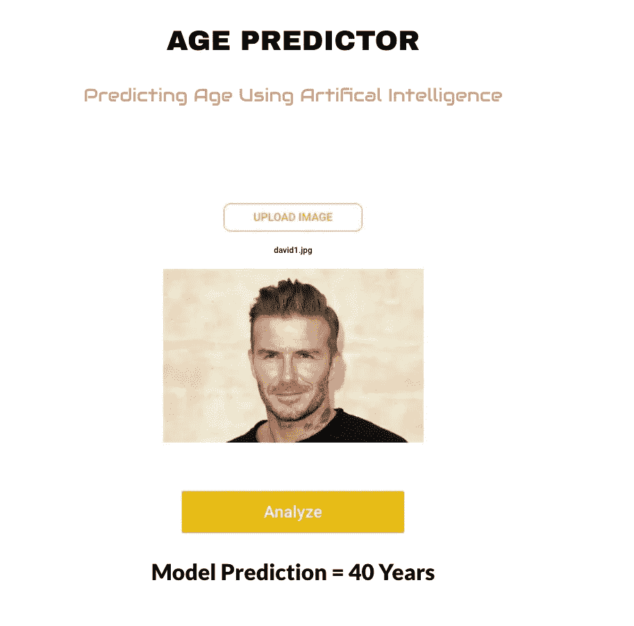
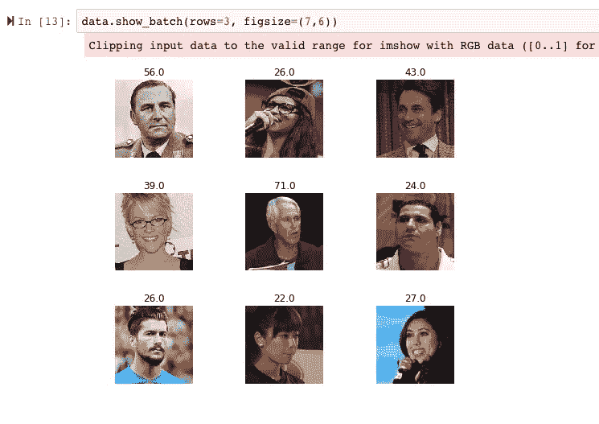
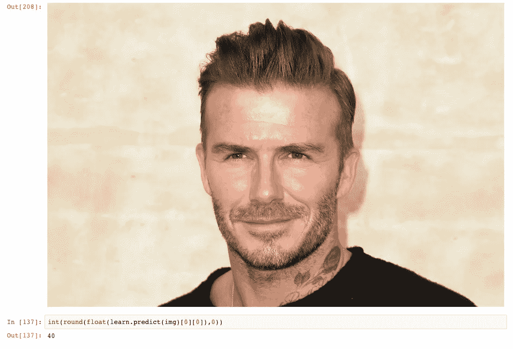

# 使用深度学习预测照片中的年龄！

> 原文：<https://medium.com/hackernoon/building-an-age-predictor-web-app-using-deep-learning-25f0190ea18f>

An App that predicts the age of the person in the photo

如果你只是想玩玩这个应用程序，看看这里:[https://age-predictor.now.sh/](https://age-predictor.now.sh/)

继续我的深度学习之旅，我决定尝试在图像中预测人的年龄。

谢天谢地，有一个非常好的数据集可供我使用，叫做 IMDB-Wiki 数据集:【https://data.vision.ee.ethz.ch/cvl/rrothe/imdb-wiki/ 

# 迁移学习

我对此喋喋不休。转学很牛逼！你可以用一个已经训练好的模型走得更远，而不必花几天时间来训练你的模型。这就像一场接力赛，最初的模型正在把接力棒传递给你，让你继续前进。

使用维基百科的纯人脸数据，我训练了一个 Resnet-50 模型(已经在 Imagenet 上训练过了)。这类似于创建数据集的人采用的方法，但他们使用了不同的头，即 VGG16 模型而不是 Resnet。

# 与数据角力

很多时候，将数据转化为易于理解的形式是深度学习项目最大的挑战。在这种情况下，尽管数据可供我使用，但我仍然不得不进行一些争论。

首先，数据被分成子集并存储在编号为 01-99 的文件夹中。我编写了一个 python 脚本来遍历目录，并将所有文件移动到一个文件夹中，我的模型将在这个文件夹中使用这些文件。

一个有趣的挑战是获取标签，因为它们没有单独的文件，而是在图像本身的文件名中。数据集中的图像有文件名，包括人的出生日期和照片拍摄的年份。利用这些，并假设照片拍摄的年中日期为 7 月 1 日，我们可以很好地估计照片中人的年龄。

我编写了另一段代码，从这两个日期中推导出年龄，以获得标签。为了简单起见，我只选择了年龄在 10-120 岁之间的照片。这意味着这个模型对于非常小的孩子或者非常老的人来说是不适用的。

现在我们有了数据以及年龄/标签:

# 模特培训

该训练模型了！我使用 Pytorch 上运行的惊人的 fastai 库进行深度学习:【https://github.com/fastai/fastai。

Fastai 是新来者进入深度学习的一个很好的方式。在他们的网站上找到更多信息，并参加他们的课程。免费的！

# 结果

经过几个小时的训练，这个模型看起来还不错:

# 部署到生产

我喜欢这个结果(即使他们是错的，听起来仍然很有趣，所以……)。我把我的模型转移到了 Zeit 应用程序代码库中。Zeit 是快速部署你的应用程序的一个很好的服务(他们有一个免费层！):[https://zeit.co/](https://zeit.co/dashboard)

这是我的直播应用:【https://age-predictor.now.sh/ 

这是应用程序中的同一个示例:

Not too shabby, despite the cheesy Alien Font

请玩一些照片，看看你会得到什么样的年龄预测。让我知道进展如何！

包含代码的 Github 回购:【https://github.com/btahir/age-detector 