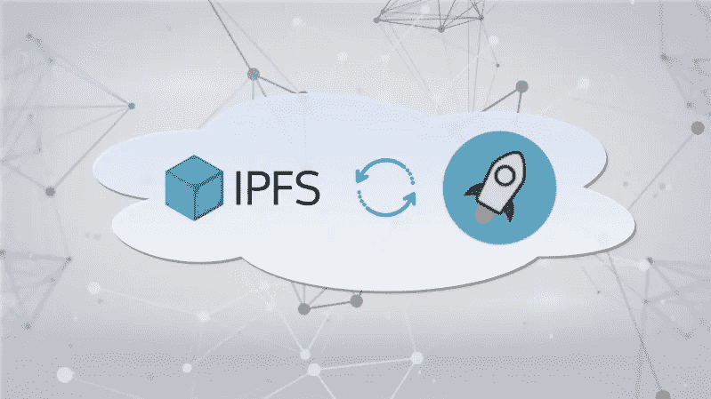
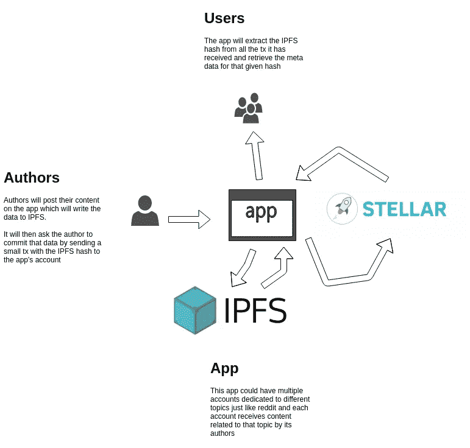
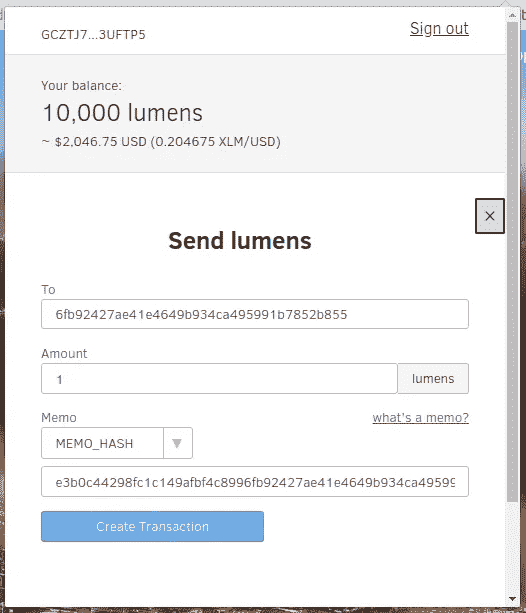

# 与恒星和 IPFS 一起构建应用程序

> 原文：<https://medium.com/hackernoon/building-an-app-with-stellar-and-ipfs-7ad57b48fda5>



虽然以太坊一直是编写 dApps 的首选平台，但可以说的交易费用非常低，而且比其他区块链(包括以太坊)快得多。

所以我开始想，用一流的[区块链](https://hackernoon.com/tagged/blockchain)来构建一个像 HackerNews 或 Reddit 这样的论坛的去中心化版本会是什么样子。以下是我所设想的工作方式:



让我们看看我们将如何去实现它。

首先，我们需要[在 Stellar testnet 上创建一个账户](https://www.stellar.org/laboratory/#account-creator?network=test)。什么是测试网？用最简单的话来说，这是一个区块链，旨在测试你不会产生任何实际费用。在这种情况下，我们将用 10k 假流明加载我们的测试帐户进行测试。

接下来，我们将构建一个小的 JavsScript 客户端，允许用户在应用程序上提交帖子。

我们可以直接获取这篇文章，并让用户通过将它放在交易的备忘录字段中，将其发送到我们应用程序的帐户。尽管 Stellar 的交易只允许有限的备忘录格式——文本(最多 28 字节的 UTF-8 字符串)、ID(无符号 64 位整数)或哈希(十六进制格式的 32 字节哈希)。所以存储大量的文本或 JSON 是不可能的。

**把它寄到 IPFS**

这就是 IPFS 的用武之地——一种 P2P 协议和网络，旨在跨所有设备存储和共享分布式文件系统中的内容(可以将其视为 git 和 BitTorrent 的私生子)。

我们将获取这些数据，并将其存储在 IPFS 的一个 JSON 对象中。

```
import ipfsAPI from 'ipfs-api'// I'm just using an IPFS gateway here for testing but in a real-world setting, we would run our own IPFS node so we can persist data
const ipfs = ipfsAPI({ host: 'ipfs.infura.io', port: 5001, protocol: 'https' });
const post = JSON.stringify({title: "'So exited!!!', content: 'This is my first post on the blockchain!', username: 'h4ck3r'})"
const buffer = Buffer.from(post);ipfs.files.add(buffer, { pin: false }, (err, ipfsHash) => {
  console.log(ipfsHash[0].path) // => QmV3C3HFE8824KWYTMq5fbZyF93GTMz5W7h3uBG1oVZCv8
});
```

现在我们有了一个足够小的散列值，可以在 memo 字段中发送。虽然看起来可能有另一个问题。IPFS 使用 Base58 编码的[multi hash](https://multiformats.io/multihash/)[multi format](https://multiformats.io/)表示文件和对象的散列。前缀`Qm`对应于 IPFS 使用的算法(SHA-256)和长度(32 字节)。

因此，看起来我们不能将它添加到我们的事务的文本字段中，该字段只允许最多 28 字节的字符串，我们也不能使用只允许 32 字节哈希的哈希字段。

因此，我们必须编写一个函数，将这个 IPFS 散列转换回十六进制格式的 32 字节散列:

```
import bs58 from 'bs58'this.getBytes32FromIpfsHash = (ipfsListing) => {
  // Decode the base58 string and then slice the first two bytes
  // which represent the function code and it's length, in this case:
  // function:0x12=sha2, size:0x20=256 bits
  return bs58.decode(ipfsListing).slice(2).toString('hex')
}
```

**加在区块链上**

既然我们已经有了存储在 memo 字段中的正确散列，我们就必须弄清楚如何实际发送这个事务。一个选项是提示用户使用 [MetaPay](https://pay.meta.re/) ，这是一个恒星的 Chrome 扩展钱包(有点像恒星流明的 MetaMask)。一旦他们安装了 MetaPay，我们就可以像这样设置一个 URL:

```
<a ref='savePost' data-meta-pay
    href="https://stellar.meta.re/transaction?to=[address]&amount=1&memo=[txMemo]" target="_blank" >Save Post</a>
```

现在，如果我们将所有这些放在一起，提交帖子的逻辑将如下所示:

```
import StellarSdk from 'stellar-sdk'// Add the post data to IPFS
this.submitPost = (post) => {
  const buffer = Buffer.from(post);
  ipfs.files.add(buffer, (err, ipfsHash) => {
    this.txMemo = this.getBytes32FromIpfsHash(ipfsHash[0].path)
    this.refs['savePost'].click() // This will open the MetaPay popup
    this.confirmPayment(this.txMemo) // Listen to see if the transaction went through
  });
}// Check to see if the transaction went through
this.confirmPayment = (ipfsHash) => {
  const server = new StellarSdk.Server('https://horizon-testnet.stellar.org'); server.transactions().forAccount('OUR_ACCOUNT_ID').cursor('now').stream({
    onmessage: (transaction) => {
      if(transaction.memo == ipfsHash) {
        // Yes, it made it on the blockchain!
        transaction.operations().then((ops) => {
          var payment = ops._embedded.records[0];
          if(parseInt(parseFloat(payment.amount)) < 1) { 
            console.error('Payment insufficient. Post not saved!');
          } else { 
            this.pinIpfsListing(ipfsHash); 
          }
        }).catch((error) => {
          error.target.close(); // Close stream
          console.error('Payment Error: ', error);
          alert('Error confirming payment. Try again later');
        });
      }
    },
    onerror: (error) => {
      error.target.close(); // Close stream
      console.error('Streaming Error: ', error);
    }
  });
}
```

这将打开带有所有预填充字段的 MetaPay 弹出窗口，我们将等待并查看用户是否完成该交易，如果是，我们将进入下一步。



**坚持在 IPFS**

```
// If successful, pin our post on the IPFS node
this.pinIpfsListing = (ipfsHash) => {
  ipfs.pin.add(ipfsHash)
}
```

请注意，当我们将数据添加到 IPFS 时，我们没有锁定它。如果不锁定帖子，我们的数据将不会永久存储在 IPFS 节点上，最终将被垃圾收集。

因此，在某种程度上，小额交易费有助于我们支付锁定数据/运行 IPFS 节点的成本，并确保数据可供所有用户使用。

**从区块链上读取&在 IPFS 上找到**

现在，当其他用户访问该应用程序时，我们将提取发布到该应用程序帐户的所有交易，获取 memo 字段，将其编码回 Base58，并从 IPFS 提取数据:

```
import StellarSdk from 'stellar-sdk'
import ipfsAPI from 'ipfs-api'this.getIpfsHashFromBytes32 = (bytes32Hex) => {
  // Add our default ipfs values for first 2 bytes:
  // function:0x12=sha2, size:0x20=256 bits
  const hashHex = "1220" + bytes32Hex
  const hashBytes = Buffer.from(hashHex, 'hex');
  const hashStr = bs58.encode(hashBytes)
  return hashStr
}const server = new StellarSdk.Server('https://horizon-testnet.stellar.org');
const ipfs = ipfsAPI({ host: 'ipfs.infura.io', port: 5001, protocol: 'https' });
let posts = [];server.transactions()
  .forAccount('OUR_ACCOUNT_ID')
  .order('desc')
  .call()
  .then((page) => {
    page.records.forEach(record => {
      if (record.memo) {
        const ipfsListing = this.getIpfsHashFromBytes32(record.memo)
        ipfs.files.get(ipfsListing, function (err, files) {
          files.forEach((file) => {
            const post = file.content.toString('utf8')
            posts.push(post) // Show this to the user
          })
        })
      }
    });
});
```

**分权**

这种架构确保我们的数据是分散的，但应用程序本身呢？如果应用程序宕机，用户可以编写另一个客户端，可以读取该帐户的区块链，并从 IPFS 获取相应的数据。

尽管我们可以更进一步，通过利用`manageData`帐户操作，将客户端代码实际存储在区块链上。

类似这样的东西可能是应用程序构建/部署链的一部分，所以每次发布新版本时，它也会被添加到区块链中:

```
import fs from 'fs'this.publishClient = () {
  const code = fs.readFileSync('my_project/client.js'); ipfs.files.add(buffer, (err, ipfsHash) => {
    const server = new StellarSdk.Server('https://horizon-testnet.stellar.org'); server.loadAccount('OUR_ACCOUNT_ID').then((base) => {
        const tx = new StellarSdk.TransactionBuilder(base);
        const data = {name: 'v1.0.0', value: ipfsHash[0].path};
        tx.addOperation(StellarSdk.Operation.manageData(data));
        var builtTx = tx.build();
        builtTx.sign(StellarSdk.Keypair.fromSecret('OUR_ACCOUNT_SECRET'));
        return server.submitTransaction(builtTx);
    });
  });
}
```

尽管需要记住，每个数据条目都会增加账户所需的最小余额。因此，我们可能只想维护客户代码库的最后一个版本或最后几个版本。但这应该足以使我们的演示应用程序或多或少地分散。

**结论**

这是一个有趣的思想实验，但这个演示应用程序仍然没有办法管理评论，upvotes 等，因为我们在某种程度上受到恒星平台的能力限制。

要构建更高级的东西，我们需要在真正的 dApp 平台上构建，比如以太坊或 NEO，它们拥有实现这一目标的所有必要工具。

但随着最近脸书数据和用户隐私的争议，现在绝对是时候考虑如何建立分散的社交应用程序了。

在这一领域有许多有趣的工作，如 [Datawallet](https://datawallet.com/) 、 [Blockstack](https://blockstack.org/) 、[阿卡夏](https://akasha.world/)等项目，这些项目在未来几年将会很有意思。