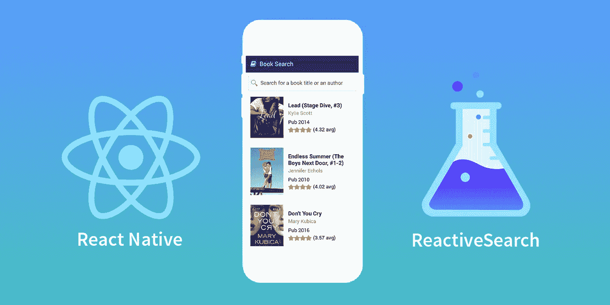
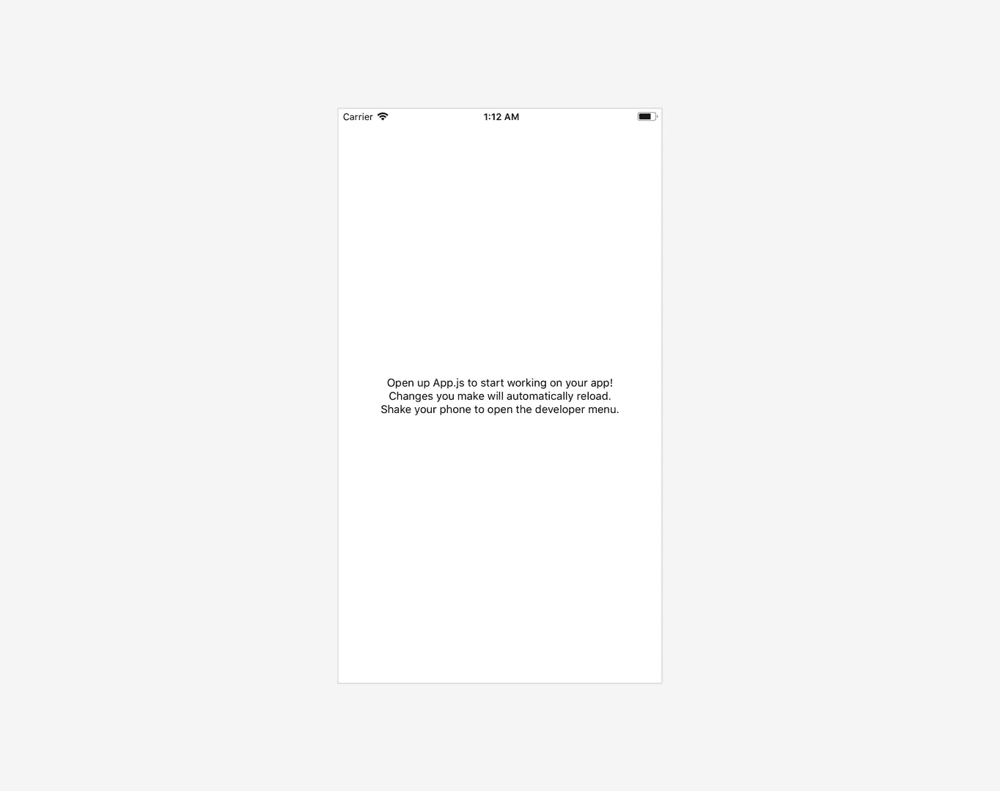
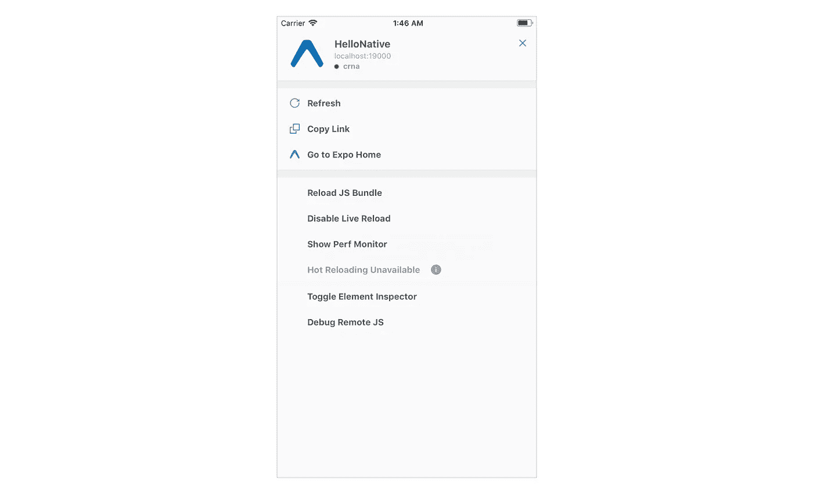
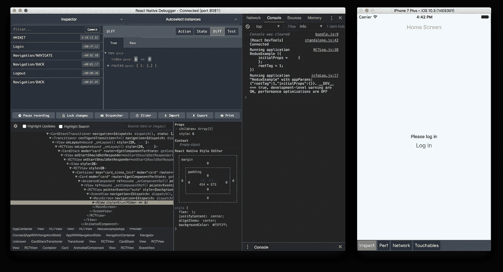
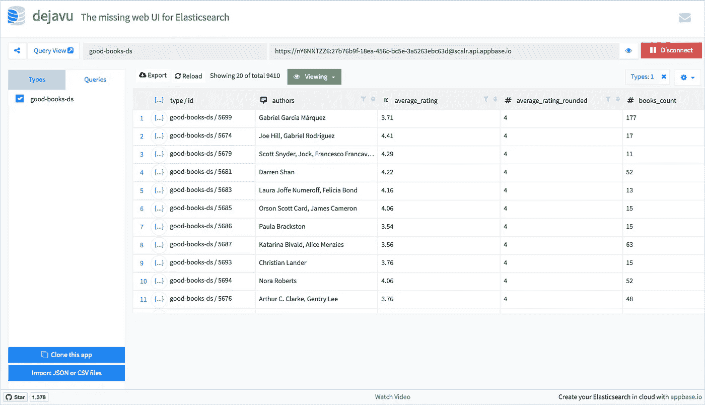
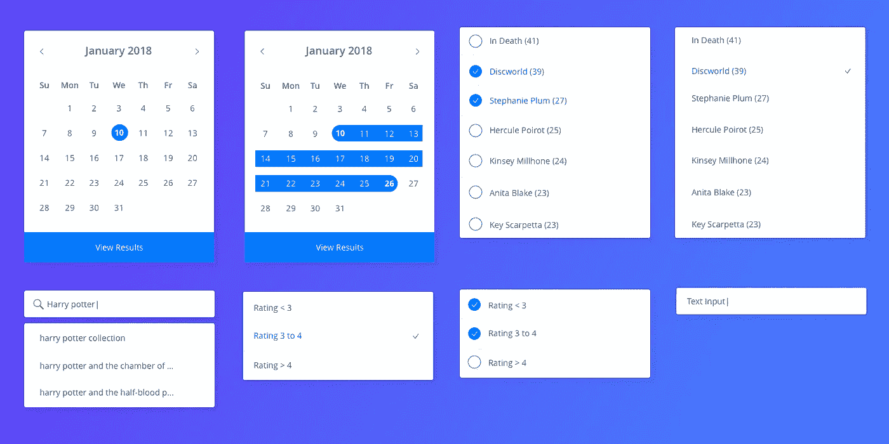
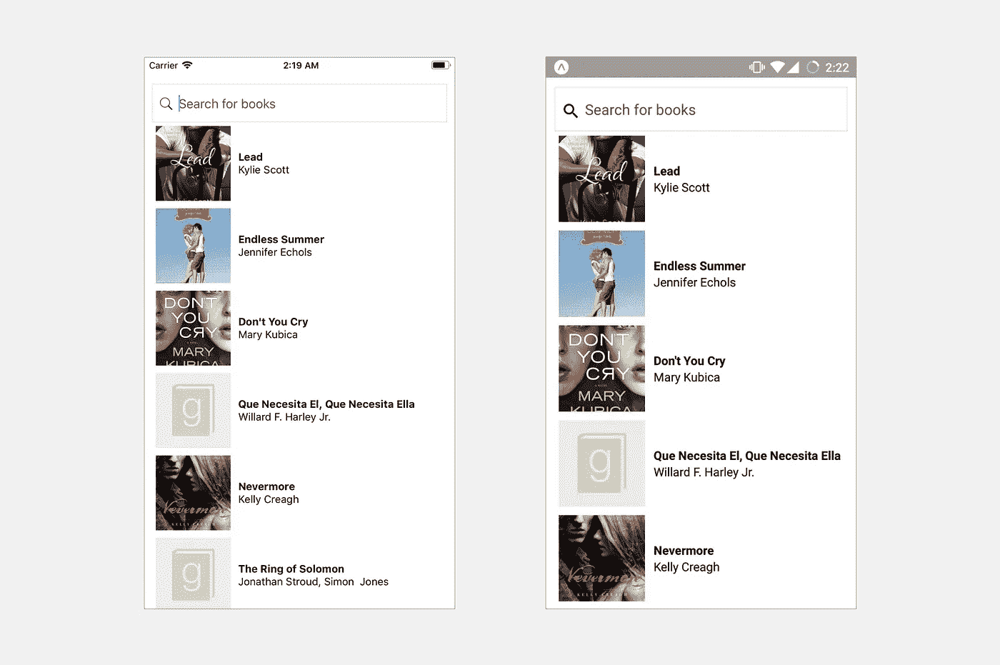

# 用 React Native 构建电子商务搜索应用🔰

> 原文：<https://medium.com/hackernoon/building-an-e-commerce-search-app-with-react-native-2c87760a2315>



我们将回顾使用 React native 构建一个初级电子商务移动应用程序来搜索图书数据库的过程。如果你以前从未使用过 React Native，这可以作为你使用 [Javascript](https://hackernoon.com/tagged/javascript) 进行移动应用开发之旅的起点！🎉

S 先来点背景知识！现在是 2018 年，JavaScript 的发展速度比以往任何时候都快。整个社区都在努力让网络变得越来越容易访问。从库和框架开始，到构建应用程序所需的开发工具，一切都已经成熟。当然，在这些改进中有一些混乱。但令人着迷的是，如果你今天了解 JS，你可以构建一个 web 应用程序、一个后端服务器甚至移动应用程序。

React Native 支持使用 JavaScript 和 React 构建原生移动应用。与 Cordova/Ionic/Phonegap 不同，React Native 也允许您使用 JavaScript 和 WebViews 构建移动应用程序，它完全编译成本地应用程序，并允许在需要时编写本机(Swift、Objective-C、Android)代码。

# 开始之前需要知道的事情👶

你应该有一些(如果不是很多)写 React 的经验。这很容易上手，网上有[好的资源](https://github.com/enaqx/awesome-react#react-tutorials)可以提供帮助。如果是初学这门学科，可以[从官方教程](https://reactjs.org/tutorial/tutorial.html)入手。而且，如果你喜欢视频而不是文本，我强烈推荐 [*下一节*](https://medium.com/u/db72389e89d8#0bd2) *。*

对于那些刚刚入门的人来说，你可以[在这里](https://facebook.github.io/react-native/docs/getting-started.html)跟随官方的设置指南(更详细)，或者跟随我在这里:

> 确保您的系统中安装了`*node*` *和* `*yarn*` 。

我们将使用`create-react-native-app` (CRNA)工具来设置样板文件。

```
yarn global add create-react-native-app
```

然后运行下面的命令来创建一个新的 React 本地项目，比如说`HelloNative`:

```
create-react-native-app HelloNativecd HelloNative
npm start
```

这将为您启动一个开发服务器，并在您的终端中打印一个 QR 码。

> 在这里使用`*create-react-native-app*`的唯一警告是，它可能不会使用 react-native 的最新版本。如果你对此感到困扰，你可以使用 [Expo CLI](https://expo.io/tools#cli) 或 [Expo XDE](https://expo.io/tools#xde) ，这两个网站也很容易上手。

下一步是在您的 iOS 或 Android 手机上安装 [Expo](https://expo.io/) 客户端应用程序，并连接到与您的电脑相同的无线网络。使用 Expo 应用程序，您可以从您的终端扫描上面生成的二维码，并直接在手机中打开您的项目。多酷啊！

此时，您的应用程序应该如下所示:



React Native app

如果您希望在模拟器上运行此应用程序，您可以运行:

`yarn ios`对于 iOS 和，

`yarn android`用于 Android 模拟器。

这将在模拟器上安装 Expo 客户端，并运行您的 react-native 应用程序。

如果你现在打开应用程序中的开发者菜单，你会看到启用*热重装和实时重装*的选项。这些允许你立即重新加载你的应用程序，如果你来自 Android 开发背景，这是一个很大的优势，因为 gradle 需要很长时间才能完成构建。



A closer look at the developer options

开发人员选项也与调试特性捆绑在一起。我们将在下一节讨论它的细节。

# ⚒的调试和故障排除

开发人员菜单中的调试远程 JS 特性允许我们在浏览器中浏览任何控制台消息或错误。这在你构建应用程序时非常方便。

此外，你可能想安装 [React 本机调试器](https://github.com/jhen0409/react-native-debugger)。



React Native Debugger in action

这是一个漂亮的工具，允许我们在 React 本地应用程序中浏览组件状态和属性树。它还可以让你浏览和编辑应用于你的应用程序中的组件的样式，作为 chrome-dev-tools 的替代品。

# 🔋含电池

React Native 附带了一系列内置组件，您可以使用它们来构建应用程序。您可以在这里浏览可用组件的[列表，在这里您会发现其中一些组件是特定于平台的——在](https://facebook.github.io/react-native/docs/components-and-apis.html) [Android 特定的](https://facebook.github.io/react-native/docs/components-and-apis.html#android-components-and-apis)和 [iOS 特定的](https://facebook.github.io/react-native/docs/components-and-apis.html#ios-components-and-apis)部分。

这些组件将帮助你为你的应用程序组装简单的用户界面。与 web 类似，React Native 支持`fetch`，使您能够发出 http 请求并从您的服务器获取数据。

为了我们的📗booksearch 应用程序，我们将使用 Elasticsearch，这是一个 [NoSQL](https://en.wikipedia.org/wiki/NoSQL) 数据库，可以在短时间内搜索大量数据。它通过检查每个文档中的所有单词，对以文档形式存储的数据(是 JSON 对象)执行[全文搜索](https://en.wikipedia.org/wiki/Full-text_search)。

即使你以前从未使用过 Elasticsearch，你也应该能够理解这篇教程。

Elasticsearch 似乎不是一件容易上手的事情。如果您是初学者，那么设置、添加或查看数据以及生成查询可能会显得有些力不从心。这就是为什么，我们在 [Appbase](https://appbase.io) 已经建立了一些开源工具来帮助你做所有这些事情，只需要点击几下鼠标😉

*   用于**将数据**添加到弹性搜索中的工具— [进口商](https://opensource.appbase.io/dejavu/importer/index.html) 🗃
*   像 excel 表格一样查看弹性搜索数据的工具**—[数据浏览器](https://opensource.appbase.io/dejavu/)👀**
*   用于**生成相关弹性搜索查询的工具** — [查询构建器](https://opensource.appbase.io/mirage/)🔨

在这篇博文中，借助这些工具，我们将利用 elasticsearch 和 React Native 的优势来构建一个丰富的移动书店应用程序。

您可以按照[官方安装指南](https://www.elastic.co/guide/en/elasticsearch/reference/current/_installation.html)来设置和安装 Elasticsearch 服务器，或者您可以在 [appbase.io](https://appbase.io) 创建一个免费帐户，该帐户提供 Elasticsearch 托管服务，并且易于使用。为简单起见，我们将使用 appbase.io 服务开始。

为了简单起见，我已经用图书数据集创建了一个 appbase 应用程序。你可以在这里查看数据集。

[](https://opensource.appbase.io/dejavu/live/#?input_state=XQAAAAKJAQAAAAAAAAA9iIqnY-B2BnTZGEQz6wkFsyzhBoa6J5YHVVPvvStg3duFL_9lBQxNAUEiS2LxrmQIi48IYsLycilGizdEqIf-Z3FUOIdIqHULMVrBqKtL5qUJx1gsOpt0WbuAhQS8qMoK8IdlqoG0tr-8UHi3sau8zMqY64fzpXCehrrPI4SNk8VTbiMsIZhduWAX4hCATwCBWfvrJqfAoiqKGt9zyTfsxLU7CbxGxE6__je7GeiC7UaPdD8YDeYC7eRxv-8JF1j3ysqY_Lkqc6hZAtUm9dN1Mg7O2uJ1MJxZyZWCmnz3ovLxz81T3C6KJZXI0OFjB5ll22UJm0iEaxN9NgY8yT9XOuK1k_90Fp4A&editable=false)

Dataset of books

您可以通过点击左下角的 ***克隆此应用*** 按钮来克隆此数据集并为您自己的应用生成凭证。

这些凭据将用于将我们的用户界面与此应用程序连接。我们将在本教程中使用的上述应用程序的凭据是:

```
{
    app: "good-books-ds",
    credentials: "nY6NNTZZ6:27b76b9f-18ea-456c-bc5e-3a5263ebc63d",
    type: "good-books-ds"
}
```

# 打招呼👋反应搜索🔍

我们将使用[**React search**](https://github.com/appbaseio/reactivesearch)，这是一个开源的 React 和 React 原生 UI 组件库，用于我参与的 Elasticsearch。它提供了一系列高度可定制的丰富 UI 组件，可以连接任何 Elasticsearch 服务器，并为捆绑到这些组件中的所有通用用例(如电子商务、Yelp、Meetups 等)提供适当的默认配置。

> **等等，为什么我现在需要 ReactiveSearch？**
> 
> ReactiveSearch 简化了连接到 Elasticsearch 索引、进行查询、获取和在光滑的 UI 中呈现结果的整个过程，不仅如此，它还允许您使您的组件相互对话，即，如果组件 A 得到更新，组件 B 会知道，并且它可以更新自己，而不需要任何手动交互。
> 
> 当您的屏幕上出现动态过滤器时，这种整个组件到组件的订阅就很方便，例如在电子商务应用程序中，选择一个电器类别，也会改变可用的子类别、价格等等。
> 
> ReactiveSearch 帮助你以一种声明式的方式轻松地创建更加智能的应用。

> Reactivesearch-native 捆绑了一系列原生 UI 组件，使您能够无缝地构建 Airbnb、meetups 等 UI。您可以在这里找到[可用组件的完整列表](https://opensource.appbase.io/reactive-manual/native/getting-started/componentsindex.html)。



Reactivesearch Native Components

# 构建📚图书搜索应用

首先，我们需要通过运行以下命令在 React 本地项目中安装`reactivesearch-native`:

```
yarn add @appbaseio/reactivesearch-native
```

所有的 ReactiveSearch 组件都包装在一个名为 [**ReactiveBase**](https://opensource.appbase.io/reactive-manual/native/getting-started/reactivebase.html) 的容器组件中，该容器组件将我们的 UI 组件与 Elasticsearch 集群连接起来。

我们将在`App.js`中使用它:

Adding ReactiveBase component

> 注意我们在这里是如何使用基于 Flex 的样式的。React Native 中的样式非常类似于 web 中的样式。如果你没有使用 flex 的经验，我强烈推荐从 [FlexBox Froggy](http://flexboxfroggy.com/) 开始。

除了**样式表**，我们还在代码片段中使用了 React Native 的另外两个组件:

*   **视图**——这类似于 React Native 生态系统中的一个`div` html 元素。它是一个容器，支持带有 [flexbox](https://facebook.github.io/react-native/docs/flexbox.html) 、 [style](https://facebook.github.io/react-native/docs/style.html) 、 [some touch handling](https://facebook.github.io/react-native/docs/handling-touches.html) 和 [accessibility](https://facebook.github.io/react-native/docs/accessibility.html) 控件的布局。
*   这是一个简单的本地组件，用于显示文本。你可以在这里阅读更多关于它的信息。

对于我们的 BookSearch 应用程序，我们需要 reactivesearch-native 中的两个组件:

## 1.用于搜索书籍的搜索框:

这里，我们将使用来自`reactivesearch-native`的`DataSearch`组件。它创建了一个搜索 UI 组件，使我们能够轻松地在数据集中搜索一个或多个字段。看起来是这样的:

```
<DataSearch
    componentId="searchbox"
    dataField={[
        'original_title',
        'original_title.search',
        'authors',
        'authors.search',
    ]}
    placeholder="Search for books"
    autosuggest={false}
/>
```

这个 [**数据搜索**](https://opensource.appbase.io/reactive-manual/native/components/datasearch.html) 组件查询数据集中给定的`dataField` (s)。该组件位于`ReactiveBase`组件内部，并从中接收所有必要的数据，因此我们不必自己编写 Elasticsearch 查询。

> 注意我们是如何在数据字段属性中使用`.search`字段的。`authors.search`是`authors`字段的一个[多字段](https://www.elastic.co/guide/en/elasticsearch/reference/current/multi-fields.html)。Elasticsearch 可以针对不同的目的以不同的方式索引相同的数据，我们可以使用这些数据来获得更好的搜索结果。

## 2.用于显示搜索结果的结果列表视图:

为了显示结果，我们将使用来自`reactivesearch-native`的`ReactiveList`组件。它看起来是这样的:

```
<ReactiveList
    componentId="results"
    dataField="original_title"
    size={7}
    showResultStats={false}
    pagination={true}
    react={{
        and: "searchbox"
    }}
    onData={(res) => (
        <View style={styles.result}>
        <Image source={{ uri: res.image }} style={styles.image} />
        <View style={styles.item}>
            <Text style={styles.title}>{res.original_title}</Text>
            <Text>{res.authors}</Text>
        </View>
        </View>
    )}
/>
```

它的道具是这样工作的:

*   `dataField`:在此使用`name`字段对结果进行排序。
*   `react`:指定应该基于`searchbox`组件的当前选定值构建查询。每当用户改变搜索框中的输入值时，就会触发一个新的查询——您不需要为这里的任何 UI 组件编写手动查询，它们已经预设了默认配置以满足所有通用用例，但是如果您愿意，您可以通过`customQuery` prop 覆盖它。
*   `onData`:接受一个函数，该函数应返回一个有效的 [JSX](https://reactjs.org/docs/glossary.html#jsx) ，表示结果列表中的列表项。这个属性将用于呈现结果列表。

你可以在这里阅读所有关于它正确用法[。](https://opensource.appbase.io/reactive-manual/native/components/reactivelist.html)

Reactivesearch 建立在[原生基础](https://docs.nativebase.io/docs/GetStarted.html)之上💯它使用一些字体，可以通过添加:

```
async componentWillMount() {
  await Expo.Font.loadAsync({
    Roboto: require('native-base/Fonts/Roboto.ttf'),
    Roboto_medium: require('native-base/Fonts/Roboto_medium.ttf'),
    Ionicons: require('@expo/vector-icons/fonts/Ionicons.ttf'),
  });
}
```

有了这些组件和一些样式💅神奇的是，我们的应用看起来是这样的:

> 瞧啊。你有一个在安卓和 iOS 上运行的图书搜索应用



> 如果你想在飞行中玩这个应用程序，[试试这里的小吃](https://snack.expo.io/@metagrover/booksearch)🎉

# 有用的链接

1.  [反应搜索 GitHub 报告](https://github.com/appbaseio/reactivesearch)🌟
2.  [反应搜索文档](https://opensource.appbase.io/reactive-manual/native/)

希望你喜欢这个教程。如果你有任何想法或建议，请告诉我，并在评论中分享你的应用版本😉