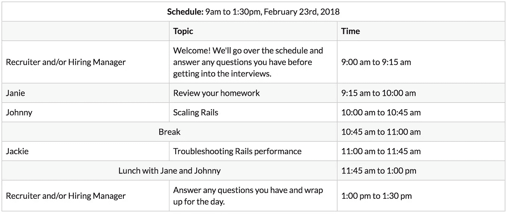

# 构建工程面试流程

> 原文：<https://medium.com/hackernoon/building-an-engineering-interview-process-4d47e31bb0e4>

创建一个面试过程可能很难。一个有效的[面试](https://hackernoon.com/tagged/interview)过程是一系列艰难的权衡。一方面，你想弄清楚一个候选人将如何融入你的团队，以及他们完成工作的能力。另一方面，候选人想知道他们有多喜欢和你一起工作以及这个角色。从时间上来说，平衡这些需求可能是昂贵的。

花八个小时面试一名候选人会给你带来不小的成本:那是从开发时间中拿走的几个小时，乘以你面试的候选人数量。这也意味着除了他们正在面试的其他公司和他们的日常工作之外，候选人还要花 8 个小时和你在一起。但是，唉，你花的时间越少，对你和候选人的信号就越差。你的目标是花尽可能少的时间获得尽可能高的信号。这比听起来要难。

# 候选人经验至关重要

在我们进入这个话题之前，有一点需要注意:在面试中要注意应聘者的经历。即使候选人没有得到聘用，你也希望他们离开时谈论你的团队有多棒，他们的经历有多棒。他们可能不是今天的合适人选，但他们可能是未来的。永远不要忘记应聘者会说:如果你有糟糕的面试经历，其他潜在的应聘者会发现的。这对你来说是个坏消息。

所以要善良。要有思想。让你的面试过程成为一次愉快的 T4 之旅。

# 开始的过程

如果你不确定从哪里开始面试，我为你准备了一个。这样做很好，但是请随意修改它以适合您自己的需要。这是高层次的:

第一步:职位描述和团队准备
第二步:筛选简历/申请
第三步:电话/视频筛选
第四步:家庭作业
第五步:现场
第六步:查看面试官的反馈
第七步:发出录用通知/发送拒绝通知
第八步:收集应聘者的反馈

# 第一步:工作描述和团队准备

在你把工作张贴在某个地方并开始面试候选人之前，招聘就已经开始了。我将讲述如何撰写出色的职位描述，以及如何弄清楚你在另一个职位上想要什么，但我只想说，你的团队在决定这个新角色将从事什么样的工作以及什么样的人适合这个职位方面发挥了重要作用。到了开始面试的时候，你的团队需要非常清楚什么对这个角色重要，什么不重要。

这听起来很傻，但你在招聘中面临的最常见的挑战之一就是不知道你想要什么。“我怎么能发布一份工作却不知道自己想要什么呢？！招聘启事是我写的！”你可能会想。不幸的是，有一个“理想技能和经验”的流水账并不罕见，这些会影响你的判断。不久，你就会得到一份理想的候选人简介，这份简介与其说是现实，不如说是虚构。没有弄清楚你需要什么和你想要什么，你可能最终会拒绝许多其他方面都很好的候选人，仅仅因为他们不符合你对你所寻找的模糊不清的想法。每个面试官都必须有相同的想法。

在你开始面试候选人之前，召开一个团队预备会议。这是查看招聘启事并确认你的团队对新员工有什么要求的好方法。我还建议复习一些有效的面试问题来评估各种技能。每个参与面试的人都应该知道他们将要讨论什么，为什么，以及他们想要什么。确保每个面试官都会在面试中做笔记——这对以后评估候选人至关重要。

# 第二步:筛选简历/申请

一旦你的工作发布了，简历就会(希望)开始进来。根据职位、你的位置和其他一些因素，你可能会有大量的简历……或者是涓涓细流。

不管怎样，你都有简历要筛选。这是一个相当快速的过程，尽管它可能会令人厌倦和畏惧，尤其是如果你有几百份简历需要筛选的话。

# 谁负责筛选？

一些经理喜欢在团队筛选简历时有一名工程师，而其他人则喜欢自己处理这项任务。这两种方式都行之有效(尽管我个人更喜欢让经理来筛选他们)。

# 我如何筛选简历？

我发现有两种筛选简历的方法:过滤掉和过滤掉。两者都很有用，取决于你想雇什么样的人。

## 过滤掉

如果你有硬性的技术需求，这是一种有效的筛选方式。回顾每一份简历，寻找那些你离不开的、你不能接受培训的具体经历。扔掉任何不符合你标准的。其余的移动到手机屏幕上。就这么简单。

当然，你的硬性要求越多，通过这一步的简历就越少。

## 过滤进去

这是筛选大多数角色的有效方法，因为它偏向于这样的问题，“这个人有做这项工作的潜在能力吗？”

这种方式很难筛选，因为你没有与一些设定的标准进行比较。好的一面是会有更多的候选人通过这个过滤器。

# 每种方法的示例

**过滤:**你的团队致力于搜索技术，大量使用 Elasticsearch。您最近失去了团队中的一名成员，并且正在替换他们。你需要一个已经熟悉 Elasticsearch 的人，不能花时间去培训任何人。过滤筛选法会扔掉任何没有弹性搜索经验的简历。

**过滤:**你的团队致力于搜索技术，大量使用弹性搜索。您正在向一个已经稳定且高效的团队添加新成员。过滤式筛选方法不会太关注弹性搜索经验，但会更多地关注一般工程背景。

如果您不确定使用哪种方法，请使用过滤方法。

我鼓励在这个阶段回复所有的简历，包括拒绝。在这个阶段拒绝一个候选人可以用一个表格回复来完成，不需要个人回复(除非候选人是通过推荐进来的——那么应该是个人回复)。

# 第三步:电话/视频屏幕

时间:20-30 分钟

一旦你有了通过简历筛选的候选人，是时候和他们谈谈了。我更喜欢视频通话，而不是这里的电话。有了视频，你们双方都能从非语言交流中获益。这个电话不需要很长。

# 聊什么

询问他们对下一个角色有什么要求。了解他们对一家公司的兴趣以及他们想找的工作类型。谈论你的角色如何映射到他们的兴趣和愿望。候选人可能也会对这个角色有一些疑问。

你可能倾向于在这里做一个简短的编码测试，比如 fizz buzz 或者另一个工程难题/脑筋急转弯。我建议反对。这些类型的测试是低信号、高压力的，并且很少映射到实际工作中。你上一次实现排序算法或者遍历链表是什么时候？从大学开始就没有了？所以不要在这里做。

相反，询问他们的经历。开放式问题非常有效:“告诉我你最近参与的一个项目，”并继续问更多关于这个项目的问题。

不确定如何深入了解某件事？以下是一些需要跟进的问题:

*   你是如何决定做 X 的？
*   X 的挑战是什么？
*   关于 X 最有趣的是什么？

记住，你这次面试的目的不是决定是否雇佣他们，而是你是否想继续下去，看看他们是否适合你的团队和公司。请记住，候选人可能会面试不止一家公司；你想给他们留下好印象，所以他们想继续留在你的公司。

如果你想让他们进入下一步，快速介绍你的面试过程是一个好主意(电话筛选、家庭作业、现场)，以及典型的时间表。

最后，问一问对薪酬的期望。一些候选人喜欢把讨论留到面试过程的最后，而一些人喜欢一开始就把它说出来。如果你知道你的公司没有支付市场价格，现在就让他们知道你对这个职位的预算是值得的，而不是让他们在这个过程的最后发现你根本没有接近他们的价格。不要问他们现在/过去的薪酬:这不仅在某些美国司法管辖区是不合法的，而且实际上对你没有帮助。如果你真的必须知道，就问“你的期望薪酬是多少？”他们可能会转过身来问你的预算——如实回答。没有必要对此守口如瓶。

一旦候选人与一个人谈过话，你就不在表单回复的范围之内了。如果你在这个阶段或随后的任何阶段拒绝了一个候选人，招聘经理或招聘人员应该亲自去做。

# 第四步:家庭作业

时间:2-3 小时(考生)，5-10 小时(设计作业)，1 小时(复习作业)

要求考生做家庭作业对许多人来说是一个有争议的问题，有很多赞成和反对的观点。一方面，这是你将从整个面试过程中获得的最强信号之一。另一方面，由于工作日程和家庭责任，许多人没有时间做作业。本质上，通过选择提供家庭作业，你在做一个权衡:为了换取更高的信号，你可能会过滤掉整群的候选人。

也就是说，我认为好处大于坏处，而且坏处可以在很大程度上得到管理和缓解。家庭作业最大的问题之一是它需要的时间，所以你的家庭作业必须有很好的时间限制，最好不超过 2-3 小时。

设计一个有效但不耗时的家庭作业是很棘手的。最好的家庭作业是测试真实世界的作业，所以尽可能让它接近他们为你做的作业。

大多数候选人都想超越自我，花费比你预期更多的时间。除此之外，我还见过几个作业完全没有经过测试，或者只由写作业的人测试过。最好的测试:付钱给几个人让他们检查一下，并提供反馈。只需几百美元，你就可以确保你的测试既有效又不耗费时间。

# 一个警告

一些团队喜欢让候选人编写一个实际的特性或者修复一个实际的 bug。虽然这是你能得到的最接近真实的工作，但它有两个巨大的问题:

1.  它需要比他们更多的背景和应用知识，所以你不太可能看到他们的最佳状态。
2.  它本身对你是有价值的。也就是说，即使你不雇佣他们，你也会从任务中受益。这相当于免费工作。不酷。

如果一个考生提交了作业，就要有人审核。不检查作业就拒绝候选人是对候选人努力的不尊重。如果你的作业复习时间太长，可以考虑重新设计，这样复习更容易。

# 第五步:现场

时间:4.5 小时

在现场，你最终会把候选人和你的团队召集到一起，真正了解他们能把工作做得多好，能与你现有的员工配合得多好。别忘了应聘者也在这里面试你。这不是单方面的——在每次面试中，都要给应聘者留有了解你和你的公司的空间。

我在下面整理了一个样本时间表。关于此计划的一些注意事项:

*   修改它以适合你的需要！这只是一个样本。
*   注重候选人经历。小事情可以产生大影响。例如，在每个面试房间里放几瓶水。必要时补充库存；你的候选人会为此而感激的。
*   在面试前几天把时间表发给候选人，这样他们就知道会发生什么。如果你能提前告诉他们将与谁交谈，那就更好了，这样他们就有时间在 LinkedIn/Twitter/Google 上查找。当你能事先建立共同点时，就更容易建立融洽的关系。
*   如果你安排了一次午餐，一定要在发送时间表的时候询问候选人关于饮食方面的限制。你真的不想带候选人去吃他们不能吃的午餐。

# 关于午餐的一些特别注意事项:

规则一:不喝酒。句号。讨论结束。这也适用于你的团队。面试时喝酒会向应聘者传达最糟糕的科技文化，如果碰巧应聘者不喝酒，他们可能会感到尴尬——尤其是如果你的团队都在喝酒，而他们却没有。

至于和谁去吃午饭，挑两个之前的面试官。如果可能的话，不要是经理或招聘人员。与经理共进午餐的压力太大了，因为他们被认为对雇佣谁有最终决定权(这对你的公司来说是不是真的无关紧要)。与招聘人员共进午餐对候选人没有帮助，因为他们不会与招聘人员一起工作。

所以从你的团队中挑选两个人和他们一起吃午餐。为什么是两个？如果只有一个团队成员和候选人，可能与那个特定的人没有什么融洽的关系，尴尬的停顿太常见了。超过两个人，很容易陷入你的团队互相谈论而把候选人排除在外的陷阱，更不用说有这么多人可能有点霸道。甜蜜点是两个人，因为社交动态将允许对话更自由地流动。

# 现场时间表示例

Sample on-site schedule

# 第六步:回顾面试官的反馈

在现场会议结束后的几天内，需要对所有反馈进行审核。我建议作为一个小组来做这件事，这样你们可以讨论反馈。这就是记笔记的价值发挥作用的地方:如果你没有实际的笔记要回顾，那么你只能讨论本能和直觉，我们知道这是不准确的。没有笔记，你就无法恰当地评估候选人。

# 第七步:出价/拒绝

# 提供

哦，快乐的一天——你找到了你想雇佣的候选人！但是你还没有完成——这份工作还没有被接受，直到候选人坐在你的办公桌前，为你工作，你才算真正得到了一份工作。

出价很简单，应该分两次进行:

第一个对话是给候选人打电话，告诉他们公司想发出邀请。现在该谈真正的细节了:工资、非现金报酬、休假时间、福利等。了解什么对候选人来说是重要的——不是每个人都关心薪水的最大化。

第二个对话是口头提议本身。打电话给候选人，让他们知道他们提供的细节。通话结束后，通过电子邮件向他们发送聘书，以及福利待遇的所有细节。

一些公司有所谓的“爆炸要约”，这是一个附有截止日期的要约。请不要这样做。这对候选人是不公平的，他们可能需要时间来结束其他面试或与家人讨论。相反，问一问他们预期的报价时间。没有人会坐在一个报价几个月，并期待它仍然存在，所以不要太担心它。只要和候选人保持沟通，就没问题了。

在候选人花时间审查了报价后，可能需要进行一些协商。如果对双方来说一切都很好，那么你最终会得到一个被接受的提议。恭喜你！

# 拒绝

在这个阶段被拒绝对候选人来说很难。在这一点上，如果你用了我的时间表，候选人可能花了 8 个小时和你在一起，如果他们在作业上花更多的时间，可能会更多。他们在这一点上投入了。

虽然你可能会不经意地拒绝一名候选人，但要知道这对他们来说绝不是不经意的。任何拒绝都应该得到招聘经理的个人回应。一个含糊的拒绝(“抱歉，团队已经决定这不是一个很好的时机”)是粗暴的，尤其是如果候选人觉得面试进行得很顺利。对他们的处境感同身受。

如果拒绝的理由是技术性的，你应该告诉候选人，并建议他们如何改进。如果拒绝是非技术性的，那就有点棘手了。你的人力资源和法律团队可能会完全适应这一点——我建议请他们向你介绍一下风险是什么。请记住，含糊的拒绝是粗鲁的，对候选人不公平。记住这一点。

# 第八步:收集候选人的反馈

在整个过程完成后，不管你是发出了邀请还是拒绝了邀请，你都应该收集候选人的反馈。这可以是通过电子邮件提出几个问题，甚至是谷歌表格。候选人的反馈对于改善你的面试过程、发现需要额外培训的面试官等等都是很有价值的信息。如果你把这封信发给某人，你已经给了他一份工作，在这份工作被接受后等待，确保候选人知道这不会对他们的工作有任何影响。

现在你有了:一个面试的开始过程。你怎么想呢?你自己的流程是怎么运作的？它对你有多有效？