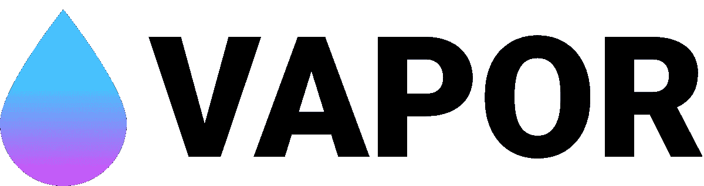
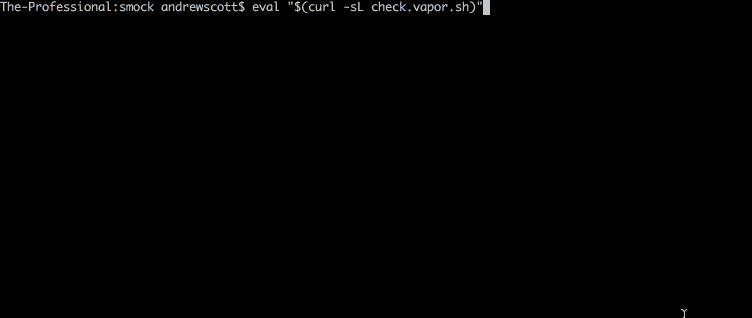
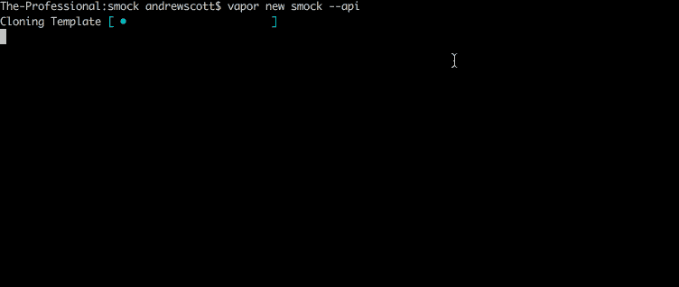
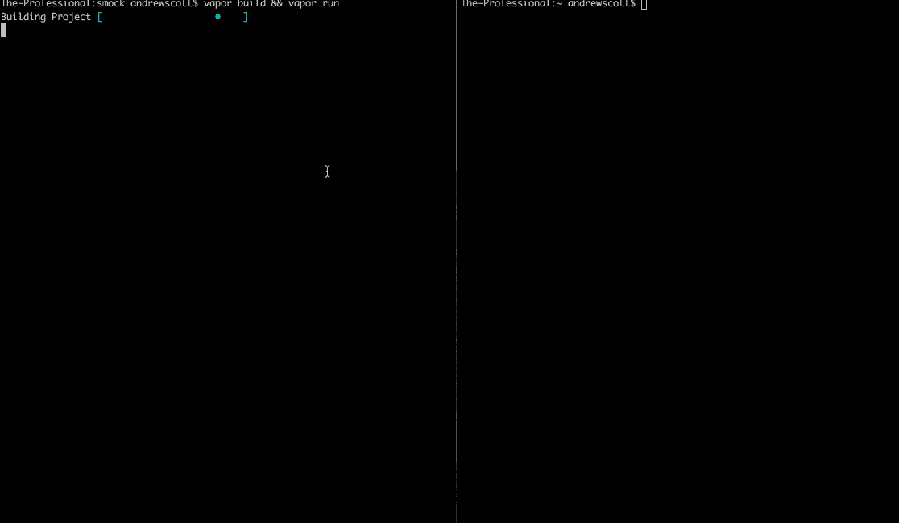

# 使用 Vapor 在 Swift 中构建一个优秀的模拟服务器

> 原文：<https://medium.com/hackernoon/building-an-excellent-mock-server-in-swift-with-vapor-7e25aaa985e6>

## Swift，它不再仅仅适用于移动设备…



[vapor](https://vapor.codes/).[codes](https://vapor.codes/)

## 什么是蒸汽？💧

[Vapor](https://vapor.codes) 是用 Swift 编写的非阻塞、事件驱动的服务器架构，构建在苹果 [SwiftNIO](https://github.com/apple/swift-nio/) [框架](https://hackernoon.com/tagged/framework)之上。它很容易上手，有一个庞大且不断增长的社区，并且是为性能和易用性而构建的。挺甜蜜的。

在新一批服务器端 Swift 框架中，Vapor 并不孤单。还有 IBM 的 [Kitura](https://www.kitura.io/) 、 [Perfect](https://github.com/PerfectlySoft/Perfect) 和 [Zewo](https://github.com/Zewo/Zewo) 。这些都有其利弊，我不太敢说目前在这个领域有一个明显的领先者。将来我可能会更多地关注那些其他的框架，但是现在我将把重点放在 [Vapor](https://hackernoon.com/tagged/vapor) 上。

## 正在设置

如今，在为项目选择技术时，易用性可能是一个主要的决定因素。Vapor 团队似乎认识到了这一点，因为设置起来很容易。他们甚至创办了 Vapor 大学，作为管理 Vapor 教程的仓库。

我的安装说明是基于 macOS 的，但是你也可以跟着使用 Ubuntu !

1.  确保 [Xcode](https://developer.apple.com/xcode/) 是最新的。你可以在 App Store 里这样做。
2.  检查您的 swift 版本(至少需要 4.1.x)
    `$ swift — version`
3.  如果您还没有
    T1，请安装 [brew](https://brew.sh/)
4.  安装[蒸汽](https://vapor.codes/)使用 brew
    `$ brew tap vapor/homebrew-tap`
    `$ brew update`
    `$ brew install vapor`
5.  检查你的蒸汽安装
    
6.  为您的项目创建新目录。我已经给我的工作服取名为*。
    `$ mkdir smock`*
7.  *移动到新目录并创建一个新的 vapor 项目。我在这里传递了`—-api`标志，因为我们只关心为本教程构建一个后端服务器。
    `$ cd smock`
    `$ vapor new smock --api`*

****

*gifs 👌*

## *什么是模拟服务器？*

*在解释什么是模拟服务器之前，我们将从什么是模拟服务器以及为什么使用模拟服务器开始。我还将避免深入研究 mock、stub 和 fake 之间的区别。只知道他们都*差不多*一样。尽管已经有很多关于这个主题的文章(例如)但是在专业人士中仍然很难达成共识。*

*一般来说，一个 mock，在某种程度上是一个 stub/fake，只是你为了测试需要替换的代码的一部分。我喜欢的区别是一个*模拟*本身没有预定义的行为。*

*我将在这里分享的模拟服务器旨在充当测试应用程序的任何 HTTP 或 HTTPS 操作的替身。*

*我认为像这样的服务器在组件或集成级别的测试中工作得很好，在那里您可能有一个或多个不同的服务，您的代码依赖于这些服务，而在测试时向这些服务发出请求是不实际的。虽然使用存根可以获得类似的结果，但是使用模拟服务器将允许您充分使用您可能正在使用的任何 HTTP 客户端代码。*

## *代码*

*方便的是，当你创建一个新的 vapor API 服务器时，vapor 会在你的新应用中创建一个简单的 *hello，world* 和 *todo* 应用。虽然我们最终会删除大部分代码，但是看看如何使用 vapor 构造一个简单的 MVC 还是很有帮助的。由于这个示例应用程序也经历了引导 SQLite 数据库的麻烦，我们将继续使用它来存储我们的模拟响应。在正常情况下，我会建议将它们作为字典存储在内存中，但是既然数据库已经连接好了，我们也可以使用它。*

***模拟响应模型***

****模拟响应*** 将是我们在模拟服务器中处理的主要对象类型。这个类将扩展 SQLiteModel 类，它将允许我们使用方便的内置方法来存储和检索记录。*

****MockResponse*** 将包括几个属性，包括唯一 ID、相关路由、http 方法、响应代码、自定义头，最后是有效载荷。*

*因为这是一个通用的模拟服务器，所以它应该能够支持各种不同的有效负载格式。Swift 使用名为[***Codable***](https://developer.apple.com/documentation/swift/codable)的协议对 JSON 进行编码/解码。不幸的是， ***Codable*** 不支持动态字典结构，所以我求助于一个名为[***Codability***](https://github.com/yonaskolb/Codability)的库，它提供了一个名为 ***AnyCodable*** 的类，这将允许任意字典结构符合 ***Codable*** 协议，而不必事先定义。*

***模拟控制器***

****模拟控制器*** 将在我们的应用程序中充当控制器。为简单起见，它缺乏更新现有模拟记录的能力，只处理记录的创建、删除、列表，以及最重要的检索和响应格式化。*

***路由器***

**routes.swift* 处理 vapor app 内的路由，并扩展 Vapor ***Router*** 类。*

**router.swift* 包括用于模拟创建、列表和删除的静态路由，以及支持您最终可能添加的任何模拟端点的动态路由。为了完全支持任何 url 路径，我需要依赖于***path component . catchall***，或者只是“ ***all*** ”，因为它可以被访问。这与标准的 vapor 路由有点不同，它实际上是作为一个通用的请求处理器，这意味着一些正常的路由支持范例是不可用的，比如参数处理。*

*我不建议将 ***all*** 参数用于任何类型的生产服务。这只是将你自己暴露给潜在的可用性和安全性问题。*

***响应映射器***

*我最终编写了一个新类来包含我的实用程序方法，这样我就不需要弄乱我的模型或控制器类。这些 ***ResponseMapper*** 函数通常用于通过解密 ***MockResponse*** 对象上的***any codable***payload 属性来准备模拟响应，并使用这些细节来生成正确的响应体和头。*

## *运行服务器*

*您可以通过运行以下命令从命令行构建并运行 vapor 应用程序。*

```
*$ vapor build && vapor run*
```

*您也可以在 XCode 中打开应用程序并在那里运行。*

```
*$ vapor xcode*
```

**

## *外卖*

*开始使用 Vapor 3 真是轻而易举。虽然我还没有检查它的竞争对手，如果你的目标是建立一个简单的 MVC 应用程序，我会给它一个机会。*

*在这个项目中，我遇到的唯一问题是找到准确的文档(自 Vapor 2 以来有些事情发生了变化，文档似乎不太完整),了解更多关于 Swift 的 ***可编码*** 协议，并使用 ***可编码*** 来符合它。*

*总的来说，我会推荐 Vapor，并期待将来更多地使用它。*

*你可以在这里找到我的完整代码。*