# 建立和参与加密社区—一个带有示例的剧本

> 原文：<https://medium.com/hackernoon/building-and-engaging-a-crypto-community-a-playbook-with-example-9e30695e8ae6>

A global community of traders, founders, investors, CAs, Lawyers (and all legit people interested in crypto)

我从 2017 年 5 月 21 日开始学习加密交易。在接下来的 4 个月里，我在 4Chan、reddit、Twitter、脸书、Quora 和 Telegram 上寻找关于加密货币和区块链的最好、最真实的内容和学习材料。通过泵和转储组，虚假的承诺和错误的解释，我烧伤了我的手(损失了我的钱好几次)。但是，我能够在八月底之前弄清楚，在《加密》和《区块链》中我该向谁学习什么。

当我过去和我的朋友谈论加密货币时(在我学习的同时)，他们也面临的最大问题是**围绕这个主题有太多的噪音(禁令、法规、黑客等等),而且，没有一个博学的人可以和他们认识的人交谈。他们没有人可以依靠，没有人可以信任，他们很害怕。**

2017 年 10 月 26 日，也就是我 29 岁生日的前 4 天，加密货币交易极客的故事就这样开始了。一个封闭的脸书群体给了他们做自己的安全地带，询问他们的任何疑问，找出价格上涨或下跌的原因，并与像他们一样的人进行交谈😃

**好家伙，我们为今天站在这里感到骄傲。**

***在 4 个月的时间里，我们在 99 个国家拥有近 7000 名聪明的投资者，他们随时准备帮助你以安全和聪明的方式登上加密列车。***

[如果你想成为社区的一员，看看我们讨论的内容，请加入我们的脸书](https://www.facebook.com/groups/stature.network/)

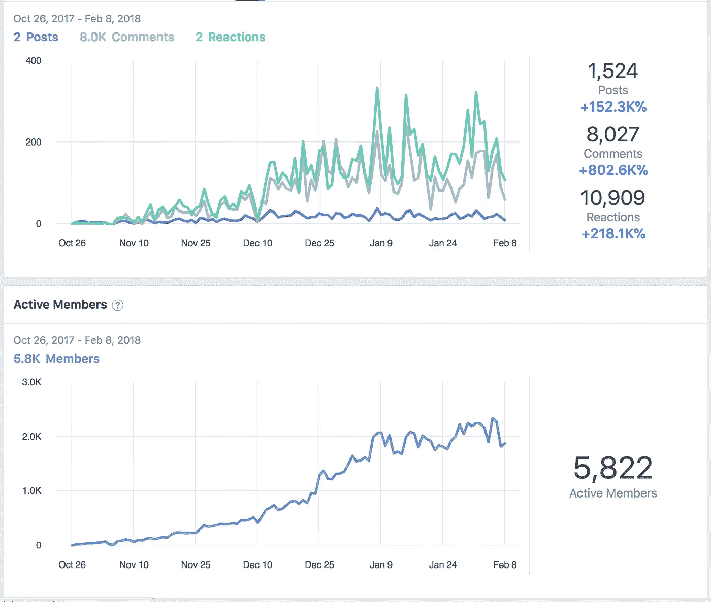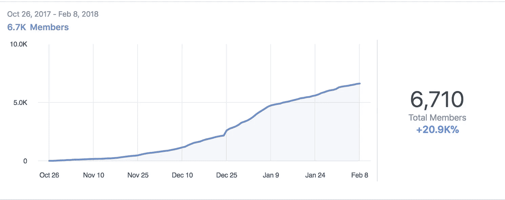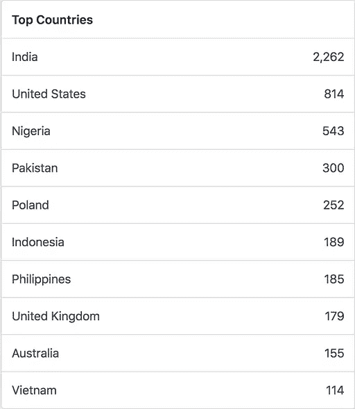

Steady organic growth in the past 3 months in no of community members and their engagement. We have tried our best to maintain a global representation (evident from the top countries in the community). But, we still lack in a number of women in the community.

当我们开始建立这个社区时，我们正在为一个我们正在计划的产品——身材网络——而建立

用简单的话来说，Stature Network 将是区块链上的[交易视图](https://www.tradingview.com/)，鼓励分享优质交易分析。

**在构建社区的过程中，我们了解了社区成员的以下情况—**

1.  他们需要大量的帮助，而这是不可能通过制造产品来实现的。主要是因为这是许多社区成员有生以来第一次做的事情。
2.  交易涉及很多激情和情感，管理它(朝着积极的方向)需要高质量的人类参与。
3.  他们中的大多数人不想每天交易，而是想了解基本面并建立投资组合。
4.  社会投资和高质量的投资决策合作将是投资和投资组合管理的未来。
5.  人们不喜欢在投资前研究(不是他们不想研究)。如果游戏化的权利，你可以鼓励这种行为。
6.  不同的社区成员有不同的需求——你不能建立一个一刀切的模式。为此，我们拓展了各种渠道——电报(用于实时交易分析和基本面新闻)、时事通讯(用于发人深省的基本面挑战内容)和加密交易讲座(用于加强离线模式下的社区)
7.  只有线下存在，对 crypto 不起作用，因为观众需要一个数字社区，以便在他们深入研究时可以依靠他们的持续怀疑。区块链和 crypto 不可能一节课就教完。这是一个持续的过程，需要整个社区的帮助。

管理一个社区是一个持续的、不断发展的游戏。一方面，你必须聪明地剔除有毒内容，另一方面，不断删除垃圾邮件和广告，第三方面(如果你有的话)，创造内容让人们评论和讨论。

这是一条细细的红线，你在上面扮演着平衡的角色。

基于上述认识，我们决定暂时放弃 Stature Network，专注于发展社区。

**以上几个例子—**

1.  Gimmer 的游戏化投资挑战

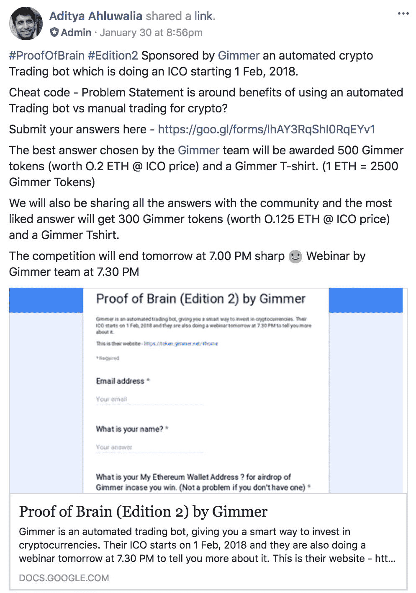

2.有趣的实验和激烈的辩论

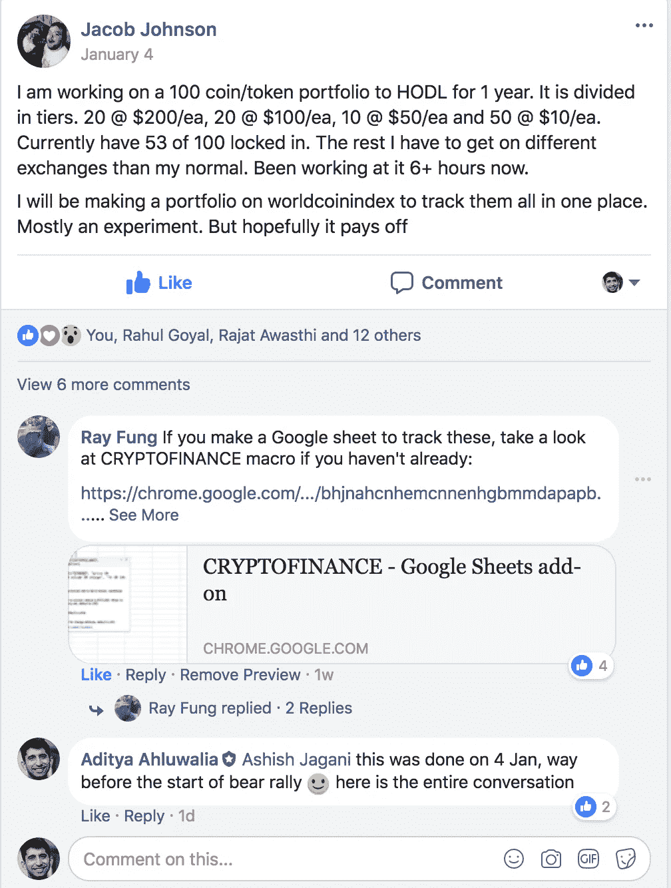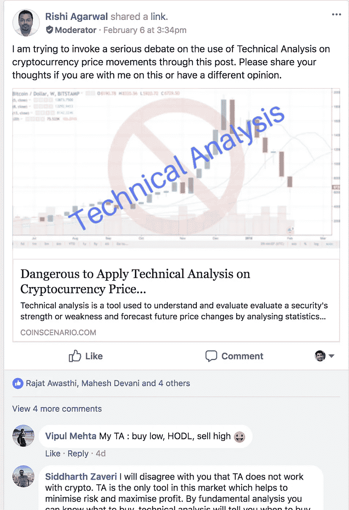

3.关于加密交易的基础和技术方面的日常讨论(常见问题)

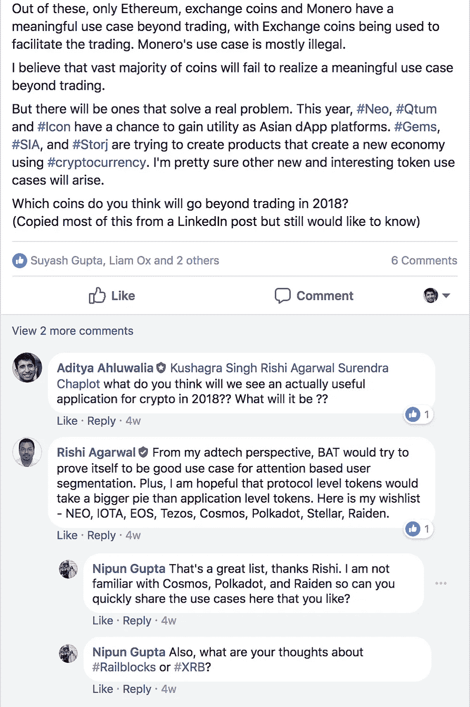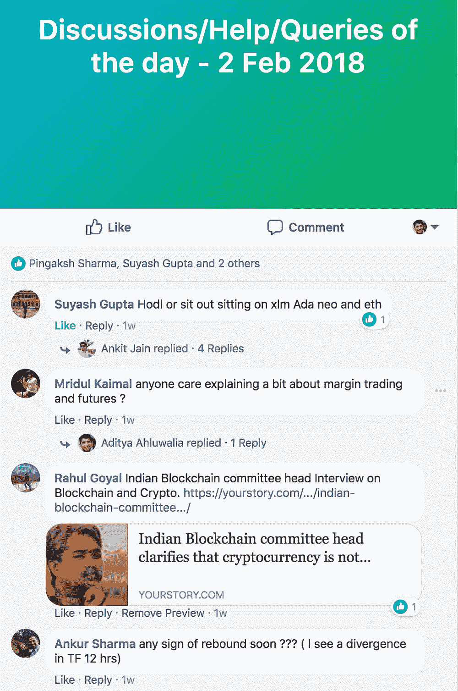

Daily discussions on fundamental topics and market sentimens

4.通过加密交易会谈建立离线社区

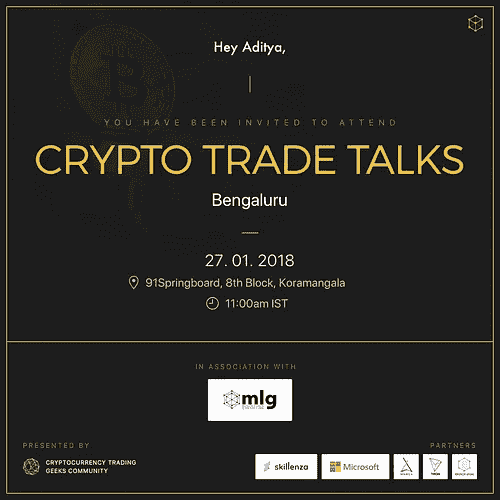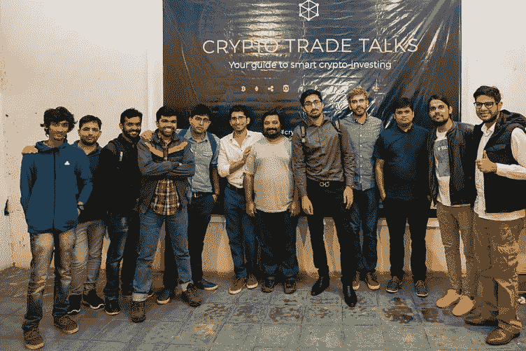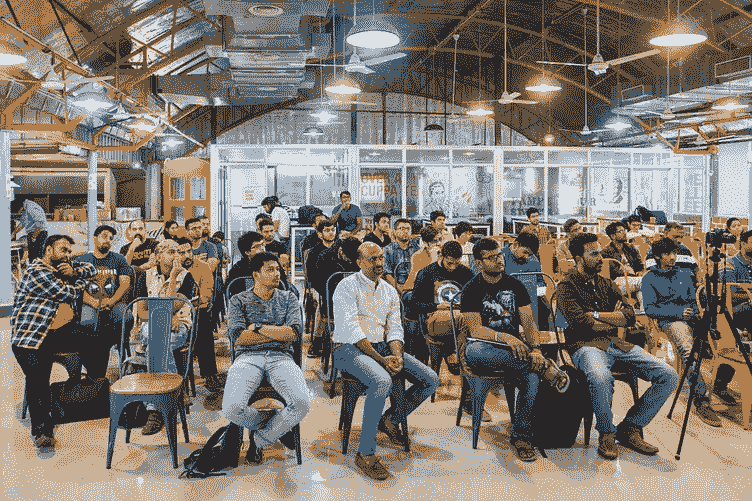

**从事密码交易谈判最有影响力的时刻之一是——**

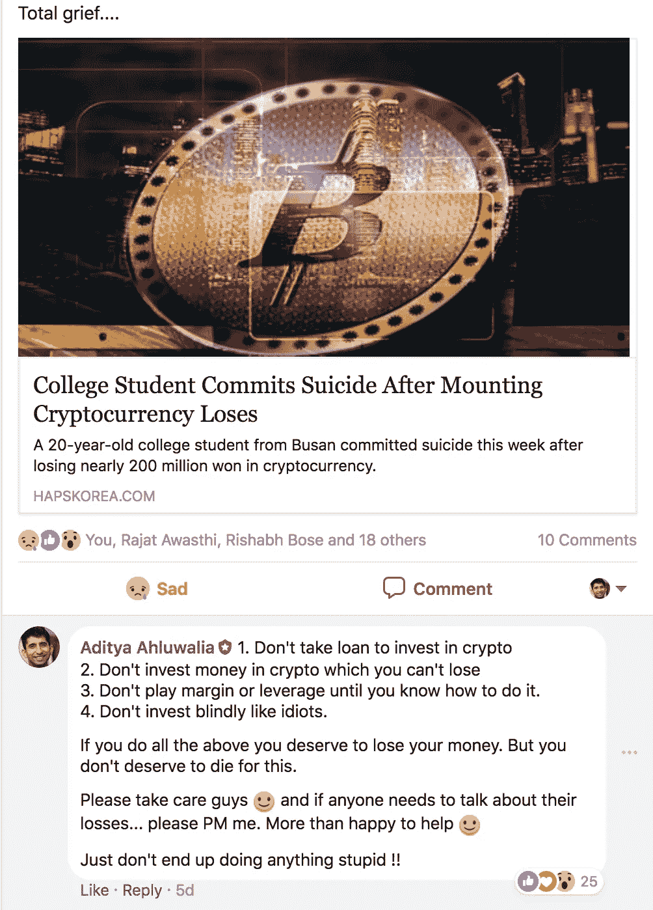

> 在发表这个评论后，12 个社区成员在脸书上给我发消息，让我了解他们如何在这次危机中更好地管理自己的情绪和金钱。
> 
> 我们真切地感受到，我们已经能够对一些社区成员的生活产生重大影响。

现在，我们希望将这种影响扩大到下一个级别，这就是我们的计划。

# 介绍负责与我们一起发展社区的社区领袖—

[**Rishi Agarwal**](https://www.linkedin.com/in/linkedtorishi/)—bid stalk 创始人，前 MD Applift(一家数据驱动的 app 营销公司)，创始人[币景](http://coinscenario.com/)。Rishi 将通过分享最新的基本面新闻和最佳技术分析来帮助社区，因为这是他在 Coin Scenario 策划的内容。

[**尼普古普塔**](http://indya.today/nipun/) —尼普生活、饮食、呼吸着网络安全、创新和风险生态系统。作为许多企业家的导师，他创建了 Veni Vidi VC 播客，其剧集在 ProductHunt 上排名第一。虽然目前领导着德勤的网络创新生态系统，但尼普建议将加密货币 Hshare(HSR)作为一个副业项目。他继续为美国、印度和英国的初创公司提供建议。他的方法经常被称赞为务实和可持续的，同时与项目的商业目标保持一致。Nipun 总部设在硅谷，与当地的区块链社区相连，将帮助我们在质和量两方面增强网络实力。

[**伊山伽**](https://www.linkedin.com/in/ishangarg10/)——从事验证和清除市场上假冒/垃圾 ICO 的 ICO 专家之一。他还经营着一家名为 [Bitcofunds](https://bitcofunds.com/) 的区块链媒体公司。

**anu rag Yadav**—2017 年年中引入 crypto。大约 4 个月前，他开始积极地自学这个领域，2 个月前，他开始积极地投资。议程显然是为了创造收入来源，但他也着迷于这项技术提供的功能及其解决现实世界问题的应用。他仍然认为自己是这个世界上的一个新手，但他也试图每天学习一些新的东西。Anurag 将帮助我们识别潜在的 ico。

你永远不会独自成长，而是与一个群体一起成长。当 Paras 开始作为社区经理工作时，这开始变得有意义。三年内，他希望在六家公司任职，但最终还是找到了他大学毕业后就开始的那个职位。只有一点不同。正式地说，他被任命为社区经理，这一次，他选择成为社区经理。Paras 将通过活动、会面和数字互动帮助我们扩展线上和线下社区。

rish abh Bose——将帮助我们让事情变得简单。有了这些大人物，我们需要一个人来帮助那些想要开始的人(我们称他们为 noobs)把事情变得更容易。职业营销人员。

# **未来 6 个月路线图**

1.  **加密贸易会谈** —在印度的多个城市(孟加拉、德里、孟买、海德拉巴等)进行线下接触，并有可能走向国际。
2.  **对脸书集团**的视频采访——涉及加密和区块链生态系统的影响者，讨论该行业如何发展，以及在该领域进行哪些明智的投资可以在未来获得良好的回报。
3.  **将投资研究游戏化**——让品牌与观众互动，激励他们做更好的投资研究。我们计划定期在网上(在小组中)和网下(在秘密交易会谈中)这样做。
4.  **庆祝智能加密投资者**——展示智能加密投资者的故事、动机和交易风格，让每个人都可以从这些常识中学习。
5.  **在社区内建立一个网络圈** —我们的团队中确实有来自加密生态系统各个部分的人，从矿工到交易员，从新手到技术爱好者，从博客到创始人。我们计划开始为他们创造数字化和线下的社交机会。

# 我们为什么要这么做？这对我们有什么好处？

**不确定地**

1.  对实际影响某人的投资决策(积极的)并因此影响他/她的生活深感满意。
2.  在做出投资决策时，能够采纳 6500 多名明智投资者的意见(社交投资)
3.  增加市场的流动性:)
4.  坐在车内而不是坐在前排，享受这一过程

**有形地**

1.  我们计划通过品牌合作来赚钱，但只够支付致力于发展社区的社区成员的工资。**我们计划建立一个非盈利实体结构**(更多更新即将推出)。我们承诺只让最好的加密品牌中最好的品牌与您合作。
2.  每个管理员和社区成员有时都有自己的专业项目，并期望得到社区的支持。我们中没有人会给你发垃圾邮件，这是一个承诺。

这是一个开放的社区，我们喜欢任何形式的批评、反馈或建议。

**联系我们 cryptotradetalks@gmail.com 或脸书集团:)**

# 哪些职位仍有待竞争

我们仍在寻找以下社区成员—

1.  至少有 2 名女性从事区块链技术、采矿或贸易
2.  采矿专家、区块链技术专家

如果你想申请，请联系我们小组或发电子邮件到 cryptotradinggeeks@gmail.com

或者你可以在这里申请[http://bit.ly/CryptoMods](http://bit.ly/CryptoMods)

如果您对 crypto 充满热情，并且想要一个安全、受尊重的地方来分享您的想法、疑虑、讨论、意见或创新，请加入我们。