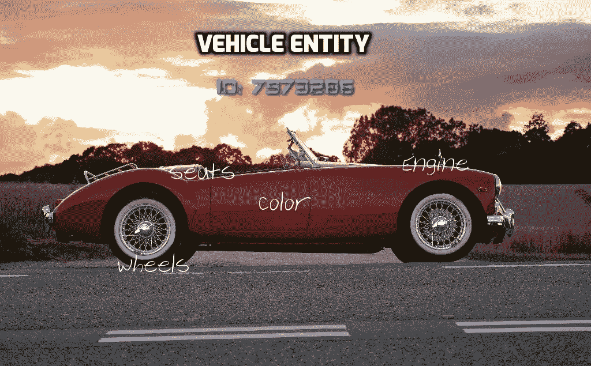

# 用 Javascript 和 HTML 构建 AR/VR

> 原文：<https://medium.com/hackernoon/building-ar-vr-with-javascript-and-html-28acd1da0371>

## 使用 Web 技术构建引人入胜的增强和虚拟现实体验的全面资源列表


> 这篇文章最初出现在[光环实验室的博客](https://blog.halolabs.io/)

几个月前，我加入了 Halo Labs，帮助构建我们的 AR/VR 设计和原型开发平台。第一次面试后，我接到了一个“带回家”的练习，要搭建一个简单的 VR 场景。第一次搭建 VR app 兴奋的同时，也有点害怕。我来自一个 web 开发背景，以前从未做过 VR 项目。令我惊讶的是，我花了大约三个小时来完成这个练习，而且它看起来还不错(嗯，至少对我来说……)。

在过去的六个月里，每当我告诉别人我正在使用网络技术开发一款
虚拟现实产品时，我都会得到困惑的目光。第一届年度 WebXR 周将在两周后举行，我认为这是向网络开发者展示这一点的好时机。

这篇文章的主要目标是让 Web 开发人员快速轻松地进入 AR/VR 世界。我采用的方法不是编写关于特定技术或库的指南，而是建立一个将带你从零到专家的“课程”，因此你将能够建立复杂的 AR/VR 体验。
即使你不打算开发 AR/VR 体验，阅读本指南也能让你一窥 WebXR 世界的现状。我们开始吧。

# 开始旅程—了解虚拟世界

在我们开始之前，让我们排列一下术语:虚拟现实是使用计算机技术来创建一个**模拟**环境，因此当你在 VR 中时，你正在查看一个与你面前完全不同的现实。另一方面，增强现实(AR)是通过在现实生活中添加数字信息而创建的现实的增强版本(就像《口袋妖怪 GO》一样)。术语 XR 通常用于描述两者中的任何一个。

虽然您可以轻松地跳过这一步，直接跳到 WebVR 框架，但花一些时间学习 XR 世界的基础知识将极大地提高您的学习速度和理解能力。

以下资源将帮助您获得一些关于 VR 和 AR 开发的背景知识，以及所需的(非常基础的)数学背景知识:

*   [uda city 的虚拟现实介绍](https://www.udacity.com/course/introduction-to-virtual-reality--ud1012)课程——这个免费课程是一个很好的起点。该课程介绍了目前可用的主要虚拟现实平台，并解释了它们是如何工作的，同时教授一些基本的(但很重要！)VR 术语。
*   [VR/AR 词汇表](https://imm3rsive.com/en/glossary/) —了解这些基本 XR 术语的含义将有助于您更好地理解文章和 XR 框架文档。另一个很好的资源是[VR 词汇表](http://www.vrglossary.org/)网站。我真的很喜欢他们的信息图表部分，因为它帮助我了解了一些 VR 术语和主题。
*   基础 3D 数学——我进入 VR 世界时最怕的科目是数学。我不是一个数学迷，我认为处理 3D 需要一个彻底的数学知识。幸运的是，事实证明我错了。我将在下面展示的框架是相对“高级”的，不需要任何数学背景。根据我的经验，在继续之前，唯一需要知道的重要事情是[左手和右手坐标系的区别](https://msdn.microsoft.com/en-us/library/windows/desktop/bb324490(v=vs.85).aspx)。

# 在网络上呈现 3D 内容

现在我们对 XR 世界有了一些基本的了解，我们可以开始研究 XR web 框架了。XR 开发的主要框架是 [A-Frame](https://aframe.io/) (由 Mozilla 支持)。下一节将深入探讨 A-Frame，但在此之前，重要的是要了解 A-Frame 是如何构建的，以便有效地使用它。让我们开始吧！

2007 年，Mozilla 首次推出 Canvas 3D，它允许在网络上呈现交互式 3D 图形。下一步是公开一个 API，到 2009 年[Khronos Group](https://www.khronos.org/)成立了 WebGL 工作组。该规范的第一版于 2011 年发布。
但是 WebGL 到底是什么？引用 Mozilla 的一句话:

> WebGL 支持 web 内容使用基于 OpenGL ES 2.0 的 API，在支持 HTML `*canvas*`的浏览器中执行 2D 和 3D 渲染，而无需使用插件。WebGL 程序由用 JavaScript 编写的控制代码和在计算机的图形处理单元(GPU)上执行的着色器代码(GLSL)组成

简而言之，WebGL 是一种能够在浏览器中渲染 3D 内容的 API，无需使用插件。

今天，所有主流浏览器都支持 WebGL API，因此我们可以安全地使用它在 web 上呈现 3D 内容。主要问题？编写 WebGL 既辛苦又乏味。看到显示简单的 2D 图形所需的[代码量](https://github.com/gpjt/webgl-lessons/blob/master/example01/index.html)就足以让人气馁。解决办法？使用 Three.js。

> 该项目的目的是创建一个易于使用的，轻量级的，三维图书馆。该库提供了
> 
> <canvas>、<svg>、CSS3D 和 WebGL 渲染器。</svg>
> (来源: [Three.js GitHub 页面](https://github.com/mrdoob/three.js/#threejs))</canvas>

Three.js 是一个“高级”库，它简化了 WebGL 环境的创建。它为您处理底层编程，让您专注于构建场景。

要了解它在多大程度上简化了开发，请看下面的代码示例，其中[在屏幕上呈现了一个动画 3D 立方体](https://codepen.io/orgoldfus/full/vjdxwb/):

在上面的代码示例中，我们初始化了场景、摄像机(在场景中是我们的“眼睛”)和渲染器。然后，我们创建一个长方体几何体，它定义了立方体**的形状**，一种定义了立方体**外观**的材质，最后我们通过将两者结合成一个网格来创建一个立方体。之后，我们将立方体添加到场景中，并附加一个简单的动画来不断旋转它。最后，我们渲染场景。

这与数百行 WebGL 代码相比是一个很大的改进，但仍然不是很简单。为了显示一个立方体，你必须了解什么是材质、网格、渲染器以及它们是如何连接在一起的。此外，呈现 3D 内容并不是故事的结尾。为了创建“严肃的”虚拟现实内容，我们还必须允许用户输入、物理、与各种虚拟现实耳机集成等等。虽然所有这些都可以在 three.js 中构建，但如果没有对 3D 和 VR 领域的深入理解，很难做到这一点。
不过不用担心！a 字架来救援了！

# A-Frame —面向大众的虚拟现实

A-Frame 框架是由 Mozilla VR 团队在 2015 年创建的，目的是让 web 开发人员和设计人员在不了解 WebGL 的情况下使用 HTML 创作 3D 和 VR 体验。A-Frame 基于 HTML 和 DOM，这使得它非常容易访问和使用。虽然只使用 HTML 层可以获得令人印象深刻的结果，但 HTML 只是 A-Frame 的最外层抽象层。**在底层，A-Frame 是以声明方式公开的 three.js 的实体组件框架。** 

> A-Frame 是 three.js 的实体组件框架

引用维基百科的话:

> **实体-组件-系统** ( **ECS** )是一种架构模式[……]
> ECS 遵循[合成优先于继承](https://en.wikipedia.org/wiki/Composition_over_inheritance)的原则，允许在定义实体时有更大的灵活性，场景中的每个对象都是一个实体(如敌人、子弹、车辆等)。).
> 每个实体由一个或多个添加额外行为或功能的组件组成。因此，实体的行为可以在运行时通过添加或删除组件来更改。

让我们用一个例子来说明:
假设我想用 ESC 模式制造一辆汽车。



Vehicle entity, composed of multiple components

首先，我需要一个车辆实体，它实际上是一个有 Id 的对象。接下来，我将使用组件来定义车辆的外观和行为。我会有多个组件，如颜色、车轮、座椅和引擎。最后，将所有这些组件组合成我们之前创建的实体将会给我们一个功能性的车辆实体。

虽然上面的例子非常简单，但是它应该给你一个什么是实体-组件架构的粗略概念。A-Frame 允许以 ECS 的方式编写 Three.js 代码，这使得 VR 开发变得容易得多。一个主要原因是 ECS 使得重用组件变得非常容易——所以如果我构建了一个组件，大多数情况下您也可以使用它。A-Frame 社区正在利用这一点，并且有一个[大型组件库](https://www.npmjs.com/search?q=aframe-component&page=1&ranking=optimal)可供您使用。既然我们理解了句子的第一部分，让我们来检查第二部分:

> 以声明方式公开的

这部分主要是指 HTML 抽象层。这一层允许我们以声明的方式构建场景，这意味着我们通过定义**它应该做什么**来创建场景，而不是定义**它应该如何做**。这可以通过允许我们创建组件的底层来实现。在我们创建一个组件之后，我们可以只说**我们想要做什么**——组件已经知道**如何**(这就是组件代码的全部)。

现在我们已经了解了 A-Frame 是什么以及它是如何工作的，让我们看看 A-Frame 的 Hello-World 示例:

Copied from [A-Frame’s official examples](https://aframe.io/examples/showcase/helloworld/). You can move in the scene using the keyboard.

在这个例子中，`a-scene`下的每个标签都是一个*原语。原语只是带有默认组件的实体的语法糖。例如，`a-box`原语是一个默认添加了多个组件(如深度、高度和宽度)的实体。每个 HTML 属性都是添加到这些实体中的一个组件——我们将位置、旋转、颜色和阴影组件添加(或覆盖默认设置)到我们的 box 实体中。*

A-Frame 提供了一组图元来帮助您快速轻松地创建基本场景，您也可以创建自己的图元。

我不会深入探讨 A-Frame，因为这不是本文的目的，但是这里有一些很好的资源可以帮助您开始 A-Frame 之旅:

1.  [A-Frame 文档](https://aframe.io/docs/0.8.0/introduction/) — A-Frame 官方文档相当全面，强烈推荐阅读。它可能包含了你所有“初学者问题”的答案，所以在搜索其他地方之前，一定要检查一下。
2.  [A-Frame 学校](https://aframe.io/aframe-school)——由 A-Frame 创作者打造的互动 A-Frame 课程。使用 Glitch，该课程提供一步一步的练习来帮助您开始。
3.  [使用 React 和 A-Frame 创建你的第一个 WebVR 应用](https://www.viget.com/articles/creating-your-first-webvr-app/)——尽管使用 A-Frame 和 React 可能会导致性能不佳，但我发现这是一个很好的组合(实际上，这是我们在 Halo Labs 的设置)。如果你喜欢 React，本教程使用的是 [aframe-react](https://github.com/ngokevin/aframe-react) ，这是一个很好的起点。(注:如果您喜欢角形，请查看[角形-aframe-pipe](https://github.com/urish/angular-aframe-pipe) )

# 增强你的技能

到目前为止我们谈论了 VR，但是 ar 呢？
由于我们今天仍然没有任何广泛的消费者 AR 耳机，现有的 WebAR 解决方案主要集中在**移动 AR** 。

今天，有三个主要的库可以用来构建 AR 场景，这三个库都使用 A-Frame，但每个库都有不同的功能。让我们一个一个来看:

## AR.js

[AR.js](https://github.com/jeromeetienne/AR.js) 提供了 A-Frame 和 three.js 扩展，允许构建基于[标记的](https://stackoverflow.com/a/27366949/3763492) AR 场景。AR.js 是用 WebGL 和 WebRTC 构建的，所以它是三者中唯一一个几乎可以在所有智能手机上工作的，无论其操作系统版本如何。

如果你想玩 AR.js，可以看看阿卡什·库塔帕的[文章](/@akashkuttappa/using-3d-models-with-ar-js-and-a-frame-84d462efe498)。

## aframe-ar

构建移动 AR 应用的常见方式是使用[ARCore](https://developers.google.com/ar/discover/)(Android)或[ARKit](https://developer.apple.com/arkit/)(IOS)两者都是原生 SDK 的。为了提供一种在网络上使用这些 SDK 功能(如表面检测)的方法，谷歌发布了两个实验性应用: [WebARonARCore](https://github.com/google-ar/WebARonARCore) 和 [WebARonARKit](https://github.com/google-ar/WebARonARKit) 。它们实际上是将 JavaScript API 暴露给上述功能的浏览器。在此基础上，他们发布了一个名为 [three.ar.js](https://github.com/google-ar/three.ar.js) 的库，为构建 ar 体验提供了 three.js 助手函数。由于 A-Frame 是建立在 three.js 之上的， [aframe-ar](https://github.com/chenzlabs/aframe-ar) 是为了提供一个易于使用的 A-Frame 包装器而创建的。有多简单？你所需要做的就是把你的 A 帧场景标签从`<a-scene>`改成`<a-scene ar>`，你就有了一个工作的 AR 场景！

如果你想玩 aframe-ar，可以看看 Uri Shaked 的[优秀文章](/@urish/web-powered-augmented-reality-a-hands-on-tutorial-9e6a882e323e)。

## aframe-xr

[aframe-xr](https://github.com/mozilla/aframe-xr) 基于 [three.xr.js](https://github.com/mozilla/three.xr.js/) 并且都是由 Mozilla 创建的。它与 aframe-ar 的主要区别在于，它使用 [webxr-polyfill](https://github.com/mozilla/webxr-polyfill) 符合提议的 [WebXR 设备 API](https://immersive-web.github.io/webxr/) 。其主要含义是，aframe-xr 能够构建“渐进式体验”——根据使用的设备而变化的体验。简单来说，它可以让你在 AR 和 VR 之间无缝切换。在 Halo Labs，我们是 WebXR API 的忠实信徒，所以 aframe-xr 是我们选择的框架。

如果你想了解更多关于 WebXR API 的知识，请查看 Dan 的博客文章。另外，Mozilla】有一篇关于渐进式 WebXR 的很棒的博文。

玩了一段时间 WebAR，很明显还没有成熟。然而，即使在今天，使用我上面提到的库，您也可以构建一些令人印象深刻的 AR 体验。

# 掉进兔子洞

到目前为止，我们已经涵盖了所有的基础知识。这足以创建基本的 AR/VR 体验，并对自己的能力充满信心，但如果你想创建一些更复杂的东西，你需要扩展你的知识。
这里有一些资源可以帮助你更深入地理解:

[交互式 3D 图形](https://www.udacity.com/course/interactive-3d-graphics--cs291)—uda city 课程，教授 3D 计算机图形的基本原理(网格、变换、材质等)。

[从 3D WebGL](https://codepen.io/rachsmith/post/beginning-with-3d-webgl-pt-1-the-scene) 开始 Rachel Smith 写的一系列帖子，用大量代码示例讲授 Three.js 基础知识。

[Three.js 101:你好世界！](/@necsoft/three-js-101-hello-world-part-1-443207b1ebe1)—three . js 简介@necsoft 在一篇博文里讲了所有重要的东西。

[线性代数—可汗学院](https://www.khanacademy.org/math/linear-algebra) —抽象程度越低，对你的数学知识要求越高。根据我的经验，如果你想加强你的数学知识，可汗学院是你最好的朋友。

[用 A-Frame 构建《我的世界》演示](https://github.com/aframevr/aframe/blob/master/docs/guides/building-a-minecraft-demo.md)——一个如何使用 A-Frame 实现 VR《我的世界》演示的例子。这个循序渐进的指南将帮助你更好地理解如何用 A-Frame 构建一个健壮的 VR 应用。

# 内容

众所周知，在互联网- [内容为王](/@HeathEvans/content-is-king-essay-by-bill-gates-1996-df74552f80d9)。对于创造 XR 体验的过程也是如此。为了建立令人信服的 XR 体验，需要 3D 资产。虽然免费和简单的 3D 创建工具的数量迅速增加，但我们中的许多人更喜欢使用现有的内容，而不是自己创建。目前，免费 3D 资产有两个主要来源:

1.  [Google Poly](https://poly.google.com/)——一个包含数千个用于 VR 和 AR 应用的 3D 模型的库。Poly 模型是在 [Creative Commons](https://creativecommons.org/) 许可( [CC-BY 3.0](https://creativecommons.org/licenses/by/3.0/legalcode) )下发布的，这意味着你可以自由使用它们，甚至用于商业用途，只要你向作者提供署名。
2.  Sketchfab —一个 3D 模型市场，包含了超过 2M 的模型。Sketchfab 包含数以千计的免费模型，也是在 Creative Commons 许可下许可的( [CC-BY 4.0](https://creativecommons.org/licenses/by/4.0/) )。Sketchfab 模型通常质量较高，因此更“重”。

两个网站都支持多种 3D 格式，包括 [glTF](https://www.khronos.org/gltf/) 。您可以在下载模型时选择所需的格式。

通过使用`a-gltf-model`原语，很容易将模型添加到 A 帧场景中(对于其他格式也有[加载器):](https://aframe.io/docs/0.8.0/introduction/models.html)

```
<a-gltf-model src={http://model.url} />
```

避免 CORS 问题的最简单方法是将你的资产托管在一个公开的 CDN 上。Mozilla 免费提供了一个:[https://cdn.aframe.io/](https://cdn.aframe.io/)

# 最后的话

作为 web 开发人员，AR/VR 世界往往看起来不可接近。事实是，我们进入和创造这个世界所需的工具已经存在。像 three.js 和 A-Frame 这样的库允许我们使用现有的 web 开发技能来构建丰富的 VR 场景。此外，补充库添加了能够创建 AR 场景的功能，甚至是适应运行它们的设备的功能的渐进体验。希望我的帖子能帮助其他 web 开发者进入 AR/VR 世界，我们最终能一起建造[元宇宙](https://en.wikipedia.org/wiki/Metaverse)！:)