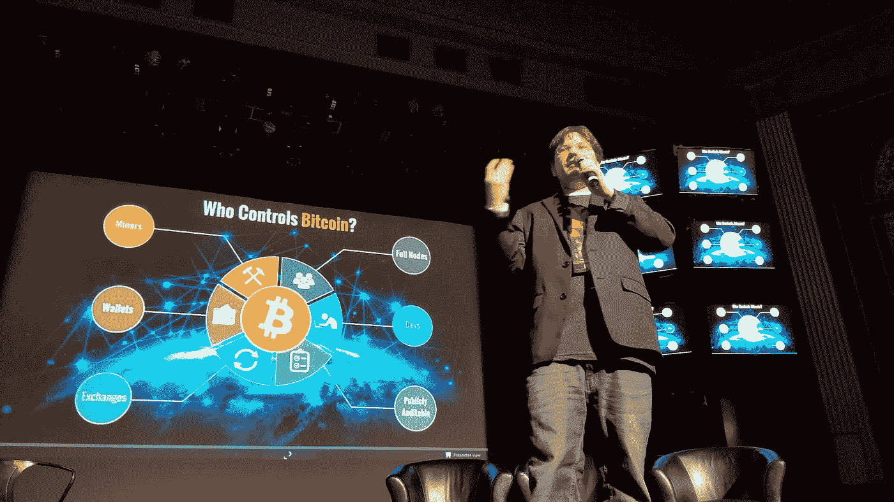
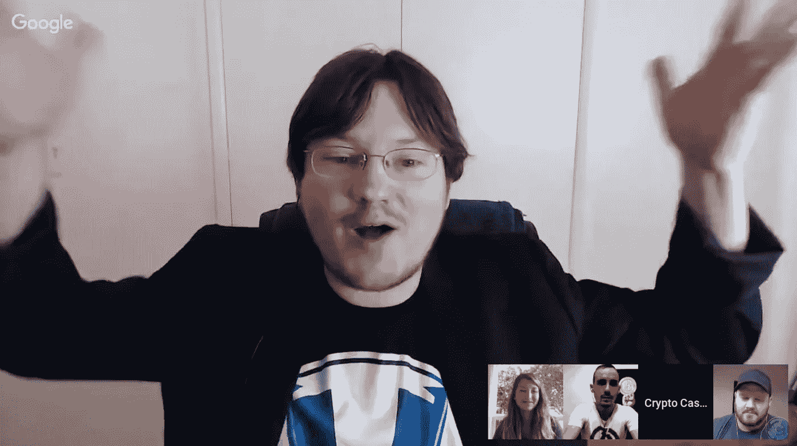
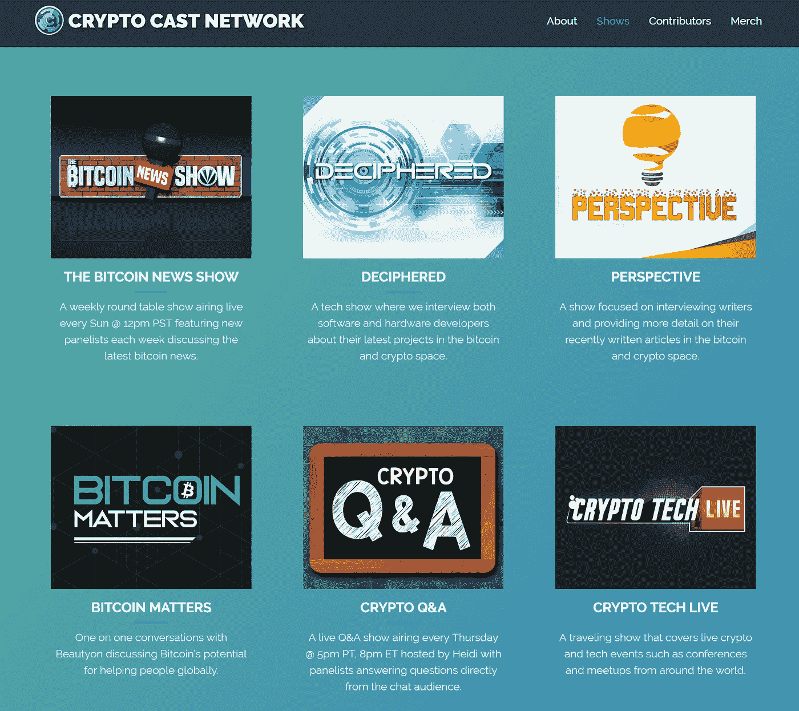
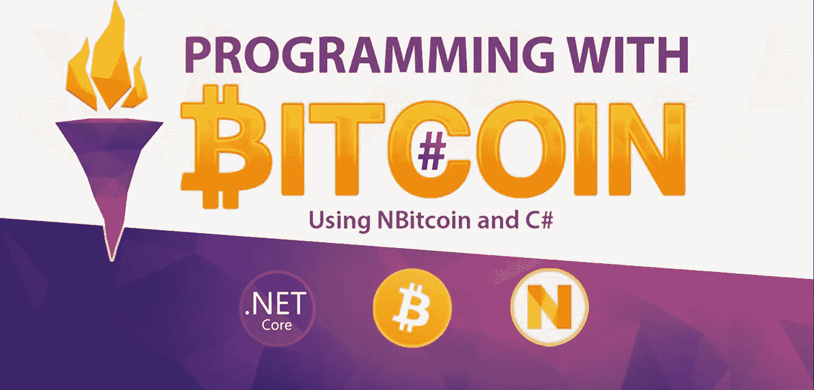
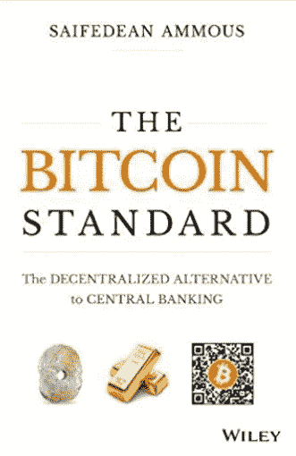
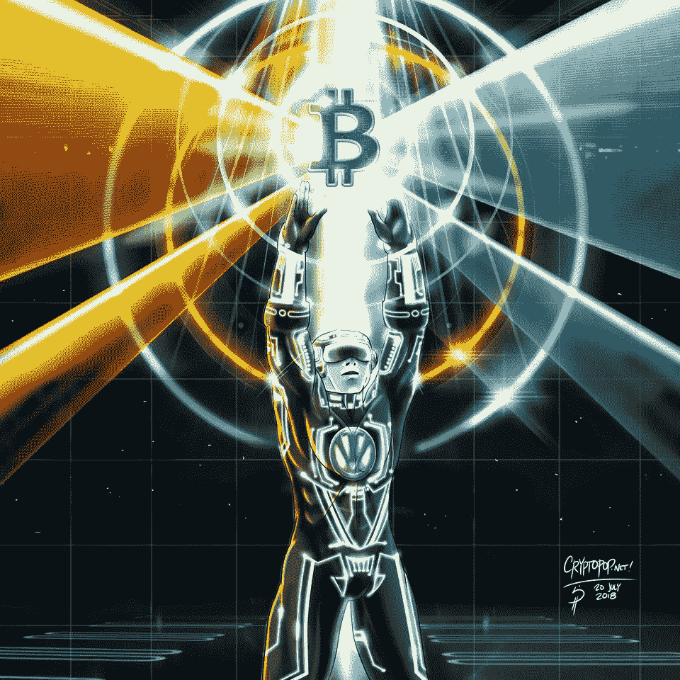

# 构建比特币:采访“用比特币编程”和“加密网络”的创始人 Vortex

> 原文：<https://medium.com/hackernoon/building-bitcoin-interview-with-vortex-the-founder-of-programming-with-bitcoin-and-the-8b18fbb8e4f1>

Vortex speaking at one of many Bitcoin conferences around the globe.

大约两年前，我通过比特币世界认识了 Vortex。你们中的许多人都是通过他的热门播客“比特币新闻秀[认识他的 Vortex 是那些唯一的使命是帮助教育世界关于比特币的人之一，并花了无数时间帮助发展比特币社区。](https://www.youtube.com/playlist?list=PLPj3KCksGbSYHFmduDw4fyKe8H5fEZ6Be)

在过去的一年里，我看着他从制作近 90 个比特币播客发展到推出[加密广播网](http://www.cryptocast.network/)，其中包括几个与比特币相关的播客。最重要的是，他最近推出了一个新的开发者课程，用比特币编程，教人们如何用比特币和 C#编程。

当他不忙于这些项目时，他会作为演讲嘉宾在各种 Bitcon 会议上周游世界。众所周知，当涉及到任何试图阻碍或破坏比特币的人时，Vortex 都会直言不讳，并且在 UASF 运动中发出了巨大的声音。

上个月，我采访了他，以了解更多关于他的新项目，并看看他还在做些什么。Vortex 是一个彻头彻尾的比特币极端主义者，他始终坚持的一点是，他让比特币 100%真实。

**在线身份:**漩涡

**RJ:** 我做了 15 年的软件开发员，专门用[ASP.NET](http://asp.net/)c#做网络应用。

**在$BTC 游戏中的岁月:**

我第一次了解比特币是在 2012 年末。

人们如何认识你？

我有一个名为[的比特币新闻节目](https://www.youtube.com/playlist?list=PLPj3KCksGbSYHFmduDw4fyKe8H5fEZ6Be)，之前在世界加密网络 youtube 频道播出，现在在我的新 youtube 频道播出，名为[加密演播网络](https://www.youtube.com/channel/UCHFL9uTsDbOuBtkhfabU38w)。

人们怎样才能追随你？

我在推特 [@theonevortex](https://twitter.com/theonevortex) 。

今年你在更多的会议上发言，这种经历对你有什么影响？

直到今年，我才开始参加更多的会议和聚会。今年到目前为止，我已经参加了在洛杉矶、旧金山、丹佛、蒙特利尔和西雅图的会议和聚会，并计划在年底前去拉脱维亚和布拉格。

从这些经历中肯定有一些收获:

——绝大多数人仍然不明白区块链是什么。

-有很多热情的比特币人，甚至比我希望的还要多。

-比特币社区的创新数量惊人

Vortex doing his show with a panel of guests.

你是非常受欢迎的播客“比特币新闻秀”的主持人。你的播客是关于什么的，是什么促使你开始这样做的？

BitcoinNews 节目是一个专题节目，我们采访了一些嘉宾，讨论本周的比特币和加密货币新闻。我确保总是有在这个领域工作的客人，所以我们现在已经有了首席执行官、首席技术官、开发人员、对冲基金经理、投资者、内容创作者等等。我们尽最大努力提供我们的诚实意见，以对比主流媒体对比特币的不断误解。

**人们能从你的节目中学到什么？**

正如我所说的，我们试图让许多不同的客人有许多不同的观点，所以知识范围实际上是相当大的，但我们确保它与当前的事件和可行的想法保持一致。

**做了 87 场演出后，是什么激励你继续走下去？**

这种驱动力实际上来自于想要确保真相被告知。确保比特币还有机会。正如比特币标志盖伊所说，“我们都只是想为比特币走出大门提供掩护火力”。

你最近做过的哪些节目让你印象深刻？

我们做了一个很棒的节目，鲁道夫·诺瓦克在讨论他的新冷卡设备。这提供了业界迄今为止未见的另一个级别的硬件钱包安全性。很高兴能得到一个。我们还刚刚录制了一集，讨论通过由 crypto 付费的闪电网络提供数据服务。最后，我认为最有趣的一个是与 Nik bhat ia 谈论为照明网络创建一个利率参考利率，其概念是在网络中押注比特币，为渠道提供流动性，以传递价值。

Interview with Rodolfo Novak talking about OpenDimin and ColdCard.

**你对播客市场新人越来越多有何看法？**

我完全支持更多的人学习 crypto。正如我在过去几年里所说的，我相信这一次将被视为全球金融复兴。这是人类开始重新思考如何理解货币概念本身的时候。

**你为什么离开世界加密网络并推出加密广播网络频道？**

有一些创造性的差异，但主要是时候让我自己走出来，向世界证明我可以创造出比特币社区可以欣赏和学习的伟大内容。

**在你的新渠道中，有什么新的东西是你希望探索或开发的，而在改变之前因为某种原因你没能做到的？**

新的渠道将会更加技术化。不会有那么多关于价格的讨论，也不会有关于交易的展示。也不会有每日新闻节目，因为我认为有很多人在做这些。

The Crypto Cast Network features multiple podcasts.

**你对加密广播网络有什么看法？**

我想把重点放在获取社区实际成员背后的故事上，那些为加密世界构建项目的人。发生的事情太多了，很难跟上，但我希望我能提供一些背景，让世界回顾一下，亲眼看看比特币革命

**你是什么时候决定为开发者推出名为“用比特币编程”的新课程的？**

那是在 2017 年听了[伊丽莎白·斯塔克](https://twitter.com/starkness)描述闪电网络未来的演讲之后。我意识到，这个世界将需要大量使用比特币的应用程序开发人员，远远超过我们现在的数量。

所以教育开发人员的概念在我脑海中根深蒂固。随后，我了解了 Jimmy Song 的课程，并看到他是如何教开发人员使用比特币，或者更确切地说，是直接使用比特币协议。

这太棒了，但是协议开发是一个高度专业化的领域，所以包括我自己在内的大多数开发人员都无法接触到它。我已经和 NBitcoin 库的创建者 Nicolas Dorier 在他的 slack 频道上谈过了，问了一些关于 NBitcoin 和 BTCPayServer 的集成问题。尼克很乐于助人，也很善良。

正是在这一点上，我意识到 [NBitcoin](https://github.com/MetacoSA/NBitcoin/tree/master/NBitcoin) 和 [BTCPayServer](https://github.com/btcpayserver/btcpayserver) 对这个世界是多么有用，并认为这可能是让更多开发者使用比特币的一个好方法。我和尼克谈过，他马上就同意了。原来他是一个经验丰富的老师，已经获得了微软的教学证书，剩下的就是历史了。

Learn more about the classes offered [programmingwithbitcoin.com](https://programmingwithbitcoin.com/)

你教授这门课的主要目标是什么？

主要目标是让更多的应用开发者使用比特币。原因在于，我们需要构建软件基础设施，为这种新的去中心化货币体系提供动力，并使其真正可扩展，可供地球上的每个人使用。为了做到这一点，我们需要开发人员构建应用程序，进一步推动网络的效用，创造新的使用案例，这将为生态系统带来更多用户，使其更有价值，进而为生态系统带来更多流动性，进而为世界各地的每个人提供更多机会。

**有人上你的课需要什么样的编程经验？**

我们最多只需要 1-2 年的 C#经验。事实上，你不需要了解任何关于比特币或区块链的知识就可以学习这门课程。我们将介绍挖掘和完整节点的所有基础知识，确保您有必要的框架来理解课程中教授的所有概念。

Great book for anyone interested in Bitcoin.

**你有没有建议学生在上课前阅读的书籍或材料？**

现在关于比特币最好的书是安德里亚斯的， [*掌握比特币*](https://books.google.com/books/about/Mastering_Bitcoin.html?id=k3qrBQAAQBAJ&printsec=frontcover&source=kp_read_button#v=onepage&q&f=false) 和赛弗迪安的， [*比特币标准*](https://www.amazon.com/Bitcoin-Standard-Decentralized-Alternative-Central/dp/1119473861) 。

你会发放奖学金吗？

我们正在积极寻找公司为比特币编程课程提供赞助和奖学金。

**怎样才能申请到？**

您可以通过访问 ProgrammingWithBitcoin.com/contact 的联系页面与我们联系，并告诉我们您希望如何提供帮助，然后我或 Nic 将会与您联系。

**教可能与你的比特币政治不一致的学生，你会有问题吗？**

当然不是。欢迎所有人学习如何用比特币编程。

**你对区块链这个词有什么感觉？**

在这一点上，炒作是如此强烈，以至于这个术语完全没有意义。

**你觉得比特币最大的敌人是谁？**

比特币试图向中央银行卡特尔提供竞争。

**关于世界是如何监管比特币的，你怎么看？**

目前情况还不算太糟。现在还为时过早，但大多数国家似乎都在使用轻触式方法。

Custom Vortex art by [CryptoPopArt](https://cryptopopart.tumblr.com/).

**你对闪电有多乐观？**

闪电是比特币需要的数量级缩放解决方案。我完全怀疑 LN 将在 2019 年底整合到加密生态系统的每个主要部分，包括钱包和交易所。在此之后，进入 2021-2022 年，我们可以预计商家采用将开始大幅增长。

**你如何将本轮熊市与 2014 年至 2015 年的熊市进行比较？**

这很可能是上一次熊市的浓缩版。我预计我们将在今年秋天或最迟明年夏天开始下一次集会。

**你对 2020 年的比特币有什么预测？**

10 万美元以上

**你从哪里获得比特币的消息？**

大部分来自推特。在这一点上，几乎所有业内人士都在 twitter 上。

*如果你喜欢这个采访，可以看看我的其他一些文章*[*hacker noon/@ piratebachbum*](https://hackernoon.com/@piratebeachbum)*或者在 twitter 上找我*[*@ piratebachbum*](https://twitter.com/piratebeachbum)*或者* [*@ coin _ strategy*](https://twitter.com/coin_strategy)*或者*[*coin strategy . io*](https://www.coinstrategy.io/)