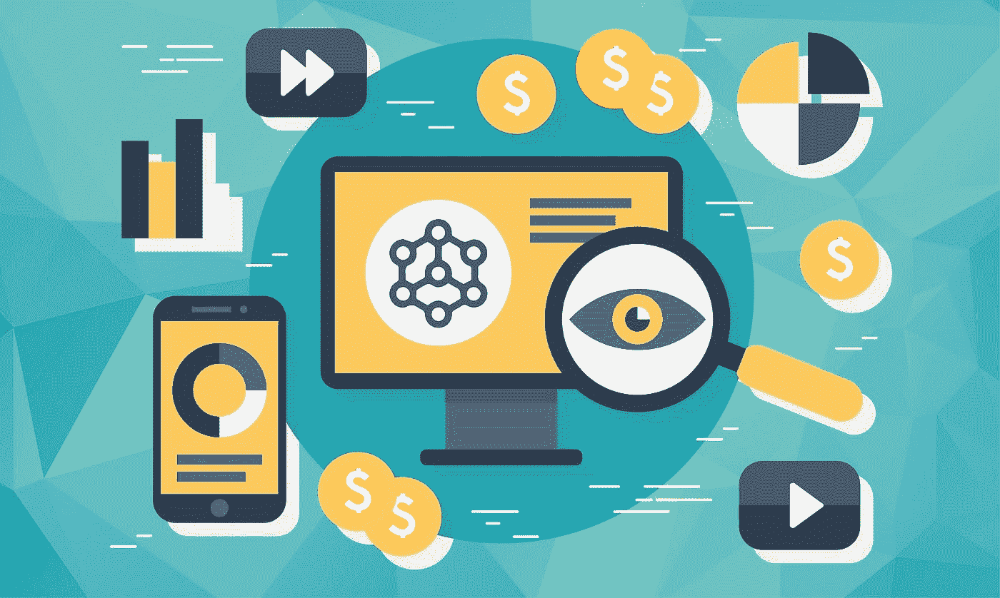

# 用区块链打造品牌

> 原文：<https://medium.com/hackernoon/building-brands-with-blockchain-af100f7ab6a7>

过去，品牌广告有多种形式，通过报纸、杂志、广告牌和传单以及名人代言和电视广告进行传播。但如今，人们对一个品牌或特定产品的目标受众有了更多的了解，这意味着不仅可以定制产品，还可以制作广告来吸引非常特定的人群。

但为了让这成为可能，公司不得不购买大量的用户数据，这引发了隐私问题，特别是当客户不知道他们的信息是如何被使用或出售的时候。只要公司制定清晰的数据使用政策，并让使用其网站和产品的用户随时可以使用，使用用户数据就不是问题。然而，有了这种新的广告形式，客户对品牌定位他们的方式更加了解，因此有必要也有机会重塑企业与客户互动的方式，使之更加公平有效。

区块链技术虽然相对较新，但已经影响了一系列行业，它可以帮助品牌更直接、更真实地接触消费者。这方面的一个例子是分散市场，用户可以选择将哪些个人数据直接出售给广告商。这使得消费者可以从他们的数据中得到补偿，企业可以确信他们从潜在客户那里收到了真实的信息。这也是客户关系中的新道德标准，而不是使用要求用户“选择加入”数据收集以便使用网站、应用程序和产品的表格。

像 Wibson 这样利用区块链的平台非常有价值，因为它们在公司意图方面提供了透明度，验证了用户数据，而且这些数据也是免费提供的。企业可以购买购买历史、交通模式和位置数据，客户知道所有这些都将被用于针对他们进行广告宣传，从而看到与他们的兴趣和购买习惯更相关的营销活动。

事实上，区块链和广告是一种天然的契合和结合，一旦消费者确信自己的数据是安全的，并且能够更容易地跟踪数据在哪里以及如何被使用，就可以帮助激发他们对品牌的更大信任。

通过这些强化的关系，品牌可以自信地向选定的用户群做广告，并以更大的参与度和更高的销售额的形式看到自由共享数据的结果，消费者可以相信品牌不会利用他们的信息，同时有助于建立一个持续发展的内在安全和透明的环境。

BLMP 2018，新加坡

BLMP(block chain Licensing market place)是区块链的一家技术公司，致力于消除障碍，促进虚拟商品行业中围绕供应链管理交易的复杂问题的信任。

*BLMP Network 利用区块链技术，将全球的数字平台与全球品牌连接起来，将跨任何数字平台的官方授权虚拟商品货币化；从游戏到流媒体服务&社交媒体，让数百万用户能够接触到一个全新的品牌虚拟产品世界。*

联系我们:

[网站](https://www.blmp.network/)

[推特](https://twitter.com/BLMPNetwork)

[脸书](https://www.facebook.com/BlmpNetwork)

[领英](https://www.linkedin.com/company/blmp/)

[AngelList](https://angel.co/blmp-network)