# 建设预算员——经验和教训

> 原文：<https://medium.com/hackernoon/building-budgeteer-lessons-and-experiences-97dec9031006>

离大学毕业还有不到一个学期，我意识到我需要一个预算应用程序。我当然知道 Mint，后来了解到 Clarity Money 已经进入开发阶段，但我想要更小、更专注的东西，而不需要 Mint 提供的额外重量，或者 Clarity Money 包含的广告和推荐。

预算员出生了(我在家度假时，我姐姐在晚餐时起了这个名字，我没那么有创造力)。这是我如何建立它的故事，学到的教训和获得的经验。它还没有完成，仍然需要大量的工作，但不会多到我真的想在几周内完成，或者如果我想放松一下，几个月内完成。请随时[查看](https://budgeteer-prod.herokuapp.com/budgeteer)并在此留下您的任何评论(请避免在设置页面添加或删除太多帐户，因为它会更新数据库，我不想有一天检查并看到 50 个我必须删除的链接帐户)。特别欢迎设计建议。

你会问为什么是另一个预算应用程序。虽然银行和信用卡提供了大量相同的统计信息，但很少有公司将所有信息汇总在一起。我认为大多数人至少有两张信用卡、一个储蓄账户、一个支票账户和一个退休账户。这需要跟踪很多账户，每个账户的数据如果不与其他账户结合起来是没有用的。这就是预算员的原因。

# 堆栈

MERN。MongoDB、ExpressJS、ReactJS 和 NodeJS。它令人敬畏和强大。

除了这些，我还使用了 Mongoose、PassportJS、Webpack、date-fns(牛逼的日期库——非常模块化=微小尺寸)、Plaid、ReactRouter、Recharts 以及其他一些工具。

为什么我要分享我用过的所有技术？因为我怀疑其他人会愿意经历这一过程，并重建完全相同的产品。坦率地说，如果他们能做到，并且能做得更好，那就去做吧。我是自由市场的人。我可能会尝试将它推向市场，并作为订阅出售(如果我将它作为服务出售，格子是唯一的大成本)，但有了开发者帐户，我很高兴成为唯一的用户，并可以免费这样做。

# 范围

定义这个项目的范围是一个渐进的过程。首先，我专注于一个桌面网站。然后，我希望它也是移动友好的，在屏幕小至 4 英寸的手机上看起来很棒。然后我决定把它建成一个进步的网络应用程序，既作为了解 PWAs 需要什么的一种手段，也因为我认为 PWAs 在不久的将来会更受欢迎。有了一个代码库，我可以访问任何设备并获得原生应用功能。

这个产品的核心是从银行获取数据。我是应该选择一些银行(也就是我使用的银行)并仔细阅读他们的 API 文档(如果有的话)，这肯定会很糟糕，还是有更好的方法。进入 [Plaid](https://plaid.com/) ，这是一个很棒的 API，开发者可以让用户链接银行账户并访问许多其他数据点中的交易信息。但对我来说，我得到了交易数据。我唯一需要的数据，格式优美，组织有序。如果你出于任何原因需要使用银行账户，请查看它们。

## 核心功能

最重要的是，我想要简单、优雅的设计，以及一个最终会有用的工具，而不仅仅是一个肤浅的克隆。没有广告，没有奇怪的合作关系，没有金融产品推荐，什么都没有。只是一个诚实的，高质量的产品，我会想用。我希望你也能。我在下面列出了核心功能。

*   查看和搜索所有账户的交易数据
*   提供有意义的反馈，帮助用户了解他们的消费模式——用图表直观显示统计数据
*   轻松查看您的资产净值
*   跟踪每月经常性支出，如网飞、Spotify、HBO NOW 等
*   轻松添加或删除帐户，没有任何大惊小怪或箍跳

## 处理

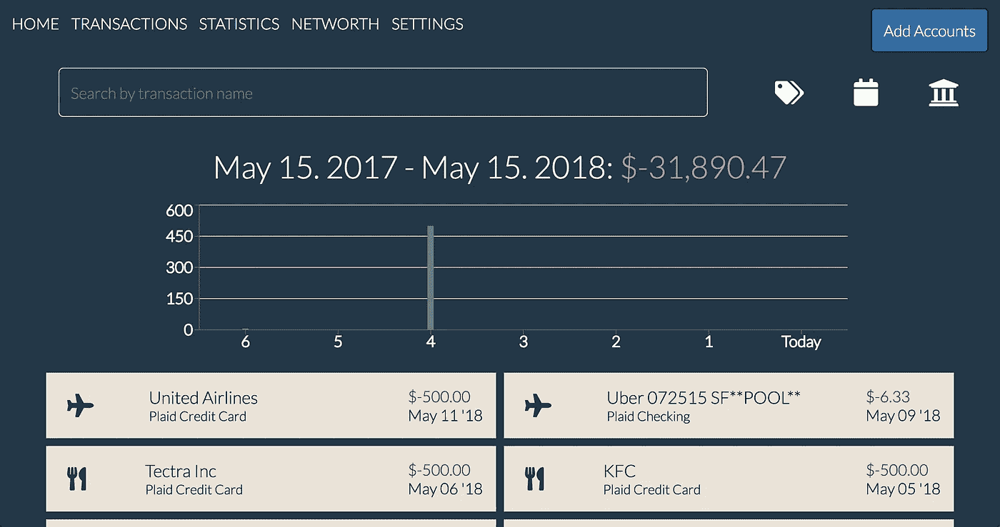

Desktop view of the transactions page

能够查看你所有账户的所有交易，让用户能够在一个地方看到他们在哪里花钱，他们可以在哪里削减开支，并使处理一个棘手的问题变得更容易。能够搜索交易并按类别、日期和账户类型进行过滤使得跟踪各种费用变得容易。在图表中了解你在过去一周的花费可以让你诚实地了解你在短期内的表现，而统计数据则有助于你将注意力集中在中长期。(注意:日历按钮还不做任何事情。我仍在努力寻找一个我可以使用的好日历——欢迎提出建议)。

## 统计数字

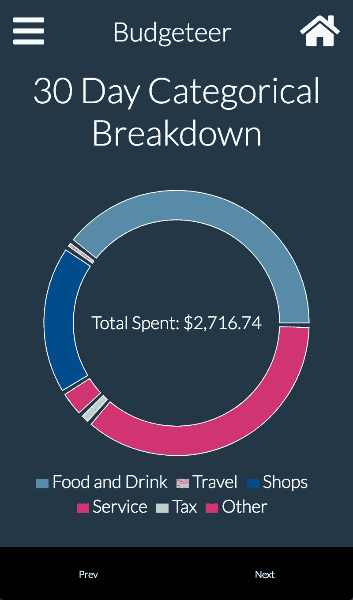

这需要一个图表库。我首先从 ChartJS 开始，坚持了一段时间后，我最终转向了 Recharts。ChartJS 的样式和选项配置很奇怪。脑海中想象的编辑后的样子经常与现实不符。Recharts 虽然一开始更复杂，但配置和风格却容易得多。我创建的五个图表解释如下

*   以甜甜圈图形式对支出进行分类细分
*   过去一年每月的年度支出，其中一条线代表每月的平均金额
*   每月预算图表，显示当月迄今为止的支出金额和剩余金额
*   周与周末的支出，以更好地了解你的支出是否在这两者之间发生了巨大变化
*   热图显示了不同地点的交易，较热的区域表示花费更多(进行中—不在演示中)。

这些图表都回答了有价值的金融问题。我的钱去哪了？我是如何度过的？我能在哪里削减？我的预算正常吗？我的支出每月是否一致？我在哪里花费最多？这些图表中的每一个都提供了对用户财务健康状况的不同视角的快速快照，而不会被无关信息淹没。它通过向人们展示他们财务的硬数字，使人们记忆中的粗略想法具体化。最重要的是，每张图表都很有见地，也很简单。

## 净值和经常性付款

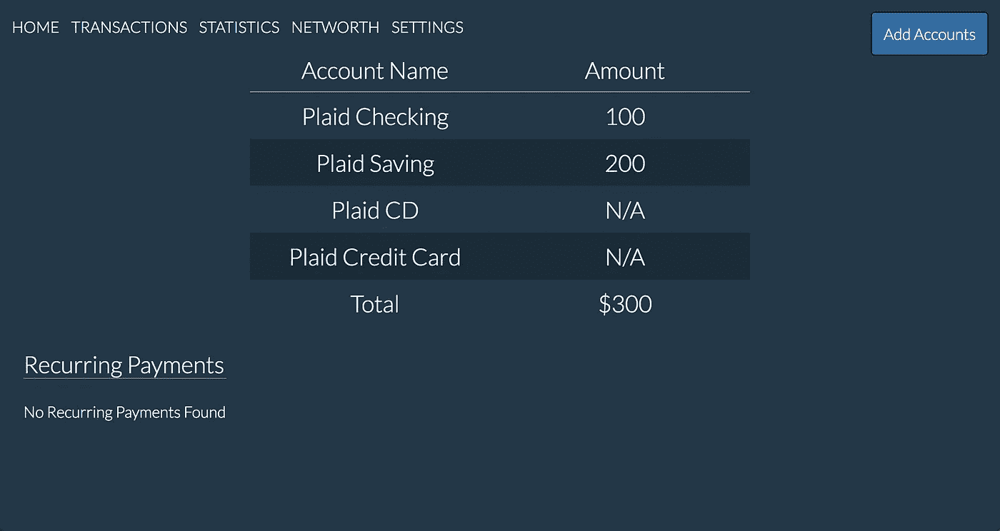

净值可以让人们快速查看他们的账户总余额，并知道他们在各种账户中有多少现金，无论是他们设立的应急基金还是他们的主要支票账户。显示每一个账户给了用户所需的透明度，以确保他们能够有效地分配他们的钱，而不是粗略地跟踪他们头脑中的金额。

经常性交易让用户对他们每月支付的产品和服务有很好的感觉。也许你忘记的那个 Pandora 订阅已经没有必要了，因为你已经开始使用 Spotify 或者你已经完全停止使用它了。

## 设置页面

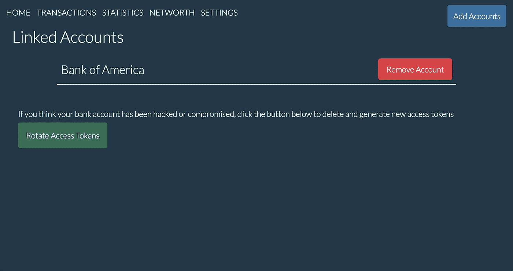

设置页面是为了给用户带来更多的透明度。他们可以很容易地删除任何他们不想链接的帐户，并查看他们是否遗漏了什么。一旦他们点击 remove，存储在数据库中的访问令牌就会被删除，更重要的是会失效，因此即使有人得到了它们，它们也不会工作。

# 设计

设计预算员是这个项目中最有趣的部分。我经历了如此多的反复寻找正确的方法来显示交易，显示图表，设计导航条等等。我检查了历史上不同的提交，所以你可以看到下面的进度。

# 交易页面

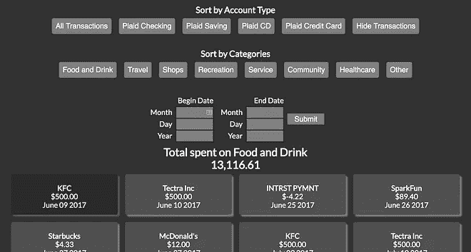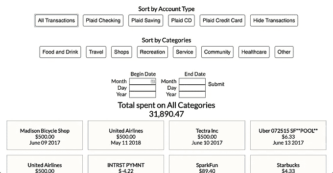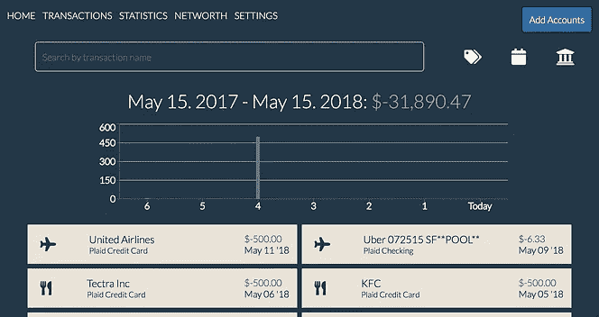

3 Different Versions of the Transactions Page

差别是明显的。交易要优雅得多，占用的空间也少得多，但传递的信息却是原来的近两倍。该图增加了一个可视化的视角，打破了用户界面，并为用户提供了另一个快速总结他们的消费趋势。所有的分类选项都被压缩成更小的可扩展部分，减少了混乱，增加了急需的视觉效果。它使设计移动友好和易于导航。

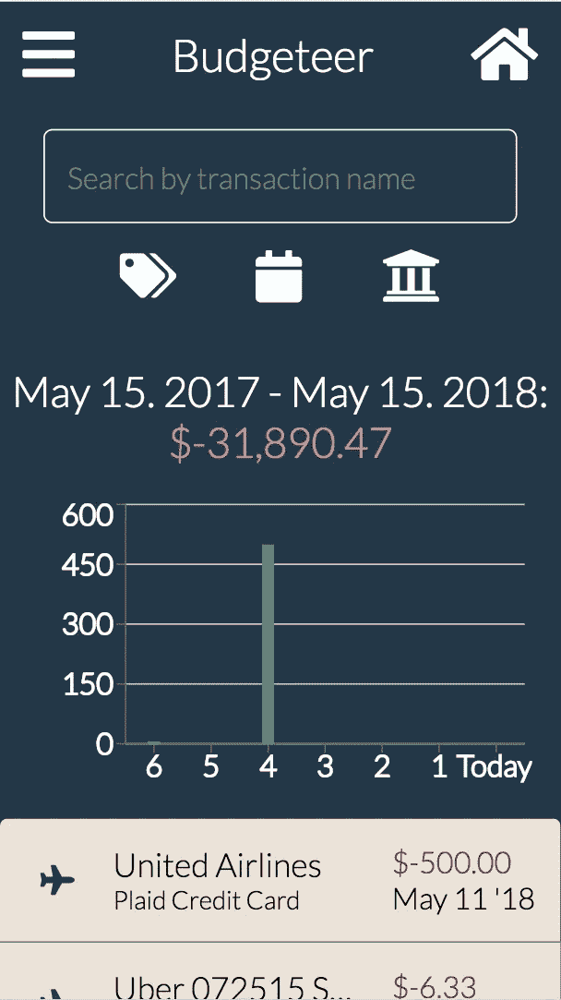

# 统计页面

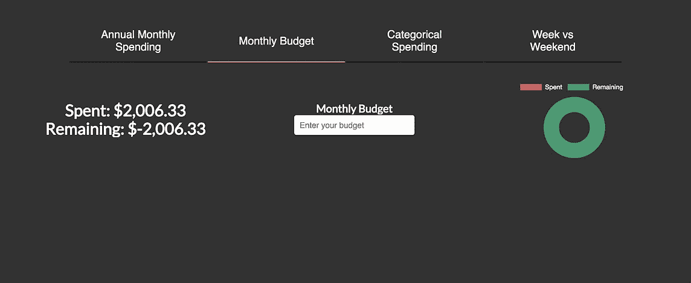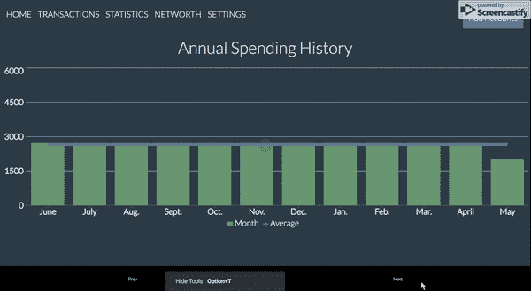

起初，我从基于标签的设计开始。我认为这在桌面上看起来很酷，但我知道它不会在移动设备上扩展。然后，我决定有一个滑块一样的选项，用户可以按下下一个和上一个按钮来改变图表。虽然它在桌面上看起来还不太棒，但在移动设备上看起来很棒。也许下一步我会切换到底部有一个小菜单栏，每个图形有一个图标。这将占用电脑上额外的视觉空间，同时也适合移动设备。桌面可以包含单词，如果合适的话，可以切换到带有断点的图标，如果不合适的话，移动设备也可以这样。

# 导航条

哦天啊。导航条。在桌面上很容易，但在移动上有很多迭代。下面是三个主要的。最终版本最大的不同是在结尾有一点小小的改动，这让它看起来更有活力和互动性。这是否仍然是最终版本，或者我去与一个更原生的应用程序感觉离开左边的重视尚未确定。

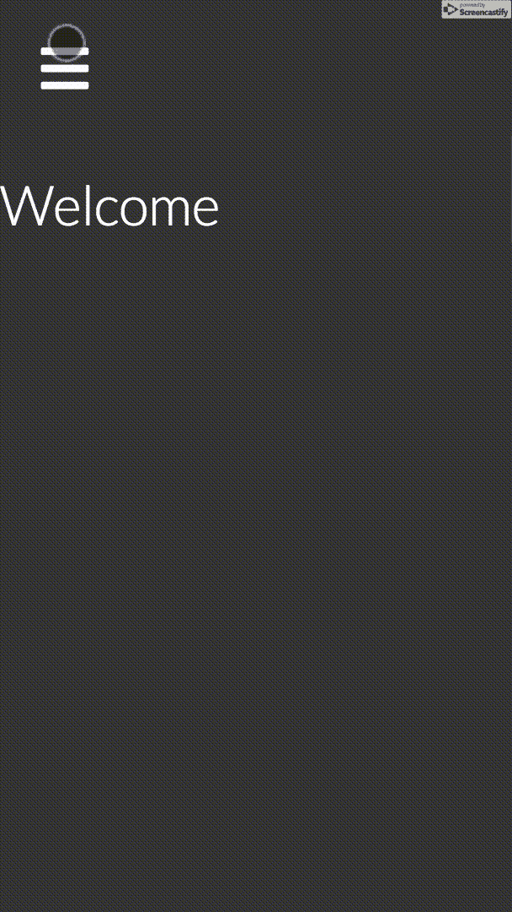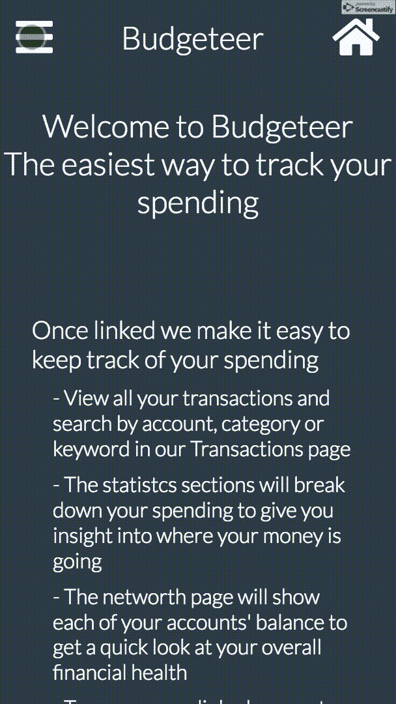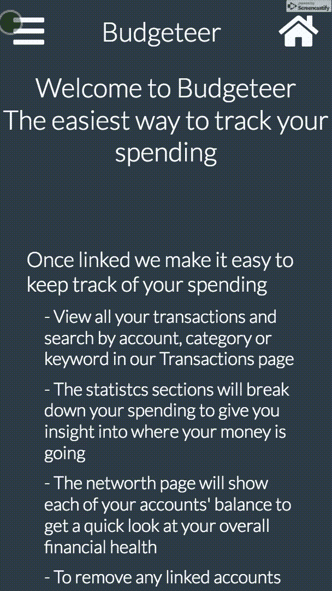

—更新—我用的是原生移动导航条。在手机上查看网站或者在桌面上缩小窗口，看看它看起来怎么样。

# 更广泛的设计评论

在一些图片中，你可能会注意到字体有点粗。我在某个时候从 400 磅(正常)换到了 300 磅(只是稍微瘦了一点)，差别令人震惊。它创造了如此大的空间，让我感到惊讶。一切都感觉现代，更干净，只是看起来更好。我的另一个想法是，根据交易是付款还是退货，将交易价格的颜色设置为红色或绿色。

此外，使用较大字体的交易名称和较小字体的账户名称，将用户的注意力集中到更重要的信息上。这些和其他许多技巧是我花时间在其他网站和应用程序上学习的。

花点时间去注意应用程序中菜单栏的动画是什么样子，看看你的眼睛在页面上被吸引到哪里以及为什么，或者看看颜色是如何用来传递信息的，这些都给了我很多灵感，让我明白了什么是好的设计和 UX。

最后，绝对要去 https://medium.muz.li/的[看看令人敬畏的设计和趋势。这是我第一次陷入困境或需要快速灵感的时候。他们提交的作品背后的设计师是非常有才华的。](https://medium.muz.li/)

# 作为渐进式 Web 应用程序开发

这个项目最有趣的部分之一是致力于将它建成一个进步的网络应用程序。这使得它可以像本地应用程序一样安装和运行。主要好处是推送通知、设置离线功能和本地缓存资源以减少网络请求。这意味着有了一个代码库，我就有了一个桌面和移动网站，以及类似原生应用的功能。不过，同性恋有点奇怪。我在缓存来自不同域的 CDN 的资源时遇到了一些问题，我知道这是一个 CORS 问题，正确配置服务人员，设置推送通知，以及找出如何让安装弹出窗口自动出现。此外，测试它总是很困难，因为它缓存了所有内容，但是对代码的更新可能并不总是使现在陈旧的缓存无效。

虽然 React Native 本来可以让我实际构建一个原生应用程序，但这让用户可以选择他们希望如何使用该产品，无论是不经常在他们的计算机上使用，一周几次在他们的手机浏览器上使用，还是经常使用其他应用程序。PWA 版本没有推出，因为我仍在解决缓存和推送通知的问题，但我希望接下来完成这一部分，然后解决最终的设计问题，然后是我推迟的任何功能*咳咳，排序交易*咳，按日期*咳咳，清嗓子。

# 结论

我学到了大量关于设计和制造产品的知识。从工具到 API 集成，这是我接手的最有收获的项目之一。当我在学校无聊的时候，或者当我想拖延时间的时候，我会做这个，做这个非常有趣。

作为最后一个想法，如果你认为浅色主题比现在的深色主题更好，我会请大家留下评论。这是我和我姐姐一直在争论的问题。