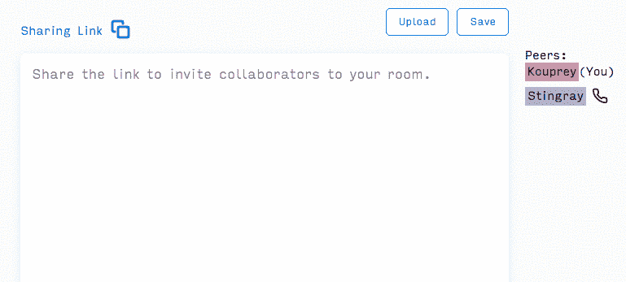

# 构建秘密会议:一个分散的、实时的、协作的文本编辑器

> 原文：<https://medium.com/hackernoon/building-conclave-a-decentralized-real-time-collaborative-text-editor-a6ab438fe79f>

## 使用 WebRTC 和无冲突复制数据类型(CRDTs)

Conclave in action

[在此尝试秘密会议](https://conclave.tech)

[点击此处阅读我们的深入案例研究](https://conclave-team.github.io/conclave-site/)

如果你了解最新的科技新闻，你可能听说过 GitHub 发布的 TeleType。Teletype 是一个插件，由…