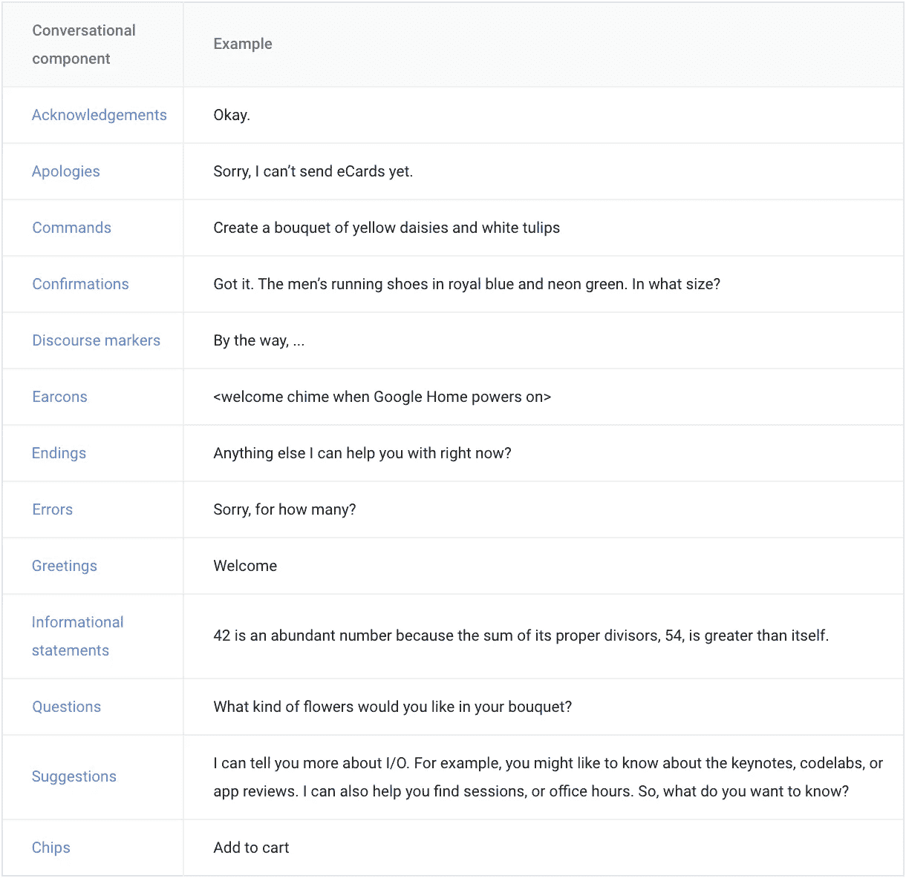

# 构建对话产品和界面

> 原文：<https://medium.com/hackernoon/building-conversational-products-interfaces-5e9d3f08d3d4>

# 介绍

有了对话式产品和界面，产品创作者现在不得不想象一种交互方式，在这种方式中，屏幕扮演着辅助角色。因此，大多数良好用户体验的最佳实践和原则都需要重新定义，如果有的话。

即使在对话界面中，我们说话方式也不同于书写方式。我们不发句子中所有单词的音，组合单词，根本不说一些单词，我们的交流很大一部分是非语言的。

因此，对话式界面的 MVP 需要不同于任何其他产品的 MVP。需要对它能为用户做什么设定好的期望。

# 构建对话，而不是用户故事

以我的经验来看，为对话式界面构建用户故事非常笨拙，更好的方法是在终端用户和产品之间构建可能的对话。关注对话的书立有助于你理解触发点和目标。

改善用户体验为客户提供了尽可能少摩擦的问题解决方案。提高可信度和扩大话语范围是减少对话式用户界面摩擦的关键。

从学习某人可能要求其帐户余额的所有不同方式，到增加可以自主执行的任务数量，客户提出的每个挑战性问题都是我们学习和改进的机会。

在构建这些对话时，请记住以下几点:

## 高层流动

一旦你有了一些示例对话，你就可以抽象出对话的流程和逻辑。这提供了你的对话界面的结构。好的设计平衡了清晰定义的用户路径的需求和用户想要的快捷方式。

从你为用户设想的最理想或最优的路径开始。这是客户行为和你的设计意图之间的完美结合。

然后在前进的过程中扩展路径。

## 适应用户自然会说的话

对话式界面的美妙之处在于它对用户来说是自然而然的，他们不需要学习如何使用它们。产品应该适应用户的词汇选择，而不是强迫用户记忆一组命令。用户可以更容易、更自然地回答一个狭隘的问题(例如，“这对你有用吗？”)而不是被教说什么(例如，“如果那管用，就说‘是’”。").

## 提供线索

机器人应该推动对话，有时甚至限制对话。有一些简单的方法可以帮助用户保持在护栏内。在视觉上，你可以使用按钮或快速回复(FB Messenger 和 Slack 支持这一点)来推动他们向正确的方向前进。

考虑建议要做的事情；这将帮助用户发现额外的功能。

“嘿，机器人，预定一张桌子。”

*“预定的桌子。要不要我点一杯优步？”。*

机器人交互有点像传统的电子商务流程。我们应该不断地让用户更新，并帮助他们前进，同时避免用一堵墙的信息淹没用户。

## 交互应该简单

对话可以采用的路径数量增加了走进死胡同的可能性。最好是限制功能，把用户推到一个特定的路径上。一个简单的解决方案是使用结构化消息来引导用户。不要让最终用户键入“是”或“否”，而是显示一个带有两个按钮的结构化消息。

## 专注于口语对话

开始时，最好只关注口语对话，不要被代码符号、复杂的流程图、屏幕大小等技术干扰。如果所有东西都在一个地方，就更容易获得正确的流程。当你扩展到手机等其他设备时，信息将从语音提示转移到显示提示、芯片和视觉上。

## 处理错误

对话界面可能会面临以下 3 种错误:

*   没有输入:产品没有记录用户的输入。
*   系统错误:执行用户提示时出错。
*   不匹配:操作无法在上下文中解释用户的响应。

“不匹配”错误有点棘手，需要在对话中妥善处理。以下是不匹配错误的一些可能原因。

*提示:什么时间对你合适？*

*用户:晚上晚些时候？*

*提示:不好意思，几点？*

(用户说了一些和语境相关的东西，但是产品不理解。)

*提示:什么时间对你合适？*

*用户:天气怎么样？*

*提示:不好意思，几点？*

(用户希望完全切换主题。)

在每种情况下，重要的是考虑为什么用户可能有困难。然后，在随后的提示中，以选项或附加信息的形式包括附加支持。例如

*提示:什么时间对你合适？*

用户:晚上晚些时候？

*提示:抱歉，我们有两个时间段。一个在下午 1 点到 2 点，另一个在晚上 4 点到 5 点。现在，什么对你有效。*

如果在第二次尝试后仍然“不匹配”,则结束对话以避免用户进一步受挫，并提供替代或替代方法进行跟进。例如

提示:对不起，我仍然有问题，所以你可能想访问我们的网站。

好的错误处理是特定于上下文的。即使你问的是同样的信息，在第二次或第三次尝试的时候，对话的语境是不同的。为了为上下文播放正确的错误提示，您需要记录发生了多少错误，以及错误的类型。

## 适当时随机提示

像人一样做出各种反应。这让对话感觉更自然，并保持这种体验不会变得乏味。例如，随机选择你的第一个提示，如嗨，你好，嗨，欢迎等。

## 对话组件的正确组合

对话组件是组成提示的所有东西，如确认或问题。它们还包括筹码，用来继续或转移谈话。提示和筹码是对话互动的核心，应该为对话中的每一个回合而设计。Google 的设计指南列出了可以在提示中使用的不同对话组件。

## 简明扼要，切题

对话界面也是线性的，不像 GUI，没有办法浏览信息。通过强迫用户使用无意义和不相关的语言，你不必要地浪费了他们的时间并考验了他们的耐心。人们不喜欢花额外的时间或费尽周折去发现事情或完成事情。因此，成功的对话式界面设计应该简洁明了。

## 优雅的退场

确保用户可以离开当前的对话流。无论是输入“退出”，超时，甚至报错。机器人应该总是允许你优雅地退出，而不会让用户感到内疚。

# 所有关于上下文

一旦您生成了潜在的用例，并根据实际的业务目标对它们进行了筛选，接下来您需要回答一些关于您的目标用户的问题，例如客户的身份、反馈、用于联系的渠道、日期、时间、位置和其他实时信息。

所有这些问题都会影响对话式界面体验的实现。通过使用人工智能和机器学习分析所有数据，机器人可以预测客户需求。在 2D 设计环境中，你可以看到用户与你的应用程序交互——滚动、点击按钮、打字，但在对话式产品设计中，你必须考虑更广泛的用户环境。

通过文字表达意图比汉堡菜单更容易，但自然语言比点击一下更难理解。随着时间的推移，理解上下文和观察用户行为会变得更容易。

训练人类输入计算机理解的命令是一回事。教计算机将自然人类语言输入映射到意图是完全不同的过程。将自然语言映射到意图是对话式 UI 的第一层。

# 利用平台功能

不同平台的机器人也完全不同。所有的平台都有不同的功能。它们都有不同的特性集或功能。

Alexa 是语音优先的体验。Alexa 的应用程序版本被称为“技能”——这个想法是你可以通过启用第三方创造的新“技能”来教你的 Alexa 做一些新的事情。

谷歌的助手更像是一个平台:“动作”(谷歌版的“技能”)可以是语音激活的，也可以是点击或输入的。一个混合语音，文本和类型的界面，助理让您使用任何方法适合你在您当前的环境和方法之间无缝切换。这也意味着 Assistant 可以在更广泛的外形上使用，从智能扬声器到手表，从智能手机到电视。

Facebook Messenger 是一个聊天平台，增加了大量可定制的小工具，允许用户快捷地进行对话并快速完成工作。让一个聊天机器人加入到人类的对话中来帮助你完成任务真的很容易。

一个对话式的产品应该尽量利用它所在的平台。

# 不仅仅是 NLP，还有预测引擎

当一个人问另一个人一个问题时，他们平均需要 200 毫秒来做出反应。这是如此之快，我们甚至听不到暂停。事实上，它比我们大脑实际工作的速度要快。大脑需要大约半秒钟的时间来检索要说的话，这意味着在交谈中，一个人在另一个人说完之前就已经准备好说话了。通过听别人说话的语气、语法和内容，我们可以预测他们什么时候会结束

# 监控机器人的健康状况

当涉及到机器人时，旧的分析工具无法胜任，所以深入研究而不只是插入现成的东西是很重要的。像 Botmetrics 和 Dashbot 这样的新玩家正在根据基本原则为机器人开发工具，他们每天都在改进。但是，即使它们也不能提供您需要的所有信息/功能，您可能最终会发现您的数据是孤立的和不可访问的。

1.  混乱触发:整个漏斗都是由出错的方式造成的。鉴于这种可能的用户输入范围，机器人通常会误解或根本无法确定用户想要什么。检查前面的提示，看看您可以在哪里做出一些澄清。行动号召清楚了吗？
2.  **对话步骤:**了解一般的对话步骤可以让你开始区分用户和机器人之间好的或坏的体验。对话步骤是用户和机器人之间的一次来回交换。根据机器人的类型，你的平均步骤会有所不同。显著超过或低于平均对话步骤的对话通常表明用户体验不佳。要么是用户放弃得太快，要么是机器人花了太长时间来完成用户的目标。
3.  **对话流程:**

*   注意用户自然索要东西的方式。流量是让用户觉得一次只能提供一条信息，还是鼓励他们一句话提供多个细节？
*   寻找用户看起来困惑或不确定该说什么或做什么的地方。
*   用户可能会说一些你意想不到的话。记下它，并在设计中添加对它的处理。
*   沮丧或不耐烦的迹象表明互动过于冗长。回顾你的提示，看看你是否能更简洁。
*   观察谁说得最多，用户是否控制了对话

**4。每个用户的会话数**:与平均步骤数相关的是每个用户的平均会话数。这表明与机器人的接触。

**5。活跃用户与参与用户**:如果你的机器人同时支持推和拉交互，那么你需要比较用户与你的机器人交互方式的差异。活跃用户将消费机器人发送的消息，而参与用户将做出响应。这很重要，因为你可以从参与的用户那里学习。这些是你的快乐用户，他们正在体验这种体验。你会想要适应这些类型的对话。

**6。响应时间**:知道你的 bot 需要多长时间响应。了解命令和响应之间的潜伏期。这会影响整体用户体验。你在这里寻找中间时间和异常值。

机器人应该通过减少摩擦和努力来节省时间和缓解压力。否则比之前来的网站或 app 好不了多少。集成和上下文相关性是体验的关键要素。

# 混合体验是可以的

认为对话式设计意味着每个用户的输入和输出都必须以纯粹的聊天格式来处理是错误的。聊天机器人存在于消息应用程序中，用户已经习惯于使用文本与朋友交流，但文本输入并不是对所有用例都有效。GUI 取代基于文本的终端是有原因的，一些任务如浏览和选择用触摸或点击会更快。只要有意义，就可以考虑混合方法，在对话中使用其他交互元素(如按钮、卡片、表格)来帮助用户更快、更少摩擦地完成目标。

然而，过度依赖结构化信息会让人觉得不自然，因为你失去了对话的元素。

# 结论

从基本原则开始设计是避免基本可用性问题的唯一方法，特别是因为这是一种全新的用户体验模式。在网络或移动应用中，这可能是一个相当安全的假设，因为人们已经学会了标准的用户界面和手势，但在对话界面世界中却没有。

对话式产品涉及通过语音和消息传递接口提供服务，但它也意味着产品开发的不同理念，这更多地是关于理解上下文、不断迭代和不断 A/B 测试。