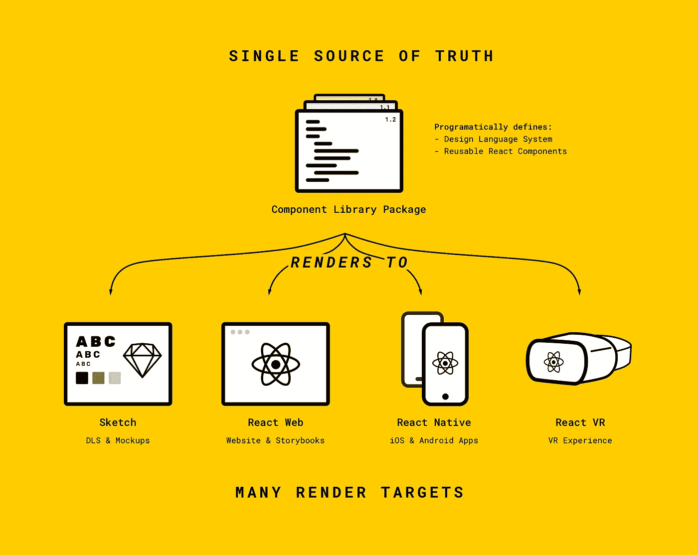
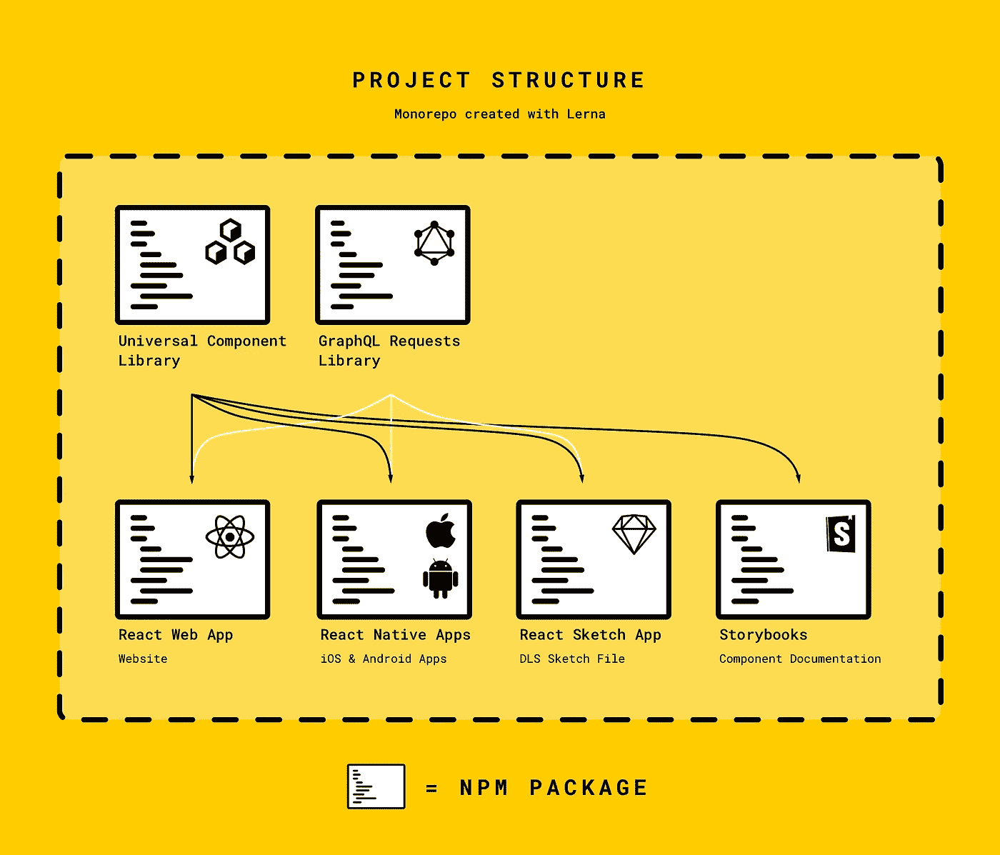

# 用通用组件库构建跨平台应用程序

> 原文：<https://medium.com/hackernoon/building-cross-platform-applications-with-a-universal-component-library-e6292ca9a15>

## 如何在管理设计系统的同时，同时编写一个 iOS、Android 和 web 应用程序(此外，还要加入一些虚拟现实的乐趣)。


我想象一下:你是一家小公司的工程师。你负责设计和开发产品的前端用户界面。*你的产品依赖于作为其价值支柱的一部分，每个人都可以在每台设备上使用。* **面对如此多的目标，你该如何打造一个平台？**

# 蜜蜂应用程序

[蜜蜂应用](http://www.thebeeinc.com)是你最喜欢的品牌的数字 VIP 通行证。它允许品牌发布故事，举办比赛，并直接向顶级粉丝发布独家产品(想想每个品牌的耐克应用程序)。

无论用户如何访问 Bee，我们的团队都希望尽可能提供最佳体验。这意味着我们不能把它仅仅看作一个应用程序，而是一个平台:**任何设备，任何时间，任何地点**。用一个小团队(我和另一个服务器端工程师)构建这么多东西的开销令人望而生畏，但是随着移动生态系统的成熟，工具也变得成熟了。我们决定创建一个跨平台、可重用的组件库，以满足我们构建概要 web、iOS 和 Android 应用程序的目标。

> 通过使用通用可渲染组件，我们能够在管理设计系统的同时构建三个应用程序。

从概念到创作，我们在不到 4 个月的时间里同时推出了 iOS、Android 和 web 版的蜜蜂应用。实现这一点的唯一方法是创建可在 web、iOS 和 Android 上重用的用户界面组件。我们称之为**通用组件库**。这是我们在建造它时学到的东西。

# 如何建立通用组件库

首先，我们决定使用 [React](http://reactjs.org) 作为框架来支持我们的用户界面。React 允许您将用户界面定义为它所提供的数据的函数。这意味着您可以以声明的方式构建 UI，而不是强制性的。

此外，React 允许将用户界面的定义从将其显示在屏幕上的渲染引擎中分离出来。这是我们想要利用的特性。


We love React

React 不是一个写一次就可以在任何地方运行的框架。保持不同的风格:React-Native、React-VR 等。分开是 React 社区非常自觉的决定。

然而，社区中的人们已经注意到 React 的某些实现有相似之处。例如，React-Dom 中的`<div>`和 React-Native 中的`<View>`的作用类似于容器。与``和`<Image>`相同。这引起了 React 社区的思考:**如果这些相似的组件有一个公共接口会怎么样？**

Airbnb 的一些非常有才华和创造力的工程师创造了一个叫做 [React-Primitives](https://github.com/lelandrichardson/react-primitives/) 的东西。React-Primitives 表示 React 和 React Native 中最常用的组件子集，即:视图、图像、文本、样式表、动画和可触摸。对 React-VR 和 React-Sketchapp 的支持是后来才加入的。

> react-primitives 库通过为环境选择正确的依赖关系，允许跨平台的 react 代码。

这个库允许我们做一些疯狂而强大的事情。我们使用 React-Primitives 使用户界面可以跨平台重用，并与我们的[设计](https://hackernoon.com/tagged/design)系统完美同步。

# 构建设计语言系统

虽然所有这些跨平台的可重用代码都很棒，但是利用它的最佳方式是什么呢？幸运的是，Airbnb 更多有才华的人也想出了答案(真的我们欠你很多，有时间在蜜蜂队喝酒)。

设计语言系统(DLS)是一套规则，用于构建控制用户体验的视觉标识。这组规则可以定义如下内容:

*   **排版**
*   **颜色**
*   **布局**
*   **用户界面组件**

所有这些共同作用，在所有产品媒介上构建一致的体验。

通常，DLS 将存储在某种视觉设计文档中，如草图或 Photoshop 文件。然而，随着产品的变化，设计文档和源代码都需要独立更新以保持同步。通用渲染可以帮助解决这个繁重的任务。

## React +通用组件+ DLS 是如何协同工作的？

Airbnb 的乔恩·戈尔德(Jon Gold)提出了“单一真理来源系统”的概念，在这个系统中，构成设计语言系统(DLS)的所有元素都有定义。从那里，许多不同的应用程序可以从这个单一的事实来源中提取信息，以确保用户界面的一致性。

理论上，该系统是完全平台不可知的。我们的实现生活在 JavaScript 世界中——它使用 React、React-Native、React-Sketchapp 和 React-VR 使之成为可能。



Our implementation of Airbnb and Jon Gold’s Single Source of Truth system.

我们的 DLS 是在一个 JavaScript 包中定义和存储的。DLS 包含关于颜色、字体、大小和其他 [**设计符号**](/salesforce-ux/living-design-system-3ab1f2280ef7) 的信息。它还包含应用程序中经常使用的可重用基本组件，如缩略图、表格单元格和标题。所有这些都是作为纯粹的 [**表示性组件**](/@dan_abramov/smart-and-dumb-components-7ca2f9a7c7d0) 构建的，以便可以定制功能。

## 创建跨平台组件

下面是一个用 React-Primitives 构建的简单`ProfileImage`组件的例子:

```
import { Image } from 'react-primitives';
import React from 'react'const ProfileImage = (props) => {
  return(
      <Image
        style={{
          width: 40,
          height: 40,
          borderRadius: 20
        }}
        resizeMode="cover"
        source={{uri: props.uri}}
      />
  )
}ProfileImage.defaultProps = {
  uri: "[http://www.lucasmcgartland.com/profile_photo.jpg](http://www.lucasmcgartland.com/profile_photo.jpg)"
}export default ProfileImage
```

在使用中，这看起来像:

```
import { ProfileImage } from "your-universal-components-package"export default class App extends React.Component{
  render(){
    // Add prop uri to <ProfileImage/> to pass in your own image
    return(
      <ProfileImage/>
    )
  }
}
```

App 可以是你的 React web app，React-Native app，甚至是 React Sketch app。是的，使用原语就是这么简单。

## 渲染到所有 5 个平台

既然我们的跨平台代码已经工作了，是时候实现可以跨平台重用的组件了。

我们构建了一个简单的 DLS 风格指南，包括一些颜色、字体和组件。这里是我们的 DLS 渲染的早期版本同时在所有五个平台上的截图。


Our early DLS rendering to all 5 platforms

以这种方式渲染 DLS 的神奇之处在于，通过改变一个变量(比如一个色样)，应用程序会立即重新渲染以反映这一变化(这要归功于热模块重新加载)。

有了这个框架，我们继续构建 DLS，创建更多可重用的按钮、图标、单元格和其他组件。

下面是一个跨平台的更新源渲染示例:


Rendering the same “updates feed” component across the 5 platforms. Note: React-VR currently doesn’t support multiple type styles.

## 动画片

我们甚至发现，我们可以在网络和本地应用程序之间共享动画。下面是一个在 iOS 和 web 上呈现的有点“弹性”的按钮示例:


The button and the spring animation are cross platform thanks to the Animated API.

## 网络虚拟现实

为了好玩，我们还尝试将组件渲染到 React-VR 环境中。虽然我们仍然不知道 Bee 何时会创建 VR 体验，但很高兴知道我们可以选择使用现有的组件。


Here are some story cards from the explore feed rendering in VR

# 项目结构

维护一个通用组件库、web 应用程序、React-Native 应用程序、DLS 草图渲染工具和文档并不是一件容易的事情。这就是为什么我们决定使用 [**Lerna**](https://github.com/lerna/lerna/) 来创建一个 monorepo，并将 Bee 应用拆分成更小的部分。

下面是我们的项目结构:



This is how our project is structured so that each part can reference the others.

这种安排允许我们在包之间容易地共享组件库和 DLS。

如果您对 GraphQL 包有疑问，请继续阅读。

# 让我们的 API 变得普遍可用

除了让我们的用户界面通用化之外，我们还需要让服务器上的数据对他们通用。我们决定使用 [**GraphQL**](http://graphql.org) 作为客户端应用程序和服务器之间的通信层。GraphQL 提供了灵活性，并与 React 很好地集成。

这导致我们创建了一个可重用的 GraphQL 查询、变异和片段的包(基本上是您想要对服务器发出的请求的定义)。这些请求在任何平台上的 Javascript 中运行，它们的结果可以被推送到组件中。


We love GraphQL too

为了简化这个过程，我们使用 Apollo 作为我们的 GraphQL 客户端。这允许我们使用更高阶的组件将来自通用组件库的表示组件与来自 GraphQL 包的查询包装在一起。一旦一个组件需要的信息变得可用，更高级的组件就通过 props 提供它。

**最终我们有了一个系统，我们可以:**

1.  定义我们的应用应该是什么样子，不管平台如何。
2.  指定组件需要什么数据，而不考虑平台。
3.  跨平台重用组件和数据查询。

# 通用组件库如何让您的团队受益？

使用通用组件库和设计语言系统有很多好处。以下是您的团队可以从这种方法中获得的收益:

## **设计师**

*   用真实数据做原型。Ping 您的 [API](https://hackernoon.com/tagged/api) ，并将结果直接传递到您的模型中。这可以让你看到你的应用真正的样子(不再需要 lorem ipsum)。
*   原型国际化。使用 Google translate 测试其他语言的用户界面外观，并并排输出结果。
*   保持资产与实际部署的代码同步。

## 开发商

*   需要管理的代码更少。如果您可以跨平台重用代码，您可以节省时间、精力和精力。
*   代码都是 JavaScript。JavaScript 支持所有应用程序的 React 端，因此工程师可以在不同平台上无缝切换工作。

## 商业

*   算算吧。如果一个工程师现在可以为三个平台而不是一个平台构建，您将节省大量资金，并且为多个平台发货所需的时间也更少。

# 包扎

从现在开始，我们的设计语言系统将随着我们的平台继续成长和发展，变得更加模块化和可重用。展望未来，我还想为 SVG 构建一个原始接口，因为 React-Sketchapp 支持它们。

我真的要感谢所有为 React、React-Native、React-Primitives 和 React-Sketchapp 做出贡献的人——没有你们，我们所做的一切都是不可能的。Airbnb 的 DLS 团队，感谢你们向我们展示了代码和设计的结合是如何创造出惊人强大的工具的。感谢 Bee 团队的其他成员，他们满足了我为我们年轻疯狂的初创公司建造 DLS 管道的疯狂梦想。

> 如果你想加入蜜蜂社区，[下载应用](http://www.thebeeinc.com)并使用邀请代码 [072WT](https://www.thebeeinc.com) 注册(仅对前 25 名用户有效)

如果你想多聊聊，聊聊 React 或者伟大的字体，**在 twitter 上打我@**[**lucasmcgartland**](https://twitter.com/lucasmcgartland)**。**或者在下面的网站上找到我:

> [网站](http://www.lucasmcgartland.com) | [邮箱](mailto:luke@thebeeinc.com) | [LinkedIn](https://www.linkedin.com/in/lucasmcgartland/) | [推特](https://twitter.com/lucasmcgartland)

## 更多阅读材料/资源:

*   用代码作画:[https://airbnb.design/painting-with-code/](https://airbnb.design/painting-with-code/)
*   构建视觉设计语言:[https://airbnb.design/building-a-visual-language/](https://airbnb.design/building-a-visual-language/)
*   Airbnb 如何使用 React Native:[https://www.youtube.com/watch?v=8qCociUB6aQ](https://www.youtube.com/watch?v=8qCociUB6aQ)

## 使用的库:

*   [https://github.com/lelandrichardson/react-primitives/](https://github.com/lelandrichardson/react-primitives/)
*   [https://github.com/airbnb/react-sketchapp](https://github.com/airbnb/react-sketchapp)
*   [https://github.com/apollographql/apollo-client](https://github.com/apollographql/apollo-client)
*   [https://github.com/lerna/lerna/](https://github.com/lerna/lerna/)