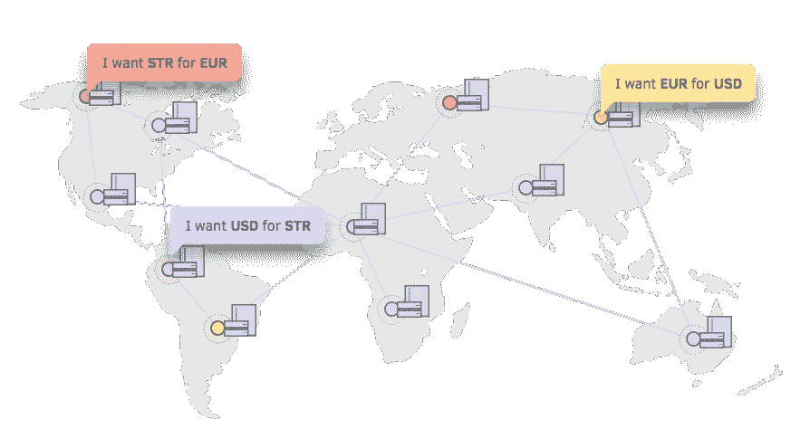
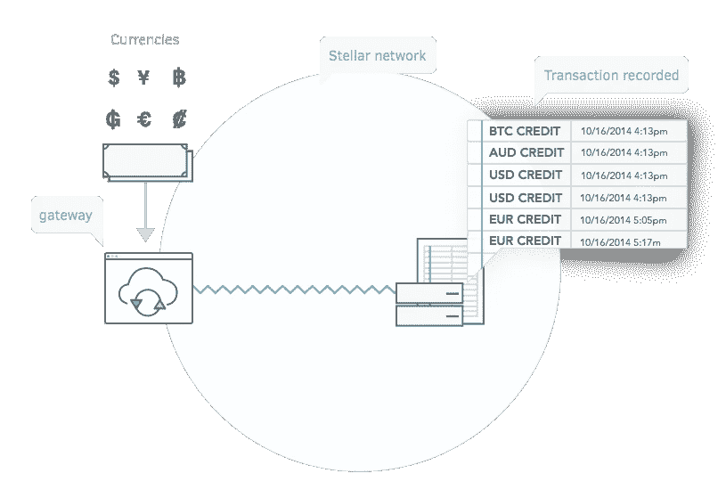
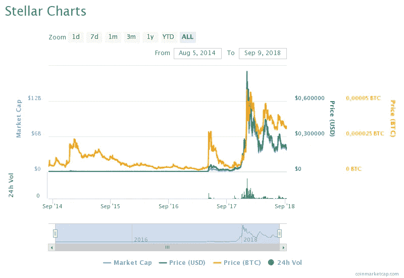
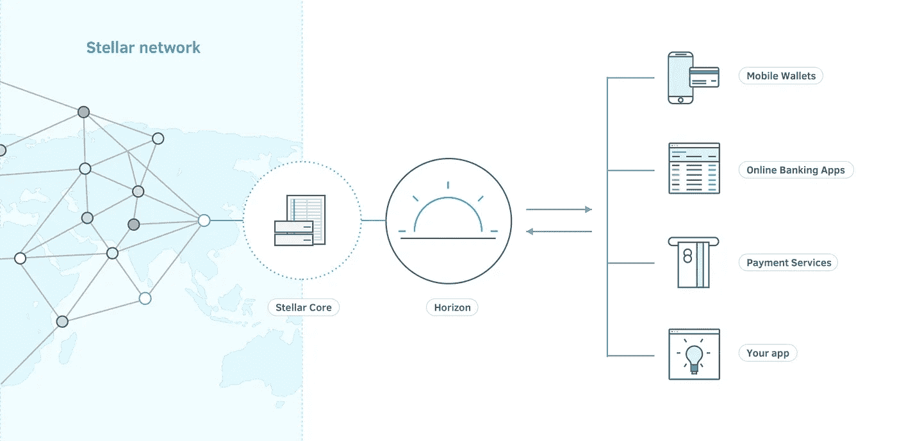

# 用 Stellar 构建金融系统——最终创建实际经济活动的应用。

> 原文：<https://medium.com/hackernoon/building-financial-systems-with-stellar-513a6a43dda2>

让我们回到过去……现在是 2018 年 1 月——在 2017 年神秘而热情的结束之后，我们满怀希望地跨入了新的一年。不管有些人飞到了多少个卫星，我们都被带回了地球——着陆一点也不温柔。

reddit.com/r/bitcoin /u/trance929

现在差不多 8 个月过去了，我们仍然深陷熊市。硬币热已经停止，社区的观点也发生了变化。我们现在更加谨慎——人们不再相信空洞的承诺。他们想看到的是具有真实用例的工作产品。

虽然痛苦，但这一熊市可能是加密货币新时代的开始。我们将最终拥有技术和解决方案，而不是投机性的玩具，让公司重新发明做生意的核心方式。

支付是业务支柱之一，而 Stellar 可能是推动他们走向未来的东西。

# 但是恒星到底是什么？

Stellar 是一个开源的分散协议，用于数字货币到法定货币的转移，允许任何货币之间的交易。它是由 Mt. Gox 的创始人和 Ripple 的联合创始人——杰德·麦卡勒(Jed McCaleb)发起的。Stellar 是与独角兽金融科技初创公司 Stripe 合作创建的，后者获得了 Stellar 300 万美元的种子资金。

假设你有美元，你想换成欧元。你可以在传统的货币兑换点进行交易，在这个过程中会损失(大量)金钱和时间。你也可以使用 Stellar 和它的分散兑换系统，它会自动为你的货币对找到最便宜的可能的汇率。

[https://www.stellar.org/how-it-works/stellar-basics/#how-it-works](https://www.stellar.org/how-it-works/stellar-basics/#how-it-works)

# 这种魔力是如何实现的呢？

Stellar 基本上是一个分散在世界各地的服务器网络。这些服务器记录了恒星网络上发生的每一笔交易。他们中的每一个人都持有所有交易的完整副本。所有这些数据形成了分布式账本——恒星网络在给定时间的状态，服务器充当验证器。

任何实体都可以启动自己的服务器，服务器越多，网络就越独立。这使得 Stellar(和许多其他区块链项目)避免了单点故障缺陷。当一台服务器出现故障时，[网络](https://hackernoon.com/tagged/network)继续照常工作——这与传统的银行系统不同，因为它们的一些部分是整个系统工作所必需的——这些部分的故障意味着中断。

当涉及到交易时，没有矿工像比特币那样浪费多年的精力——验证是以不同的方式实现的。Stellar 提出的方案叫做 Stellar 共识协议。

## 共识

[https://www.stellar.org/how-it-works/stellar-basics/explainers/#Consensus](https://www.stellar.org/how-it-works/stellar-basics/explainers/#Consensus)

恒星网络上的所有验证者定期就新的交易分类账达成一致——这就是我们所说的共识。每个验证器都创建它们自己信任的验证器列表——也称为它们的仲裁片。这些片一起形成网络范围的仲裁。这有助于 Stellar 保持分散——没有形成可信验证者列表的中央实体。在网络范围的法定人数就分类帐的某个版本达成一致意见后，就达成了共识。

因为不需要解决复杂的密码难题，并且交易在投票过程中得到验证，Stellar 能够实现大约 3 到 5 秒的交易时间。点击阅读更多关于共识[的信息。](/a-stellar-journey/on-worldwide-consensus-359e9eb3e949)

## 分布式交换

[https://www.stellar.org/how-it-works/stellar-basics/explainers/#DistributedExchange](https://www.stellar.org/how-it-works/stellar-basics/explainers/#DistributedExchange)

由于分布式交换，Stellar 能够实现其作为通用支付系统的功能。分类账存储用户发出的买入或卖出指令——这种报价是公开承诺将一种资产换成另一种资产。资产交换的汇率是预先确定的，每种货币对都有自己的订单簿。

*但是如果我想把 BTC 换成委内瑞拉玻利瓦尔而订单是空的怎么办？！*

Stellar 支持多币种交易。网络将自动为给定交易找到最佳汇率。这可以通过不同货币对之间的一系列交易来实现。

> 如果买卖报价之间没有明确的关系，Stellar 会尝试从网络中寻找报价，这将导致从欧元到美元的一连串转换。例如，欧元对澳元，澳元对 BTC，BTC 对瑞士法郎，瑞士法郎对美元。

## 恒星锚

[https://www.stellar.org/how-it-works/stellar-basics/explainers/#Anchors](https://www.stellar.org/how-it-works/stellar-basics/explainers/#anchors)

Stellar 允许其用户使用如此多的交易对，这要归功于被称为锚的可信实体。锚就像不同货币和星形网络之间的连接。

用户向锚定器存款，作为回报，锚定器以信用的形式发行相同数量的钱。这种信用随后被分配到 Stellar 网络中的用户账户。用户可以将发出的信用回馈给主播触发提现——星美网用户之间几乎所有的交易都是信用交换。

## 恒星流明

除了所有不同的货币，Stellar Network 还有一种本地加密货币，叫做 lumen(XLM)。流明是恒星网络的重要组成部分，它们充当反垃圾邮件工具。每笔交易只需要很少的费用，并且 Stellar 网络上的每个账户都必须满足最低 XLM 余额标准才能保持活跃。这使得在网络上执行 DoS 攻击变得更加困难。此外，如果两种货币之间没有直接联系，流明可能会作为所需资产之间的桥梁，有效地使交易成为可能。

XLM price chart

# 听起来不错…好得难以置信？

一个几乎免费使用的支付网络听起来的确很吸引人，但 Stellar 也不是完美无缺的。

因为没有区块挖掘奖励，相比比特币或以太坊之类的加密货币，网络验证者更少。缺乏成为验证者的动机可能会破坏网络的稳定。

[https://www.stellar.org/how-it-works/stellar-basics/explainers/](https://www.stellar.org/how-it-works/stellar-basics/explainers/)

另一个不利之处是，恒星网络需要主播来实现其核心功能，而一个愿意成为主播的机构必须克服许多障碍。首先也是最重要的是，用户需要用自己的钱来信任主播。没有信任，没有人会为了信用而存款，没有信用，就没有网络。锚基本上成为一个金融实体——这自动涉及许多责任以及监管和法律相关的工作——这意味着锚最有可能是有执照的货币服务提供商，可能很难说服这样的机构使用 Stellar。

到目前为止，可伸缩性也是一个主要问题。虽然速度仍然比比特币快得多，但在每秒交易数量方面，Stellar 还无法与 Visa 等传统支付方式相比。

# 让 Stellar 适合您的业务

成熟的公司已经在恒星网络上建立服务。我相信你们有些人听说过德勤吧？他们是其中之一。

Stellar network 是一个开源项目，您可能需要将其与您的业务集成的所有软件都获得了 Apache 许可证 2.0 版的许可，并且对 Stellar network 的任何商业使用都没有限制。然而，你需要的是一个开发团队，他们将创建你的解决方案并将其与 Stellar 网络集成——这个过程不应该需要超过 200 个小时的开发时间(根据 Stellar.org)。

为了支持这一过程，官方发布了 REST API——Horizon，以及允许您连接到 Horizon 的 JavaScript、Java 和 Go SDKs。这个社区还维护着更多语言版本的 SDK。

[https://www.stellar.org/developers/guides/get-started/](https://www.stellar.org/developers/guides/get-started/)

大多数应用程序将使用 Horizon API 与 Stellar 进行交互，它提供了简单易用的方式来提交交易、检查账户和执行其他频繁的任务。它可以很容易地与 cURL 或 web 浏览器等工具一起使用。Stellar Core 是网络的主干——这是执行验证的地方。与 Core 的其他实例一起，它对网络上的事务状态达成一致。

Stellar 提供了详细的文档，可以帮助您迈出开发的第一步——从[初学者指南](https://www.stellar.org/developers/guides/get-started/)开始，然后从这里开始。

# 这值得吗？

Stellar 还没有被大规模采用——但对于每个区块链和加密货币相关的项目来说都是如此。截至目前，它提供了便宜且易于集成的支付解决方案——其中便宜的部分非常重要，尤其是对较小的初创公司而言。

> 传统费用可能超过交易价值的 3%。对于 Stellar，0.01 美元的费用将满足约 60 万笔交易。

从技术上讲，接受任何货币支付的能力至关重要，因为它独自将我们的服务推向了新的市场——这是传统支付提供商无法保证的。

Stellar 开启了对创业者和用户同样有用的新的可能性。然而，它需要的是更多的采用，所以问自己一个问题——这种支付系统对你的企业成长有益吗？

在写这篇文章的时候，我和团队在 [upnext.io](https://upnext.io/) 合作！