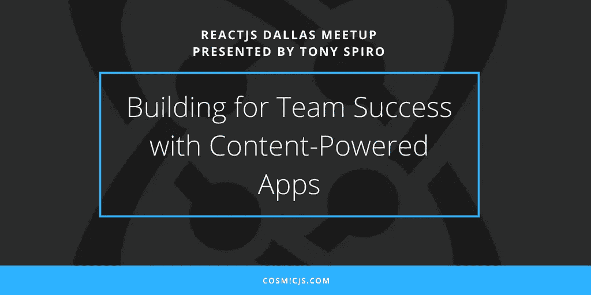

# 利用内容驱动的应用程序打造团队成功

> 原文：<https://medium.com/hackernoon/building-for-team-success-with-content-powered-apps-e6a1b94e3fcf>

应用程序开发有一个强大的趋势。这是一个从构建和管理应用服务到利用 API 来提供重点应用服务的转变。 [Cosmic JS](https://cosmicjs.com) 将这一授权概念应用于数据和文件管理，并允许跨职能团队一起更快地构建高质量的应用程序。为了进一步说明这一点，[Cosmic JS 的联合创始人兼首席执行官托尼·斯皮罗](https://cosmicjs.com/tony)在 2018 年 5 月 8 日星期二的 [React JS Dallas Meetup](https://www.meetup.com/ReactJS-Dallas/) 上发表了“用内容驱动的应用程序打造团队成功”。

React JS Dallas 是一个创新的前端开发团队，由企业内部开发人员、Dev Bootcamp 系统的社区领导者以及自由职业者、代理开发人员和技术布道者组成。在组织者 [Mike Mathew](https://twitter.com/drumsensei?lang=en) 的带领下，总部位于达拉斯的 React 开发负责人和 [Call-Em-All](https://twitter.com/CallEmAll) 的技术总监，会议在[Pearl Technology Holdings](http://www.pearlsolutions.com/)举行，来自 [DevMountain](https://devmountain.com/) 和 [Cosmic JS](https://cosmicjs.com/) 的演讲嘉宾出席了会议。完整的视频嵌在下面，大约 43 分钟。

## 利用内容驱动的应用程序打造团队成功

**TL；博士:**

*   托尼·斯皮罗是谁？
*   对于构建基于内容的应用的团队来说,“旧的工作流程”是什么样的？支付网关、电子邮件平台和内容管理领域的云/ API 微服务转变
*   Cosmic JS 演示:从 Cosmic JS CLI 安装 GraphQL / React 博客
*   Cosmic JS 演示:首次推出具有动态内容变化的新增强现实应用程序

我希望你已经发现这个事件回顾信息丰富，并启发激活本地 JavaScript 和反应自己的社区。要了解我们如何建立自己的开发者和编辑社区，合作开发更快的应用程序，请访问 [Cosmic JS](https://cosmicjs.com) 并注册免费试用。

如果你对 Cosmic JS 系统的特性有任何问题或意见，我很乐意倾听。你可以参考我的 [Cosmic JS 个人资料](https://cosmicjs.com/carsongibbons)来获取更多关于如何直观地导航 Cosmic JS 仪表盘的内容。