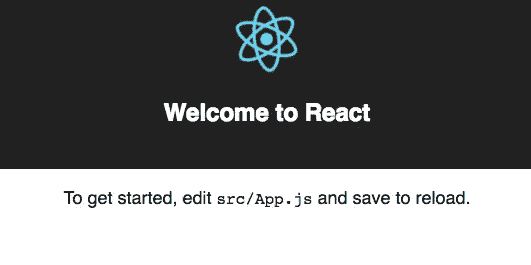
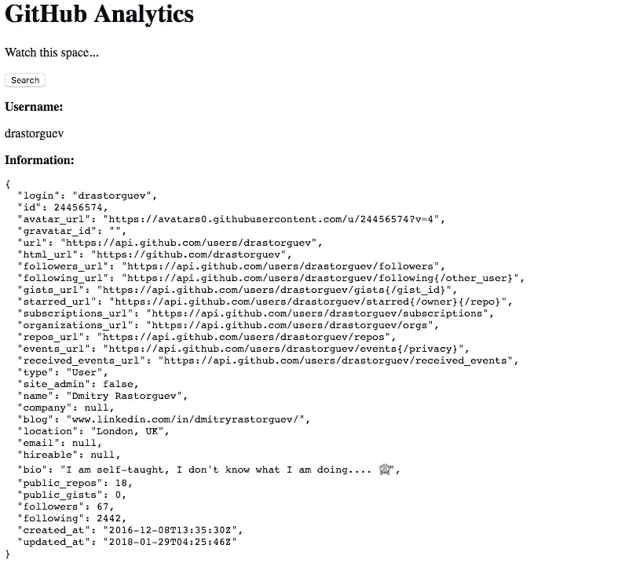
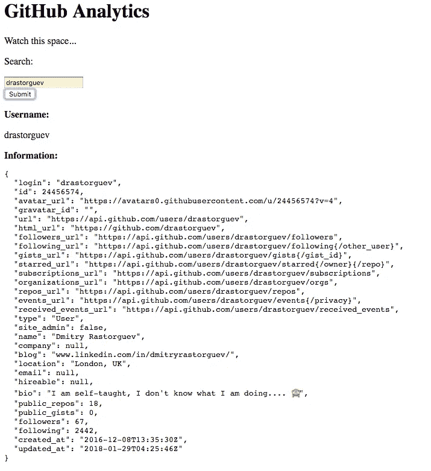

# 使用 React 构建 GitHub 概要分析||第 1 部分

> 原文：<https://medium.com/hackernoon/building-github-profile-analytics-using-react-part-1-37e03b0c3366>

这是一篇逐步介绍如何使用 [React](https://hackernoon.com/tagged/react) 为 [GitHub](https://hackernoon.com/tagged/github) 概要文件构建一个**基本**分析工具的文章。重点是快速实现功能，因此最终结果确实需要进一步的代码重构和样式化。文章由两部分组成([第 1 部分](/@dmitryrastorguev/building-github-profile-analytics-using-react-part-1-37e03b0c3366)、[第 2 部分](/@dmitryrastorguev/building-github-profile-analytics-using-react-part-2-bc1adc640e25))，基于下面的 [GitHub](https://github.com/drastorguev/github-analytics-react) 库。也是在这个[网站](http://github-analytics-react.s3-website.eu-west-2.amazonaws.com/)托管的。请注意，存储库和网站都将超越这两篇文章。

开始加载 create-react-app(假设已经安装了 npm 和 create react app)

`create-react-app github_analytics`

一旦完成，用`cd github_analytics`改变目录并输入`npm start`来检查一切是否正常。您应该会在浏览器中看到以下页面。



首先删除以下文件:`logo.svg`、`index.css`、`App.css`。将`App.js`名称改为`App.jsx`(别忘了它在`App.test.jsx`和`index.js`中的导入)。也偶然其内容为如下:

```
import React, { Component } from 'react';class App extends Component {
  render() {
    return (
      <div className="App">
        <header className="App-header">
          <h1 className="App-title">GitHub Analytics</h1>
        </header>
        <p className="App-intro">
          Watch this space...
        </p>
      </div>
    );
  }
}export default App;
```

在`src`中创建子文件夹`components`。在这里，我们创建第一个组件`Button.jsx`,如下所示:

```
import React from 'react';const Button = (props) => {
    return (
        <button className='button' onClick={()=>{props.handleClick()}}>Search</button>
    )
  };export default Button;
```

将`App.jsx`调整到以下位置:

```
import React, { Component } from 'react';
import Button from './components/Button.jsx';class App extends Component {
  constructor() {
    super();
    this.handleClick = this.handleClick.bind(this)
  }handleClick(e) {
    alert("The button was clicked");
  }render() {
    return (
      <div className="App">
        <header className="App-header">
          <h1 className="App-title">GitHub Analytics</h1>
        </header>
        <p className="App-intro">
          Watch this space...
        </p>
        <Button handleClick={this.handleClick}/>
      </div>
    );
  }
}export default App;
```

当按下`Search`按钮时，这将导致`The button was clicked!`报警。

接下来我们需要运行`npm install axios -save`。这将安装 axios，它允许发出 HTTP 请求。安装后，`App.jsx`需要更改为:

```
import React, { Component } from 'react';
import Button from './components/Button.jsx';
import axios from 'axios';class App extends Component {
  constructor() {
    super();
    this.state = {
      username: 'No username',
      info: ''
    }
    this.handleClick = this.handleClick.bind(this)
  }handleClick(e) {
    axios.get('[https://api.github.com/users/drastorguev'](https://api.github.com/users/drastorguev'))
    .then(response => this.setState({
      username: response.data.login,
      info : JSON.stringify(response.data, undefined, 2)
    }));
  }render() {
    return (
      <div className="App">
        <header className="App-header">
          <h1 className="App-title">GitHub Analytics</h1>
        </header>
        <p className="App-intro">
          Watch this space...
        </p>
        <Button handleClick={this.handleClick}/>
        <p><b>Username:</b></p>
        <p>{this.state.username}</p>
        <b>Information:</b>
        <pre>{this.state.info}</pre>
      </div>
    );
  }
}export default App;
```

这导致我的 GitHub 帐户的数据被自动收集。



最后，我们将用一个表单替换`Search`按钮，允许用户通过用户名搜索 GitHub。为此，我们首先需要创建`Form.jsx`组件。

```
import React from 'react';const Form = (props) => {
  return (<form onSubmit={(event) => props.handleUserFormSubmit(event)}>
      <label>
        <p>Search:</p>
        <input name="username"
        type="text"
        placeholder="GitHub username"
        required
        value={props.formData.username}
        onChange={props.handleFormChange}
      />
      </label>
      <div>
      <input
        type="submit"
        value="Submit"
      />
    </div>
    </form>)};export default Form;
```

同样，`App.jsx`也需要更换如下:

```
import React, { Component } from 'react';
import axios from 'axios';import Form from './components/Form.jsx';class App extends Component {
  constructor() {
    super();
    this.state = {
      gitun: 'No username',
      info: '',
      formData: {
        username: '',
      }
    }
    this.handleUserFormSubmit = this.handleUserFormSubmit.bind(this);
    this.handleFormChange= this.handleFormChange.bind(this);
  }handleUserFormSubmit(event) {
    event.preventDefault();
    axios.get('[https://api.github.com/users/'+this.state.formData.username](https://api.github.com/users/'+this.state.formData.username))
    .then(response => this.setState({
      gitun: response.data.login,
      info : JSON.stringify(response.data, undefined, 2)
    })).catch((err) => { console.log(err); });
  };handleFormChange(event) {
    const obj = this.state.formData;
    obj[event.target.name] = event.target.value;
    this.setState(obj);
  };render() {
    return (
      <div className="App">
        <header className="App-header">
          <h1 className="App-title">GitHub Analytics</h1>
        </header>
        <p className="App-intro">
          Watch this space...
        </p>
        <Form
          formData={this.state.formData}
          handleUserFormSubmit={this.handleUserFormSubmit}
          handleFormChange={this.handleFormChange}
        />
        <p><b>Username:</b></p>
        <p>{this.state.gitun}</p>
        <b>Information:</b>
        <pre>{this.state.info}</pre></div>
    );
  }
}export default App;
```

你的页面应该看起来像下面的截图。



我们现在能够从 GitHub API 请求任何数据，并在我们的网页上显示它。因此，[第一部](/@dmitryrastorguev/building-github-profile-analytics-using-react-part-1-37e03b0c3366)到此结束。在[第 2 部分](/@dmitryrastorguev/building-github-profile-analytics-using-react-part-2-bc1adc640e25)中，我们将添加 3 个不同的部分:基本信息、最受欢迎和星级回购列表，最后，分析用户自己的回购中最常见的语言，并为星级回购生成关键字。

请在 GitHub 的网站上随时关注这个项目的进展。

