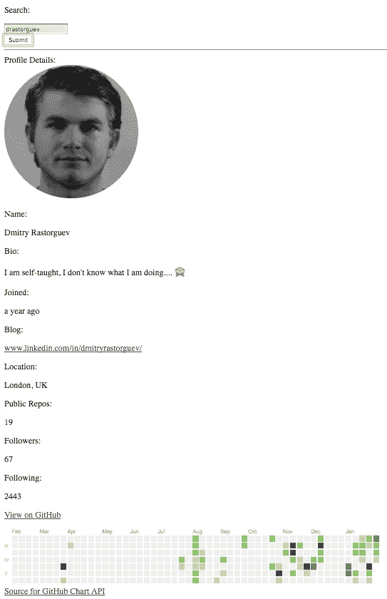
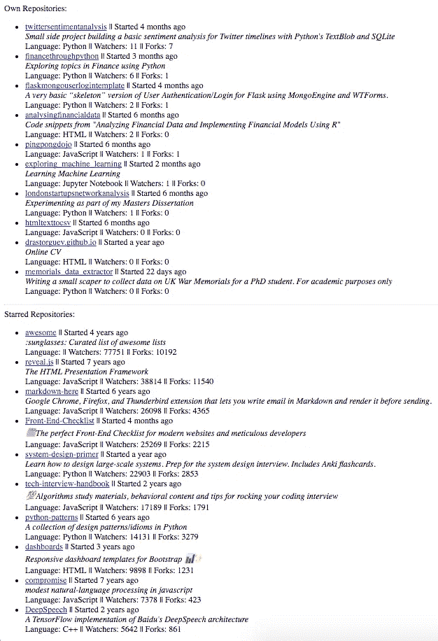
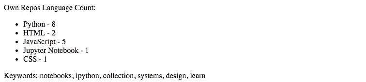

# 使用 React 构建 GitHub 概要分析||第 2 部分

> 原文：<https://medium.com/hackernoon/building-github-profile-analytics-using-react-part-2-bc1adc640e25>

这是一篇逐步介绍如何使用 [React](https://hackernoon.com/tagged/react) 为 [GitHub](https://hackernoon.com/tagged/github) 概要文件构建一个**基本**分析工具的文章。重点是快速实现功能，因此最终结果确实需要进一步的代码重构和样式化。文章由两部分组成([第 1 部分](/@dmitryrastorguev/building-github-profile-analytics-using-react-part-1-37e03b0c3366)、[第 2 部分](/@dmitryrastorguev/building-github-profile-analytics-using-react-part-2-bc1adc640e25))，基于下面的 [GitHub](https://github.com/drastorguev/github-analytics-react) 资源库。也是在这个[网站](http://github-analytics-react.s3-website.eu-west-2.amazonaws.com/)托管的。请注意，存储库和网站都将超越这两篇文章。

本文是第 1 部分的继续，在第 1 部分中，我们构建了一个基本页面，它能够接受用户输入，使用它从 GitHub 的 API 请求数据，然后在网页上显示收到的响应。

在这一部分中，我们将添加 3 个不同的部分:基本信息，最受欢迎和星级回购列表，最后，分析用户自己的回购最常见的语言，并生成星级回购的关键字。

让我们从运行`npm install --save moment react-moment`开始，这是调整其中一个变量的日期所必需的。接下来，我们需要用下面的代码创建一个名为`ProfileDetails.jsx`的新组件:

```
import React from 'react';
import Moment from 'react-moment';const imgStye = {
  borderRadius: "50%",
  width: "250px",
  height: "250px"
};const ProfileDetails = (props) => {
    return (
      <div>
        <div>
          {props.infoclean.avatar_url ?
             : null }
        </div>
        <div>
          {props.infoclean.name ? <div><p>Name:</p><p>{props.infoclean.name}</p></div> : null }
        </div>
        <div>
          {props.infoclean.bio ? <div><p>Bio:</p><p>{props.infoclean.bio}</p></div> : null }
        </div>
        <div>
          {props.infoclean.created_at ? <div><p>Joined:</p><p>{
          <Moment from={new Date()}>{props.infoclean.created_at}</Moment>}</p></div> : null }
        </div>
        <div>
          {props.infoclean.blog ? <div><p>Blog:</p><p><a href={
             props.infoclean.blog.search("http") !== -1 ? props.infoclean.blog
            : "http://" +  props.infoclean.blog } target="_blank">{props.infoclean.blog}</a></p></div> : null }
        </div>
        <div>
          {props.infoclean.location ? <div><p>Location:</p><p>{props.infoclean.location}</p></div> : null }
        </div>
        <div>
          {props.infoclean.company ? <div><p>Company:</p><p>{props.infoclean.company}</p></div> : null }
        </div>
        <div>
          {props.infoclean.public_repos ? <div><p>Public Repos:</p><p>{props.infoclean.public_repos}</p></div> : null }
        </div>
        <div>
          {props.infoclean.followers ? <div><p>Followers:</p><p>{props.infoclean.followers}</p></div> : null }
        </div>
        <div>
          {props.infoclean.following ? <div><p>Following:</p><p>{props.infoclean.following}</p></div> : null }
        </div>
        <div>
          {props.infoclean.html_url ? <div><p><a href={props.infoclean.html_url} target="_blank">View on GitHub</a></p></div> : null }
        </div>
        <div>
          {props.infoclean.login ? <div>{ 
        }<br/><a href="[https://ghchart.rshah.org/](https://ghchart.rshah.org/)" target="_blank">Source for GitHub Chart API</a></div> : null }
        </div>
      </div>
    )};export default ProfileDetails;
```

同样，`App.jsx`号也需要进口做相应的改动。

```
import React, { Component } from 'react';
import axios from 'axios';import Form from './components/Form.jsx';
import ProfileDetails from './components/ProfileDetails.jsx';class App extends Component {
  constructor() {
    super();
    this.state = {
      gitun: 'No username',
      infoclean : '',
      formData: {
        username: '',
      },}
    this.handleUserFormSubmit = this.handleUserFormSubmit.bind(this);
    this.handleFormChange= this.handleFormChange.bind(this);
  }handleUserFormSubmit(event) {
    event.preventDefault();
       axios.get('[https://api.github.com/users/'+this.state.formData.username](https://api.github.com/users/'+this.state.formData.username))
    .then(response => this.setState({
      gitun: response.data.login,
      infoclean: response.data,
    })).catch((err) => { console.log(err); });
  };handleFormChange(event) {
    const obj = this.state.formData;
    obj[event.target.name] = event.target.value;
    this.setState(obj);
  };render() {
    return (
      <div className="App">
        <header className="App-header">
          <h1 className="App-title">GitHub Analytics</h1>
        </header>
        <p className="App-intro">
          Watch this space...
        </p>
        <hr></hr>
        <Form
          formData={this.state.formData}
          handleUserFormSubmit={this.handleUserFormSubmit}
          handleFormChange={this.handleFormChange}
        />
        <hr></hr>
        Profile Details:
        <ProfileDetails infoclean={this.state.infoclean}/></div>
    );
  }
}export default App;
```

这些变化使我们能够将侧写的各种数据点整合在一起。例如姓名、简历、位置、转发次数、关注者和其他信息。总的来说，这个部分看起来像这样。



现在，我们将开始处理自有和星级存储库的列表。为此，我们首先创建一个名为`SortedList.jsx`的新组件:

```
import React from 'react';
import Moment from 'react-moment';const SortedList = (props) => {
  if (props.repitems) {
    return (
        <ul>
          {props.repitems.map((repitem) =>
            <li key={repitem.id}>
              <div>
                <div>
                  <a href={repitem.html_url} target="_blank">{repitem.name}</a> || Started <Moment from={new Date()}>{repitem.created_at}</Moment>
                </div>
                <div>
                  <i>{repitem.description}</i>
                </div>
                <div>
                 Language: {repitem.language} || Watchers: {repitem.watchers_count} || Forks: {repitem.forks_count}
                </div>
              </div>
            </li>
          )}
        </ul>
      )
  } else { return null;}
  };export default SortedList;
```

然后我们相应地更新`App.jsx`:

```
import React, { Component } from 'react';
import axios from 'axios';import Form from './components/Form.jsx';
import SortedList from './components/SortedList.jsx';
import ProfileDetails from './components/ProfileDetails.jsx';class App extends Component {
  constructor() {
    super();
    this.state = {
      gitun: 'No username',
      infoclean : '',
      formData: {
        username: '',
      },
      repitems: null,
      staritems: null,}
    this.handleUserFormSubmit = this.handleUserFormSubmit.bind(this);
    this.handleFormChange= this.handleFormChange.bind(this);
  }handleUserFormSubmit(event) {
    event.preventDefault();
    axios.get('[https://api.github.com/users/'+this.state.formData.username](https://api.github.com/users/'+this.state.formData.username))
    .then(response => this.setState({
      gitun: response.data.login,
      infoclean: response.data,
    })).catch((err) => { console.log(err); });axios.get('[https://api.github.com/users/'+this.state.formData.username+'/repos'](https://api.github.com/users/'+this.state.formData.username+'/repos'))
    .then(response => this.setState({
      repitems : response.data
      .filter(({fork}) => fork === false)
      .sort((b, a) => (a.watchers_count + a.forks_count) - (b.watchers_count + b.forks_count)).slice(0,10)
      })).catch((err) => { console.log(err); });axios.get('[https://api.github.com/users/'+this.state.formData.username+'/starred'](https://api.github.com/users/'+this.state.formData.username+'/starred'))
    .then(response => this.setState({
      staritems : response.data
      .filter(({fork}) => fork === false)
      .sort((b, a) => (a.watchers_count + a.forks_count) - (b.watchers_count + b.forks_count)).slice(0,10)
    })).catch((err) => { console.log(err); });
  };handleFormChange(event) {
    const obj = this.state.formData;
    obj[event.target.name] = event.target.value;
    this.setState(obj);
  };render() {
    return (
      <div className="App">
        <header className="App-header">
          <h1 className="App-title">GitHub Analytics</h1>
        </header>
        <p className="App-intro">
          Watch this space...
        </p>
        <hr></hr>
        <Form
          formData={this.state.formData}
          handleUserFormSubmit={this.handleUserFormSubmit}
          handleFormChange={this.handleFormChange}
        />
        <hr></hr>
        Profile Details:
        <ProfileDetails infoclean={this.state.infoclean}/>
        <hr></hr>
        Own Repositories:
        <SortedList repitems={this.state.repitems}/>
        <hr></hr>
        Starred Repositories:
        <SortedList repitems={this.state.staritems}/></div>
    );
  }
}export default App;
```

该页面现在应该能够显示每个存储库列表的项目:



最后，我们可以对接收到的存储库信息进行一些基本分析。例如，对于用户自己的资料库，我们将计算每种编程语言的资料库数量。这将是每个用户最喜欢的语言的指示。类似地，我们将提取标有星号的存储库的描述，并生成一个关键字列表，指明首选主题。该主题建模过程将使用[潜在狄利克雷分配](https://github.com/primaryobjects/lda)来完成。

让我们从运行`npm install lda --save`开始，它将安装所需的包。为了允许构建过程发生，我们需要将`node_modules`中的`lda`文件夹移动到`src`文件夹中。结果，`lda`的新路径变成了`src/lda`。这也允许我们将`lda`导入到`App.jsx`中。

接下来，我们需要创建一个新的`LanguageList.jsx`组件。

```
import React from 'react';const LanguageList = (props) => {
  if (props.langslist) {
    return (
        <ul>
          {Object.entries(props.langslist).map(([key,value]) =>
            <li key={key}>
              {key} - {value}
            </li>
          )}
        </ul>
      )
  } else { return null;}
  };export default LanguageList;
```

最后，我们可以更新`App.jsx`如下:

```
import React, { Component } from 'react';
import axios from 'axios';import Form from './components/Form.jsx';
import SortedList from './components/SortedList.jsx';
import ProfileDetails from './components/ProfileDetails.jsx';
import LanguageList from './components/LanguageList.jsx';import lda from './lda';class App extends Component {
  constructor() {
    super();
    this.state = {
      gitun: 'No username',
      infoclean : '',
      info: '',
      formData: {
        username: '',
      },
      repitems: null,
      staritems: null,
      replanguagecount: {},
      keywords: null
      ]}
    this.handleUserFormSubmit = this.handleUserFormSubmit.bind(this);
    this.handleFormChange= this.handleFormChange.bind(this);
  }handleUserFormSubmit(event) {
    event.preventDefault();
    axios.get('[https://api.github.com/users/'+this.state.formData.username](https://api.github.com/users/'+this.state.formData.username))
    .then(response => this.setState({
      gitun: response.data.login,
      infoclean: response.data,
      info : JSON.stringify(response.data, undefined, 2)
    })).catch((err) => { console.log(err); });axios.get('[https://api.github.com/users/'+this.state.formData.username+'/repos'](https://api.github.com/users/'+this.state.formData.username+'/repos'))
    .then(response => {var itemsWithFalseForks = response.data.filter(item => item.fork === false)var sortedItems = itemsWithFalseForks.sort((b,a) => {
        if((a.watchers_count +  a.forks_count) < (b.forks_count + b.watchers_count)){
          return -1
        }else if ((a.watchers_count +  a.forks_count) > (b.forks_count + b.watchers_count)){
          return 1
        }else {
          return 0
        }
      })let dictrlc = Object.assign({}, this.state.replanguagecount);
      for (var i = 0; i < itemsWithFalseForks.length; i++) {
          dictrlc[itemsWithFalseForks[i]['language']] = -~ dictrlc[itemsWithFalseForks[i]['language']]
      }this.setState({
        repitems: sortedItems.slice(0,10),
        replanguagecount: dictrlc,
      })}).catch((err) => { console.log(err); })axios.get('[https://api.github.com/users/'+this.state.formData.username+'/starred'](https://api.github.com/users/'+this.state.formData.username+'/starred'))
    .then(response => {var itemsWithFalseForks = response.data.filter(item => item.fork === false)var sortedItems = itemsWithFalseForks.sort((b,a) => {
        if((a.watchers_count +  a.forks_count) < (b.forks_count + b.watchers_count)){
          return -1
        }else if ((a.watchers_count +  a.forks_count) > (b.forks_count + b.watchers_count)){
          return 1
        }else {
          return 0
        }
      })var documents = []
      for (var i = 0; i < response.data.length; i++) {
          var descr = response.data[i]['description']
          if (descr != null) {
            var newtext = descr.match(/[^.!?]+[.!?]+/g)
            if (newtext != null) {
              documents = documents.concat(newtext)
            }
          }
      }
      var result = lda(documents, 3, 3);
      var keywords = new Set()
      for (var k = 0; k < 3; k++) {
        for (var j = 0; j < 3; j++) {
          keywords = keywords.add(result[k][j]['term']);
        }
      }this.setState({
        staritems: sortedItems.slice(0,10),
        keywords: Array.from(keywords).join(', ')
      })}).catch((err) => { console.log(err); })};handleFormChange(event) {
    const obj = this.state.formData;
    obj[event.target.name] = event.target.value;
    this.setState(obj);
  };render() {
    return (
      <div className="App">
        <header className="App-header">
          <h1 className="App-title">GitHub Analytics</h1>
        </header>
        <p className="App-intro">
          Watch this space...
        </p>
        <hr></hr>
        <Form
          formData={this.state.formData}
          handleUserFormSubmit={this.handleUserFormSubmit}
          handleFormChange={this.handleFormChange}
        />
        <hr></hr>
        Profile Details:
        <ProfileDetails infoclean={this.state.infoclean}/>
        <hr></hr>
        Own Repositories:
        <SortedList repitems={this.state.repitems}/>
        <hr></hr>
        Starred Repositories:
        <SortedList repitems={this.state.staritems}/>
        <hr></hr>
        Own Repos Language Count:
        <LanguageList langslist={this.state.replanguagecount}/>
         Keywords:  {this.state.keywords}
      </div>
    );
  }
}
```

为确保 GitHub 图表也可见，将`ProfileDetails.jsx`更改为以下内容:

```
import React from 'react';
import Moment from 'react-moment';const imgStye = {
  borderRadius: "50%",
  width: "250px",
  height: "250px"
};const ProfileDetails = (props) => {
    return (
      <div>
        <div>
          {props.infoclean.avatar_url ?
             : null }
        </div>
        <div>
          {props.infoclean.name ? <div><p>Name:</p><p>{props.infoclean.name}</p></div> : null }
        </div>
        <div>
          {props.infoclean.bio ? <div><p>Bio:</p><p>{props.infoclean.bio}</p></div> : null }
        </div>
        <div>
          {props.infoclean.created_at ? <div><p>Joined:</p><p>{
          <Moment from={new Date()}>{props.infoclean.created_at}</Moment>}</p></div> : null }
        </div>
        <div>
          {props.infoclean.blog ? <div><p>Blog:</p><p><a href={
             props.infoclean.blog.search("http") !== -1 ? props.infoclean.blog
            : "http://" +  props.infoclean.blog } target="_blank">{props.infoclean.blog}</a></p></div> : null }
        </div>
        <div>
          {props.infoclean.location ? <div><p>Location:</p><p>{props.infoclean.location}</p></div> : null }
        </div>
        <div>
          {props.infoclean.company ? <div><p>Company:</p><p>{props.infoclean.company}</p></div> : null }
        </div>
        <div>
          {props.infoclean.public_repos ? <div><p>Public Repos:</p><p>{props.infoclean.public_repos}</p></div> : null }
        </div>
        <div>
          {props.infoclean.followers ? <div><p>Followers:</p><p>{props.infoclean.followers}</p></div> : null }
        </div>
        <div>
          {props.infoclean.following ? <div><p>Following:</p><p>{props.infoclean.following}</p></div> : null }
        </div>
        <div>
          {props.infoclean.html_url ? <div><p><a href={props.infoclean.html_url} target="_blank">View on GitHub</a></p></div> : null }
        </div>
        <div>
          {props.infoclean.login ? <div>{ 
        }<br/><a href="[https://ghchart.rshah.org/](https://ghchart.rshah.org/)" target="_blank">Source for GitHub Chart API</a></div> : null }
        </div>
      </div>
    )};export default ProfileDetails;
```

因此，这为我的 [GitHub 概要文件](https://github.com/drastorguev)产生了以下输出。



这个项目中进一步改进的机会包括添加样式、代码重构和测试。

请随时在 GitHub 和它的网站上跟踪这个项目的进展。

