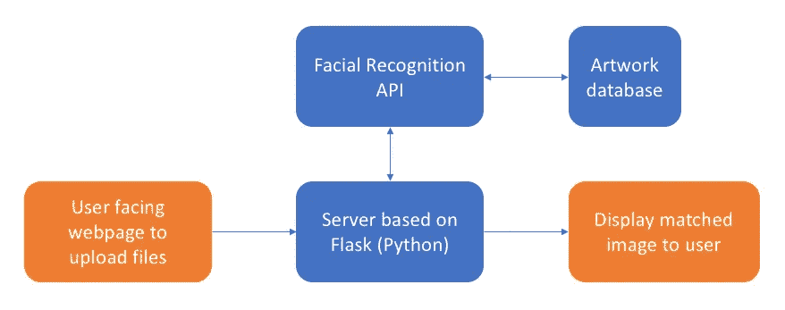
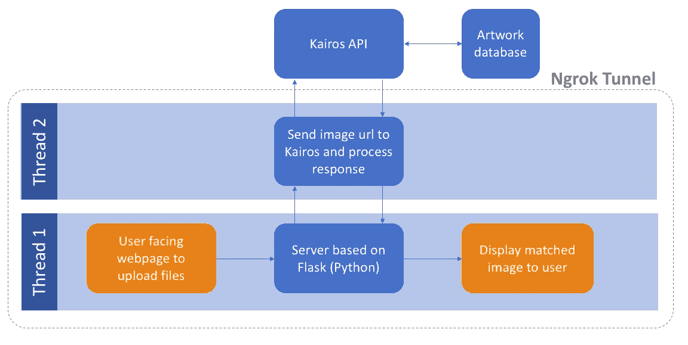
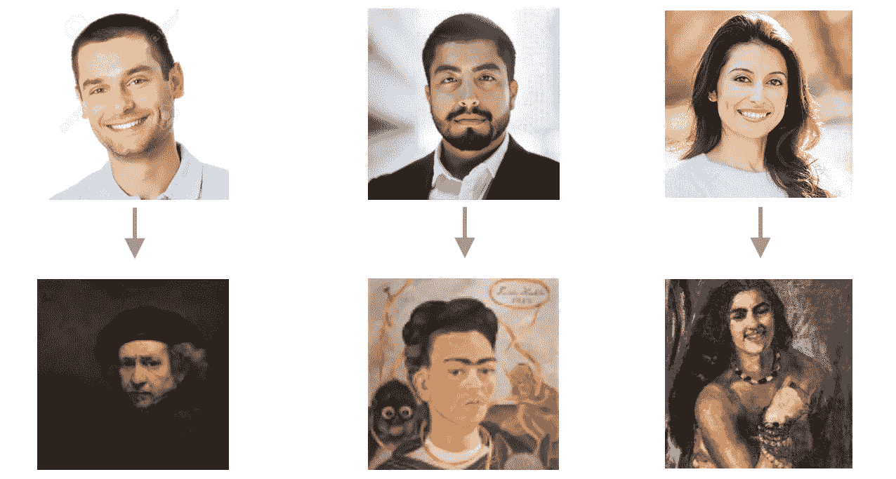

# 构建谷歌的艺术和文化肖像匹配器

> 原文：<https://medium.com/hackernoon/building-googles-art-and-culture-portrait-matcher-8abc040e9a10>

当我兴奋的室友第一次向我展示肖像搜索功能时，我对结果感到惊讶(有点被侮辱)。对于那些不熟悉它的人来说，谷歌艺术与文化中的这一功能允许你在谷歌的数字化艺术收藏中找到与你提交的自拍相似的面孔。

对我来说，这是真正可怕的作品:


Apparently my 17th century doppelgänger

多亏了大量可用的开源工具和库，在一个下午的时间里就可以创造出一些不那么不可思议但有点实用的东西。

## 粗略的计划



首先，找到一些面部识别即服务。辉煌的 [Kairos](https://www.kairos.com) 提供了一个免费且令人不安的 API，一旦输入一个图片的 url，它就会提供大量信息:


Generic input image

```
**Returned JSON data (some image info removed for length)**
{"images":
  [{"faces":
    [{"attributes":
      {"age":40,
      "asian":0.00539,
      "black":0.00032,
      "gender":{
        "femaleConfidence":0.00002
        "maleConfidence":0.99998,
        "type":"M"},
      "glasses":"None",
      "hispanic":0.04204,
      "lips":"Apart",
      "other":0.01249,
      "white":0.93976}    
    }]
  }]
}
```

**Kairos** 还允许将带标签的图像*注册*到数据库中，当未加标签的图像传递给 API 时，它会返回数据库中*最相似图像*的标签。

虽然这是为了识别以前已经注册过的人，但它可以非常尊重地执行艺术识别任务(当它的相似性阈值设置得足够低时)。

为了找到合适的图片来注册，我挖掘了我正在尝试模仿的服务，从[谷歌艺术和文化](https://www.google.com/culturalinstitute/beta/)网站抓取艺术品的 URL。如果我要在这方面投入超过四个小时，我可能会花时间给每件艺术品贴上一个唯一的 id，这个 id 与图像、艺术品名称和艺术家的数据库相关联，以提供全面而轻松的用户体验。

但我不是。

所以每幅作品的标签只是它的 url，所以用户可以被重定向到他们匹配的作品。

```
from flask import Flask, redirect#Some function here, get a suitable image url as label
    return redirect(label)
```

## 服务器和主机

**Flask** 提供了一个简单的选项，在使用 python 处理图像 IO 和处理的同时向用户提供网页。不想花太多时间在主机上，我只是在本地运行网站。

Kairos 需要一个公共图像 url 作为其输入，因此为了在本地网络之外公开我的站点，Ngrok 提供了一个到我的本地主机的安全通道。

下一个挑战是处理用户输入和 API 响应，同时继续为用户提供站点服务。为了处理异步事件，可以使用**线程**库来分离两个进程。



最后，是时候把朋友、家人以及一些普通人的自拍照上传到网站上了，结果如下所示！



Results from my site — Successfully matches sex & ethnicity