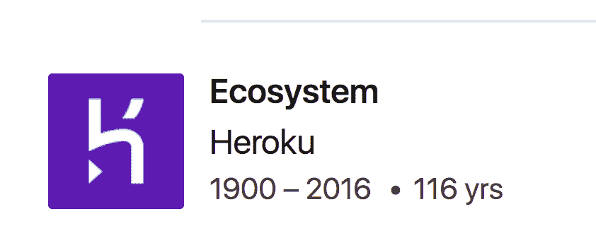
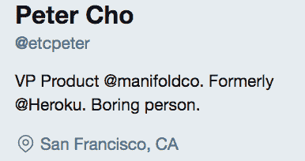

# 用多种方式打造优秀产品

> 原文：<https://medium.com/hackernoon/building-great-products-with-manifold-2753a07c2345>

## **产品开发面试**

> *揭秘:* [开发者集市流形](https://goo.gl/BtueKD) *，之前赞助过黑客正午。* [使用 code HACKERNOON2018 获得任何服务 10 美元优惠。](https://goo.gl/BtueKD)

如果你错过了，一定要看看我上个季度对他们的采访，[构建第一个独立的开发者服务市场](https://hackernoon.com/building-the-first-independent-marketplace-for-developer-services-830bad14228e)。今天，我们将与 Manifold 的产品副总裁 Peter Cho[一起探讨是什么造就了伟大的产品。我们还讨论是什么让无聊的人变得无聊，产品集成，以及活到 100 多岁是什么感觉。](https://www.linkedin.com/in/petercho/)

大卫:在你的 LinkedIn 个人资料上，显示你从 1900 年到 2016 年在 Heroku 工作。你认为你做那份工作太久了吗？

彼得:我们这些从事技术工作的人喜欢寻找新的挑战和学习新的东西。这种文化的副产品是，我们中的许多人每 1-2 年就会交换角色、公司或职业，而不是真正深入地学习一些东西(我对此绝对感到内疚)。我们中的许多人都在这个循环中，我们往返于每一家主要的科技公司，或者在我们特定领域的顶尖公司之间循环，有时甚至会回到第二轮。(我已经离开了乔布斯，在我工作的最后一天，他们会眨眨眼，说“如果你决定飞去来往往，我们会在这里..”).

这样做的好处是，你可以在行业中获得一些令人敬畏的交叉授粉，在非常短的周期内传播新的想法和流程。从个人角度来看，如果做得正确，你也可以大大加快你的职业发展。也就是说，真正掌握一些东西需要时间，尽管我不认为我们会回到在公司(如 IBM、GE 等)做“终身从业者”的状态，但我认为我们需要找到一种快乐的媒介，让人们在 5-10 年内找到职业成就感，即使是在一家快速发展的技术公司。我认为，随着我们开始投资深度技术，如机器人、生物技术、人工智能/人工智能，这一点尤其正确。

不过说真的，我在 LinkedIn 上放了 116 年来摆脱招聘人员。自从我暴露自己是一个吸血鬼，他们不再滑入我的 DMs。

**是什么造就了伟大的产品？**

一个伟大的产品是一个能实现对用户承诺的产品。每种产品都承诺某种东西，无论是 iMac、一支 Mac 口红、一辆 Mack 卡车，还是房地美支持的抵押贷款。它承诺让你的生活更轻松，承诺让你有某种感觉，也许它承诺提供营养。糟糕的产品不会实现它们的承诺，它们可能是设计糟糕的笔记本电脑，运行很热，风扇很响，经常关机，很难登录 Reddit。劣质产品让你燃起希望，粉碎你的梦想。

人们喜欢说“哦，伟大的产品将改变你的生活”和“它们必须是世界级的”，但我不认为每个产品都必须这样才能成为“世界级的”。你知道，我不指望我的客厅地毯能改变我的生活。但是我买的时候说只要你给我提供点隔音效果，好看又不掉毛，你在我的书里就是很棒的。我有[瓶辣酱](https://www.elyucateco.com/)，承诺让我的嘴着火，他们做得令人钦佩。那些也是很棒的产品。

**通过******，你可以将各种服务添加到你的栈中(Bonsai Elasticsearch、Mailgun、LogDNA、** [**等)。**](https://www.manifold.co/services) **)。您如何让在 Manifold 中使用第三方产品成为无缝体验？****

**关于今天的开发人员，让我震惊的一件事是他们的耐心。每次他们需要一项新服务时，他们都会查看谷歌、Quora、Stack Overflow、StackShare，不可避免地要花费更多的时间进行研究。我对此绝对有罪。当我在 Heroku 部署我的第一个应用程序时，我花了更多的时间来比较 Mandrill 和 Mailgun，而不是选择我的全科医生，那个对我的实际健康负责的人。**

**一旦我们找到了适合我们的服务，我们就创建一个帐户，设置一个计费配置文件，找到并阅读相关文档，安装正确的客户端库，然后返回 Stack Overflow 来解决问题。老实说，这要求不高。你想要一个 MySQL 数据库？别担心，我知道了，一小时后回来。哦，等等，你想要电子邮件？..还有监控？雷迪斯？Elasticsearch？RabbitMQ？Memcache？伐木？这些都是用哪张信用卡支付的？弗兰基周五就要走了，这些账户中哪些是他名下的？我们的信用卡过期了？抱歉，但是我辞职了。**

**另一方面，你最终会被锁定在一个大盒子云中，满足于一堆白标服务。听着，我们想吃可可泡芙，不是 CVS 巧克力味的玉米粒。我们想要一个大盒子的便利，可以自由选择一流的开发人员服务。有了 Manifold，您可以使用一个帐户、一张信用卡，在几秒钟内提供上述任何服务。您想要一个可以与团队共享的 Redis 数据库吗？两次点击。你想用它搭配 Laravel，Terraform，还是 Kubernetes？我们抓住你了。**

****你是如何成为 Manifold 产品副总裁的，为什么？****

**他们向我保证，这不是因为我是团队中最差的程序员，而是我认为他们只是出于好意。**

**在[总管](https://goo.gl/BtueKD)之前，我在经营 Heroku 的元素市场。当我在那里的时候，给我印象最深的是早期的*和*的感觉。尽管这个行业现在感觉很大，但有太多方面的发展是不必要的痛苦，许多人认为 AWS 已经赢了。我在 Heroku 看到的是，仍然有一个巨大的机会来授权和培养下一代 Twilios、MongoDBs 和新遗迹，希望防止未来的 Parse 或 RethinkDB 再次发生。今天的云是一个非常大的冰山的一角，有数百名企业家愿意并且能够创造下一代的开发者工具和服务，只是他们还不知道而已。**

****你的产品性能 KPI 是什么？你是怎么选择他们的？您曾经认为哪些 KPI，*它们可能很重要，*但它们并不重要？****

**目前，我们真正关注的是入职，因此漏斗指标是重中之重。有百分之多少的人在注册？在这些人中，有多少人验证、开始创建资源、完成创建资源并登录到他们的控制面板？我们决心提高这些转化率指标。诚然，这不是一个迷人的答案，但我们正试图在胡思乱想之前遵守基本原则。**

**在此之前，我们有一个很长的虚荣心指标列表，比如用户数量、浏览量等，这些指标看起来不错，但并不能帮助我们了解我们的业务。我们是一个小的、过度杠杆化的团队，所以优先级是关键。我们决定，我们需要做一件事，把它做好，并创造一个强参与的集中培养皿。(强投入的专注培养皿其实是我高中乐队的名字)。你可以有一个真正成功的产品搜索发布，并产生大量用户，但如果他们只是注册并离开，他们不会提供太多的价值。我可能不会邀请这些人参加我的婚礼。**

****您能分享一些关于 Manifold 目前使用情况的数据吗？****

**大卫，我是完全透明的超级粉丝，很乐意向你展示我们所有的使用数据，但不幸的是，我们已经达到了 Mode Analytics 订阅的最大用户数。**

**也就是说，我最喜欢的数字是 32，这是在提供了第一个资源之后，又回来使用第二个资源的用户的百分比。这是一个我们正在继续改进的数字，我喜欢它，因为它显示了我们在构建一个引人注目、有粘性的产品方面取得的进展。**

****您的日常工作应用程序使用情况如何？你如何在这些应用程序中最大化你的时间？****

**我 90%的时间都在 Google Hangouts，另外 10%是 Trello、GitHub 和 Slack 的混合体(巧合的是，这些%s 也准确地反映了我的笔记本电脑 CPU 和 RAM 的使用情况)。**

**由于我们是一个分布在旧金山、多伦多、汉密尔顿、纽约、丹佛、哈利法克斯、弗雷德里克顿和比利时的团队，我们非常依赖支持远程工作的工具。我们每天的大部分时间都是在空闲时进行的，我们使用 Hangouts 来协调、启动和计划，其副产品最终会出现在 GitHub 和 Trello 的工程华夫饼板和产品路线图板上。**

**尽管我*对远程工作应用的现状相当*满意，但我们非常缺乏的一件事是建立友情和创造自发的饮水时刻的能力。我一直在推动我们整合像《守望先锋》和《英雄联盟》这样的应用来对抗这种情况，但显然这些不被认为是“工作应用”。**

****这些产品的功能变化是高质量产品开发的一个例子吗？****

**我最近最喜欢的新功能是 Slack 上的共享频道功能。这不是马上就能看出来的事情，但在我过去的几个角色中，这一直是我的一大痛点。当我在 Heroku 的时候，我们与脸书合作集成 Parse。我必须创建一个新的独立 Slack 实例，并邀请所有相关人员加入。然后在 Manifold，在我们最初的十几个集成中，我们一直在创建一次性的嘉宾频道并邀请用户，但这只是增加了很多开销。(可以邀请这个人吗？你能为这个实例创建一个新帐户吗？)能够创建一个频道，并使用相同的帐户信息进行分享，这令人惊叹，他们做到了真正的无缝。**

****在建筑流形中，什么特征让你感到惊讶并带来高客户价值？什么功能让你惊讶客户价值低？****

**我之前提到过，我们非常关注入职培训。最让我吃惊的一件事是，你认为很明显的事情，对你的用户来说通常不是那么明显。提供最大价值的东西是那些推动你的用户更好地理解你的产品的小事，我们通常认为这是理所当然的。我们花了几天的时间来编写和重写所有这些惊人的副本，然后意识到用户正在被“资源”是什么所困扰。“资源”是一种我们发明的东西，它是您提供的服务的一个实例。然而，如果没有上下文，用户在我们的测试中会感到困惑，这时我们意识到我们要么停止创造词汇，要么我们需要花更多的时间来提供教育和上下文。理想情况下，两者兼而有之。**

**同样，我们将花费数周或数月来构建一些“改变游戏规则”的功能，但想当然地认为用户可能不理解或不同意该功能实际上是多么具有革命性。投资于小事情，确保你自己的偏见和观点不会蒙蔽你与用户的关系，这是一个“duh it sense in retrospect”的教训，比我希望的更经常发生，但让我们保持谦虚。**

****根据** [**你的推特简历**](https://twitter.com/etcpeter) **，你形容自己是“一个无聊的人”你能分享一下你今天做的无聊到有趣的事吗？****

****

**我的团队对我这个问题的第一稿答案的回复是“你听起来像个爸爸”。这可能足以解释我的推特简历了。**

**我想说的是，除了 KPI、日常工具或不朽的天赋之外，决定你是否会创造一个伟大产品的最重要的因素是你是否有一个伟大的团队。如果没有我们才华横溢的产品管理二人组 [Ming](https://twitter.com/its__ming) 和 [Sitara](https://twitter.com/sitara_ramesh) ，或者被称为 [Meg](https://twitter.com/megthesmith) 和 [Nick](https://twitter.com/ntassone) 的设计大师，我将一事无成。没有他们，我会变成一个可悲的空壳人。此外，如果没有我们的营销项目经理玛格丽特·麦卡菲，这次采访就不可能进行。如果我们是诚实的，我只是流形的产品傀儡。因此，无聊的人。**

****用流形搭建的最酷的新项目是什么？****

**[歧管](https://goo.gl/BtueKD)！我们现在正在进行的最有趣的项目之一是弄清楚如何用流形来构建流形。我们将会写一篇博文，讲述我们是如何做到这一点的，以及我们如何在内部使用 Kubernetes，所以请务必关注我们的博客[！](https://blog.manifold.co/)**