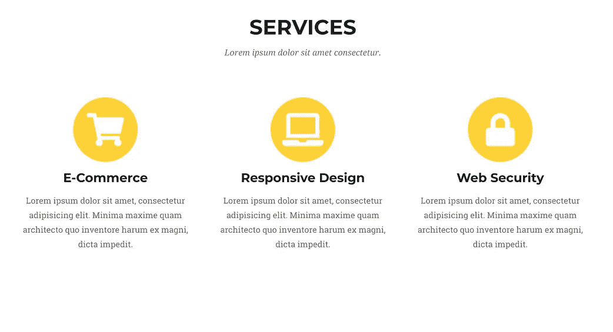
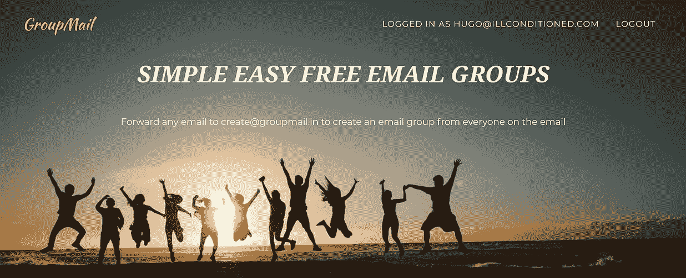
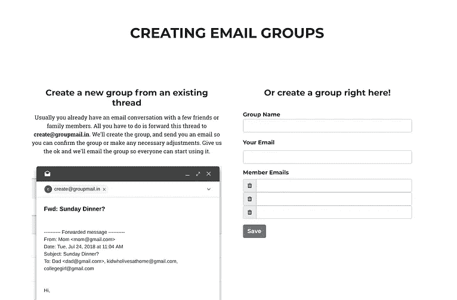
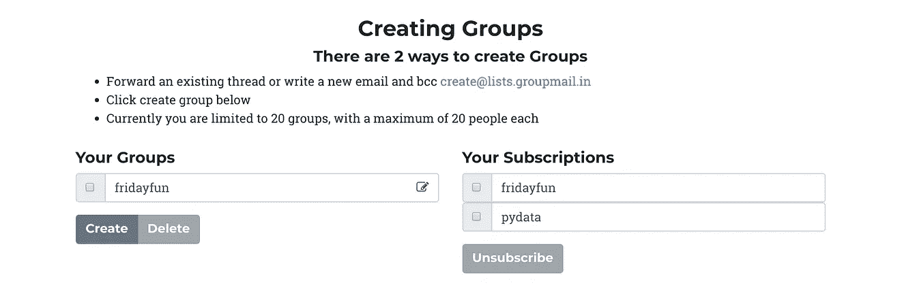
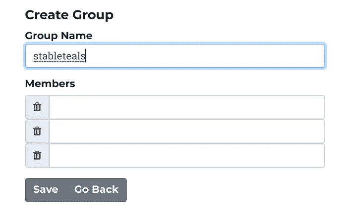

# 构建群组邮件，一种群组邮件服务

> 原文：<https://medium.com/hackernoon/building-groupmail-a-group-email-service-fa8ce4a17fc3>

# 概述

我最近辞去了对冲基金的工作，去追求创业。我的假设是，从长远来看，创业优于高薪工作，在创业时，通过选择保守(简单)的问题，并在商业问题上运用理性思维和创造力，可以最大限度地降低失败的风险。我开始记录我的成功和失败[这里](/@hhuuggoo/entrepreneurship-vs-quantitative-finance-an-experiment-be4fdc05fd8d)，这是第二条。它将涵盖创意形成、货币化，以及我在构建产品时所做的技术和设计选择。

# 思维能力

我为 8 个朋友租了[这个 Airbnb](https://www.airbnb.com/rooms/25910563) 。Airbnb 想要我同伴的电子邮件地址，以便他们转发行程。输入一个地址没问题，8 个地址太多了，所以像大多数程序员一样，我写了一个程序来解决这个小问题。

## 竞争格局

现在有很多方法可以解决这个问题。我指的是“处理与一群人的电子邮件交流”

1.  回复-全部。你可以在邮件中输入多个地址。这基本上行得通，尤其是 gmail 的自动完成功能非常好。不幸的是，有时人们会忘记点击回复全部(回复只发给一个人)。没有一种好的方法可以将确认邮件转发给同一组人(不需要重新输入所有这些地址)。
2.  邮件客户端电子邮件组—几乎所有客户端都有客户端电子邮件组。这些是化名；你输入一个地址，它代表多个人。但是其他人不能发送到您的群。
3.  谷歌集团，雅虎集团(和其他类似的东西)。这些都很好，但它们更复杂，它们是为创建人们可以随时加入和离开的群组而优化的(想想开源邮件列表，而不是周四晚上和你一起出去的朋友)。还有一些规模较小的竞争对手，它们功能相似，但可能更好( [Gaggle Mail](https://gaggle.email/) 和 [eMailDoDo](https://www.emaildodo.com/) )

我相信，通过让电子邮件群像选项 1 一样易于使用，人们会开始在更多的地方使用电子邮件群。

**货币化**

如果我能赚钱的话，这只能算作一个生意。我想到了两种可能的方法——付费版本(更多群组，更大的群组)或广告。这项服务是对现有解决方案(免费)的逐步改进，所以我之前认为很难收费。电子邮件广告让你每发送 1000 封邮件得到 5 美元(或者每打开 1000 封邮件得到 15 美元)。邮件列表邮件应该有相当高的打开率(在这种情况下，它是由你的朋友发送的)。如果我能从一项构建如此简单的服务中每月赚取 2000 美元，那么(假设 80%的打开率)每月需要发送 166，000 封电子邮件，我会相当高兴——这并不荒谬。

这个想法的一个缺点是，它不是对现有工具的巨大改进——我通常更喜欢有紧急客户需求的业务——但它很容易组装(1.5 周的开发时间),我个人使用它，所以我愿意尝试一下。还有一个我喜欢的病毒成分。我相信被添加的群成员会添加他们的朋友，它会传播开来。

# 构建产品

这一部分有点技术性(但没有代码片段)。如果技术内容让你厌烦，你现在可以停止阅读。

## 登录页面

我做的第一件事是拼凑一个登陆页面。我不擅长设计——我只是需要一些看起来既专业又有趣的东西。我去了这个免费(和付费)主题的[页面](https://startbootstrap.com/)，选择了这个。对于像我这样的人来说，使用一个主题(或者雇佣一个设计师)绝对是最好的方式，有太多的设计细节让我在尝试自己做的时候出错。我唯一的抱怨是，大多数主题往往过于具体，当你试图将它们用于其他内容时，看起来很奇怪。

在这里，它被改编为[群发邮件](https://www.groupmail.in)。我去 [pexels 拍了一些免版税的照片](https://www.pexels.com/)，选择了一个快乐的海滩场景。

## 证明

传统的基于口令的认证方案过于繁琐。我要求用户提供一个电子邮件地址，然后我给他们发送一个一次性登录链接(顺便说一下，这也是 Medium 的工作方式)。它还有一个额外的好处，注册新帐户和登录的流程是完全一样的。

## Web 用户界面

Web App for GroupMail

我用 Vue.js 拼凑了一个 web 界面。我最初开始使用 React，后来因为两个原因放弃了它

1.  如果您还没有使用 node，Vue.js 可以更容易地集成到现有的应用程序中。您只需要包含一个指向 Vue.js CDN 的链接，就可以开始编写普通的 Javascript 了。使用 React，你必须学习 ES6 和 JSX(好吧，你不必学，但网上所有的例子都使用 ES6 和 JSX，所以如果你想阅读它们，你需要学习)。即使您很擅长 ES6 和 JSX，构建链也不会产生带有源代码映射的未简化的 js 文件，所以要调试它，您必须运行一个调试服务器，然后当您部署时，您的 web 服务器必须在调试服务器和生产构建之间切换。
2.  对我来说，简单的 HTML 模板比 JSX 更容易理解。

[GroupMail](https://www.groupmail.in) 的 web 应用部分很简单。我不清楚 Vue.js 的模板是否足够灵活，可以生成更复杂的 web 应用程序而不会变得太混乱。如果我曾经构建另一个足够复杂的客户端 web 应用程序，我可能会发现，但现在 Vue.js 很棒，React 太难了。

## 电子邮件

web 界面是创建电子邮件组的第二种方式。创建群的最简单方法是转发电子邮件。如果您将电子邮件转发到 [create@groupmail.in](mailto:create@groupmail.in) ，我们会将电子邮件的主题转换为群名称，并将电子邮件中引用的所有电子邮件地址添加到群中。每当我在 create@groupmail.in 收到一封电子邮件时，我的电子邮件服务提供商就会用一些关于即将到来的事件的元数据来点击我的一个 webhook。我解析创建电子邮件，然后我向群创建者发送一条消息，其中包含一个链接，以便他们可以确认群或编辑群。当它们完成时，我向原始线程发送一条欢迎消息。对该主题的后续回复使用新的电子邮件组。我学到了一些关于电子邮件的有趣的事情

1.  电子邮件很难解析。所有邮件客户端都将转发或回复邮件的标题表示为邮件正文中的一个 blob 并且它们的做法各不相同。我只是有时正确地解析它，当我失败时，我会求助于更笨的方法
2.  电子邮件有一个邮件 Id 标题。它们还有 In-Reply-To 或 X-Forwarded-Message-Id(这是另一个消息的消息 Id)。为了确保电子邮件被正确地线程化，我将我的回复设置为原始的(In-Reply-To 或 X-Forwarded-Message-ID)，因为那些指向已经在线程中的消息 ID。
3.  现在发送邮件比过去更难了。因为每个人都在大力打击垃圾邮件，所以很难让邮件客户端将你的邮件视为非垃圾邮件。这样做需要正确地设置一系列 DNS 配置(DMARC，SPF，DKIM ),这并不难，还需要为你的 IP 地址和域名建立信任(这是困难的部分)。因此，大多数人依赖第三方电子邮件服务提供商。我查了 Sendgrid，Mailgun 和邮戳。Sendgrid 无疑是最便宜的，但 gmail 一直将 Sendgrid 邮件标记为垃圾邮件。我没有花时间与客户支持合作来解决这个问题，我怀疑它本来可以很好。我本打算注册邮戳，但邮戳要求你注册一个非免费的电子邮件地址(当时我没有)，所以我用了 Mailgun。Mailgun 似乎工作得很好，我没有抱怨。

# 结论

我现在有一个功能组电子邮件服务。我经常为一些永久的团体(例如，我的家人)和一些一次性的团体(我和朋友去旅行)使用它。建设是容易的部分——获得用户并让他们赚钱是困难的部分——这是下一步。我的下一篇文章讲述了我是如何试图推广群发邮件，并在这个过程中让 T2 被禁止使用谷歌广告词

我过去的项目是关于简单易用的电子邮件群组的，以及获得开源项目的[帮助](https://www.opensourceanswers.com)。我目前的项目提供[云托管的 Jupyter 笔记本](https://www.saturncloud.io)