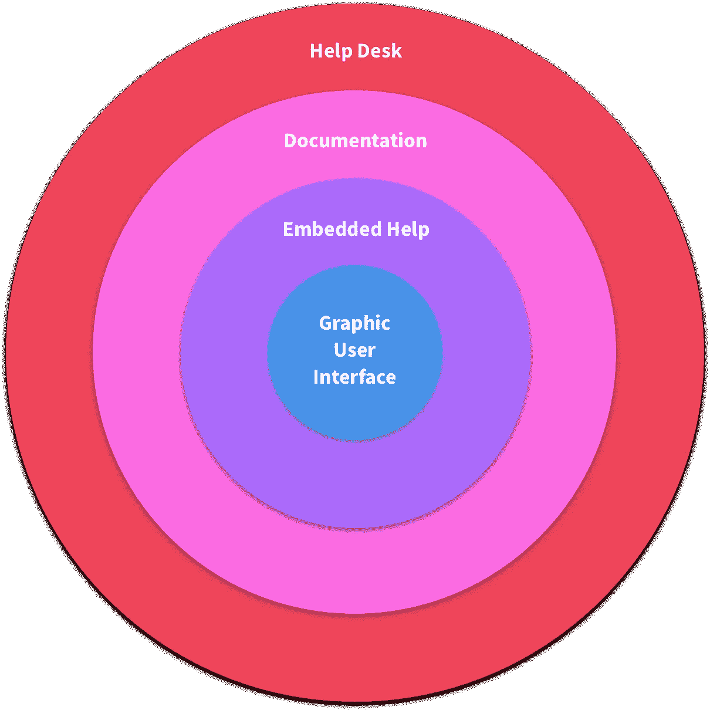
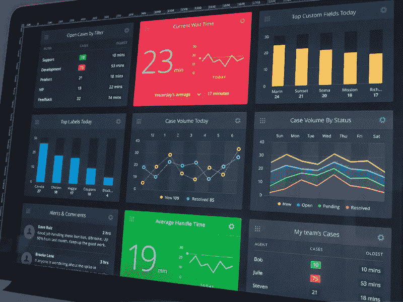
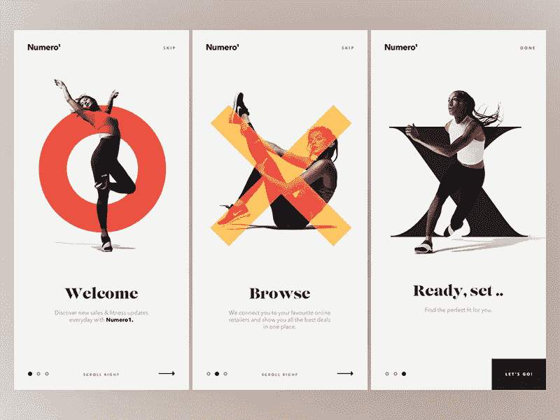
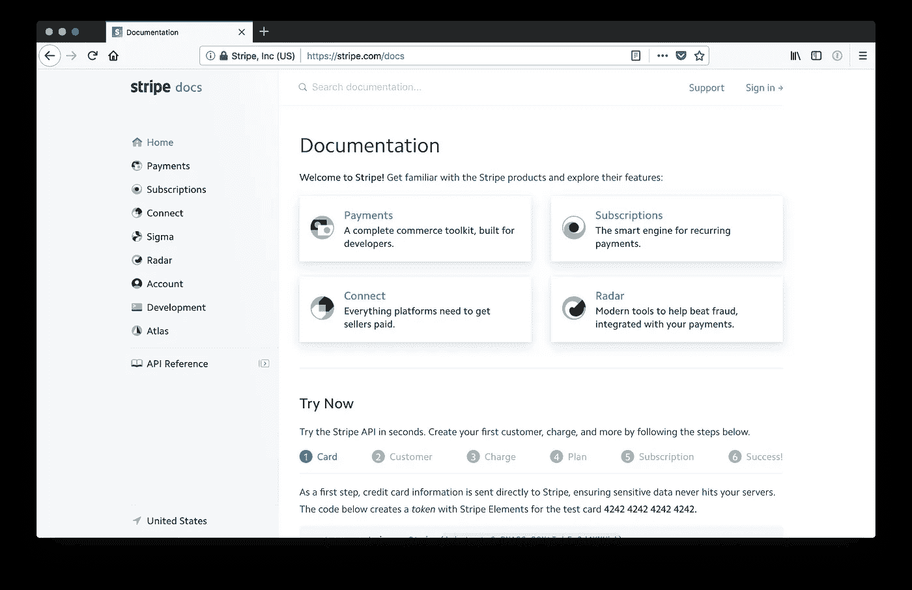
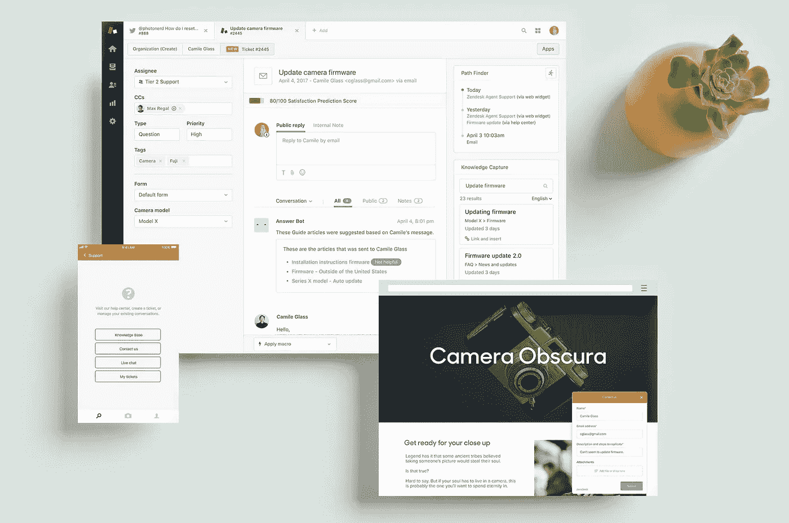

# 构建有用的用户体验

> 原文：<https://medium.com/hackernoon/building-helpful-user-experiences-cc58925a3b1b>

## 对软件支持生态系统的实际观察，它是产品不可或缺的一部分，并为用户的成功做好准备。

> 唯一“直观”的界面是奶嘴。之后就都学会了。

据说这是布鲁斯·埃迪格或者史蒂夫·乔布斯或者其他人说的。母乳喂养通常是一项痛苦的教学和学习技能。我强烈怀疑这个设计比喻的创始人对愤怒的婴儿或疲惫的母亲没有什么经验。

如果人类需要一个直接摆在他们面前的完美的食物来源来帮助他们生存…他们有多大机会能够直觉地管理他们在云中的相册共享偏好？零。几率为零。

作为寻求通过技术赋予人们权力的设计师和工程师，我们必须构建强大的系统，使他们能够理解和利用该技术。否则还有什么意义呢？

Expanding circles of support — The level of support as well as the cost and complexity increases as we approach the edge of a proposed software support ecosystem.

## 支持系统

用户会经历考虑、获取、质疑和理解一个产品的多个阶段。这些人从新手到经验丰富的超级用户，都在复杂的 [API](https://en.wikipedia.org/wiki/Application_programming_interface) 文档中挖掘。一个健壮的支持系统应该能够以一种有益的方式与这两种类型的用户以及介于两者之间的所有用户进行交流。

上图是一个概念性的支持生态系统。让我们分解它的各个部分，看看它们是如何协同工作的。(我们的示例系统是为了便于讨论。支持系统就像软件一样，在规模和复杂程度上各不相同。唯一确定的是中心的圆圈——即便如此，前提是我们不仅仅是在建造一个 [CLI](https://en.wikipedia.org/wiki/Command-line_interface) 。)

每个级别都有相应的费用和复杂性。一般来说，我们离中心越远，系统就越昂贵和复杂。

在支持用户实现其目标的关键任务中，应该考虑每种类型的帮助如何与其他类型的帮助相关联。以整体的方式设计系统，语言和交互设计的一致性，以及各层之间移动的便利性将使它成为我们产品中有价值的一部分，而不是一个令人困惑的项目工件的大杂烩。

Desk.com Dashboard concept by Dave Ruiz ([Link](https://dribbble.com/shots/1407112-Desk-com-Dashboard))

## 图形用户界面

除了命令行之外，图形用户界面(GUI)是帮助用户理解如何访问和利用我们软件提供的功能的第一层帮助。(在仪表板和商业智能工具的情况下，大部分界面可能是软件提供的功能。)

GUI 本身是一个[启示](https://www.merriam-webster.com/dictionary/affordance)或有用的环境提示的集合，向用户揭示他们的环境是如何被操纵的。应该有效地利用空间和对比来传达功能的层次和顺序。颜色和运动可以用来加强这种层次(但需要一只训练有素的手来避免简单的分散注意力)。布局应该引导眼睛。像链接和按钮这样的交互元素应该具有吸引力和响应性。

也许最重要的是，直接交流是在 GUI 中使用[符号](https://www.merriam-webster.com/dictionary/signifier)完成的，比如文字和图标。应该为我们的目标市场适当地标记元素。语言和语气应始终一致。文案应该在冗长和简洁之间取得平衡。不言而喻，对于错别字和语法错误的文案编辑应该优先考虑。

GUI 是帮助用户理解我们的软件能为他们做什么的基础。把事情做好是首要任务。它应该具有吸引力，并符合品牌、营销、收购、培训和入职流程设定的预期。

在这里，有必要说明一下我在职业生涯中遇到的一个长期存在的误区，即如果我们把 GUI 部分做得足够好，我们就可以忘记所有其他的东西。我认为对于任何功能和复杂性的软件来说，这都是无稽之谈。我认为它一直存在，因为如果它是真的就好了…

事实的核心是 GUI 只是更大的帮助系统的一部分。GUI 带来的更多负担意味着其他领域可能做得更少，但是平衡很重要。一个每时每刻都在解释一切的界面会很杂乱，很烦人。它在销售和营销过程中没有吸引力，超级用户会讨厌它。相反，过于稀疏的界面可能会演示得很好，并吸引高级用户，但有一个学习曲线，使得新用户无法跟上速度。这就是为什么从整体上来看我们软件帮助系统的用户体验很重要。

Onboarding Art Direction by Johan Adam Horn for MakeReign ([Link](https://dribbble.com/shots/3546996-Onboarding-Art-Direction))

## 嵌入式帮助

在这里，我们有了第一个令人谦卑的忠告:我们实际上可能无法设计出任何人都能拿起并使用的软件——嵌入式帮助。目前最受欢迎的形式似乎是*入职*对话或*飞溅*屏幕。如上图所示，这通常是一组简短的介绍性图片、gif 或视频，可以帮助初次使用者了解应用程序的基础知识。

嵌入式帮助还经常采用 GUI 增强的形式，例如覆盖有用的注释或工具提示。这些通常是隐藏的，但是可以在用户第一次遇到界面时自动触发，或者如果他们打开“帮助模式”，可能在需要时自动触发。或者，帮助模式可能是默认启用的，用户可以将其关闭。

构建和维护这样的东西不需要付出太多的努力，也不需要付出太多的努力。有设计和复制要考虑，但嵌入式帮助可能包含在与我们的 GUI 相同的技术堆栈中，并且可以使用相同的过程和资源来构建和发布，因为它是现有元素的扩展。

[Stripe.com/Docs](https://stripe.com/docs) screenshot (No affiliation)

## 证明文件

做软件的人都爱文档！开玩笑而已；没有人喜欢文档。用户除外。如果做得好，他们真的很喜欢。

文档的问题是，我们现在肯定是在我们的支持图形圈子之外。事情越来越难，越来越贵。

对有帮助的文档的挑战是普遍的和众所周知的。

*   需要懂软件的人来写。
*   需要懂市场的人来写。
*   但也许最令人困惑的是:文档需要以一种吸引人的方式编写，但在技术上要准确、有帮助，而不是居高临下。

用写得好的文档祝福软件公司。他们很少。

假设我们确实投入了时间、金钱和资源，并让我们的文档处于一个好的位置。好消息是，优秀的文档在不同方面都是有益的，所以我们一次又一次地收获我们的投资。

首先，我们应该从应用程序内部链接到我们的帮助文档。做到这一点的最好方法是直接链接到有帮助的主题。这可以用“你想知道更多吗？”内嵌工具提示末尾的链接。或者是特定于错误类型的错误页面上的建议阅读链接，或者是嵌入在更一般的错误上的文档搜索框。

文档的编写也可以着眼于培训和入职培训。文档片段可以重用来创建我们的闪屏，或者在实践培训课程中进行少量修改。

好的软件文档也可以成为内容营销活动和推销的明星。从主题内容的角度来看，利用一个健壮的文档站点来实现 SEO 目的是一件轻而易举的事情。好的医生应该在每一页上直接谈论如何解决市场的问题。

[Zendesk support site](https://www.zendesk.com/support/) imagery (No affiliation)

## 帮助台

这是一个大话题，我只是想顺便提一下。我的意思是，我将只从帮助台支持触及和影响我们更大的软件支持系统的角度来谈论它。支持本身的细微差别和逻辑远远超出了本文的范围。

所以我们圈子的最后一层毫无疑问是最复杂和最昂贵的，因为它涉及到真实的人与人之间的对话。这需要招聘、培训、人员、设施、通信后勤等等。(或者至少将上述所有工作外包出去——这是一门微妙的艺术。)但是我们如何将它整合到我们现有的结构中，以便用户可以在不同的层之间移动呢？

在我们的示例性支持结构中，用户通过一个表单将服务台票证提交到一个队列中，并让客户支持代表依次对它们进行响应。这一支持层的切入点在哪里？

一个入口点可以在我们软件中的任何错误页面上。这可以像一个链接一样简单，也可以像页面中嵌入的表单一样健壮。与有用的错误消息副本、任何相关文档的链接或文档搜索表单放在一起应该没有问题。

另一个服务台推广点可以放在我们营销网站的主页上。如果我的公司销售一款软件，很可能会有该软件的营销网站。该站点的支持和联系页面也是提供联系帮助台的链接的合适位置。

最后，我们真的为我们的支持感到自豪，并在这方面投入了大量资源。也许这是一个竞争优势，我们希望用户能够在任何可能的时候直接跳到它上面。我们可以在工作时间给我们的软件添加一个微妙的角落条纹，上面写着“支持在！”并带有一个专门帮助台页面的链接。(注意:这对高级用户来说可能会很烦人。一定要提供一个消除它的方法。)

## 没说的事情(相当多)

还有各种各样的支持选项，我甚至没有提到，如聊天机器人、聊天人、网络研讨会、服务状态页面、社交媒体渠道等等。服务支持行业是巨大的，每个市场中的每个软件产品都应该有一些不同的支持系统组合，它们和谐地一起工作，以帮助用户获得乐趣或更高效地使用我们的软件。

## 一锤定音

作为设计师和工程师，我们必须警惕自我陷阱，我们可以构建或设计如此宏大、如此有用、如此好的软件，以至于人类能够在没有帮助的情况下使用它。在没有介绍或解释各种理解的情况下把东西扔给用户是一个灾难或更糟的处方:一个什么都没有的处方。

大多数不能理解我们软件的用户不会告诉我们；他们就是不会用。他们会认为它坏了。他们会认为这是不好的。他们不会用我们努力提供的技术来增强自己的能力。没有帮助是不行的。

*韦德·梅雷迪思(Wade Meredith)从 2005 年开始从事设计、写作和编程工作。所有表达的意见都是他自己的，并不反映他的雇主、朋友、熟人或其他同事的意见。他的个人网站是***。**