# Building Layr:一个实验性的分散式云存储系统

> 原文：<https://medium.com/hackernoon/building-layr-an-experimental-decentralized-cloud-storage-system-be32e530fd8d>

## 证明可检索性、文件修复和智能合同支持的支付

## 序文

这是一个关于三个开发者如何受去中心化运动的启发，建立了一个实验性的去中心化的云存储系统的故事。我写这篇文章的目的不仅是解释我们面临的一些核心挑战以及我们如何解决它们，而是向读者介绍分散式云存储的总体问题空间。

我们的开发过程一直是迭代的。对于我们面临的每一个挑战，我们都遵循由研究、权衡分析、设计和实现阶段组成的系统方法。我在本文中描述的系统是我们第一次**整体迭代开发的最终结果。**

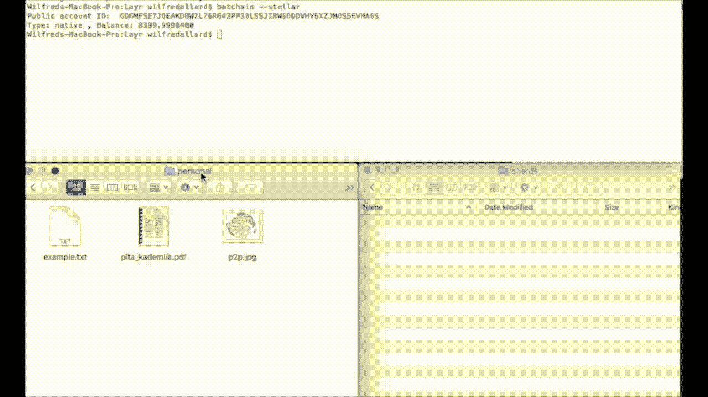

Demo of the Layr CLI

# 团队


取得联系:

*   [迪伦](https://dylankb.github.io/)
*   [佛罗伦萨](https://floalex.github.io/)
*   [Tannr](http://tannrallard.tech/)

说完这些，我们来谈谈云存储。

## 集中式云存储

毫无疑问，云存储很重要。它很方便，很划算，而且我们倾向于认为它是可靠和安全的。

我们都熟悉 DropBox、Google Drive 和亚马逊 S3。尽管这些提供者有很大的不同，但它们至少有一个共同点:它们都是集中式服务。

集中式服务是由一方控制所有状态变化的服务。把“状态”想象成实体存储的所有数据的集合。为了将文件上传到 Google Drive，用户请求 Google Drive 存储该文件。这取决于 Google Drive 是接受还是拒绝这一请求。如果他们拒绝了用户的请求，那么他们已经拒绝了用户所请求的状态改变。如果他们拒绝用户的请求，他们就不能从 Google Drive 服务的另一个提供商那里提出请求:只有一个提供商。

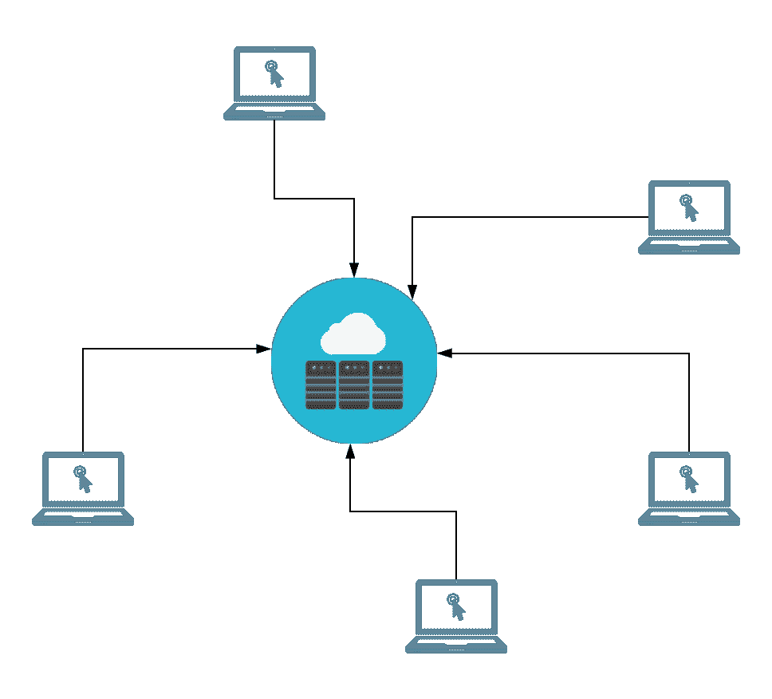

Centralized cloud storage

## 对集中式云存储的批评

对集中存储的批评比比皆是。当我们将数据存储在中央提供商处时，我们相信他们会是我们数据的好管家。他们控制着我们数据的变化。我们相信他们会保护我们的数据安全和隐私。我们也相信他们不会失去它。不管他们遵守什么样的道德规范，事实是他们可以随意使用我们的数据，为了他们自己的利益，以我们的隐私为代价。正是集中式服务的架构赋予了提供商这种能力。

最近，我们看到了马克·扎克伯格关于脸书使用和存储用户数据的方式的国会听证会。当参议员约翰·尼利·肯尼迪问他脸书是否“有权”访问用户的个人数据并与第三方分享时，扎克伯格回答说他们绝对没有权利。当肯尼迪参议员问脸书是否有能力访问和分享用户的私人数据时，扎克伯格回答说，他们“在理论上”有能力，但那将是“大规模的违反，所以[他们]永远不会这样做。”事实是，该系统的设计使提供商能够利用我们的数据做他们想做的事情，而信任他们保持道德是我们的责任。如果我们不需要信任提供商遵守他们的道德准则，那不是更好吗？

集中式服务也是寻求窃取数据的恶意方的热门目标。认为世界上所有最优秀、最聪明的人都在努力保护您的数据是天真的想法；双方都有最优秀最聪明的人，有些人正积极地寻求利用你。

并非所有存储系统都存在这些缺陷。有一类系统——分散式系统——旨在实现集中式系统无法实现的功能:提供可靠、安全、私密甚至匿名的服务，而不认为服务提供者是值得信赖的。尽管系统是由低信任度的参与者组成的，但用户可以普遍信任系统。

## 分散式云存储

分散式网络由许多进程、节点或对等体组成，它们都拥有本地状态，并将本地状态作为资源提供给网络上的其他对等体使用。整个网络的状态是所有这些本地状态的组合，许多对等体共享其部分资源的行为允许整体服务从大量相互作用的小块中出现(例如，许多对等体提供一小部分计算能力可以创建某种分散的超级计算机……这正是[假人项目](https://golem.network/home)所做的)。网络中的每个节点拥有一个单独的状态，并且是该状态的提供者。分散式服务是由独立的服务提供商网络构建而成的。

分散式系统的强大之处在于，没有供应商能控制网络中的所有状态。如果服务提供商决定背叛用户对集中式系统的信任，那么服务本身就会受到损害。一个糟糕的供应商必然带来糟糕的服务。在一个由许多只控制整个服务资源的一部分的服务提供者(对等体)组成的分散系统中，一个坏的提供者并不等同于一个坏的服务:在用户的指尖有新的提供者。分散式服务可以通过一个相互竞争提供优质服务的独立提供商网络来实现。

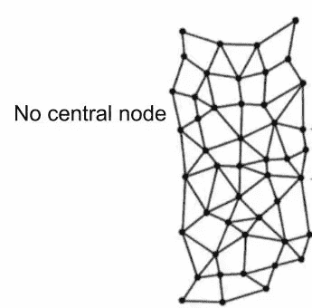

Decentralized service

# 开发云存储的定义

我们的工作从构建云存储的最低工作定义(MWD)开始。这个定义将作为我们发展的出发点。

我们从操作角度将云存储系统定义为允许用户上传文件、从本地设备上删除文件，以及稍后下载这些文件的任何系统。

这就是云存储系统的核心。然而，它远不是一个优质的云存储系统。为了打造一个高质量的云存储系统，我们需要设定一些超越 MWD 的目标。也就是说，高质量的云存储系统必须:

*   强化文件所有者的概念，文件所有者对存储在网络上的文件拥有唯一的读取权限。
*   高度可用。
*   防止数据丢失。
*   为参与和合作提供激励(首先应激励潜在的文件主机加入网络，之后，还应激励他们负责任地存储其他人的文件)

# 构建一个简单的 P2P 网络

我们开发的第一步是实现我们云存储 MWD 的 p2p 版本。我们实现的 MWD 是一个非常简单的系统:两个对等体直接互相发送文件。

在双对等网络中，每个节点可以决定将文件上传到网络，方法是将该文件发送到另一个对等节点，在本地删除该文件，然后从对等节点检索该文件。

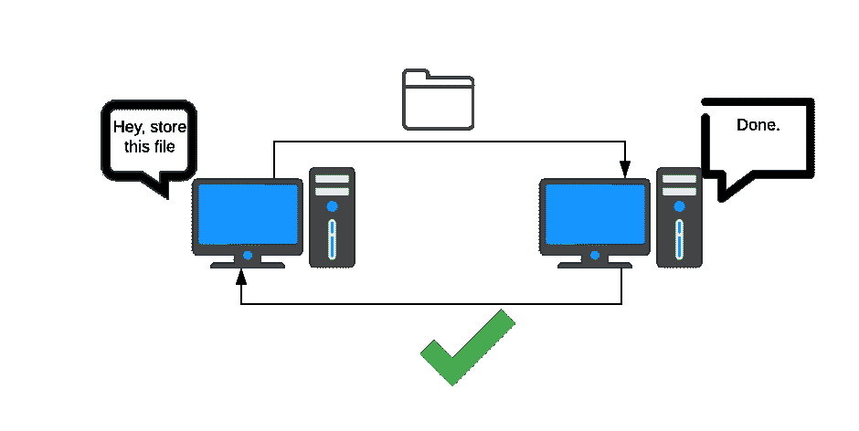

A simple p2p implementation of our MWD of cloud storage

就这样，我们实现了云存储的 MWD。

虽然这个 p2p 系统满足了我们的 MWD，但它不满足质量云存储的更苛刻的标准。如果 peer1 将他们的文件发送给 peer2，peer2 可以轻松读取 peer1 的文件。如果 peer2 离线、删除甚至覆盖 peer1 的文件，那么该文件将不再可检索。也没有适当的激励措施来鼓励东道主参与。被激励加入网络的唯一类型的参与者是希望在网络上存储文件的文件所有者。主机没有理由加入网络，除了免费存储其他人的文件的利他满足，这不是一个非常可靠的模型。

因此，我们需要加强隐私保护，提高文件可用性，并引入鼓励主机参与的措施。

# 保护隐私

我们解决的第一个问题是隐私问题。根据我们对优质云存储的定义，文件所有者应该对他们上传到网络的文件拥有特权读取权限。文件主机应该不能查看文件的内容。

我们在文件上传过程中添加了一个预处理步骤来解决隐私问题。文件所有者不是将文件数据发送给主机，而是首先用私钥加密文件数据。因为所有者是唯一能够解密数据的对等体，所以我们选择了对称密钥加密。

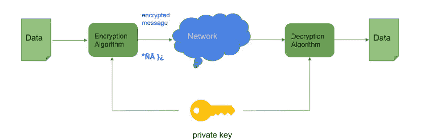

Symmetric key encryption: the same key is used to encrypt and decrypt the file. Nobody can read the file without the private key and anyone who has the private key can read the file.

在这一点上，我们仍然有一个双对等网络，但对等交换加密文件，而不是原始文件数据。主机无法再读取所有者的文件数据。

# 引入冗余

文件所有者应该能够在上传后删除他们的文件。在一个双对等网络中，如果文件所有者上传他们的文件，然后在本地删除它，那么在一个远程主机上只有该文件的一个副本。由于 p2p 网络中充斥着经常与网络断开连接的临时用户，我们不得不处理这样的情况，即所有者想要检索存储在离线主机上的文件。

幸运的是，p2p 网络可以变得非常大，并且随着网络的增长，p2p 网络的力量也显现出来。因此，我们放弃了我们的双对等模型，而采用了一个更现实的多对等模型，并研究了如何在上传后提高文件的可用性。

## 复制与擦除编码

这是冗余方案的一个经典用例:在一个不可靠的对等体网络中，我们绝对不能相信一个对等体会保持在线。我们在研究中确定了两种主要的冗余方案:简单复制和擦除编码。

我们选择复制(即跨不同节点存储文件的多个副本的行为)而不是擦除编码，原因如下。首先，擦除编码增加了上传和下载过程的开销。其次，正如我将在本文后面讨论的，当主机节点离线时，冗余会减少，Layr 需要通过重新分配丢失数据的新副本来应对这些减少。这对于复制来说很简单:只需下载一个文件的副本，给它一个新的 ID，然后将其重新上传到一个新的节点。

在擦除编码方案中，重新分配或保持基线冗余**远不如**简单或计算成本低。这是因为擦除编码将文件分割成编码片段，这样任何一个 *k* 片段的子集都可以用来重建整个文件。把每一块想象成一条直线上的一点。如果一个文件被分割成五个编码片段(一行上有 5 个点)，任何两个点都可以用来重建文件(重新画线)。但是，如果所有这些点都在完全相同的坐标上，您将无法重新绘制原始线。在擦除编码方案中，同样的原理也适用:如果每个编码片段都不同，那么任何两个片段都可以用来重建文件。如果一半的片段是相同的(或者如果一半的点具有相同的坐标),那么**任何两个片段都不能重建原始文件:只有不相同的片段才足够。因此，重新分发过程不能简单地下载并重新上传已经存在的编码片段的副本:它必须导出一个新片段(重建线并选择线上的新点)来上传。**

我们选择复制的最后一个原因是，有多种擦除编码策略可供选择，每种策略都有自己的一套权衡，在继续使用擦除编码之前，我们需要更深入地研究这些策略。

引入复制也为文件所有者提供了一个更好地控制数据的机会:我们可以允许他们选择想要存储的副本数量。我们称这个数量为文件的基线冗余。

此时，我们有了一个多对等网络，它在上传之前使用私钥加密对文件内容进行加密，并实现了简单的文件复制冗余方案，这样，如果其中一个主机节点断开连接，仍然可以检索文件。

# 文件分片

如果文件所有者想要上传一个大文件，比如 100GB，该怎么办？每个主机节点都必须存储全部 100GB。对于主机来说，100GB 的文件是一个巨大的存储和带宽负担。网络上可能没有主机有那么多空闲存储空间。此外，主机可能是没有顶层带宽能力的临时用户。要求他们下载整个 100GB 的文件不仅是存储负担:也是带宽负担。

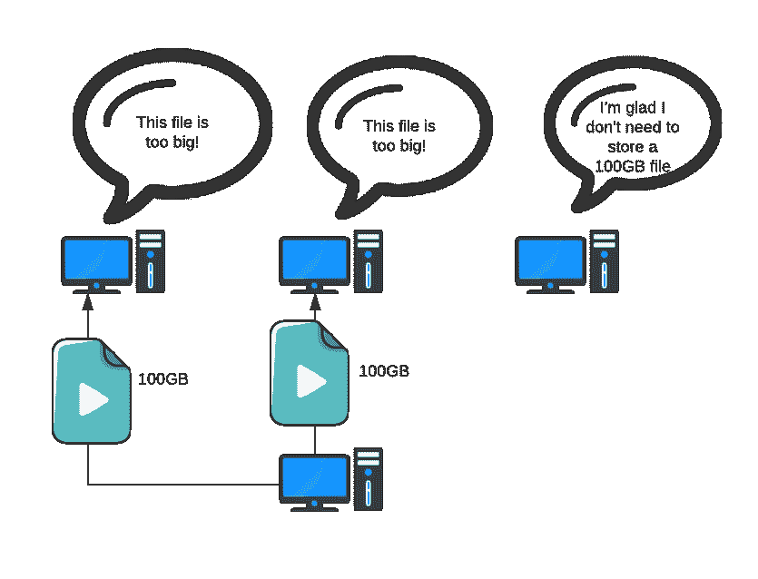

A file owner uploads two copies of its 100GB file to the network.

如果网络能够将存储大文件的带宽和存储负担分布在网络上的多个节点上，情况会好得多。我们用一种叫做文件分片的方法实现了这一点。

文件分片允许我们通过将文件分割成碎片，并将每个碎片发送到网络上的不同主机，来防止整个文件存储在一台主机上。

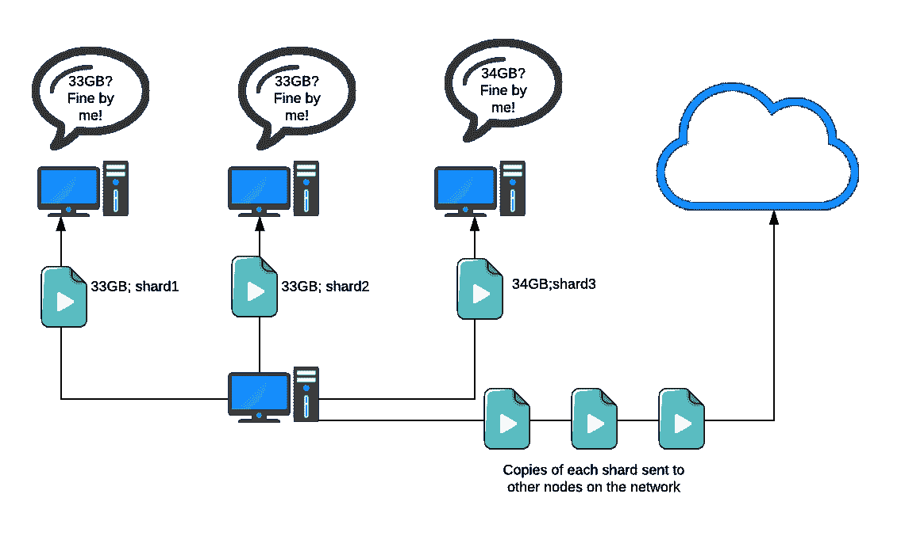

A file owner uploads two copies of a 100GB file to the network, but each copy is split into three pieces. Each piece is then sent to a different host.

在开发的这个阶段，我们有一个多对等网络，在这个网络中，文件所有者的文件被加密、分片，然后分发给网络上的不同主机。每个碎片的副本将被分发到不同的主机，以满足预设的基线冗余级别。

# 跟踪碎片

随着文件分片的引入，我们在所有者的文件和分布在网络上的分片文件之间引入了一对多的关系。

就网络上的主机节点而言，每个碎片都是一个不同的文件。碎片本身并没有保留文件和它的每个碎片之间的关系。此外，没有任何指示这些碎片应该被组合以成功地重建加密文件的顺序。

我们通过为上传到网络的每个文件生成一个清单文件来解决这个问题。清单文件的目的是跟踪每个碎片及其副本，以及这些碎片需要组合以重建原始文件内容的顺序。

为了容纳所有的碎片，我们修改了上传过程，以便一个碎片目录存储所有的碎片副本(如上面的演示所示)，然后这些副本通过网络并发上传到不同的主机。如果一个文件被分成 5 个碎片，每个碎片有 3 个副本，那么碎片目录存储 15 个碎片，这些碎片将被发送到 15 个不同的主机(假设网络上至少有 15 个不同的主机)。

使用这种新方法，文件所有者实际上是在用他们上传的文件“交换”一个(理想情况下)更小的清单文件

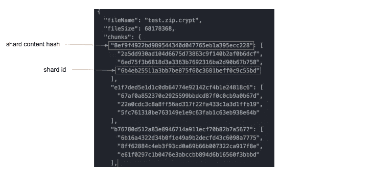

Each “chunk” in the manifest file represents a distinct shard. Each distinct shard is uniquely by the hash of its contents. Each distinct shard is paired with an array of IDs, which are the IDs of the shard’s copies.

# 分片方法权衡

管理清单文件的大小是一个令人着迷的挑战。因为清单文件存储了碎片记录，所以增加碎片计数会增加清单的大小。但是，回想一下，分片的目的是减少主机上大型文件的存储和带宽负担。

保持碎片计数不变会随着文件的增长而增加碎片的大小。但是，它保持清单文件的大小不变，有利于文件所有者。它还会导致 k 个常量碎片中的每个碎片随着上传文件大小的增加而增加。

相反，保持碎片大小不变会随着文件的增长而增加碎片数量。但是，它保持每个碎片的大小不变，这有利于文件主机。对于更大的上传文件，它还会导致清单文件变得更大。问题是:

> 哪种方法更节省空间？

对于每种分片方法，一方的存储负担随着文件大小线性增长，而另一方的存储负担保持不变。

## 按 k 大小分片

在 shard-by-k-size 方法中，文件所有者的存储成本或生成的清单文件的大小由以下函数表示:

```
manifestSize = 20 bytes * (fileSize/shardSizeConstant) * duplication Constant
```

简单地说，清单的大小大致相当于单个碎片 ID (20 字节)的空间量乘以碎片的数量，再乘以每个碎片的副本数量。唯一的非常数值是`fileSize`，表示文件大小和清单大小之间的线性关系。

## 按数量分片

在按 k 数量分片的方法中，文件主机的存储成本或每个分片的大小由以下函数表示:

```
shardSize = sizeOfFile / numOfShardsConstant
```

用简单的英语来说，这意味着每个碎片的大小等于文件本身的大小除以预先设定的碎片数量。例如，如果结果碎片的数量被设置为 10，那么每个碎片将是文件大小的 1/10。同样清楚的是，`shardSize`相对于文件的大小线性增长。

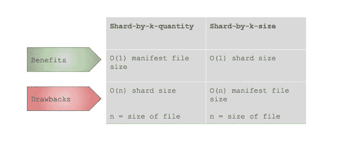

For each sharding method, one party’s storage burden increases linearly with the size of the file, while the other party’s storage burden remains constant

## 这两种方法都不是最佳的

事实证明，纯按 k 大小分片和纯按 k 数量分片的方法都有明显的缺点。

按数量分割的方法肯定会失败。如果常量太低，那么大的文件将产生对于文件主机来说过大的碎片。我们可以将常量设置得很高，但这会给小文件带来问题。

k 尺寸分片也存在类似的问题。我们可以选择一个恒定的碎片大小，它适用于许多文件，但不适用于大文件，因为大文件的风险是产生太多的碎片，以至于清单文件实际上会增长到不合理的大小。

例如，也许我们的复制常数是 500，这意味着对于每个碎片，清单存储了`500 * 20`字节，即 10KB。也许我们的恒定碎片大小是 500KB(对于上传到 BitTorrent 的文件来说，这是一个普通的[碎片大小](https://wiki.vuze.com/w/Torrent_Piece_Size))。假设文件所有者正在上传 1GB 的文件:

*   一个 1GB 的文件分成 500KB 的碎片，这将产生 2000 个碎片。
*   在清单中每个碎片 10KB，最终产生大约 20MB 大小的清单。
*   如果我们将碎片大小加倍，从 500KB 增加到 1MB，我们可以将清单大小减半(为文件所有者节省 10MB 的存储空间),而每个文件主机只需要 0.5MB 的额外存储空间。

因此，最好的分片方法是动态选择值，以便在一定限度内最小化每一方的存储负担(例如，一个分片可能不应该为了减小清单文件的大小而增加到 10GB。如果归结起来，较大的清单文件比较大的碎片更好，因为清单不需要传输或下载)。BitTorrent 和 Storj shard 文件基于文件的大小而有所不同。(参见此处的[和此处](https://github.com/storj/libstorj)的[)](https://wiki.vuze.com/w/Torrent_Piece_Size)

# 可检索性的证明

在这一点上，我们的系统看起来像这样:我们有一个多对等网络，上传需要加密、分片、复制和分发。加密保持了文件内容的私密性。分片保持了较低的存储和带宽负担。复制提高了文件的可用性。

然而，复制只解决了部分可用性问题。主机离线、丢失或损坏数据所有者文件的可能性会随着时间的推移而增加。理想情况下，Layr 将为文件所有者提供一种维护其文件基线冗余(即他们选择上传到网络的副本数量)的方法。

所有者需要检测他们的文件的任何碎片的副本何时被破坏或丢失(因为主机离线或因为主机删除了文件),以响应文件的基线冗余的减少。

测试一个碎片是否可恢复的一个简单方法是尝试恢复每个碎片。如果主机离线，测试将自动失败。否则，如果主机返回碎片，测试人员(在我们的例子中是文件所有者)可以确保碎片的内容是完整的。由于几个原因，这种方法不适合我们的需要。首先，它会产生大量的通信开销。第二，所有者需要保存每个碎片的本地权威副本用于比较，这违反了我们的要求，即云存储系统应该允许用户删除他们上传文件的本地副本。

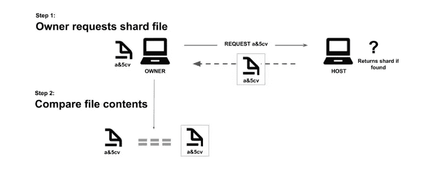

Naive way to test data integrity by downloading the file and checking its contents.

我们探索的第二种方法是请求文件内容的散列，而不是内容本身。这最小化了通信开销，并要求文件所有者只存储每个碎片的散列(他们已经存储在清单文件中)。不幸的是，这种方法也被证明是不够的:主机很容易通过存储碎片内容的散列而不是碎片内容本身来作弊。

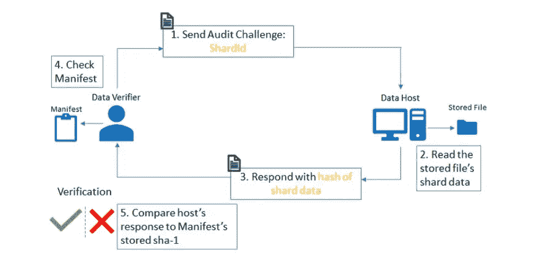

Improved audit: Ask for the hash of the file’s content and compare against the hash already contained in the manifest file.

我们考虑的第三种方法也是基于散列的，但是阻止了主机提前生成答案。我们没有向主机要求内容本身的哈希，而是要求内容的哈希+一个随机生成的 salt。由于 salt 在文件所有者执行审计之前不会暴露，所以如果要通过审计，主机在审计时也需要碎片的内容。

因为所有者应该能够在上传过程之后删除他们的文件及其碎片，所以这些挑战 salt+碎片内容的散列和 salt 需要在上传过程期间预先生成。这也意味着所有者可以执行的审计数量有上限。尽管有这些限制和其他限制，这种方法提供了很强的安全性，这也是我们选择它的原因。

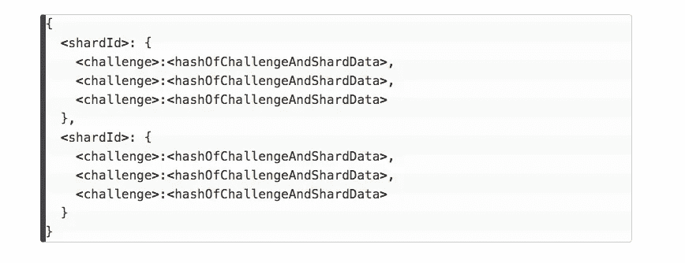

For each shard copy, its ID is associated with a set of challenges and then a hash of the challenge + the shard data. When a file owner wants to audit a shard, it sends the challenge over to the host who then has to return the hash of the challenge + shard data. Since the host doesn’t see the challenge until the time of audit, and since the shard data is required alongside the challenge to generate the correct hash, they are forced to possess the intact shard data at the time of audit in order to pass.

# 修补文件

可检索性证明的好处是，它们允许文件所有者检测他们的文件的冗余何时减少。然而，如果数据所有者能够做些什么，这些知识对他们来说更有价值。作为替代，我们实现了一个叫做修补的操作。如果审计发现特定碎片的一些副本不可检索，则修补操作将识别仍然可检索的副本，下载该副本，为该副本生成新的唯一 ID，并将该副本发送到新的主机。然后，它会更新清单文件，用新上传的副本替换无法检索的副本。

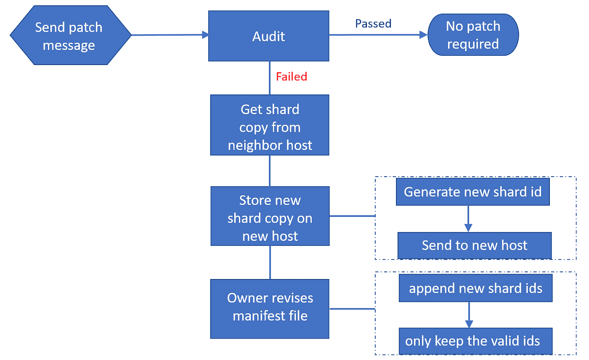

# 激励参与和合作

在我们开发过程的这一点上，我们的系统已经走了很长的路。我们有冗余方案、文件分片、跟踪分片的清单文件、可检索性证明和文件修补。仍然有一个紧迫的问题:为什么人们会首先参与？当然，文件所有者有加入网络的强烈动机，但是那些有免费存储但不一定有任何东西要存储的潜在主机怎么办？一个完全由只想上传文件的对等点组成的网络不会是一个有用的网络。

我们研究了不同的方法来激励系统中的行为，并最终确定了财务激励。因为我们正在构建一个分散的系统，因此我们应该使用分散的支付系统，这意味着使用某种形式的加密货币。我们选择 Stellar 是因为他们强大的 JavaScript SDK、testnet 和低廉的交易费用。


# 简单的付款

我们想到了最直接的激励方案:上传付费。在按上传付费的方案中，文件所有者将在上传过程中为存储他们的文件向主机付费。选择简单的激励方案使我们能够专注于在不信任环境中实现交易的技术方面，尽管简单的激励方案可能在经济上不稳健(并且，事实上，按上传付费的方案具有重要的缺点。有关详细信息，请参见限制和未来步骤)。

我们想到的第一个实现策略是:先付费后上传。在“先付费后上传”策略中，文件所有者将首先确定他们计划将文件发送到的主机。然后，他们会付钱给主人。付款完成后，他们会将文件发送给主机。

这种方法的问题是，文件所有者不相信他们的数据会在付款后到达主机。因为支付和文件传输是分开的操作，所以所有者不能确定两者都成功了:他们冒着为他们的文件从未实际占用的空间付费的风险。当我们探索“上传后付费”的实现策略时，出现了类似的问题:问题仍然是文件所有者不能确定主机在付费时他们的文件完好无损。

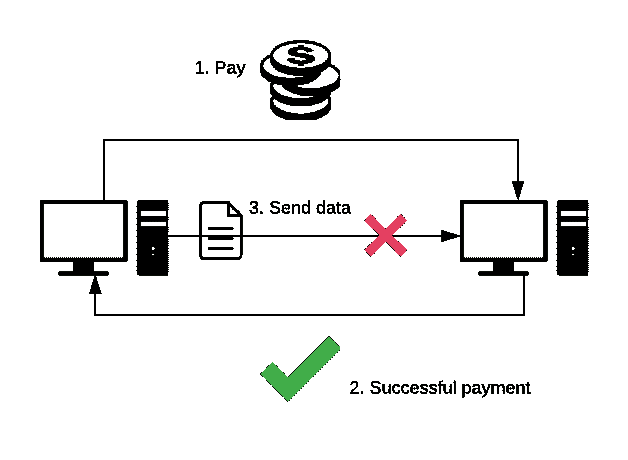

The owner pays the host then sends the data to the host. The payment goes through but the data transfer does not, causing the host to lose money.

由于 p2p 网络是一个由拥有本地状态的对等体组成的分布式系统，并且只能通过传递消息来更新彼此的状态，因此这些方法没有在确认收到数据和为该数据付费之间提供原子性是有意义的。这两项行动都采取了不同的信息形式。消息不能保证在特定的时间范围内到达目的地，也根本不能保证到达目的地。我们需要一种方法来“组合”这些消息，这样一个消息不能成功，另一个也不能成功。

## 引入智能合同

我们通过智能合同实现了这一点。

智能合约为我们提供了一种只有当所有相关方满足特定条件时才执行交易的方法。

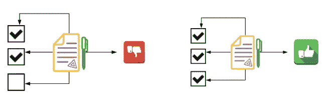

Smart contracts batch transactions together and apply constraints to these transactions. If one transaction fails, the whole batch fails. If one party wants to pay another party only if certain conditions are met, smart contracts allow us to accomplish this.

智能合约将交易批量处理在一起，并对这些交易应用约束。如果一个事务失败，整个批处理都会失败。如果一方想在满足特定条件的情况下向另一方付款，智能合约可以让我们做到这一点。

想象一下，我想雇你帮我装修房子。我不想提前付钱给你，因为我不放心你带着钱跑了。你不想在没有报酬的情况下工作，因为你不相信我会在你完成后付给你报酬。所以我们决定请律师。你和我在律师在场的情况下决定装修的一系列规格。我把我想付给你的钱交给律师，他会保管它，这样我就不能在你工作的时候拿走它。一旦你完成你的工作，你提交证明，工作是按照我们商定的规格完成的。如果你的作品确实符合我们的要求，那么律师会把我之前存的钱给你。否则，钱退还给我。

智能合同可以取代上述场景中的律师。

## 恒星智能合同(SCCs)如何工作

在我介绍我们如何使用智能合约来实现上述目标之前，有必要先了解一下智能合约在 Stellar 中的工作原理。来自 [Stellar 开发者指南](https://www.stellar.org/developers/guides/walkthroughs/stellar-smart-contracts.html):

> 一个**恒星智能合约** (SSC)被表示为使用各种约束连接和执行的交易的组合。

此外，Stellar 网络中的**事务**是“修改分类帐状态的命令”，有点类似于数据库中的 SQL 查询。事务可以由多个**操作**组成，这些操作实际上负责操纵分类帐的状态。事务作为一个批处理的原子事件按顺序执行操作。如果一个操作失败，整个事务都会失败。

所有操作都有特定的阈值，所有签名都有特定的权重。如果事务签名的权重之和不满足事务内任何操作的阈值，则事务将自动失败。

恒星账户也可以通过`create_account`操作[创建更多账户](https://www.stellar.org/developers/guides/concepts/list-of-operations.html#create-account)。该操作可以与其他操作结合起来，对新创建的帐户设置各种约束。从本质上说，通过整合出色的运营，开发者可以在用户之间创建复杂的关系，以及持有资金的独立场所，并仅在特定条件下将这些资金释放给特定方。重要的是(对于外行来说), Stellar 事务可以使用操作的组合在文件主机和文件所有者之间创建自动的 [**托管**](https://en.wikipedia.org/wiki/Escrow) **契约**..

## 使用智能合约支付

在我们的场景中，我们希望来自文件所有者的资金被释放给主机**，前提是**他们能够证明他们拥有所有者的数据。

我们通过以下工作流程实现了这一点:

1.  文件所有者创建资金并将其存入智能合同
2.  文件所有者散列加密的文件数据
3.  文件所有者将该散列作为散列签名人添加到合同中
4.  文件所有者将文件和合同 ID 传输到主机
5.  主机试图通过提交交易并用其接收的文件数据对其签名来解锁合同中的资金
6.  然后 Stellar 对文件数据进行哈希处理，并检查以确保哈希与 hashX 签名者匹配
7.  如果哈希值匹配，则交易通过。否则，它将被停止。

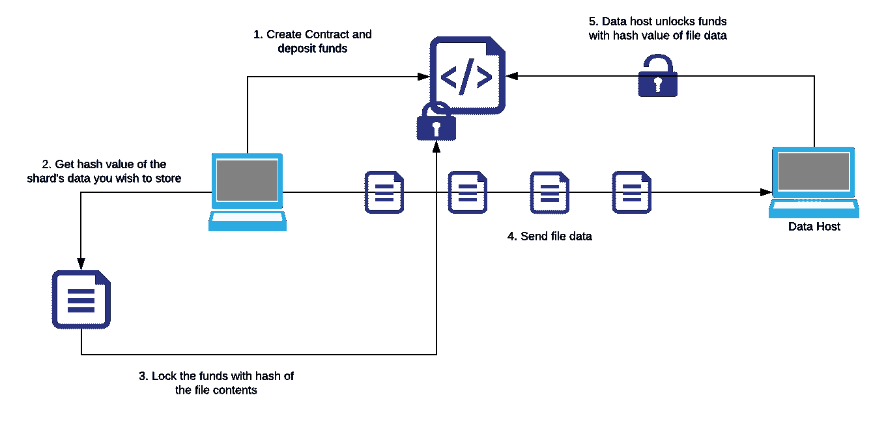

Graphical representation of smart-contract payments with HashX signers.

这里需要注意的一点是，尽管添加了`hash(fileData)`作为签名者，但是某些人不能用`hash(fileData)`签名:他们必须提交`fileData`本身。这很重要，因为它确保了主机不能预先生成`hash(fileData)`，删除`fileData`，然后签署交易:他们必须用`fileData`本身签署交易，从而保证数据拥有证明和支付之间的原子性。

# 局限性和未来步骤

## 智能合同

我们与 hashX 签名者的智能合约支付处理了数据拥有和支付证明的基本批处理，但是这种方法有潜在的弱点。

1.  如果 hashX 签名者具有足够的权重来签署支付交易，则 hashX 签名者的权重满足中等阈值。因此，任何拥有哈希预映像的人都可以签署任何具有中等阈值的交易，包括进一步的支付。
2.  一旦使用前映像签名的交易被提交到 Stellar network，hash 的前映像就被公开了(点击了解 HashX 签名者)。

关于问题 1，具有中等阈值的签名者可以执行的最具破坏性的动作是创建支付。添加其他签名者或合并一个帐户需要更大权重的签名者。由于该账户仅被提供了足够支付文件数据的资金，因此不存在资金提供者(文件所有者)损失额外资金的风险。如果我们要使用不同的激励方案，如通过审核付费，我们会选择在文件所有者和每个主机之间保留相同的托管帐户，为每次审核提供资金。我们还将更新 hashX 签名器，以匹配每个后续审计的`fileData + challenge salt`散列。在这种情况下，我们需要防止 hashX 签名者撤销超过允许撤销的数量。为了防止这种情况，我们要做的是:

1.  将 hashX 签名者的权重设置为权重< the low threshold
2.  Create a [预授权交易](https://www.stellar.org/developers/guides/concepts/multi-sig.html)，该交易仅授权提取资金以支付通过的审计，并将该预授权交易添加为签名者。
3.  设置预授权交易的权重，使得 hashX 权重+预授权权重=中阈值。

这将防止主人比他们应该的退出更多。

问题 2 对我们来说不是问题，因为智能合同的唯一目的是在上传过程中促进主机和所有者之间的单次支付。这也不是隐私问题，因为前映像(或文件数据)是加密的。

但是，如果所有者需要在服务过程中多次向主机付款，例如，如果当主机通过文件审核时所有者正在向主机付款，那么这可能会成为问题，因为 hashX 签名是公开可见的。

预授权交易的使用，结合降低 HashX 签名者的权重，也减轻了这种风险。

## 更复杂的激励方案

按上传付费的激励方案非常简单，它让我们能够专注于 p2p 环境中支付的细微差别和技术挑战。但是设计经济上合理的(而不仅仅是技术上合理的)激励方案对于任何分散化的产品来说都是一个重要的挑战。

尽管按上传付费的方案激励了参与，但它没有激励文件主机的一些最重要的行为:主机可以在获得报酬后立即轻松删除文件，而不会有任何影响。事实上，他们这样做是有动机的，因为他们会赚同样多的钱，同时还能保留他们的存储空间。

一个有效的激励方案应该促进东道方的以下特点:

1.  主机参与(按上传付费成功激励)
2.  正常运行时间(在网络上可用)
3.  文件保存(防止文件丢失或损坏)

正常运行时间激励和文件保存都可以通过按审核付费激励方案来鼓励。在这样的方案中，只有当主机成功通过审核时(即，当它们存储的文件既存在又未被修改时)，主机才被付费。由于文件所有者自行决定发起审核，因此主机被鼓励尽可能多地保持在线(请记住，如果目标主机离线，审核会自动失败)。

## 擦除编码

擦除编码是一种冗余方案，可以产生与复制相同级别的文件可用性，而不需要那么多存储。我们计划在决定擦除编码的好处是否值得其潜在的缺点之前，更深入地探索擦除编码。

在我们的简单复制模型中，每个不同分片的分片副本对于重建原始文件是必要的:

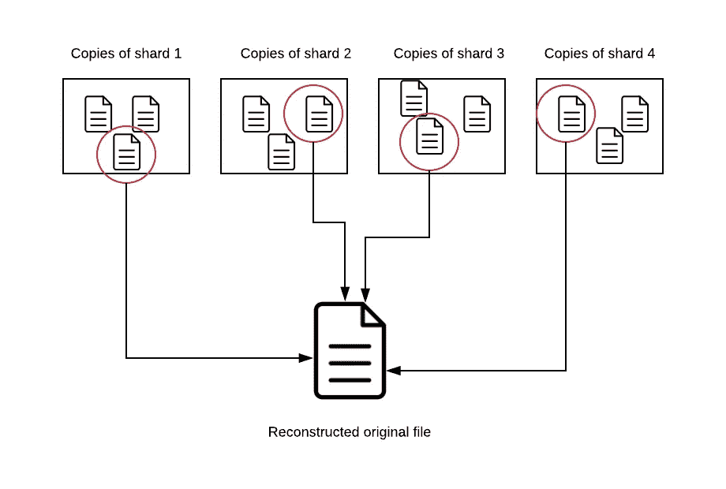

Simple replication: A copy of each distinct shard is required to reconstruct the original file.

这意味着文件的可用性等同于最少可用的碎片拷贝集的可用性。碎片 2、3 和 4 的所有副本都可以在线，但是如果碎片 1 的副本不可用，那么整个文件也不可用。

擦除编码通过创建称为**奇偶校验碎片**的东西来消除这种限制。奇偶校验碎片就像“通配符”,可以填补其他缺失的碎片。如果将文件拆分为 4 个碎片，然后创建 8 个奇偶校验碎片，则总共提供 12 个碎片。然而，总共 12 个碎片中的任何 4 个都可以用来构建原始文件。只要有 4 个碎片可用，文件也是可用的。

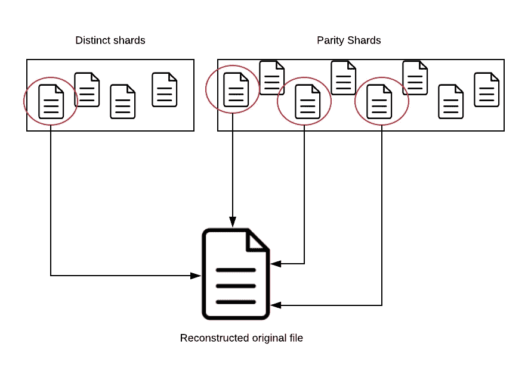

Reconstructing the file with any 4 out of 12 total shards.

## 可检索性的证明

我们目前正在探索更复杂的可检索性证明方法，这些方法:

A.提供无限数量的审计

B.不要求主机处理整个文件来响应审核

C.不要求所有者存储额外的信息

D.仍然提供高水平的安全性

# 结论

我希望你喜欢阅读我们的经验建设 Layr。作为实验性软件，前面还有很多挑战和改进。我还希望您已经对构建分散存储系统所涉及的一些核心挑战建立了一个清晰的心智模型，我敦促您尝试一下！这是一次美妙的学习经历。

再一次，在撰写本文时，我们都对全职工作机会敞开大门。如果你有兴趣让我们中的一员加入你的团队，请联系我们！

*   迪伦(科幻)
*   [佛罗伦萨](https://floalex.github.io/)(科幻)
*   [Tannr](http://tannrallard.tech/) (纽约市)

如果您对分散式云存储有任何疑问，或者对构建 Layr 的过程有任何疑问，请随时联系我们中的任何一位。