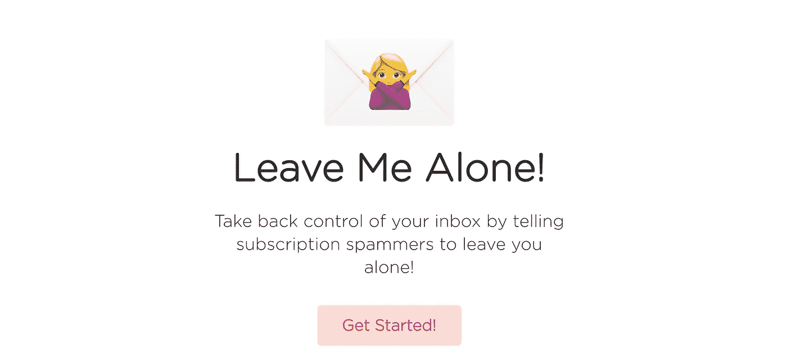
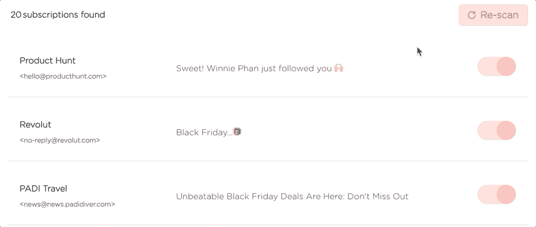
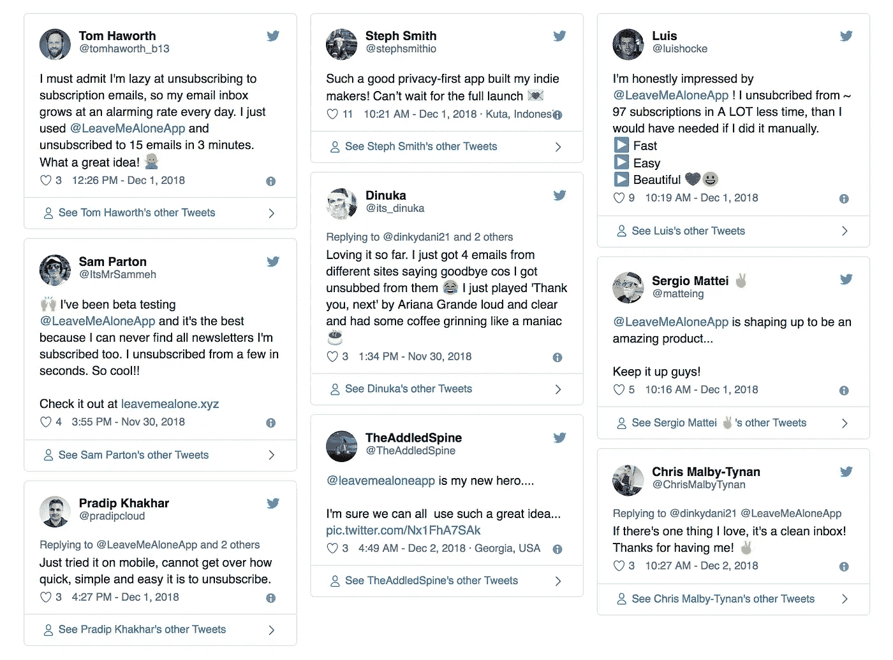

# 完全公开地创建一家创业公司

> 原文：<https://medium.com/hackernoon/building-leave-me-alone-in-the-open-7721274af173>

## 我们制造和发射的新方法

Photo by [Randy Fath](https://unsplash.com/photos/ymf4_9Y9S_A?utm_source=unsplash&utm_medium=referral&utm_content=creditCopyText) on [Unsplash](https://unsplash.com/?utm_source=unsplash&utm_medium=referral&utm_content=creditCopyText)

在推出新产品之前，用户反馈和社区支持的重要性是巨大的。用户总是充满惊喜，很久以来，开发人员就对用户如何接近、使用或解释他们的应用程序做出了许多假设。其中很多都会是错的！

接下来是我们第一个完全开放的应用的故事——我们试图帮助解决这个问题。

让我们从设定场景开始…

## 第 1 章——理念

那是圣诞节前的一个月，整个房子里，没有一个动物在动，甚至没有一个…好吧，不完全是，但实际上发生的是黑色星期五。

是的，黑色星期五，这个有点令人厌恶的节日专注于通过提供无数的交易和漂亮的东西从消费者身上尽可能多的吸走钱。

一个人根本不可能浏览网页而不被最后的机会淹没。不，我不想在 Cacti-R-Us 享受 40%的折扣，沙发上的免费送货，或者半价的墨西哥胡椒汉堡，谢谢！实际上*也许*是我最后一次尝试。但不是因为你愚蠢的交易！

但这不仅仅是另一篇抨击黑色星期五的文章(尽管今年一些地方去了“网络星期二”！加油，那是在推)。

不，在这个最辉煌的日子里引起我们注意的是电子邮件！这么多营销邮件！其中大部分我都不记得注册过，当然也不打算再次购买。

我知道这是吸引消费者注意力的一个很好的媒介，但是 24 小时后，我感觉我的注意力已经从耳朵里被炸开了。

甚至选择退出或退订这些邮件都是对我能量的消耗。寻找选择退出链接很烦人，尤其是因为这通常意味着我必须阅读你愚蠢的营销垃圾。如果你足够天真，只是把它们扔进垃圾桶，那么你会很快意识到这并不能解决任何问题，接下来的一周你的收件箱又会被淹没。

事实证明，这个问题是有解决办法的。然而，作为使用为你取消订阅这些东西的服务的回报，你必须同意让他们出于营销目的出售你的所有数据。你可以说我多疑，但我不是在试图摆脱营销目的吗？

那么我们能做些什么呢？

## 第 2 章—验证

好了，我们发现了一个问题，让我们看看它是否困扰了其他人。所以我们选了一个名字，拼凑了一个 10 分钟的登陆页面，并开始在社交媒体上分享。

The first draft of the landing page

反应是压倒性的积极！让我一个人呆着是成为**道德和隐私第一的电子邮件退订服务。**几个小时之内，我们就有了 50 名潜在的测试用户，以及大量的想法和功能需求。所有这些都发生在我们编写一行代码之前。

我们决定，今后我们将听取社区对我们所做的每一个决定的反馈。这包括特征、设计、颜色、域名，甚至一些文字。

所以我想下一步是实际建造一些东西？

## 第 3 章—编码

[编码](https://hackernoon.com/tagged/coding)本身是我们最熟悉的产品拼图的一部分，正如我们开始理解的那样，它也可以说是最不重要的部分。

尽管如此，这件事还是不得不做。我们集思广益，几天后就有了一个工作原型。**让我一个人呆着**扫描了用户的 [Gmail](https://hackernoon.com/tagged/gmail) 收件箱，让他们点击一下就可以退订营销邮件。

我们很高兴地说，我们做到了这一点，在我们的服务器上没有暴露任何电子邮件内容。从而实现了对我们来说至关重要的隐私方面。我们仍然会存储一些未订阅的电子邮件的元数据(这样当我们再次看到它们时就知道它们已经被处理了)，但是这些信息是加密的，所以我们认为这是一个小小的让步。

*(如果有人能想出一种方法让我们拥有相同的功能，而不需要存储哪怕是这么一点点数据，请告诉我们！)*

无论如何，随着现在的工作，是时候让我们的测试人员自由运行了！

## 第 4 章—封闭测试版

Beta 测试是一个可怕的前景，在你的应用程序还没有完全准备好的时候就让用户进入？如果东西坏了怎么办？

事实证明，事物确实会破碎，而且有时会破碎得很厉害。但是测试版用户并不期待一个成品，而且他们出奇的宽容！在我们的情况下，我们交换免费使用我们的测试产品，以换取专注地倾听他们对该应用程序的所有意见。

因此，我们发现并修复了许多错误，调整了用户界面，并推出了一些我们没有想到的新功能，这些功能现在对应用程序至关重要。

我们现在的看法是，如果不尽快让用户松绑，**别管我**的效果还不及现在的一半。

## 第 5 章—公开测试版

既然测试版如此成功，我们现在向任何人开放**让我一个人呆着**。如果你喜欢的话，可以试一试。这将有助于我们传播信息，因为快乐的用户会成为最好的销售人员！

Our wall of love ❤️

## 收场白

我们让**别管我**与我们之前的应用程序有很大不同。我们希望在开放的环境中构建，并与其他制造商和潜在客户分享我们的进展。我们在[推特](https://twitter.com/leavemealoneapp)上分享我们的进展，在 [Makerlog](https://getmakerlog.com/products/leavemealone) 上记录我们的任务，并在我们活跃的 Slack 和 Telegram 社区中寻求反馈。

这被证明是一个极好的决定，原因有二；

*   我们受制于责任。我们公开负责构建和传递我们承诺要实现的理念。人们立即开始询问承诺的功能、进度更新和发布日期。这有助于确认产品是需要的，并给我们继续开发的动力。
*   拥有一个希望看到我们产品成功的用户群体是非常宝贵的。我们发现了一些孤立的 bug，如果没有专门的用户，这些 bug 很难被追踪到。例如，一个用户有一封格式错误的电子邮件，如果被看到，会导致整个应用程序崩溃。另一个人的收件箱是我见过的最大的垃圾邮件，很快就把我们的电子邮件流给毁了😂。总的来说，我们忙了 72 个小时，处理错误报告，浏览日志，推动修复。如果没有这个过程，我们永远不会知道这些问题，我们会推出一个非常糟糕的产品。

## 最后的想法

我们想说一个巨大的🎉谢谢你🎉感谢所有测试人员的帮助。别管我现在已经准备好被放归野外了。我们将继续开发和改进服务。你可以在这里看到我们的公开路线图——让我们知道你希望我们下一步开发哪些功能。

如果你已经做到这一步，并且你想尝试**让我一个人呆着**你可以前往[https://leavemealone . app](https://leavemealone.app/)并使用 WE_HATE_SPAM 优惠券享受任何扫描 10%的折扣！

我们希望我们的电子邮件服务对您有用，并能帮助您。如果您有任何问题或反馈，请随时通过 [Twitter](https://twitter.com/leavemealoneapp) 或电子邮件 [hello@leavemealone.app](mailto:hello@leavemealone.app) 联系我们。

享受干净的收件箱！