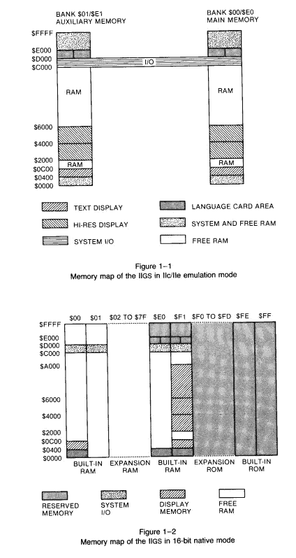
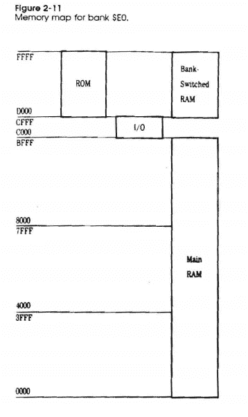
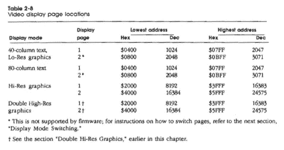
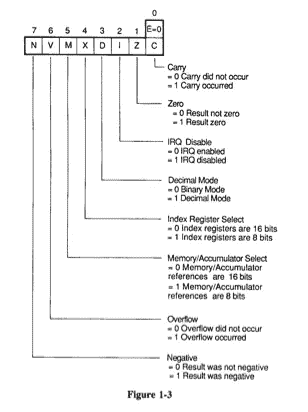
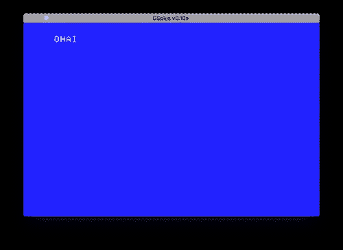
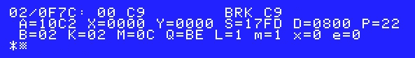
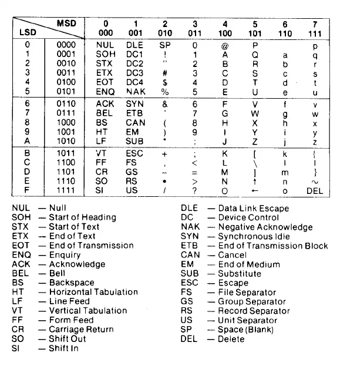
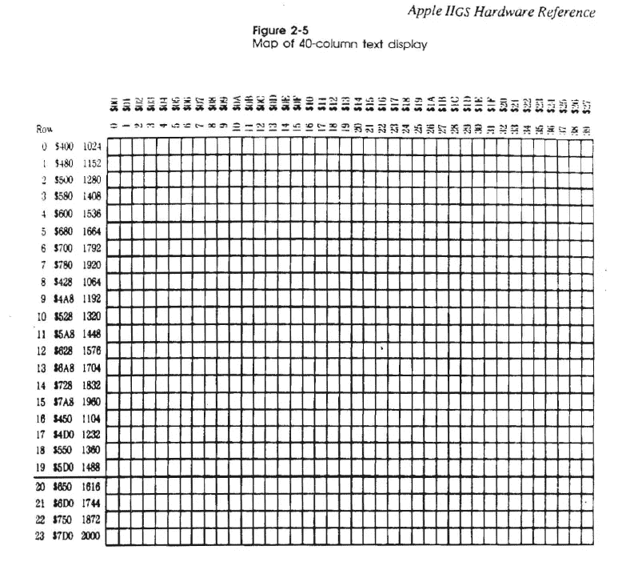
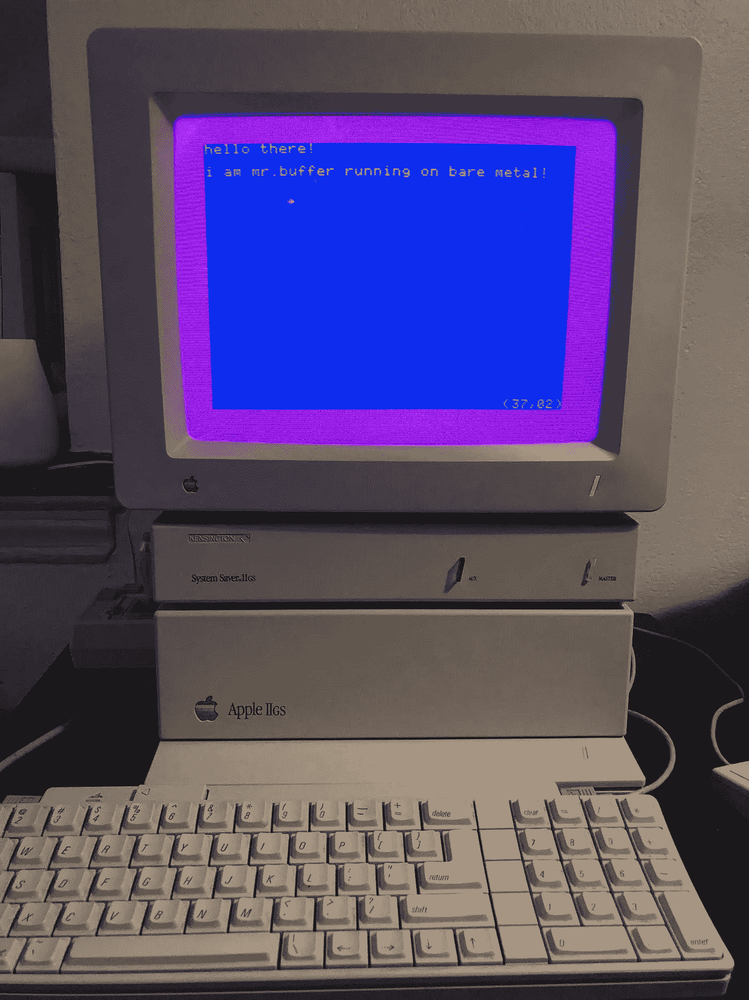

# 构建 mrbuffer:一个用于 31 岁计算机的文本编辑器

> 原文：<https://medium.com/hackernoon/building-mrbuffer-a-text-editor-for-a-31-year-old-computer-59d5ea450507>

苹果 IIgs 于 1986 年 9 月 15 日问世。它配备了一个 2.8 MHz WDC 65816 CPU(与 SNES 和那个时代的其他类似计算机相同，是一个具有 24 位寻址的 16 位 CPU)，256k 或 1MB RAM(可升级到 8 MB)，以及一个 Ensoniq 8 位立体声合成器(这是 Apple II 系列的 bit-speaker 的一个受欢迎的升级)。作为参考，最初的 Apple II 系列是围绕 6502 CPU (8 位，16 位寻址)构建的，在 IIe 和 II+中最多有 1 MB 的 RAM。然而，直到 1988 年，苹果公司才发布了新电脑的操作系统，能够有意义地利用新的硬件。GS/OS 是用原生 16 位代码编写的，更重要的是，旨在通过其新的闪亮 GUI 使用。

这篇文章是关于我如何从头到尾为 IIgs 构建了一个[微型“文本编辑器”](https://github.com/mach-kernel/mrbuffer)。

PS: [这个操作码引用可能在阅读时有用](http://www.intel-assembler.it/portale/5/65816_guide/opcode_reference.asp)！

# 我们要做什么？

在这个项目开始时，我提出了一些要求。我的文本编辑器应该:

*   可以从 GS/OS 启动，不管它实际上是否在操作系统的窗口中运行。
*   不要占用超过 256k 的 RAM，以便它可以在任何*iig 上运行。*
*   在本机 16 位模式下运行。

如果你对这个处理器不熟悉，那么最后一个 bulletpoint 就让人摸不着头脑。等到 IIgs 发布的时候，已经有太多的软件可以兼容最初的 Apple II(使用 6502)。65816 有一个可以切换的“仿真模式”,通过选择性地将累加器和变址寄存器的宽度“减半”,有效地将 816 变成 6502。

GS/OS 是一个 16 位的“一次一个进程”操作系统。对我来说，这意味着我的文本编辑器将是系统加载完成后唯一运行的程序。OS 将保留在 RAM 中，但是为了不破坏 OS 代码，我将不得不放弃写入某些内存位置。GS/OS 将引导我的程序，然后将计算机的完全控制权交给它。要退出应用程序，我必须跳转到操作系统的入口点(在本地模式下为`jsl`),在那里它将接管。

就编程环境而言，我们的选择看起来有些暗淡:

*   [ORCA/C](https://github.com/byteworksinc/ORCA-C) ，ANSI C 编译器，但必须运行在裸机或仿真器上。
*   [cc65](https://github.com/cc65/cc65) ，ANSI C 编译器，但只针对 6502。
*   [Merlin16](https://en.wikipedia.org/wiki/Merlin_(assembler)) ，65816 汇编器，但必须在裸机或仿真器上运行。
*   Merlin32 ，一个 Merlin16 宏兼容汇编程序，可以在任何现代计算机上运行，可以从源代码构建它。

我拥有一个物理的 IIgs，但是希望能够从一台现代计算机上轻松地开发。此外，在模拟器的中构建*也很麻烦，并且不容易用构建脚本自动完成(也就是说，花时间去破解模拟器以便编写 UI 动作并不是一个好的选择)，所以唯一可行的选择是使用 Merlin32。此外，我将东西真正部署到物理计算机的唯一方法是将 CF 卡插入我的台式机，这是这里唯一一台带有多读卡器的计算机。在决定使用 Merlin32 之后，第一件事就是弄清楚如何用我的程序编写磁盘映像，以便仿真器可以加载它。我不得不[为 BrutalDeluxe 软盘映像工具编写 POSIX 文件 API 绑定](https://github.com/mach-kernel/cadius),因为它只能在 Windows 上运行(这是一种基本错误),而且它是唯一可以轻松编写脚本的工具。明智地使用`#pragma once`和一些`stat()`让我在几个小时内制作了 Apple II 磁盘映像。*

# COUT 之旅

在困难的项目中不失去理智的唯一方法是尽可能以面向目标的方式编写软件。任何编辑器都必须能够实现的*最基本的*功能是在屏幕上显示字符串。在大多数编程语言中，您可以调用`print()`的某种变体来完成这项任务。在 Apple II 世界中，我们没有这种启示，尽管这有点像谎言，因为 Apple II ROM 包含一系列实现`COUT`、`RDKEY`和许多其他实用程序的工具箱函数。工具箱实用程序的工作流程很简单:你用一些数据准备寄存器(在`COUT`的情况下，一个字符被加载到`A`寄存器，称为累加器)，从你的程序`jsr`到例程，它执行一些任意的任务，然后调用`rts`将控制返回给你的代码。这似乎正是我们想要的，那么我们为什么不能使用它呢？

是时候了解一下 Apple IIgs 的内存架构了。



Apple IIgs Hardware Reference (APDA Draft)

GS/OS 可执行文件存储在 OMF 中，一种可重定位的可执行格式。如果你已经为 Linux 和/或 Windows 写了软件，那么这是类似于你的`ELF`或`PE32`可执行格式的东西，但是对于 GS 操作系统。观察每个内存块流动`$FFFF->$0000`，但是更明确地说，内存被分成 64k 的块。为什么这是值得注意的？请记住，65816 可以完全模拟 6502，后者最多只能寻址 64k (2 ⁶)的 RAM。Apple IIe 和 IIc 使用 6502，但支持超过 1M 的内存配置，这是由于硬件实现了存储体切换(因此在任何给定时间，总内存中的 64k“窗口”都是可见的)。由于 65816 CPU 支持 24 位地址，它可以只使用一个额外的字节来表示存储体编号，如下图所示。

存储体`$00`是特殊的([也是因为其他硬件特征在这里得到了最好的解释](https://retrocomputing.stackexchange.com/questions/52/how-do-i-use-shadowed-memory-to-render-super-hi-res-quickly)，因为它包含 ROM 和一系列用于 I/O 的地址。



Apple IIgs Hardware Reference (APDA Draft)

考虑到我们的 GS/OS 代码是可重定位的，*无法保证**程序将始终如一地加载到相同的位置(考虑到您的最终用户可能拥有的各种 aux 内存配置，情况更是如此)。换句话说，操作系统可以在自由的内置或辅助 RAM 中任意加载你的代码。回想一下，我们之前说过在加载一个字符后使用`jsr`(带有一个 16 位的例程位置的立即地址参数)来调用工具箱的`COUT`。在后台，`jsr`指令将下一条指令的内存位置(即`PC+1`)放入堆栈，然后跳转到您指定的立即参数地址。`rts`指令(你用来从例程中退出的指令)通过将值`jsr`推入堆栈来知道返回哪里。该值是一个 16 位地址，这意味着除非你的程序在 bank 0 中，否则整个练习将不会工作。*

*我们刚刚讨论完 65816 如何支持 24 位寻址，因此指定存储体应该不是问题，对吗？这是真的，但是还有一个问题。为了保持与现有 Apple II 软件的兼容性，原始 Apple II ROM 必须与 IIgs 一起发货，以便为 Apple II 编写的软件仍然可以运行。也就是说，如果原始的 Apple II 程序使用`COUT`例程，它们也需要在 IIgs 上使用相同的例程，而不管 6502 仿真模式。因此，这些 ROM 函数是用 6502 汇编编写的，而不是用本机 65816 汇编编写的，这就产生了两个问题。假设我们用`COUT`例程的 24 位“长”地址调用了一个`jsl $00FDED`。计算机*将到达*正确的指令——考虑到指令的兼容性和与 65816 的重叠——它将运行它们。然而，在本地模式下，我们的寄存器大小不同(寻址模式可能不同！)，所以代码会以一种意想不到的方式执行，并导致 GS 崩溃到 monitor(ROM 包含一个在崩溃期间调用的小汇编器/监视器)。然后，即使计算机成功执行这些指令(并显示字符)，用于退出例程的`jsr`也只会从堆栈中取出两个字节(即 16 位，而不是 24 位地址)，因此如果越过了存储体边界，您将*永远不会*回到您的代码。我们需要一个来自`COUT`的原生 IIgs(我不相信它存在于 40 个字符的视频页面(？)).*

# *显示字符*

*所以，我们仍然有展示一个角色的任务。看起来我们要亲自动手写程序了。上面的 bank 0 地图有标记为 I/O 的地址`$CFFF->$C000`。在 IIgs 上，这具体表示允许您:*

*   *阅读键盘*
*   *软开关模式设置为:文本，高分辨率，或 SHR“超高分辨率”视频页面*
*   *调用扬声器上的`lda`产生滴答声*
*   *读取游戏控制器*

*前两点对我们很有价值，因为我们需要读取用户输入并确保我们处于正确的视频模式。我们将首先弄清楚如何切换软开关，因为我们可以在做我们需要做的事情以显示字符之前，通过将字符代码加载到寄存器(即，作为类似`lda`的指令的立即值参数)来测试我们的视频是否工作。我们需要做什么？让我们离开 I/O 部分，找出视频页面在哪里。*

**

*Apple IIgs Hardware Reference (APDA Draft)*

*上表中列出的 16 位地址都是仅在存储体 0 上可用的*。如果我们将值(在本例中是字符代码)写入文本页面，它们将出现在显示屏上。65816 的 24 位寻址允许我们写入任何 24 位地址，这意味着我们可以将存储体编号添加到上述地址，以获得`$000400`并执行写入。默认情况下(或者在我的测试中似乎如此)，GS/OS 以 80 字符视频模式加载程序，因此我们需要在打印前切换视频软开关。我们将在后面的章节中讨论这个问题。现在，假设我们已经打开了相应的开关。然后，显示一个字符所需的代码如下所示:**

*然而，这样做有一个问题。我们使用了`A`寄存器来存储我们的字符，然后使用带有 24 位长地址的`stal`命令来存储 40 个字符的文本页面的第一个位置。本机模式下 65816 的`A`寄存器为 16 位，即两个字节大。一个字符只有一个字节，因此我们在这种情况下的写操作将两个字符写入页面(取决于执行写操作时`A`寄存器的另一半中剩余的内容)。用`ldal #”AB”`可以一次操作两个字符，但是一次读一个键，同时必须写两个字符将是一个令人恼火的练习。回想一下，我们讨论过一个 6502 仿真模式，它涉及到告诉 65816 使用较小的寄存器。*也可以在不退出本地模式的情况下*改变寄存器的大小。这意味着我们可以将`A`的大小改为 8 位，这样`stal`就可以执行 8 位写操作(或一个字符)。拼图的这一部分已经完成，但是为了弄清楚如何让这个代码做我们想要它做的事情，我们需要理解处理器状态寄存器。*

# *处理器状态寄存器和软交换机*

**

*对于汇编程序员来说，这是一个非常棒的地方。看看你只用 8 位就能表达的所有信息！类似于`bcc`(如果进位清零则分支)的指令利用该寄存器进行分支逻辑。其他指令如`cmp`设置这些位来给你一些关于你所执行的操作的信息。在`cmp`的情况下，如果`A`大于另一个操作数，则进位位被置位。`E`位是模拟位，但是在本教程中我们不会涉及它，因为这个编辑器仍然是 16 位的。*

*在我们的例子中，我们需要将“存储器/累加器选择”设置为`1`,这样它就是 8 位宽。为此，我们可以通过以下方式写入该寄存器。如果不明显，下面指令中使用的十六进制数为 8 位，代表寄存器的整个宽度。此外，65816 是 little-endian，所以在比较这个数字和寄存器时要记住这一点！*

*要返回全宽:*

*回想一下，我们之前提到过 I/O 模块中的软开关用于更改视频模式。我们仍然需要将 GS 设置为 40 个字符的视频模式，让我们开始吧。软开关可以通过对开关地址执行`lda`或`sta`来切换。有关 I/O 模块中的所有开关，请参考 Apple IIgs 硬件参考。在我们的例子中，你可以想象某种视频控制器在这些地址监听一个信号来做一些事情。我们只是通过对它执行内存访问操作来“拨动”开关。*

*您*必须*处于 8 位累加器模式才能工作。例如，`$C00C`禁用 80 char 硬件，而`$C00D`启用它。如果您向`$C00C`写入一个 16 位值，它也将覆盖`$C00D`，因此将其关闭，然后立即再次打开。问我怎么知道的！*

*让我们结合我们目前所拥有的一切，并添加软交换切换代码，以制作一个简单而命令式的 hello world 程序。现在，我们已经组装了开始构建文本编辑器所需的几乎所有组件。*

**

# *阅读键盘*

*我们剩下的挑战是找出如何捕捉用户输入。查阅 [IIgs 硬件参考](http://www.goldstarsoftware.com/applesite/Documentation/AppleIIgsHardwareReferenceManual.PDF)后，我们获得了一些有用的 I/O 位置:*

*   *`$C000`包含被按下键的字符代码和*选通位**
*   *`$C010`包含任意键按下标志和*频闪复位*软开关*

*回想一下，我们之前提到过一个字符代码可以放在一个字节(或 8 位)内。现在想象一下，我刚刚按了 F 键，马上表演了一个`ldal $00C000`。`A`寄存器看起来像这样:*

```
*| Strobe (7) | 6 | 5 | 4 | 3 | 2 | 1 | 0 |
|------------|---|---|---|---|---|---|---|
| 1          | 1 | 1 | 0 | 0 | 1 | 1 | 0 |*
```

*位 0–6 代表字符代码`$C6`，位 7 是选通脉冲。这个选通位到底是什么，为什么在那里？键盘控制器设置选通脉冲，为程序员提供一种理解何时发生按键事件的机制。有些人可能会说“我不需要一个选通位来做这件事，难道我不能只检查看看值是否改变吗？”如果用户有意输入同一个字符两次呢？此外，如果您希望使用这种方法，您将不得不浪费一个额外的字节来存储先前输入的值。选通位为这个问题提供了一个更好的解决方案，此外，我们通过清除它来控制整个反馈循环，然后告诉键盘控制器可以轮询另一个 keydown 事件，并再次修改在`$C000`可用的数据。当选通位被置位时，键盘控制器将*而不是*覆盖该位置！*

*逻辑最好写在纸上，所以我们来想一个小的事件循环:*

```
*- Read character data from $C000
- Determine if the strobe bit is set 
  - If yes, branch and handle input
  - If not, proceed
- Read $C010, thereby toggling a softswitch causing the strobe bit to clear*
```

*现在，将此逻辑转换为 65816:*

*`bit`指令将处理器状态寄存器的`n`位设置为累加器中数据的高位。对我们来说，这意味着我们可以立即使用`bmi`指令(“如果减则转移”)，只有当`n`位为高(即设置为`1`)时才转移。*

*汇编编程在开始时可能会令人望而生畏:你没有任何东西可以和过去的助记指令一起工作。当然，你的汇编器可能支持宏(可以代替汇编代码块的标签)，但是除此之外，你并没有得到任何组织代码的便利。在 C 语言中，我们可以把逻辑分成函数。在汇编中，最接近的类似便利是我们前面讨论过的`jsr` `rts` & `jsl` `rtl`子程序指令。同样，也没有循环结构；正如我们上面所演示的，通过某种比较来防止跳转到其他地址，从而形成循环。下面的 C 代码是按照与上面的程序集相同的精神实现的:*

*上面的`if`子句可能看起来有点难懂，但是我们所做的就是在`gs_char`的解引用值和左移 7 次的数字`1`之间执行按位`AND`，这样二进制`1`就变成了`10000000`。*

*成功！我们已经收集了为 Apple IIgs 制作一个非常基本的文本编辑器所需的所有知识。*

# *文本编辑器里有什么？*

*最重要的是，我只希望我的文本编辑器中包含以下内容:*

*   *仅支持 40 个字符的文本页面*
*   *无滚动(即没有带偏移的文本缓冲区来同步到文本页面，文本页面*是我们的存储)**
*   *箭头键可用于擦除缓冲区和改变当前字符的位置*
*   *显示屏的右下角将以格式(XX，YY)显示列和行输出*
*   *“点击”第 0 列或第 39 列(最大值)将 ping 扬声器*

*为了说明第二点，您使用的现代文本编辑器能够使文件加载更多的文本，以适合您的显示器。接下来，当前加载的文件的所有文本必须驻留在某个地方，即使你只是在查看它的某个部分。在 IIgs 上，这意味着为所有文本保留一些单独的空间，但是这需要做更多的工作。出于本教程的目的，这意味着我们允许用户在内存中存储的最大文本量将是 40 个字符的页面可以在屏幕上显示的最大文本量。*

*让我们用一个完整的特性集和一些变量来装饰我们之前的笔和纸事件循环:*

***寄存器中的变量***

*   *`X`、列*
*   *`Y`、行*
*   *`A`，从当前键下来的字符*

*熟悉 65816 的人会注意到我们没有“通用”寄存器。还剩下两个寄存器:直接页面和堆栈指针寄存器。前者允许您使用具有较小地址的指令作为立即值，因此如果您不使用该模式，技术上您可以将该寄存器用于其他目的。我们不能改变堆栈指针寄存器，因为我们想要使用堆栈，此外，堆栈是一个*更惯用的*工具，用于保存和恢复寄存器值，以便您可以释放它们用于破坏性操作。指令如`pha`将`A`推入堆栈，而`pla`将`A`从堆栈中拉出。当我们构建行和字符计数机制时，您将看到一个这样的例子。*

***核心事件循环***

```
*- Read character data from $C000
- Determine if the strobe bit is set 
  - If yes, branch and handle input (via a subroutine)
    - Is the key up, down, left, right, return, or backspace?
      - If yes, handle those cases
    - Otherwise, for any arbitrary key
      - Write the character to the text page
      - Increment column and row appropriately
    - rts
  - If not, proceed
- Invoke subroutine to display current character
- Read $C010, thereby toggling a softswitch causing the strobe bit to clear
- Jump to character reading address to repeat*
```

# *开始实施*

*第一件事是告诉我们的汇编程序 Merlin32，我们想制作一个 GS/OS 可以识别的可重定位 OMF 可执行文件。`rel`和`typ`不是 65816 指令，而是只有 Merlin32 可以解析的助记符。我们在这里使用它们来设置文件名和类型(`$B3`用于`OMF16`)。*

*最后两条指令负责将数据组寄存器设置为与程序组寄存器具有相同的值(通过将前者推入堆栈并将该值拉入后者寄存器)。还记得我们说过`OMF`是*可重定位的*吗？假设我们在汇编源代码中的某个地方存储了一个字符串。我们可以通过按顺序使用`db [byte]`指令来做到这一点，用字节来表示组成我们字符串的字符。方便的是，Merlin32 允许我们添加标签，所以我们可以用一个标签引用这个数组，以便稍后在我们的程序中使用(例如，`lda` s 来读取字符串)。如果我们不将数据库寄存器指向程序所在的同一个数据库，我们将不得不使用更大的 24 位地址来引用我们的字符串，而不是 16 位地址。8 位数据库寄存器被附加到您作为立即值提供的 16 位地址的*高端*，形成一个 24 位地址。如果大量引用该字符串，可以节省几个字节的文件大小！*

*回到正题，让我们添加开关切换代码和核心事件循环:*

*您可以通过用`brk`实现`keydown`例程并注释掉还未实现的`jsr drawpos`来验证您是否正确读取了键。我们希望将断点放在例程中，因为只有当一个键被实际按下时，我们才分支到例程。否则，您将没有可靠的测试方法(因为在我们知道是我们导致了输入之前，*什么是* $00C000 并不重要)。无论如何，计算机会将其作为一个*断点*进行处理，并显示您在下面看到的监视器。查看 A 的*最右边的*字节，查看您刚刚按下的字符代码。*

**

*Magic!*

*这确实是`mrbuffer`的核心事件循环。你可能注意到还没有`drawchar`例程。请记住，我们将它作为 keydown 例程的一部分来处理(因为如果某些键被按下，就不需要重新绘制)。我们最终会谈到它，但是让我们先解决这个问题。*

# *实现按键程序*

*让我们重申一下我们的任务目标:*

```
*- Is the key up, down, left, right, return, or backspace?
  - If yes, handle those cases
- Otherwise, for any arbitrary key
  - Write the character to the text page
  - Increment column and row appropriately*
```

*当然，这里有一个 ASCII 表，使生活更容易。注意，在最高有效(“MSD”)报头下只有 3 个比特；回想一下，最高位是选通位(因此此处省略)。令人尴尬的是，我更依赖上面的`brk`方法来识别字符，因为我很懒:*

**

*Scanlon — IIgs Assembly Language Programming*

*看起来我们很容易就能逃出去了。我们可以将一些`cmp`链接在一起，并在它们后面跟随`beq`和上、下、左、右、返回和退格字符代码的直接值。*

*我想这里没有什么需要解释的了，所以我们继续。*

# *(再次)显示字符*

*从上面引用`Table 2-8`我们可以看到，40 列的文字页面开始于`$0400`，结束于`$07FF`。我们之前的命令式 hello world 程序通过在每个超过`$0400`的连续地址上写一个字符，将“OHAI”打印到屏幕上。从表面上看，假设如果你一直进行到`$07FF`，你会绕到剩余的行，直到显示满，这并不是不合理的。然而，这是不正确的。让我们来看看 40 个字符的文本页面的映射:*

**

*Apple IIgs Hardware Reference (APDA Draft)*

*观察行的值。代表完整行的下一个连续地址位于`$0428`，但该行不是行 1，而是行 8！通过编写一个从第一行开始向页面写入 41 个字符的程序来尝试一下。您将看到最后一个字符出现在显示屏的下方！此外，行 8 紧接着行 16。最靠近第 16 行末尾的下一行是第 1 行，但是第 1 行不连续跟随。第 16 行在`$478`结束，但是第 1 行在`$480`开始，在两行之间留下两个字节的空间。不幸的是，对这个设计决策感到恼火既不能解决我们必须实现一个工作解决方案的事实，[也不能解决事情以这种方式实现的实际原因](https://retrocomputing.stackexchange.com/a/2541)。*

*我们可以选择使用两种解决方案中的一种，这两种方案都涉及分别存储在 X 和 Y 寄存器中的列、行数据:*

*   *定义一个指针(和一个更新它的例程)指向随着行的改变而改变的基本内存地址。*
*   *为每一行制作一个大的`cmp`表。*

*虽然前者可能更简洁，但边缘情况会很烦人(例如两个字节的洞)，而且可能会造成大量的`cmp`意大利面。当文档不能进行 OCR 时，最好的办法是使用一些必要的和可靠的东西。*

*假设我们已经处理了行和列的增量逻辑，并且寄存器包含正确的值(不要担心，我们将在下一节中讨论)。我们的解决方案如下所示:*

*我承认，这不是最好的解决方案，但它确实工作可靠。酷！我们现在可以任意写入缓冲区的任何地方。*

# *管理行和列标记*

*如果我们能够理解有效值是什么样的，就更容易理解手头的任务:*

*   *`X`:0-39(40 个字符的行)*
*   *`Y` : 0-22(共 23 行)*

*不，这不是一个错误，页面中总共有 24 行可用，但我想保留最后一行来显示一个小的`(col,row)`输出，这样用户就可以知道他们在一行上写了多少个字符，或者，如果我愿意，我可以使用这个空间在底部添加热键定义(如`nano`)。*

*上面的代码显示的实现这个的例程是`up`、`down`、`left`、`colinc`、`return`和`backspace`。我们可以通过使用`cpx`(与 X 比较)和`cpy`(与 Y 比较)来实现所有这些功能，并为边界设置即时值，以防止设置无效值。由于我们正在检查`X`和`Y`寄存器，这也是 ping 扬声器的最佳位置。在本教程中，我们不会探究如何实现`ping`子例程，因为它值得单独编写。如果你跟着做，只需删除它(如果你删除它，你可以简化下面的逻辑相当数量！)*

*因为常规的按键总是增加列，而且右箭头键也会这样做，所以使用相同的分支是有意义的，这样我们的增加逻辑是一致的。如果该列位于位置`39`，我们随后将该列重置为`0`，并使用来自`down`的逻辑推进该行(如果可能)。`right`分支故意位于`colinc`旁边，以便我可以跳过下一条比较指令`jmp`(因为刚刚执行了一条指令)。此外，这是为了方便，我不希望扬声器啁啾，除非 keydown 明确发生与右箭头键。类似地，退格命令用空格字符替换`A`的最后一个值，然后在检查是否可以递减并执行递减后，调用`drawchar`例程本身*(即，因为在清除当前值之前，如果可能的话，您希望删除前一个字符)。**

*你还会注意到我们正在对`finkey`标签做一个`jmp`；这些分支是最初的`keydown`子例程的一部分，所以我们需要跳回到那个例程的末尾，以便它可以清除选通脉冲位，然后调用它的`rts`，并将控制传递回核心事件循环。我确信这里有更好的解决方案，我计划在以后的文章中探索一些。*

# *显示行和列标记*

*听起来，这似乎是一个需要解决的相当简单的问题。让我们用 C 语言获得一个数字的字符值，以展示第一印象的简单性:*

*任务完成。实际上，当你有了`printf()`并且你想做的只是展示的时候，为什么还要做这个练习呢？*

*可惜我们这里没有`printf()`，也没有表现力。我们完全可以用`txa`加载`A`的值`X`，但是这个*不是*一个有效的字符代码！它只是一个数字！此外，只有数字`0-9`是字符代码(因为您可以在字符串中组合字符来显示基数为 10 的数字)，所以第一个例子可能会有点误导，似乎您可以像`57`一样添加任意偏移量并获得一个两字节的字符串，您*不能*这样做，您*必须*组合它们。*

*让我们假设`X`的值为 15，代表第 15 列。我们需要一种方法将这个数字映射成两个一字节的字符代码。参考上面的 ASCII 表，我们可以做一些类似于第一个 C 示例的事情，在这里我们将我们想要的数字的编号添加到代表字符“0”的基址。在这种情况下，基址是`$B0`，因此`$B0+0`是“0”，`$B0+1`是“1”，依此类推。因为我们的行号和列号从不超过 99，所以我们只需要考虑十进制整数的“1”和“10”位。*

*简单来说，我们可以这样做:*

*   *从存储在`X`或`Y`中的数字开始计数循环，直到 10*
*   *减去 10，每减一次，就增加一个计数器(“十位”)*
*   *前一个操作的余数是“1”的位置*
*   *将每个添加到`$B0`中，并按照从最低有效位到最高有效位的顺序显示*

*因为我们只有 3 个可用的寄存器，并且我们使用所有 3 个寄存器(`A`、`X`和`Y`)来存储有意义的数据，所以我们有一个小问题。如果我们不能使用寄存器，我们将如何计数？这就是我前面提到的堆栈的用处发挥作用的地方:如果我们需要修改寄存器，我们可以在修改它们之前通过将它们的内容推送到堆栈来“保存”它们以前的值(使用指令`pha` `phx` `phy`)。*

*为了实现上述内容，我们只需要两个寄存器。这个算法可能看起来有点奇怪，但它是有意义的，因为我们可以直接将`X`(列号)或`Y`(行号)转移到`A`，然后在计数`X`的同时从`A`中减去。然后，我们可以将“0”字符的基本偏移量添加到`A`中，然后将`A`的值写入文本页面。然后，只需将`X`转移到`A`，再次添加基础偏移，并显示。*

*简单来说，因为我们将对行和列值都使用这个逻辑，所以最好将这个逻辑放在它自己的子例程中。*

*在使用这个子例程之前，请确保您调用了`phx` `pha`来保存当前列和 keydown char 的值，因为我们通过减少`A`来修改它，并在开头用 0 覆盖`X`(如果我们有一个像 2 这样的数字，这也很好，因为它在十位表示 0)。为什么子程序不这样做？让我们看一下绘制角色位置的整个实现，以便理解:*

*由于我们在从列到行的过程中用新的数字覆盖了`A`,如果只是为了替换它而恢复它，那将是一种浪费。类似地，我们不需要将`Y`放到堆栈中，因为我们只需要`X`来计数。一旦我们完成了要做的工作，我们可以在最后恢复状态。*

*`stal`位置代表位于第 24 行末尾的最后 7 个字符(即屏幕的最右下角)。我们画出括号，一个逗号，计算 10 的个数，然后把字符放到它们在屏幕上的位置。最后，我们将状态和`rts`恢复到核心事件循环，继续运行程序。*

*恭喜你！您现在知道如何通过组合所有这些基本元素在 Apple IIgs 上实现一个非常非常基本的文本编辑器了！*

# *结束了*

*这里还有很多工作要做。例如，我还没有实现戒烟，所以期待更多的技术文章从我们今天停止的地方开始。汇编编程和围绕旧计算机架构的怪癖工作非常考验耐心，但却是有益的学习经历。我从对 GS 或 Apple II 家族一无所知开始，奇怪的是，我变得更有动力，因为这是一项我无法真正通过“Google & StackOverflow”完成的任务，这感觉很新鲜，因为我比平时更努力地推动自己。我花在做这些研究和实施这个项目上的总时间是大约一个月的奇怪的间隔夜和周末。我希望有人在那里试图完成类似的事情发现这篇文章是有用的。*

*我还要感谢# a2 中央 IRC 频道和“苹果 IIgs 爱好者”脸书小组，他们愿意回答我的问题。有一个相当大的社区真的很喜欢这台电脑:人们正在自制以太网适配器，制作 TCP/IP 协议栈，软盘仿真器，以及各种新的定制硬件和软件来保持这些机器的活力。我对此感到非常惊讶，在我的任务结束时，我明白了为什么。它不运行《孤岛危机》或《我的密码》,但这些游戏有些“老派的酷”,你会发现自己时不时会不经意地用它们做一些*的事情。这是我一生中使用电脑最有收获的经历之一。感谢您的阅读。**

**

*Hello world!*

**

*On my ROM03!*

**原载于* [*我的博客*](https://davidstancu.me) *。**