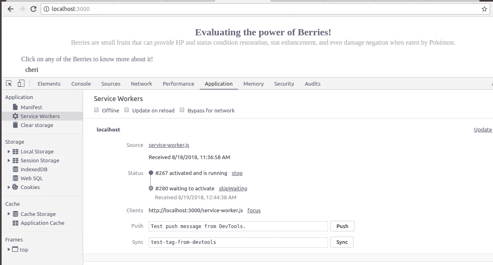
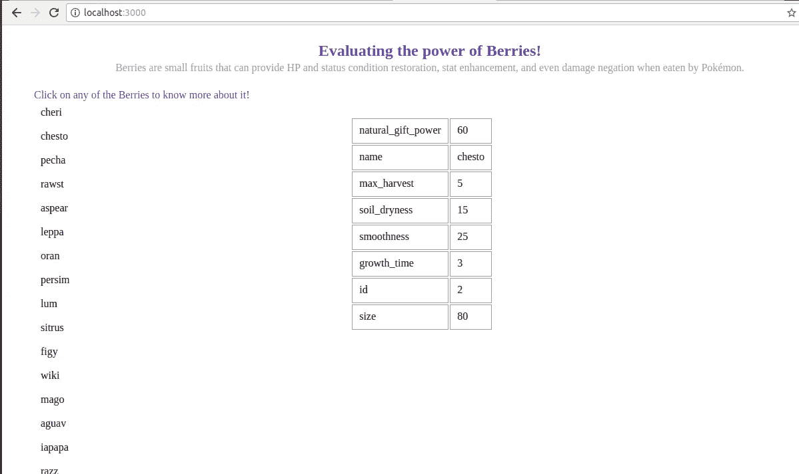
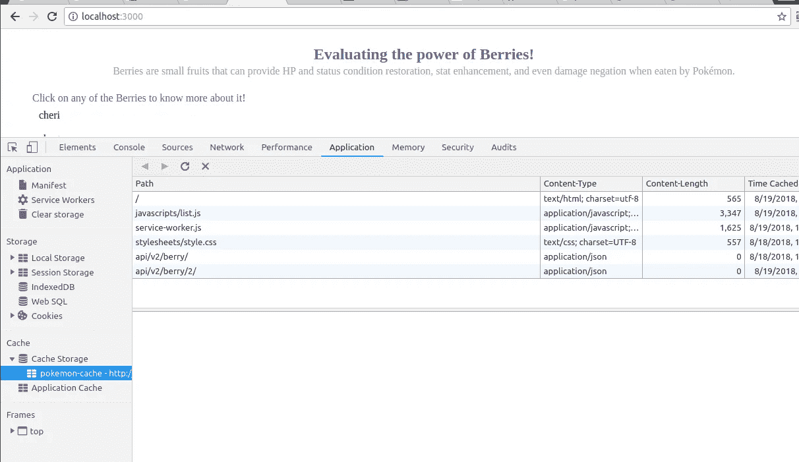
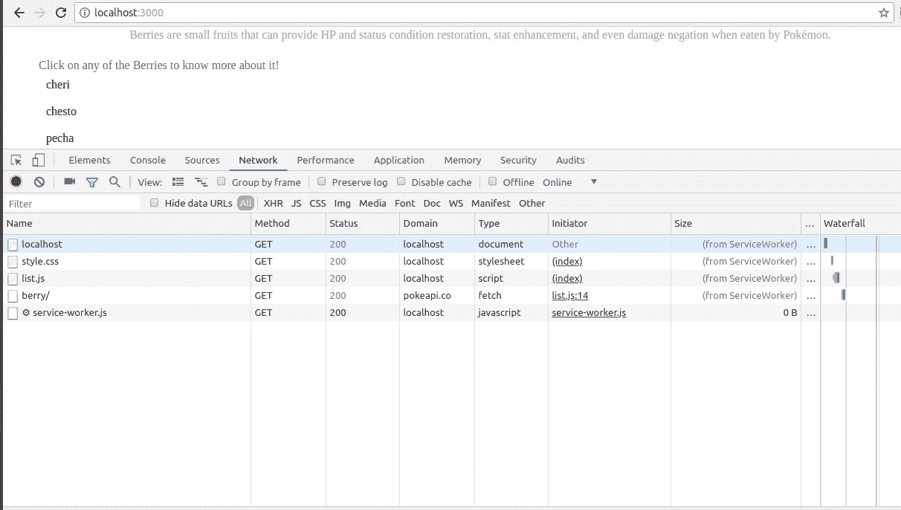

# 构建口袋妖怪应用程序以评估浆果和服务人员的力量

> 原文：<https://medium.com/hackernoon/building-pokemon-app-to-evaluate-the-power-of-berries-service-worker-176d7c4e70e3>


Credits: [http://otakukart.com](http://otakukart.com)

首先，如果你想知道浆果是什么，浆果是一种小水果，当被口袋妖怪吃掉时，可以提供 HP 和状态条件恢复，属性增强和伤害否定。如果你想知道这和服务人员有什么关系？接下来是很酷的事情——我们将构建一个口袋妖怪网络应用程序来演示服务人员的工作。如果你想对什么是服务人员有个大概的了解，请阅读我在[服务人员基础](https://hackernoon.com/service-workers-62a7b14aa63a)上的博客。

我们将使用 *express-generator* 创建一个应用程序框架。对于 restful Apis，我们将使用[PokeApi](https://pokeapi.co/)——它提供了一个广泛的 API 列表，详细列出了从 *Pokemon* 到*Berry flavors*的所有内容。我们将为这个项目使用两个简单的 APIs 一个获取浆果列表，另一个将基于许多参数评估每个浆果的能力。这个项目的主要目的是利用其离线优先功能来利用服务人员的力量。在这个过程中，我们将看到如何缓存资源和 API 响应，以便应用程序能够无缝地交付数据，即使没有互联网连接。

附言:为了充分利用这个博客，请在阅读时创建应用程序。

让我们从安装*快速发电机*开始。
`*npm install express-genertor -g*` (-g 标志告知 npm 全局安装快速发电机)。

一旦这样做了，就做 *express pokemon-app* (我想把我的项目命名为 *pokemon-app* )。你想叫它什么都可以)。搭建的常用方式是*express—view = pug pokemon-app*(—view = pug 告诉 express 项目中要用到的视图引擎。如果不指定该部分，它将使用默认的视图引擎，即 *jade* 。如果你像我一样，你会想使用简单的 HTML 来解决这个问题。在检查完 express generator 为我们创建的文件夹结构后，我们将把我们的视图引擎从默认的 jade 更改为 HTML。有 4 个文件夹— bin、public、routes & views 和 2 个文件 app.js & package.json。删除 public、routes & views 文件夹中的所有内容。我们将从头开始建造它。我们不会更改 bin 文件夹中的任何内容。

Appjs 通过将你的项目与 apt 中间件& routes 连接起来，完成设置项目的简单工作。默认为索引&用户自带两条路线(可以勾选`indexRouter` & `usersRouter`)。你可以去掉`usersRouter`，因为它不再需要了。在那下面，有一个视图引擎设置的代码。第一行— *app.set('views '，path.join(__dirname，' views '))；*设置视图目录，第二个设置视图引擎。要使用 HTML 作为视图引擎，您必须安装`ejs`，然后将视图引擎设置为

```
*app.engine(‘html’, Ejs.renderFile);*
*app.set(‘view engine’, ‘html’);*
```

让我们设置我们的路线—在 routes 文件夹中创建 *index.js* 。它所做的只是在“/”URL 上呈现索引视图。在视图文件夹中创建 index.html。请在我的 [GitHub 库](https://github.com/ankita1910/pokemon-app)中查看它的代码。它是非常直接的 HTML。现在是主要部分——让我们在公共目录中创建这些文件夹， *javascript* & *样式表*。请从我的 [GitHub 代码](https://github.com/ankita1910/pokemon-app/blob/master/public/stylesheets/style.css)中复制 CSS 文件 *style.css* 。在公共目录中的 javascript 目录&s*service-worker . js*内创建 *list.js* 。我们将详细讨论这两个文件。您可以运行`npm install`来获得所有的本地依赖项，然后运行`npm start`来运行项目。查看 *localhost:3000* 。

现在让我们跳到有趣的部分—
因此，使用服务工作者的第一步是注册服务工作者脚本，我们在 page 的 javascript 文件中完成这项工作，在我们的例子中，这个文件是 *list.js* 。让我们开始构建 *list.js* 。查看下面的服务人员注册片段。

我们在这里使用了一个[life](https://developer.mozilla.org/en-US/docs/Glossary/IIFE)函数。在注册服务人员之前，我们正在检查浏览器是否支持它。完成后，您可以在浏览器中看到打印的*控制台*语句。下一步是安装我们的服务人员。让我们在 *service-worker.js* 文件中编写一个安装事件处理程序。

当您重新加载页面时，您将看到*‘安装服务人员……’*控制台声明。安装事件是设置缓存的好地方。我们将一些资源放在这里的缓存中。 *event.until* 使服务工作者保持活动状态，直到其中的所有语句都被执行。这是因为服务人员作为*事件驱动系统*运行。当它不做任何事情时，它会进入休眠状态以保存内存。服务人员尚未在页面上激活。安装成功后，进入*就绪*状态。

接下来是激活事件，这是一个清理旧缓存的好地方。

同样，如您所见，缓存删除逻辑位于`event.waituntil` 块中，原因与上述相同。所有这些都完成后，服务人员仍然没有为您的页面激活。在*维修工人*下 *DevTools* 的*应用*选项卡中检查相同的动作。这个源文件就是你的 *service-worker.js* 文件。当你重新加载页面时，服务人员将开始裁决。这是因为您的页面可能正在使用缓存中的一些资源，而突然之间，这些资源因为服务人员的*激活*事件而消失了。如果你还想让你的服务人员在激活后马上上电， *event.skipWaiting* 就是你的救星！像在激活事件中那样处理它。

查看下面的截图，以获得对*事件的正确理解。我的客户机上运行着一个旧的服务工作器实例。我更改了服务人员文件中的一些内容，并刷新了我的页面。(请注意，我没有以编程方式执行`skipWaiting`，因此在激活它的新实例时会有延迟)另外，请注意，服务人员不会在每次页面重新加载时都进行注册。*



Service Worker — skipWaiting

既然我们已经为我们的服务人员布置好了房间，让我们看看如何最好地利用它。如前所述，我们将使用两个 PokeApis。 `[https://pokeapi.co/api/v2/berry/](https://pokeapi.co/api/v2/berry/)`是一个获取浆果列表的 GET 请求。我们将使用基于 ES6 Promise 的 *fetch* 方法来进行 API 调用。在 Berries list API 成功的基础上，我们将列表呈现给 DOM。

`renderBerriesList`方法遍历列表并将每个浆果呈现给 DOM。我们在这里使用一些辅助函数来创建节点&并将它们附加到 DOM 中。请查看 [list.js 代码](https://github.com/ankita1910/pokemon-app/blob/master/public/javascripts/list.js)以了解更多关于这些助手方法的信息

当你点击任何一个浆果时，就会有一个 API 调用来获取这个特定浆果的属性。我们在右侧以表格的形式展示了这些属性。



如果你幸存到现在，你会见证服务人员令人惊讶的离线优先功能。您在客户端发出的所有获取网络请求都要通过服务工作器的获取事件处理程序，它有能力修改将被发送回客户端的响应。查看 *service-worker.js* 文件中的获取事件处理程序。

`event.respondWith`让您编造答案。在这种情况下，我们首先检查对获取请求的响应是否存在于缓存中。如果它存在，我们直接从缓存中发送它，而不进行任何网络请求(瞧！).如果响应不在缓存中，我们对资源发出一个网络请求，并将其放入缓存中，以使后续的获取更快，并最终将响应发送回客户端。

在任何时间点，您都可以在“缓存存储”下的“应用程序”选项卡中看到缓存中的资源(在本例中，我们使用了 *pokemon-cache* )



Cache Storage

此外，当您发出网络请求时，检查 *DevTools* 的*网络*选项卡中的选项大小。因为获取浆果列表的获取请求已经通过服务工作者到达服务器，所以如果我们做得正确，它的响应应该被缓存。



Fetching resources from the Cache

现在，如果我们关掉互联网，我们仍然应该看到浆果列表。为了进一步实验，尝试加载两三个浆果的响应，然后在关闭互联网后再次检查它们。

这种离线优先的体验对于防止网络请求静态资源或不经常改变的资源非常有用。你可以在这里找到这个项目[的完整源代码。尽管如此，服务人员能做的还有很多。我会一篇一篇地报道这一切。](https://github.com/ankita1910/pokemon-app)

这是我之前博客的[链接，解释了服务人员的基本原则](https://hackernoon.com/service-workers-62a7b14aa63a)