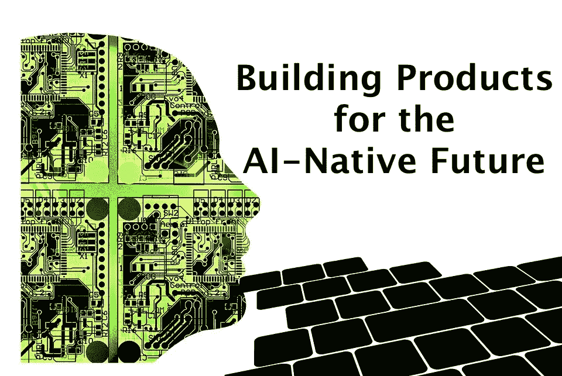

# 为人工智能的未来打造产品

> 原文：<https://medium.com/hackernoon/building-products-for-the-ai-native-future-824f26730651>

过去十年，我们一直在开发云产品和移动产品，这颠覆了几个行业，改变了我们的生活方式。移动技术让企业家能够利用相机和定位来打造 Instagram 或优步等产品。当我们展望未来时，很明显，除了云原生和移动原生，还有一些非常令人兴奋的东西，那就是[人工智能原生](/@larsbuttler/power-to-the-people-a-i-native-ad634a65871c#.prusiml35)。当你在构建“人工智能优先”时，你是在把人工智能作为设计过程的起点。它不再是添加酷的人工智能功能，而是删除人工智能之前的遗留功能，创建一个全新的以人工智能为中心的产品体验。

有几个因素使得向人工智能本地迁移成为可能:

*   工程师和科学家已经能够制造出更好的人脑工作模型，因此机器算法也越来越好。
*   由于移动和物联网设备，越来越多的数据被生成，可用于训练算法
*   以前不存在的原始计算能力

这也意味着企业家和产品经理需要重新思考这两种产品以及产品的制造方式，以使它们成为人工智能产品。人工智能原生产品将包含的一些特征和趋势是:

# 产品将变得更容易使用

AI-first 的产品更接近生物。由于机器学习，有史以来第一次计算机适应人类，而不是相反。用户在与他们互动上投入的精力要少得多，这导致了一个非常简单的核心产品简介:“它应该只是工作”。

实现这一点的一种方式是我们与机器互动的方式。个人电脑有着与独立键盘、鼠标等脱节的体验。手机通过触摸和缩放等功能使体验更加直接和“人性化”。与计算机自然互动的动力只会越来越强。相对于使用屏幕的交互，用户体验已经向“对话式”转变。系统将不得不利用人工智能的力量来实现与用户的对话。我们已经在语言中看到了这一点，可能很快我们也会看到手势。

我们也正在见证人工智能被用来提高用户界面的效率。Android 在这方面做得非常好。之前版本的 Android (Oreo)利用机器学习来做出主动决策，比如对你经常使用的应用进行排序。新版 Android 更进了一步。App Actions 使用机器学习，根据用户的习惯向用户推荐应用。它可以根据当前动作自动预测你的下一个动作，并向你显示一个快捷方式，直接带你到特定应用程序处理它的部分。例如，如果你每天在某个特定的时间预订一辆出租车去优步上班，Android P 会开始建议你这么做。

这些当然可以消除摩擦，使产品更容易使用。

# 更多优雅的失败

产品总是会失败，将来也会失败。产品经理和企业家将需要确保他们的人工智能产品能够优雅地处理低性能场景或故障。一种方法是增加更好的护栏，增加更多智能提示来设定用户期望，让产品更优雅地失败。

产品创建者也应该利用这个机会，为用户提供一种方法，立即重新标记数据，以进一步改进模型。例如，当用户点击拇指向下按钮时，聊天机器人不仅应该道歉，还应该询问用户的反馈。这种反馈可以很容易地防止类似的故障在未来再次发生。

此外，有了人工智能，预测产品故障将变得更加容易。人工智能算法还将能够管理不确定性，这意味着算法知道他们是否面临他们没有经验或不擅长解决的问题空间的一部分——然后他们可以外包给人类或回复到一组响应。最终，这将给用户带来更加满意和真实的体验。

当我们开发动态运行的系统时，我们还需要重新思考问答。我们需要实时错误检测模型，以便我们可以优雅地失败或让系统跳转到另一条行动路径。实现这一点的一种方法是从独立的应用程序获得反馈，该应用程序不断观察主系统并寻找异常或不准确的行为。一旦它检测到这种类型的行为，它会向主系统提供反馈，以便它可以调整自己的行动。

# 产品将使他们的用户

最好的人工智能产品使用户更有能力。最好的人工智能为用户完成一项任务；用户应该做尽可能少的工作来实现它。这些是真正自主的智能代理。

例如，人工智能产品将更好地理解他们的用户，并帮助他们更快地登机。这就是推荐系统的作用。它们允许用户很快上手。这些产品将缩短用户到 wow 时刻的旅程，并帮助初学者无需太多努力就能学会高级技能。

另一个例子是聊天机器人，如 Facebook Messenger 聊天机器人，它可以获取对话线索，帮助客户订购鲜花，而客户不必进入他们的网站，在几个产品中挑选合适的产品。

> 一个由人工智能驱动的真正伟大的应用程序将带来那个令人惊叹的时刻，一种完成以前不可能完成的事情的神奇感觉，就在盒子外面。以 Google Photos 为例，它可以检索与搜索查询相匹配的图片。或者快速键，它可以预测您接下来要键入的单词。

# 产品会有反馈回路

我们都会做一些 A/B 测试，衡量一些关键的东西。但这并不是系统中的一部分。这在基于人工智能的工具中很重要的原因是，系统得到的训练越多，反馈循环越多，就会变得越好。

> 一旦你把人工智能放到一个产品中，你应该会通过系统现在可以产生的学习看到该产品的持续改进。这导致更多的人使用该产品，这意味着它可以自行优化的数据增加了，你有望建立一个自我实现的改进周期，从而带来指数级的成功。反馈系统将允许产品学习并变得更聪明。

这也意味着产品经理和企业家会教育用户，他们的模型会随着时间的推移而改进。用户投入越多，产品就能提供越好的预测或推荐。

# 对错误的高度容忍

当构建人工智能产品时，你通常会构建一个强大的产品，它可以很好地完成 90%的任务，但是你只剩下剩下的 10%。问题是，剩下的 10%会怎么样？如果你决定要建立你的机器学习系统来处理它，你通常会面临收益递减。达到 90%的准确率通常需要一个月，达到 95%的准确率需要一年，达到 99%的准确率需要十年。

如果你想发布一个机器学习产品，你真的想发布一个能容忍偶尔出错的产品。

例如，谷歌为 Gmail 提供了这些智能回复。他们会在你邮件的底部给出建议的回复。如果其中一个回复不是很好，没关系。如果有一个回复是好的，用户就点击它，这样可以节省一些时间。这是部署机器学习产品的一种非常好的方式。它不是代表用户做出响应，而是简单地给出选项建议。

> 一个成功的机器学习产品会小心翼翼地选择战斗。它是关于选择运输对偶然错误有高容忍度的东西，烘焙成产品的本质。即使您想发布代表用户做某些事情的产品，获得人工批准也是一个不错的方法。

# 产品指标将会改变

人工智能产品可以与传统产品有很大不同。在传统产品中，成功通常是通过交付总是让客户满意的“确定性”产品来衡量的——硬件产品在标准条件下具有相同的行为，软件产品中相同的用户操作会产生相同的预期响应。

> 然而，人工智能驱动的产品可能并不总是具有确定性的行为，事实上可能会产生与直觉相反的结果——个性化推荐系统在学习额外的偏好后，可能会对用户的行为产生不同的结果。在基于人工智能的产品中，成功的矩阵看起来会有所不同，因为可能会引入概率和统计术语。

目前，当我们设计产品时，我们会考虑应用程序的屏幕和流程。我们将越来越需要考虑我们试图实现的目标。例如，在一个新闻应用程序中，用户花费的时间可能不是一个好的指标，特别是当大部分时间都花在搜索有趣的内容上时。应用程序本身应该能够为用户建议相关的内容。

# 产品将变得更加垂直

将原始数据转化为可以从中导出模式的东西是创建特征的过程。一个特征仅仅是被观察现象的一个单独的可测量的属性。这些特征的产生和选择是艺术、科学、实验和学习的结合。最初的特性生成需要领域专业知识。如果你很了解你正在看的数据，那么你的特性的起点可能会比那些不知道数据可能显示什么的人更强。

此外，随着技术变得水平，产品变得更加垂直。许多技术将是开源的，算法本身是独立于领域的，可以在不同的问题领域工作。这意味着，当专有代码处于主流人工智能列车的路径上时，它不再是可防御的资产。因此，对于公司来说，区别在于他们是否选择了正确的问题来解决。这将伴随着领域专业知识。在这一波人工智能中，公司会发现非常垂直的问题，他们确实拥有一个狭窄的垂直。

# 新产品创意来自新功能

就像手机的定位功能导致了 Ubers of the world 的诞生一样，人工智能也将带来基本的功能，让企业家和产品经理能够创造新的功能和产品。

例如，人工智能系统在分类方面做得非常好。这可以用于用户存储或搜索东西的方式。

零售公司正在使用人工智能驱动的视觉搜索来帮助购物者迅速找到他们想要的时装。Pinterest 最近推出了一款名为 Lens 的视觉搜索工具，该工具使用机器视觉来检测网络上或 Pinterest 库中的项目，并建议相关项目。

另一个核心能力是预测。我们已经在营销自动化中看到了这一点，预测电子邮件活动或营销计划的成功可以帮助公司不断改进营销工作(在显示、文本、视频甚至直接邮件中)。

另一个例子是认证。人工智能将允许企业家采用更加顺畅的方式来认证用户。人脸检测、指纹和语音服务将成为个人和企业访问信息和数据的常用方式。

# 结论

当考虑为 AI-native 构建产品时，企业家和产品经理必须考虑 3 件不同的事情。其中最重要的是:

*   他们必须研究机器学习算法。
*   他们必须致力于将利用该算法的产品设计。
*   他们还需要开发支持和扩展该算法的系统，以及大量数据。

他们必须让这三样东西一起工作，以这样一种方式，使用产品的用户发现它真的有用，并真正爱上这个产品。

无论你是行业巨头还是新兴创业公司，现在都是时候拥抱人工智能，开始定义你的未来了。下一代价值数万亿美元的产品和服务将为人工智能本地人打造，甚至会比上一代依靠移动和云的价值数十亿美元的产品和服务出现得更快。