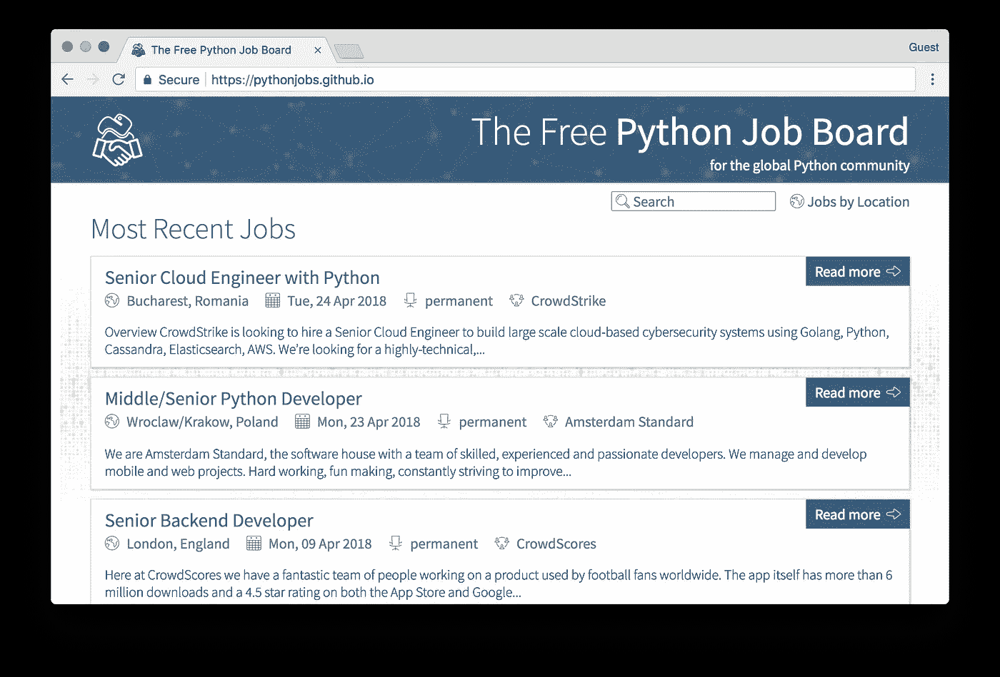
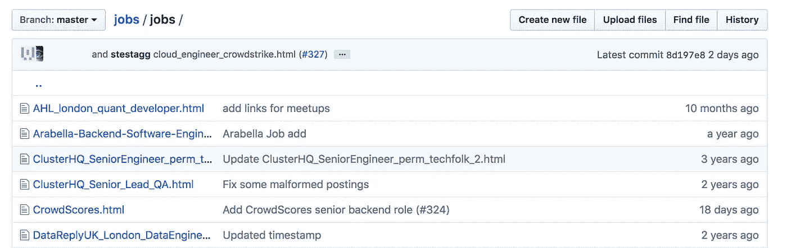
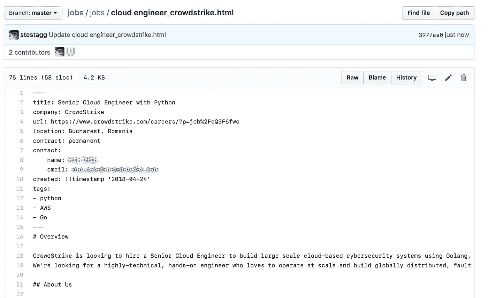
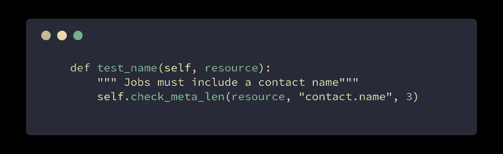
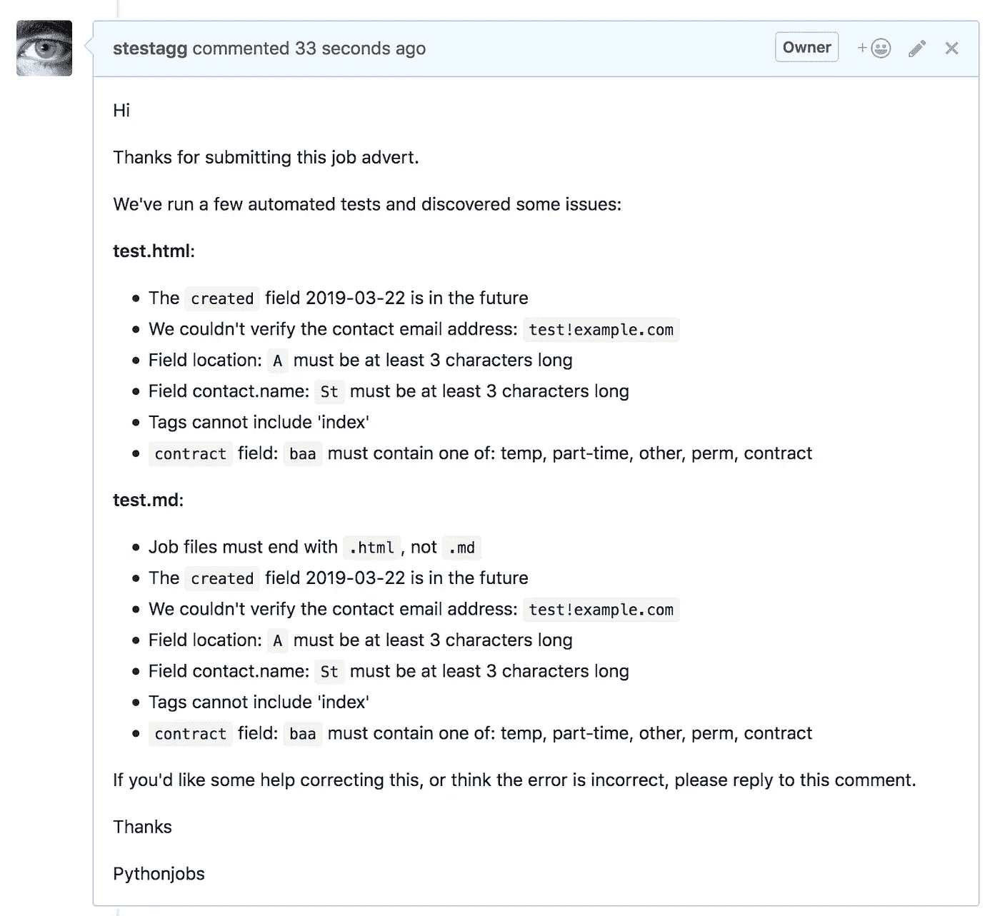
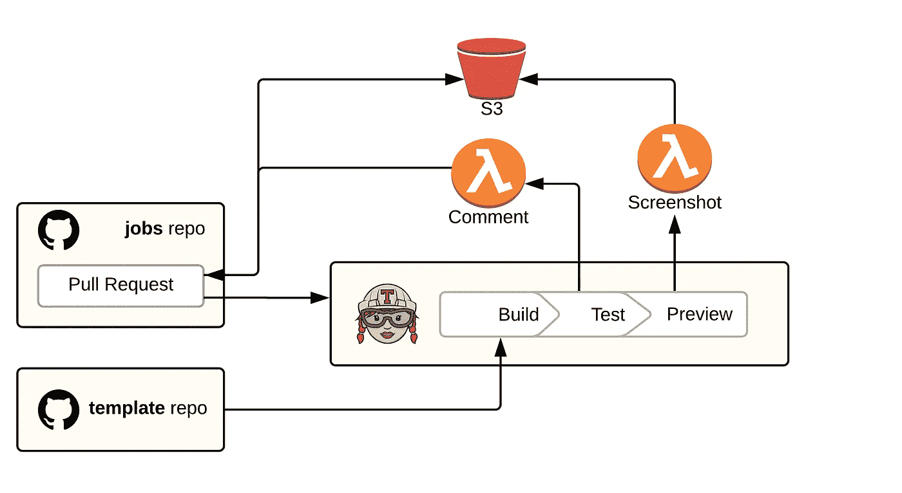
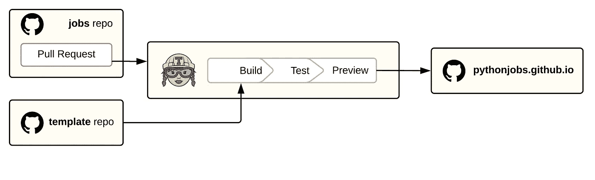
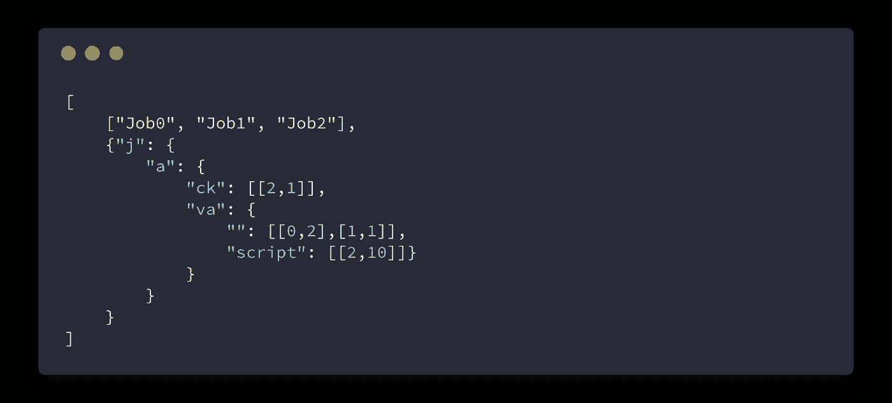
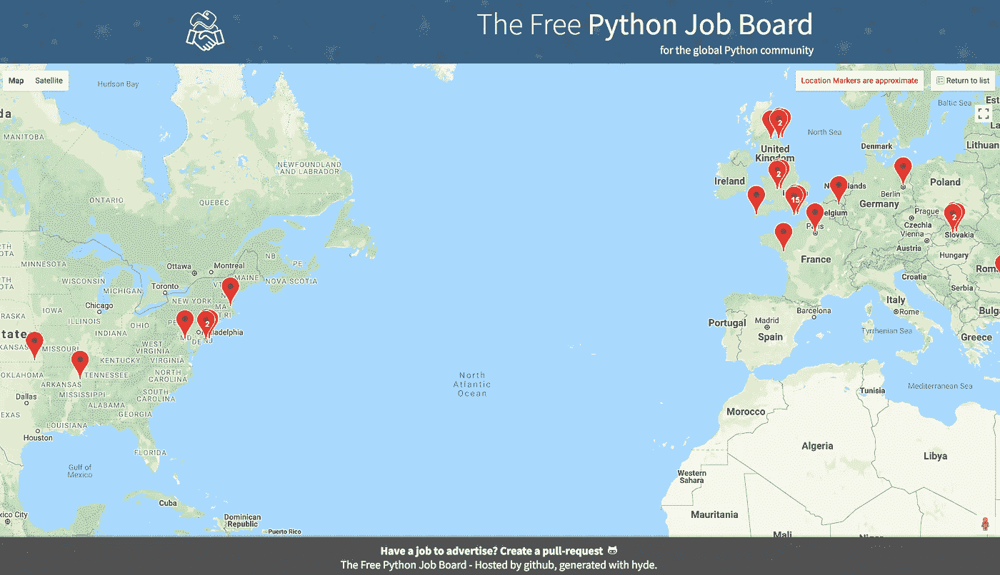

# 我们如何在一周内构建 pythonjobs.github.io

> 原文：<https://medium.com/hackernoon/building-pythonjobs-github-io-6119cd708802>

## 现代开源工具令人惊叹

不久前，一些同事(@ salimfhadley 和@lordmauve)提到了他们的一个想法:

> 构建一个使用 git pull 请求提交新工作的工作网站有多难？

当时，python.org 就业委员会已经停机维护了近一年，没有任何明显的免费、适度的地方来列出或查看工作机会。巧合的是，在那个时候，我们的雇主正在招聘，我们都参与了这个过程。

他们的想法是建立一个静态网站，使用 GitHub pull 请求来管理提交。

这个想法很棒，原因有很多:

*   有很多工具和服务可以让管理陌生人的变更请求变得容易
*   整个过程是公开的、透明的，并且很容易理解
*   稍微多一点技术含量的提交过程自然会吸引更多有技术意识的提交者。
*   都是自由奔跑！(除了一些库存图像成本和我们的个人时间)

大约在接下来的一周，我们构建了[https://python jobs . github . io](https://pythonjobs.github.io)

Screenshot of the pythonjobs.github.io front page

它在很多方面都非常成功:

*   尽管没有广告或推广(除了刚开始的时候)，我们每周都会收到几份申请，并且有持续几年的稳定流量。
*   这是我们推出几周后，python.org 官方就业委员会上线的一个因素😎。

# 静态站点

该网站是使用 python jekyll 的替代品 [hyde](https://github.com/hyde/hyde) 构建的(hyde 的开发进度一直很慢，它的文档也有点少，所以我会犹豫是否在新项目中使用它，但它非常适合我们的目的)。

广告商使用 [GitHub](https://hackernoon.com/tagged/github) pull request UI 提交 pull 请求:每个列表都是一个单独的 Markdown 文件(扩展名为. html):

带有 YAML 标题和降价内容:

一旦合并了一个变更，就使用一个 [Travis](http://travis-ci.org) 作业构建站点，并自动部署。

# 适度

手动检查大型 yaml/markdown 文件既耗时又容易出错，因此我们构建了一组测试，对每个 pull 请求运行这些测试，以确保基本检查通过(我们仍然手动检查每个提交的内容，但更多的是关于文本内容，而不是语法)。

这是作为在 jobs 目录中的每个节点上运行的 hyde pluign 实现的，并检查许多事情。例如，已经提供了联系人姓名:

Excerpt from our [job testing script](https://github.com/pythonjobs/template/blob/master/hyde/jobcheck.py)

如果其中任何一项没有通过，那么与任何 CI 测试一样，拉请求会被标记为失败，阻止我们盲目批准它。

我们遇到的一个问题是，导致失败的实际错误可能非常隐蔽。失败的原因显示在 travis 构建日志中，作为回溯，带有友好的消息，但是..

大多数给我们发广告的人都是招聘人员，或者非技术性的招聘经理。通常这是他们第一次和 GitHub 打交道。为了达到创建 PR 的阶段，他们已经不得不掌握许多不熟悉的概念(git/github、markdown、yaml、pull requests 等等..).要求他们意识到(没有明确的指示)他们必须点击构建失败日志，解析输出直到他们找到回溯，然后提取相关信息是一个步骤(或者 10！)太远了。

这让我最近增加了一个工具，可以用友好的细节直接评论公关(类似于[https://www.travisbuddy.com/](https://www.travisbuddy.com/))。评论以友好、易懂的方式解释了测试失败的原因:

当测试通过时，会有另一个脚本使用 phantomjs 和 selenium 抓取清单的屏幕截图，并将那个[作为注释](https://github.com/pythonjobs/jobs/pull/327#issuecomment-384467178)发布，以使审查更容易。

# 基础设施

我们使用三个 git repos 来运行 pythonjobs。这看起来比需要的更复杂，但是旨在保持提交过程简单:

*   [**jobs**](https://github.com/pythonjobs/jobs) **:** 只是保存了 jobs 列表文件，以及一些 travis 相关的脚本。这是提交者创建列表时必须与之交互的唯一回购。
*   [**模板**](https://github.com/pythonjobs/template) :拥有所有与 hyde 相关的代码，用于生成完整的静态站点、图形资源、构建脚本等。
*   [**python jobs . github . io**](https://github.com/pythonjobs/pythonjobs.github.io):包含生成的静态站点，由 github 页面直接托管。

构建脚本根据需要整合并合并回购:

当 PR 合并到 master 时，同一个 CI 作业将结果提交到输出 repo:

Github 为我们处理所有剩下的事情，几秒钟后，这些变化就可以在网上看到了。

我们通过使用 travis 安全环境变量来保存 github 密钥，从而将更改推送到实时回购。不幸的是，出于良好的原因，您不能在来自非成员的 pull 请求中使用安全环境变量(他们可能会更改 travis 脚本，使其打印出秘密)

为了解决这个问题，有一些简单的 Amazon lambda 函数来处理测试 PR 时生成的注释。

# 搜索

尽管这是一个静态网站，没有服务器代码，但我们可以对所有职位列表进行全文搜索:

这与 Sphinx 客户端搜索的实现非常相似(我后来才知道)。在构建期间，[一个脚本](https://github.com/pythonjobs/template/blob/master/hyde/siteindex.py)查看每个工作列表，并从广告中的每个单词构建一个紧凑的基于 JSON 的前缀树。

使用 [python](https://hackernoon.com/tagged/python) [词干库](https://pypi.org/project/stemming/1.0/)对单词进行词干处理，并根据单词出现的位置进行评分(标题中的单词得分高于正文中的单词)。

然后，这个前缀树被输出为 JSON 文件，由浏览器读取，并用于提供实时搜索功能。JSON 首先包含每个作业的数组，然后是作为一组嵌套映射的前缀树。每个映射叶为作业名称数组提供一个索引和一个相应的分数:

在这个例子中，单词 **jack** 出现在 *Job2* 中，得分为 1。而 **java** 在 *Job0* 中出现两次(得分 2)，在 *Job1* 中出现一次

突出显示是在客户端通过简单的基于正则表达式的工作列表搜索完成的。

# 位置

我们要求提交者给我们一个基于文本的位置(美国华盛顿)，不要太在意那个位置有多精确(有些公司不喜欢公开发布确切的位置)。在此基础上，我们生成了所有活动职位列表的 google maps 视图:

那么，我们如何从“伦敦的伦敦桥”到地图上的一个标记呢？

google geocoding api 可以将位置名称转换成 google maps 所需的经纬度坐标，因此构建脚本会对每个招聘广告进行查询，以找到它的确切位置。

因为这是在公共场合进行的，我们不能使用秘密的 API 密钥来查询这些位置，所以 Google 很快抑制了这些请求。为了避免这种情况，jobcheck 脚本使用 N+1 缓存，其中先前查询的结果存储在[站点呈现的输出](http://pythonjobs.github.io/media/geo.json)中，并用于确保我们在每次构建时只查询新位置(几乎总是只有 1 个位置)。

然后，这些数据被转换成 maps.html 页面中的内联 JS 数据，这样我们就可以在页面加载时用标记填充地图。

# 开源代码库

GitHub 是，也应该是，主要是一个代码托管站点。它做得很好。GitHub 页面旨在允许一些文档和轻量级主机支持代码项目。

Pythonjobs 不是这两者之一，所以我提前询问了 GitHub 我们这样做是否合适。他们非常支持这个想法，他们友好的回复让这个网站的建立变得非常愉快。

作为开放的一部分，Sal 的一个想法是强制所有提交的内容都要标明被雇佣公司的名称。虽然这给一些招聘人员带来了问题，但它的好处是让一切都变得简单，几乎没有模糊的语言或对地点的担忧。

# 摘要

事实上，我们三个人可以在大约一周内免费建立一个网站列表，并在最少参与的情况下运行几年，这充分说明了当今开源项目可用的免费工具的质量和可用性。