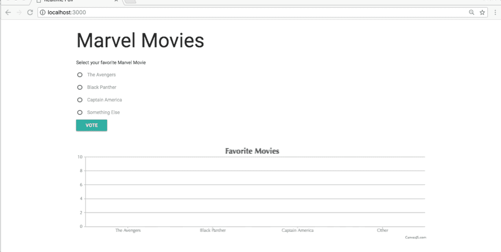
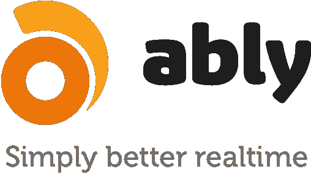

# 使用 Nest.js 和 Ably 构建实时 Web 应用程序

> 原文：<https://medium.com/hackernoon/building-real-time-web-applications-using-nest-js-and-ably-d85887e81f06>

到处实时！如果您是行业趋势的忠实追随者，尤其是 web 开发生态系统，您会同意我的观点，即更大比例的用户喜欢 web 应用程序的实时响应。

这可以是通知、事件、警报、即时消息或任何类似的形式。只有少数平台提供适用于实时数字体验的实时技术，如游戏和赌博、聊天和社交、数据内容、通知和警报等。这是一家公司大放异彩的地方。

为了探索实时技术，我一直想巧妙地尝试一下，在看完这个[帖子](https://blog.ably.io/news-flash-ably-is-no-longer-a-pub-sub-messaging-platform-long-live-pub-sub-ee767f29d71a)后，我不得不开始工作。所以当我终于有机会时，我能够通过构建下面的应用程序来探索由[巧妙地](https://www.ably.io/)提供的实时功能的神奇之处:



这是一个用 Nest.js 构建的实时民意调查，由[巧妙地](https://www.ably.io/)提供支持。在这篇文章中，我将一步一步地记录我是如何构建上述演示的过程。

# 先决条件

为了充分利用本教程，建议对 TypeScript 和 Node.js 有一个基本的了解。

# 工具

我们将使用以下工具来构建此应用程序:

*   [Nest.js](https://nestjs.com/) :一个渐进式 Node.js 框架，用于构建高效且可伸缩的服务器端应用。它利用 TypeScript 创建可靠且结构良好的服务器端应用程序。如果你非常熟悉 Angular，Nest.js 会给你类似的构建 Angular 应用的经验，但是是在后台。尽管使用现代的 [JavaScript](https://hackernoon.com/tagged/javascript) (Typescript)，它与普通的 JavaScript 非常兼容，这使得它非常容易上手。你可以在这里了解更多信息[。](https://docs.nestjs.com/)


Nest.js

*   Ably:一个优秀的[实时](https://hackernoon.com/tagged/realtime)消息传递平台，可以很容易地为应用程序添加实时功能。



Ably Realtime

*   Axios:一个基于 promise 的 HTTP 客户端，可以在浏览器和 node.js 环境中工作。
*   CanvasJS:一个用于数据可视化的响应性 HTML5 图表库。
*   最后，我们还需要使用 npm 安装一些模块

# 设置应用程序

使用 Nest.js 设置一个新的应用程序非常容易，但是在我们继续之前，假设您已经安装了 node 和 npm。如果没有，请查看 [node.js](https://nodejs.org/en/download/) 和 [npm](https://www.npmjs.com/get-npm) 网站了解安装步骤。

首先，使用下面的命令克隆一个新的 starter 存储库，将目录更改为新创建的项目文件夹，最后安装 Nest.js 应用程序所需的所有依赖项。

```
$ git clone https://github.com/nestjs/typescript-starter.git ably-nest-poll$ cd ably-nest-poll$ npm install
```

# 运行应用程序

```
$ npm run start
```

这将在 Nest.js (3000)使用的默认端口上启动应用程序。前往 [http://localhost:3000](http://localhost:3000/)


# Ably 帐户设置

如果你还没有一个 ably 账户，去他们的网站创建一个。


按照剩下的过程，一旦你完成了，你应该有一个带有私钥的免费账户。您将在您的帐户仪表板上看到一个“API 密钥”,这对我们很重要，因为我们将在教程的后面使用它来使用基本认证方案连接到。


你会看到，默认情况下，[巧妙地为你创建了一个应用程序，你可以随时开始使用。但是，您也可以创建一个新的应用程序，并根据需要进行配置。](https://www.ably.io/)


我给我的取名为`'ably-nest-poll'`。请随意选择任何符合您目的的名称。


# 属国

使用[节点包管理器](https://www.npmjs.com/)为应用程序安装依赖关系:

```
npm install ejs ably --save
```

# 引导应用程序

Nest.js 中的一个核心文件是`'main.ts’`这个文件包含了引导我们的应用程序所必需的函数。Nest 支持流行的 MVC 模式，因此允许使用模板引擎。打开`'.src/main.ts’`，填入:

```
**import** { NestFactory } **from** '@nestjs/core';
**import** { ApplicationModule } **from** './app.module';**//**import express module **import** * **as** express **from** 'express';// path **import** * **as** path **from** 'path';

   **async function** bootstrap() {
   **const** app = **await** NestFactory.create(ApplicationModule);

   // A public folder to serve static files
   **app**.use(express.static(path.join(__dirname, 'public'))); **app**.set('views', __dirname + '/views'); // set ejs as the view engine
   **app**.set('view engine', 'ejs');

   **await** app.listen(3000);
}
bootstrap();
```

我对该文件的默认配置所做的唯一添加是导入 Express module，path，并最终将 [ejs](http://ejs.co/) 设置为应用程序的视图引擎。

# 设置视图

为了呈现 HTML 输出并向用户显示应用程序，我们将在`src`文件夹中创建一个名为`views`的文件夹。现在，在这个新创建的文件夹中，创建一个新文件，命名为`index.ejs`

然后将以下代码添加到您的`'index.ejs'`文件中:

```
<!DOCTYPE html>
<html lang="en">
<head>
    <meta charset="UTF-8">
    <meta name="viewport" content="width=device-width, initial-scale=1.0">
    <meta http-equiv="X-UA-Compatible" content="ie=edge">
    <link rel="stylesheet" href="https://cdnjs.cloudflare.com/ajax/libs/materialize/0.100.2/css/materialize.min.css">
    <title>Realtime Poll</title>
</head>
<body>

    <div class="container">
        <h1> Marvel Movies </h1> 
        <p> Select your favorite Marvel Movie </p>   

        <form id="opinion-form">
            <p>
                <input type="radio" name="movie" id="avengers" value="The Avengers">
                <label for="avengers">The Avengers</label>
            </p>

            <p>
                <input type="radio" name="movie" id="black-panther" value="Black Panther">
                <label for="black-panther">Black Panther</label>
            </p>

            <p>
                <input type="radio" name="movie" id="captain-america" value="Captain America">
                <label for="captain-america">Captain America</label>
            </p> 

            <p>
                <input type="radio" name="movie" id="other" value="Other">
                <label for="other">Something Else </label>
            </p>
            <input type="submit" value="Vote" class="btn btn-success"/>
        </form>

        <br><br>
        <div id="chart-container" style="height:300px;width:100%;">

        </div>
    </div>

    <script src="https://code.jquery.com/jquery-3.3.1.js" integrity="sha256-2Kok7MbOyxpgUVvAk/HJ2jigOSYS2auK4Pfzbm7uH60=" crossorigin="anonymous"></script>
    <script src="https://cdnjs.cloudflare.com/ajax/libs/materialize/0.100.2/js/materialize.min.js"></script>
    <script src="https://cdnjs.cloudflare.com/ajax/libs/axios/0.17.1/axios.js"></script>
    <script src="http://cdn.ably.io/lib/ably.min-1.0.js"></script>    
    <script src="https://cdnjs.cloudflare.com/ajax/libs/canvasjs/1.7.0/canvasjs.min.js"></script>    
    <script src="/main.js"></script>
</body>
</html>
```

这将作为我们的实时投票应用程序的主页。为了让这个页面看起来更好看，我为 Materialize、Ably、CanvasJS 和 JQuery 分别添加了一个 CDN 文件。此外，我还包含了一个带有单选按钮输入字段的表单，最后链接了一个名为`main.js`的自定义脚本，我们将在本教程的后面部分访问它。

# 搬运路线

控制器层在 Nest.js 中处理路由。它接收传入的请求，并向客户端返回响应。Nest 使用控制器元数据`'@Controller'`将路由映射到特定的控制器。现在，我们将利用默认控制器来设置我们的演示应用程序的主页。因此，编辑`'.src/app.controller.ts'`并添加如下所示的代码:

```
**import** { Get, Controller, Res } **from** '@nestjs/common';

@Controller()
**export class** AppController {
   @Get()
   root(@Res() res) {
    res.render('index');
  }
}
```

上面的代码让我们通过使用`@Res()` 装饰器注入响应对象来操作响应。这将确保 Nest 将每条`'/'`路径映射到`'index.ejs'`文件。

# 创建控制器

我们需要构建的下一件事是轮询控制器。一旦用户做出选择并提交投票，这将处理每个请求。因此，继续在您的`'src'`文件夹中创建一个名为 **poll** 的新文件夹，然后在其中创建一个文件`'poll.controller.ts'`。将以下代码粘贴到新创建的文件中。

```
**import** { Controller, Post, Res, Body } **from** '@nestjs/common';// import pollService **import** { PollService } **from** './poll.service';

@Controller('poll')
**export class** PollController { // inject service
    **constructor**(**private** pollService: PollService) {}

    @Post()
    submitVote(@Res() res, @Body() poll: **string**) {
        **this**.pollService.create(poll);
        res.render('index');
    }
}
```

快速浏览一下上面的代码，您会发现我们导入了一个服务，并通过构造函数将它注入到控制器中，这是 Nest 推荐的，目的是确保控制器只处理 HTTP 请求。该服务将执行一项任务，将有效载荷发布到[中](https://www.ably.io/)。我们稍后将创建这个服务`PollService`。

此外，**@控制器(' poll')** 告诉框架，我们期望这个控制器响应发布到 **/poll** 路由的请求。

# 实时服务

基本上，我们希望利用 [Ably](https://www.ably.io/) 的核心功能之一，即将消息或有效负载发布到 [Ably](https://www.ably.io/) ，并确保该通道上的每个连接客户端或设备通过订阅的方式实时接收它们。这是[真正大放异彩的地方；您可以专注于构建应用程序，并允许平台使用其内部基础设施来管理通信，而无需担心这一点](https://www.ably.io/)

让我们在 Nest.js 中创建一个组件作为服务。这将用于在指定通道上向[发布有效载荷。](https://www.ably.io/)

Nest.js 中的控制器只处理 HTTP 请求，将复杂的任务委托给组件。这里的组件是带有@Component decorator 的普通 TypeScript 类。因此在 **poll** 文件夹中创建一个新文件，命名为`poll.service.ts`

```
**import** { Component } **from** '@nestjs/common';

@Component()
**export class** PollService {

    **private** poll: **string**;

    create(poll) {
        **const** Ably = require('ably'); // replace with your API Key 
        **var** ably = **new** Ably.Realtime('YOUR_KEY'); **var** channel = ably.channels.get('ably-nest');

        **const** data = {
            points: 1,
            movie: poll.movie
        };

        channel.publish('vote', data);
    }
}
```

这里，我需要前面安装的 ably 模块，并传入所需的 API 键。此外，我创建了一个独特的频道`ably-nest`供客户订阅。我还有 publish 方法，它接受两个参数，一个是可选的消息事件名称，另一个是要发布的有效负载。

# 将这些点连接起来

目前，我们的应用程序不能识别任何新创建的控制器和服务。我们需要通过编辑我们的模块文件`'app.module.ts'`来改变这一点，并将控制器放入`'controller'`数组，将服务放入`'@Module()`装饰器的`'components'`数组。

```
**import** { PollController } **from** './poll/poll.controller';
**import** { Module } **from** '@nestjs/common';
**import** { AppController } **from** './app.controller';
**import** { PollService } **from** './poll/poll.service';

@Module({
  imports: [],
  controllers: [AppController, PollController],
  components: [PollService],
})
**export class** ApplicationModule {}
```

# 巧妙地插入客户端并更新用户界面

在最后阶段之前简单回顾一下。到目前为止，在本教程中，我们已经

*   创建了一个带有单选按钮的表单，供用户投票和提交投票。
*   我们进一步在[上创建了一个账户](https://www.ably.io/)
*   建立主页
*   创建了一个控制器来处理 post 路由。
*   设置一个服务，将有效载荷发布到[上的一个命名通道`ably-nest`上](https://www.ably.io/)并且
*   最后，我们在应用程序模块中注册了新创建的控制器和服务。

还记得我们在`index.ejs`文件中包含了一个定制的`'main.js'`文件吗？继续在`src`文件夹中创建一个名为`public`的新文件夹，然后在其中创建`main.js`文件。此外，将以下代码添加到文件中。

```
**const** form = document.getElementById('opinion-form');

// form submit event
form.addEventListener('submit', (e) => {
    **const** choice = document.querySelector('input[name=movie]:checked').value;
    **const** data = {movie: choice};

    axios.post('/poll', data).then( (data) => {
        console.log(data);
    });
    e.preventDefault();
});

let dataPoints = [
    {label: 'The Avengers', y: 0},
    {label: 'Black Panther', y: 0},
    {label: 'Captain America', y: 0},
    {label: 'Other', y: 0},
];

**const** chartContainer = document.querySelector('#chart-container');

**if** (chartContainer) {
    **const** chart = **new** CanvasJS.Chart('chart-container', {
        animationEnabled: **true**,
        theme: 'theme1',
        title: {
            text: 'Favorite Movies'
        },
        data: [
            {
                type: 'column',
                dataPoints: dataPoints
            }
        ]
    });

    chart.render();

    **var** ably = **new** Ably.Realtime('YOUR_KEY');
    **var** channel = ably.channels.get('ably-nest');
    channel.subscribe('vote', **function**(poll) {

        dataPoints = dataPoints.map(x => {
            **if** (x.label == poll.data.movie) {
                x.y += poll.data.points;
                **return** x;
            } **else** {
                **return** x;
            }
        });
        chart.render();
    });
}
```

这个文件的内容是不言自明的，我们使用 **axios** 处理表单提交并发送到`poll`路径。

我们还为图表设置了一个默认的`dataPoints`,并最终订阅了从服务器发布的有效负载。

不要忘记从你的仪表板上用合适的 API 键替换`YOUR_KEY`。

# 将这一切结合在一起

如果开发服务器当前正在运行，请重新启动它，并导航到`http://localhost:3000`或`http://127.0.0.1:3000`进行检查。


就是这样。

如果你错过了任何一个步骤，你可以在 GitHub 的这里找到这个演示的代码

# 结论

在本教程中，我们成功实现了两件事:

1.  使用 Nest.js 构建 web 应用程序入门
2.  巧妙地探索[提供的实时功能](https://www.ably.io/)

如果你想了解更多关于频道、发布和订阅如何工作的信息，请看[实时频道&消息文档](https://www.ably.io/documentation/realtime/channels-messages)或者更好地了解 [Ably 特性](https://www.ably.io/features)的完整集合。