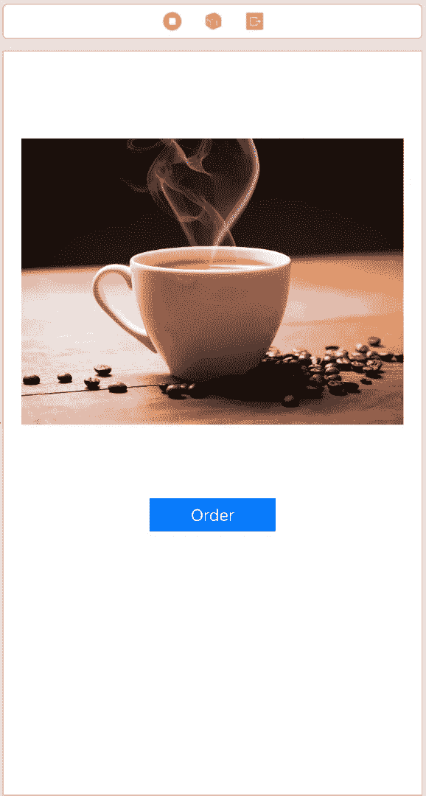
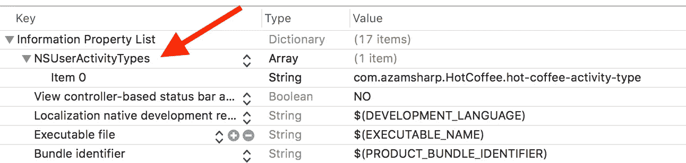
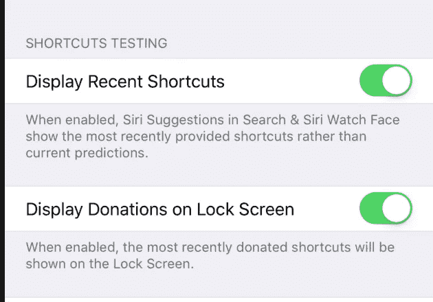
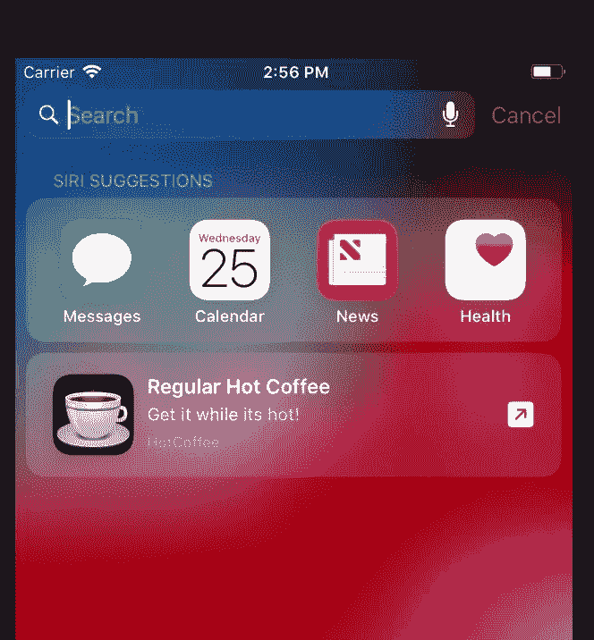
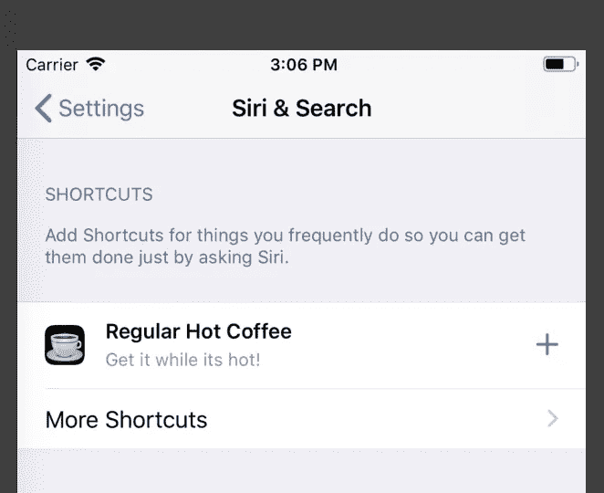

# 在 iOS 12 中使用 NSUserActivity 构建 Siri 快捷方式

> 原文：<https://medium.com/hackernoon/building-siri-shortcuts-using-nsuseractivity-in-ios-12-ff252339e98a>

## 更新:

*   [第 2 部分—使用意图开始使用 Siri 快捷方式](/@azamsharp/getting-started-with-siri-shortcuts-in-ios-12-using-intents-8206099aa5ce)

在 WWDC 2018 上，苹果宣布了 Siri [快捷方式](https://hackernoon.com/tagged/shortcuts)，它允许开发者建立体验，从他们的锁定屏幕上快速完成任务。用户将能够使用“**快捷方式**”应用程序管理第三方快捷方式，该应用程序将在 [iOS](https://hackernoon.com/tagged/ios) 12 公开发布时推出。

在本帖中，我们将介绍如何使用 NSUserActivity 创建 Siri 快捷方式。如果你的快捷方式是用来打开已安装的应用程序，那么 NSUserActivity 是一个很好的选择。你也可以使用 NSUserActivity 来恢复应用的状态，*虽然这个功能目前在 iOS 12 Beta 4* 中被破坏了。

# 先决条件

*   iOS 12 Beta 4 或以上版本
*   Xcode 10 Beta 4

# 履行

在 Xcode 中创建新的单视图应用程序项目，并将其命名为“ **HotCoffee** ”。HotCoffee 应用程序将负责在您需要时为我们订购热咖啡。用户界面的设计完全取决于你，我们采取了最简单的方法，如下所示。

为了让 Siri 了解我们喝咖啡的行为，我们需要将我们的活动捐赠给 Siri。在我们的场景中，捐赠活动的最佳时间是下订单的时候。以下代码用于捐赠您的活动。

我们从创建订单活动开始。这是通过使用 NSUserActivity 类并将活动类型作为字符串传递来实现的。现在不要担心活动类型，我们稍后会看到在哪里声明它。

接下来，我们确保我们的活动符合搜索条件和预测条件。这将有助于 Siri 更多地了解我们的活动。我们使用 **title** 属性设置快捷方式的标题。**suggestedInvocationPhrase**用于给用户一个想法，告诉他们应该为 Siri 语音快捷方式设置什么短语。

如果你想从你的活动中传递额外的信息到 iOS 应用程序，你可以把这些信息放在 userInfo 属性中。*在 Xcode 10 Beta 4 中，userInfo 属性不起作用，总是返回空字典*。

最后，您可以将视图控制器的 userActivity 属性设置为 orderActivity，并将其标记为当前属性。

在运行您的 iOS 应用程序并捐赠活动之前，让我们确保在 info.plist 文件中设置活动类型属性。添加一个新节点“ **NSUserActivityTypes** ”，如下图所示。

最后一件事！我保证:)

启动模拟器，进入**设置- >开发者**，向下滚动，确保“**快捷方式测试**下的两个选项都已启用。

厉害！现在您可以运行您的应用程序并下订单了。一旦您下订单，活动就会被捐赠，并且由于开发者快捷方式测试选项已启用，您将能够在 Siri 建议下看到您的活动(只需从顶部向下滑动，使您的搜索栏可见)。

恭喜你创建了第一个 Siri 快捷方式:)

您也可以将此快捷键添加为 Siri 语音快捷键。为此，在模拟器中打开**设置**应用，然后选择 **Siri** 。您应该会在快捷方式部分看到您的快捷方式列表。只需按下“+”按钮，将您的快捷方式添加为 Siri 语音快捷方式。这意味着您只需使用 Siri 语音就可以启动快捷方式。

如果你喜欢这篇文章，并想了解更多关于 Siri 快捷方式的知识，那么请查看我的 3 个多小时 Udemy 课程“ [**在 iOS 中掌握 Siri 快捷方式**](https://www.udemy.com/mastering-siri-shortcuts-for-ios/?couponCode=SIRIFORMED) ”。该课程更详细地介绍了如何使用 NSUserActivity、Intents、自定义响应、自定义用户界面等创建 Siri 快捷方式。

 [## 在 iOS | Udemy 中掌握 Siri 快捷键

### 用快捷方式简化你经常做的事情

www.udemy.com](https://www.udemy.com/mastering-siri-shortcuts-for-ios/?couponCode=SIRIFORMED)