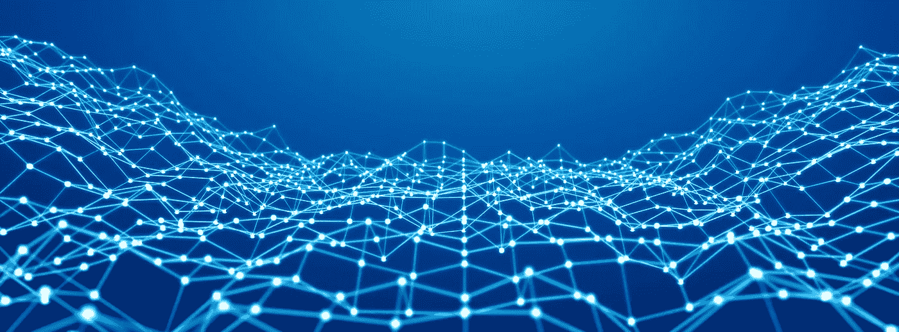

# 构建第三代区块链网络

> 原文：<https://medium.com/hackernoon/building-the-third-generation-of-blockchain-networks-52af832328e1>

在相对较短的时间里，区块链技术已经经历了几次迭代。第一次是随着中本聪开创性的比特币发明而迎来的——其核心是一种价值转移协议。

然后在 2015 年，以太坊让多功能智能合约成为现实。

我们需要努力实现真正的第三代区块链:跨链互操作性。

随着新区块链的冲击，我们陷入了技术本来要缓解的一个陷阱——支离破碎的景观。互操作性是确保技术繁荣和简化价值、信息和数字财产转移的关键。

在取得任何有意义的进展之前，链之间缺乏兼容性是需要解决的问题。让区块链能够互动将根除与流动性差相关的问题，并扩大去中心化运营体系的范围。

为了形象化这个概念，考虑一个在本地网络上运行的企业。在这个网络中，许多事情都是可能的——员工可以编写软件来做许多事情，无论是加密文件还是自动化各种任务。这很有效，但只是在一个泡泡里:与外界没有联系。这是一个内部网，许多区块链人正打算创建它。

然而，有了互联网连接，这种企业的可能性变得无限——他们可以获得丰富的信息来丰富他们的业务。他们可以与类似的企业协同工作，并交换数据。这是一个互联网，这是我们需要为区块链建设的。

今天，在这个领域已经有了一些值得注意的进展，尽管没有人们希望的那么多——这个领域的绝大多数开发人员都专注于创造新的区块链。值得一提的试图解决互操作性问题的项目是那些致力于海底交换(在闪电网络内)和以太坊团队的项目，他们设计了*等离子体*协议(尽管这还没有看到太多的实际应用)。

互操作性肯定是区块链发展较慢的领域之一，但它是一个通过连接目前在真空中运行的协议，准备交付一些最有意义的结果的领域。我们需要停止向上建设，把一切都栓在同一链条上，并开始向外建设，以便现有的数百个区块链能够开始相互作用，迎来第三代区块链。

## **关于作者**

史丹·古兰是[全球区块链](https://globalblockchain.io/)的总裁兼首席执行官，也是[激光协议](https://laser.xyz/)背后的愿景，这是一个区块链，将允许所有区块链人作为一个大网络在互联网规模上一起工作。