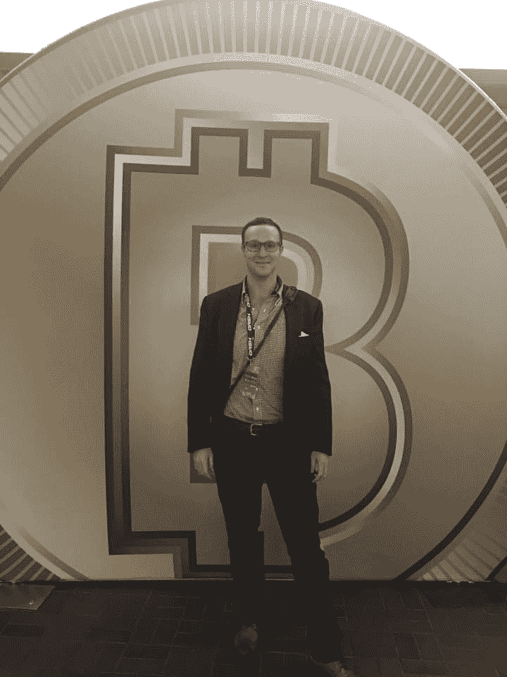
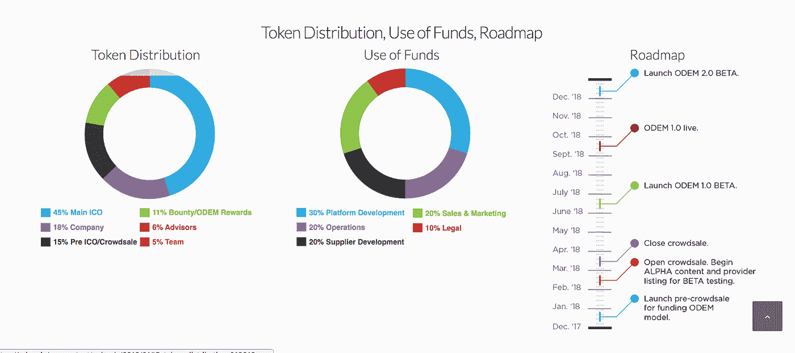

# 打造国际教育的 Airbnb

> 原文：<https://medium.com/hackernoon/building-to-be-the-airbnb-of-international-education-3b0d39c75b21>

## 创始人访谈

> ODEM。点播教育市场 IO 之前赞助过 Hacker Noon。

*如果你错过了 ODEM 首席执行官 Richard Maaghul 的第一部分，请点击这里查看:* [*教育代币能开启高等教育吗？*](https://hackernoon.com/can-an-education-token-unlock-higher-learning-8802978675d2)

*除了获得田纳西大学健康科学中心的药学博士学位，并在美国海军陆战队预备役担任了六年的战斗工程师和爆破技术员之外，* [*比尔·巴德*](https://www.linkedin.com/in/j-william-bayrd-ii-444006a/) *还负责 ODEM 的日常运营。*的首席运营官[的 ODEM*的。IO*](https://goo.gl/74Rg3t) *，他致力于利用区块链技术来扩大学生获得高质量教育的机会。今天，我们将了解一个 ICO 的幕后故事，并了解 ODEM 计划实现其更容易获得和负担得起的教育的愿景。*

[**大卫**](https://medium.com/u/7f91547ce9c9?source=post_page-----3b0d39c75b21--------------------------------) **: ODEM。2 月 17 日星期六，木卫一公开众筹。反响如何？**

比尔:没有我们预期的那么强烈。你必须明白，我们在预售中筹集的资金是我们软资本的两倍多。在众筹销售发布之前，我们的“了解你的客户”预注册非常活跃。但是，归根结底，我们认为最近全球加密货币市场的疲软削弱了对我们代币的需求。我们还认为一些潜在买家被骗子吓到了。自发布以来，我们积极提醒参与者有关安全最佳实践的信息。尽管如此，我们仍然兴奋地继续讲述我们的故事，并欢迎更多的参与者加入 ODEM 社区。

当你在 ODEM 总部准备发布会时，有多疯狂？

它非常繁忙和有趣。我们中的一些人失去了一些美容觉。开玩笑的。我们仍然对销售和收益充满期待。

**在你们关于筹集**[**220 万欧元预售**](https://odem.io/2018/02/08/odemio-exceeds-softcap-in-presale/) **的公告中，说 ODEM 立志成为国际教育的 Airbnb。我知道没有跨行业的比较是完美的，但请详细说明 ODEM 将如何像 AirBnb 一样运作？既然 Airbnb 的基本单元是住宿物业，那么 ODEM 的基本教育单元是什么呢？**

嗯，像 Airbnb 一样，我们的标准单位一点也不标准。我们的课程从一天到几周或几个月不等。我们的主题从麻醉学的复习课程到太阳能的介绍，甚至是区块链技术的初级读本。我们的主要重点是为学生提供工具，让他们能够与教育工作者合作，创建与他们职业发展特定时期相关的课程。我不应该忘记，我们为教授和讲师提供了向全球观众推销他们个人品牌的绝佳机会。

**您能否分享更多有关令牌分配的细节？主 ICO 的外行术语有哪些？**

从上面的圆形图中可以看出，45%在主要众筹销售中，18%由公司持有，15%分配给售前人员，11%用于奖金和其他奖励，6%给顾问，15%给我们的 ODEM 团队成员。

你打算如何使用代币销售的资金？

所得将用于资助区块链平台的开发。我们的具体计划取决于我们在众筹中筹集了多少资金。ODEM 白皮书中对我们提出的开支方案进行了全面的分析。在我们的网站上可以买到， [ODEM。IO](https://odem.io/) 。

我想强调的是，我们将在加密货币项目中设立新的透明度标准。我们致力于公开披露资金的使用情况。首席执行官 Richard Maaghul 和我都可以回答任何关于实际支出和平台开发的问题。

你能分享一下技术团队的情况吗？

我们的技术团队由 Adel El Messiry 博士领导，他是一位以打破常规思维著称的创新者。他曾与许多科技初创公司合作，包括 Utilize Health 和 InVivoLink。他真是一个令人印象深刻的人。他在北卡罗来纳州立大学获得了计算机科学、机器学习和自然语言处理的博士学位，会说六种语言。他正与资深软件开发人员 Sergio Diaz 和 Jose Castellanos 密切合作。

迈克尔·扎格姆博士也以顾问身份工作。Mike 是系统工程博士，主要研究分散系统的优化和控制。他正致力于将折扣券模型嵌入 ODEM 平台。我们很高兴能与 Mike 合作，因为他拥有十多年将数据解决方案应用于业务决策应用的经验。他也是 BlockScience 的创始人，block science 是一家专注于将严谨性应用于社会技术网络系统设计的公司，这将有助于在区块链建立变革性的产品。

**您能描述下一年该平台的预期技术里程碑吗？**

当然，首先，这里有一个你的读者可能会感兴趣的图表。

我们期待在 3 月份完成众筹后，能更加专注于 ODEM 的技术方面。我们仍然计划在今年 7 月发布一个测试版，并在 9 月上线。到今年年底，我们的目标是发布 2.0 版本的测试版。我们意识到我们有许多工作要做。

**让我们回到 ODEM 的开始？这一切是如何开始的？**

在 Excelorators，我们向世界各地的学生提供国际教育，并通过许多中介机构开展工作，完成提供面对面教育所需的所有要素的书面合同——教授、教室、航班、酒店、住宿、食品、媒体服务。我们看到的是一个巨大的机会，通过区块链技术和智能合同来简化这一点，并真正将所有这些都纳入其中。

我们也开始看到，我们的客户和学生开始要求我们提供国际课程。他们想让我们不仅在他们的原籍和文化中，而且在不同文化中主持节目。但要做到这一点是一个挑战，需要多种货币、多种支付、多种语言的翻译和口译。我们开始提供这些项目，我们发现可以通过在 Excelorators 当前的商业模式中使用区块链来解决这个复杂性。这是一个解决复杂性问题的方案，通过提供透明和低成本的教育，也解决了我们客户的需求。

**你对教授/老师登上讲台有什么看法？你认为什么类型的教育机会/课程越来越受欢迎，为什么？**

我们的寄宿方法是与我们的教育者建立持久的信任关系。我们的合作伙伴 Excelorators 公司在登机方面领先一步。我们的第一步是让我们目前所有的教授加入进来，包括 Excelorators 在美国各地精英大学的近 250 名教授。

第二步是开始在整个欧洲扩大一个庞大的教授群体。那将是我们的办公室和总部所在地。然后，我们希望转向我们所说的本地化，即当人们在寻找专家或教育家时，让教授与教授签约。她可能在地球的另一边，也可能在街上。你可以在自家后院找到你想要的课程。我们希望世界各地的教授都来报名。这是一种长期战略。

至于教育项目的类型，将有一个广泛的范围，反映了将参加课程的学生的多样性。我已经提到过我们的产品多种多样。我们一些最受欢迎的课程主要是让外国学生在开始正式学习之前熟悉美国的生活和教育。通过 Excelorators，我们每年夏天还在纽约州西点军校的美国军事学院提供关于全球通信和国际事务的课程。

教师能挣和他们现在工作一样多的钱吗？或者你期望 ODEM 为他们现有的工作提供额外的收入。

至少在开始时，这将是教育工作者的额外收入，但我们非常希望能为教授们的财务状况做出重大贡献。

**你和 ODEM 的合作伙伴**[**【excelerators Inc .】**](https://www.excelorators.com/)**，一家教育孵化器合作了五年多。在那里工作感觉如何？ODEM 和探索者有什么关系？**

在 Excelorators 工作对我和我的同事来说是一次巨大的个人成长经历。这个团队棒极了。每个人都相信我们正在做的事情。正是通过 Excelorators，ODEM 首席执行官 Rich Maaghul 和我真正看到了利用区块链技术和智能合同通过教育将世界联系在一起的潜力。

ODEM 和 Excelorators 共同的愿景是让教育在全球范围内更容易获得和负担得起。在我直接为 Excelorators 工作的时候，我经常旅行，在印度尼西亚和中国农村地区等新兴国家看到，高质量教育的成本对于数亿人来说实在是高得令人望而却步。

**您希望在多大程度上降低教育成本？**

我们非常兴奋能够消除许多中介，以更低的价格向学生提供课堂教育。我们的方法是，我们知道目前在我们的商业模式和五年的 Excelorators 和国际教育的经验中，我们每个课程项目至少有三到五个中介。我们知道，每一个中间商，至少会增加 25%的成本。

根据我们的研究，大多数大学在增加学生教育成本以支付校园和管理人员的所有费用时，毛利率为 60%至 70%。我们知道，如果中间有三到五个中间商，他们会增加至少 100%的成本。这意味着，如果一位教授一节课要收 1000 美元，那么在目前的模式下，当你接触到学生时，成本已经上升到至少 2000 美元。目前，我们认为我们可以提供大约 1100 美元的完全相同的价格。这就是我们所说的节约类型。

**ODEM 与** [**的合作性质是什么起源协议**](https://www.originprotocol.com/en) **？**

嗯，我们还没有说很多关于起源协议。这段感情才刚刚开始。我可以说 Origin 将会通过使用以太坊区块链和 IPFS 协议来支持 ODEM 平台的开发。

Origin 的强项是提供共享经济的技术基础，允许部分用途商品和服务的买家和卖家在网络上互动，而无需昂贵的传统中介。Origin 平台和公司员工给我们留下了深刻的印象。

**作为美国海军陆战队的战斗工程师和爆破技师，你拆过炸弹吗？你有没有想过，就这样了，我完了？**

像任何在战区服役的人一样，我面临一些危险的情况。他们真的让我想到了我们生命的脆弱和发挥潜力的重要性。

有趣的是，这有时就像一个关于闪回和濒死体验的老笑话:“我的一生在我面前闪过，而我却无动于衷。”哈。

事实上，我是在 2001 年加入海军陆战队的，就在 911 袭击前几个月。我高中毕业，正在寻找支付大学学费的方法。我把海军陆战队看做比我更重要的东西，我可以成为其中的一部分，可能有助于引导我的东西。

小时候，我总是参加体育运动。我一直喜欢团队合作。对我来说，海军陆战队看起来像一个大团队。这是高中毕业就加入的一个重要原因。我父母很震惊。我突然决定加入海军陆战队。

回顾你在高等教育机构的经历，如果当时有一个像 ODEM 这样的平台，有多少是可以被取代的？

很多都是可以避免的。与 [ODEM 在一起。我觉得我找到了我一生的工作。从海军陆战队毕业后，我获得了四年制学位，然后攻读了药学博士学位，两个学位都在田纳西大学。该说的都说了，该做的都做了，我带着 14 万美元的学生贷款债务毕业了。更糟糕的是，我在制药行业并不快乐。](https://goo.gl/74Rg3t)

长话短说，通过 Excelorators，我上了一门关于数字货币的课程。我了解了区块链技术和比特币。由于早期在比特币上的一些表现不错的押注，我得以还清贷款。

我没有忘记，正是通过非正规教育，我获得了知识，使我能够偿还债务——由我的正规教育造成的债务。它差点毁了我。因此，当我希望 ODEM 平台能够成为学生的一个工具，让他们在短时间内完成负担得起的学习，而不会让他们背负巨额贷款时，我是真诚的。我是 ODEM 方法有价值的活生生的证明。

**五年后，如果一切按计划进行，ODEM 会是什么样子？**

我希望五年后我们会成为一个家喻户晓的名字，并对学生和教育行业产生重大的积极影响。我想你会听到人们说，他们通过在负担得起的学习阶段战略性地建立自己一生的资格，从而“ODEMed”了自己的教育和职业。我们真的觉得最好的还在后面。

## 在哪里联系比尔·贝亚德:[邮箱](mailto:bill@odem.io) & [LinkedIn。](https://www.linkedin.com/in/j-william-bayrd-ii-444006a/)