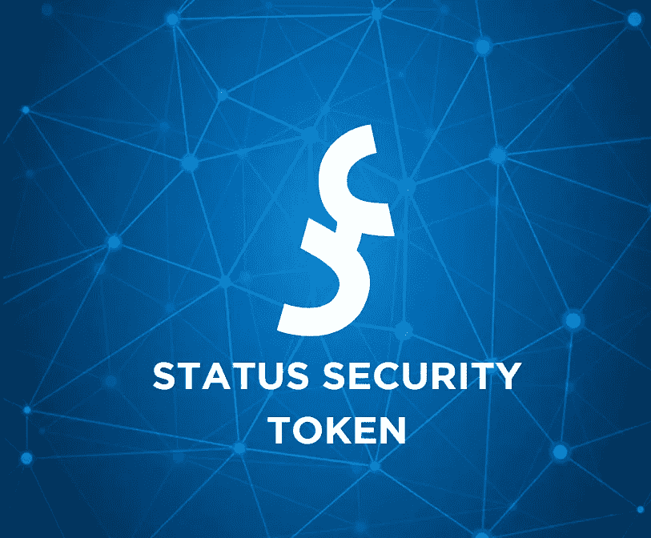
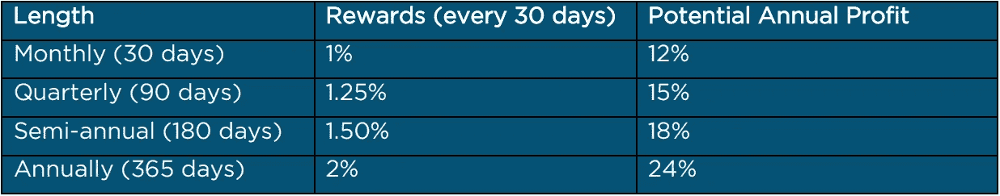
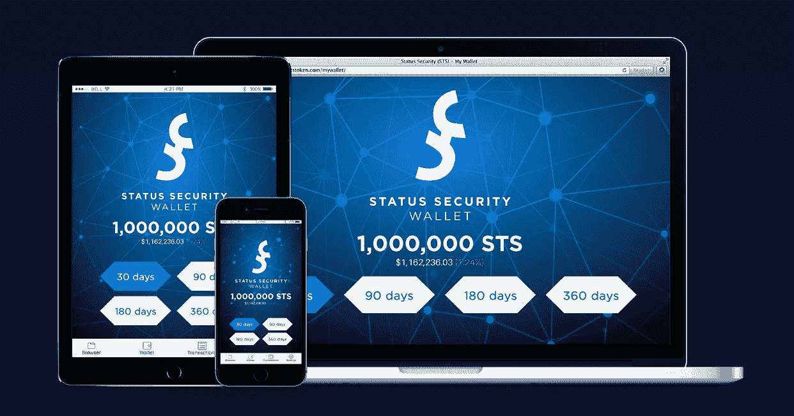

# 构建具有状态安全性的透明网络

> 原文：<https://medium.com/hackernoon/building-transparent-network-with-status-security-dc259c0c09fc>

Photo credits: [STS Project Whitepaper](https://ststoken.com/STS%20White%20Paper%202018.pdf)

尽管数字市场起伏不定，但说失去投资的风险令人伤脑筋一点也不为过。

但是国家安全局即将打破这一局面。

# **地位保障到底是怎么回事？**

状态安全，或称 [STS](https://hackernoon.com/tagged/sts) ，是一个新推出的[加密](https://hackernoon.com/tagged/crypto)项目，旨在透明网络中提供安全性、稳定性和效率。它使用点对点技术为其用户提供全球可用性。

STS 的奇妙之处在于:

他们是第一个也是唯一一个利用“基于身份的激励计划”，或者简单地说，SBIP 的硬币。

SBIP 是一个独特的系统，以确保 STS 的投资者和持有人受到激励，即使在 tippy 加密为基础的市场。

你也可以在这里了解更多:

[身份安全:致力于安全性和稳定性的革命性数字令牌](https://www.blockasia.io/status-security-volatile-sts-crypto/)

# 潜入 SBIP

长期持有者将从 SBIP 获得最大收益。

STS 用户将选择在多长时间内放置他们的令牌。根据他们的选择，投资者必须同意在商定的时间范围内冻结他们的 STS 令牌。

Photo credits: [STS Project Whitepaper](https://ststoken.com/STS%20White%20Paper%202018.pdf)

一旦它被接受，代币就不会被触动。它不能交易、出售和撤回。

这个项目优先考虑通过持有硬币而不是在交易中冒险来实现结果。

多亏了 SBIP，新进入变幻莫测的密码领域的人即使不密切关注数字市场也能获利。

Photo Credits: [Status Security](https://ststoken.com/)

Status Security 将推出一款适用于 Android、iOS 和微软操作系统的应用。发布日期尚未公布。

STS 项目组欢迎密码爱好者来看看将开放到 9 月 30 日的 ICO。

**STS 网站:**[https://ststoken.com/](https://ststoken.com/)

**STS 白皮书:**[https://ststoken.com/STS%20White%20Paper%202018.pdf](https://ststoken.com/STS%20White%20Paper%202018.pdf)

**在推特上关注:**[https://twitter.com/STStoken](https://twitter.com/STStoken/media)

**与 STS 社区就电报进行对话:**[https://t.me/STStokenCommunity](https://t.me/STStokenCommunity)