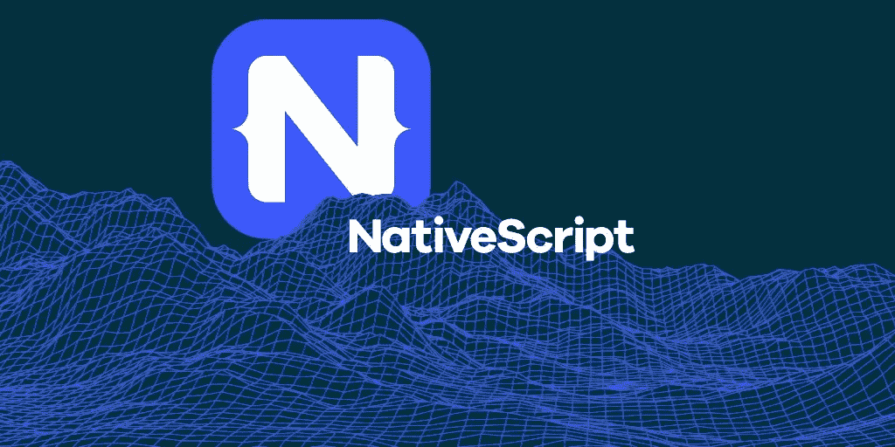

# 使用 NativeScript 构建

> 原文：<https://medium.com/hackernoon/building-with-nativescript-9e8e9d0e2fe5>

## 来自一家尝试将其应用于生产的初创公司的报告



在 TapChief，我们已经使用 Angular 个月了。我们已经很适应了。

作为一个由 5 名工程师组成的团队，我们在 Django 建立了一个 REST 后端，一个 ElasticSearch 服务器，以及两个不同的 Angular 产品。

构建原生应用成为我们的一项关键业务需求，但我们没有资源为他们组建单独的团队。

大约 3 周前，我们决定向前一步，使用 NativeScript，这样我们就可以重用我们的角度知识，并为 iOS 和 Android 提供一个共享的代码库。随着我们继续开发应用程序，我们将分享我们的经验和知识。

## 调用原生 Android/iOS 代码

这被认为是 NativeScript 与 Ionic 或 ReactNative 的最大区别。可以把它想象成 NativeScript 已经构建了一个语言翻译器，可以把你的类型脚本代码直接转换成 Java/Objective-C 代码。

我们立即怀疑这是否会像宣传的那样容易。因此，我们首先尝试的事情之一是将 QuickBlox android 和 iOS SDKs 集成到我们的应用程序中。

我们必须将 iOS SDK 包装成一个 nativescript 插件，并创建一个叫做 Podfile 的东西。这是令人生畏的，因为我们没有一个人对 iOS 开发有任何了解，但是有足够的文档来说明这一点。最后，安装 SDK 需要创建一个这样的文件夹:


Podfile 只有一行。

```
# Podfile
pod 'QuickBlox'
```

package.json 也同样简单。

```
# package.json
{
  "name": "qb-ios-plugin",
  "version": "0.0.1",
  "nativescript": {
    "platforms": {
      "ios": "1.3.0"
    }
  }
}
```

然后运行 ***tns 构建 ios。***

然后可选运行***TNS _ TYPESCRIPT _ DECLARATIONS _ PATH = " $(pwd)/typings " TNS build ios*** 为所有调用 iOS 代码的 TYPESCRIPT 代码构建 d.ts 文件。

这在挖掘一个新库时非常有用，因为它向您精确地展示了所有方法和类的 TypeScript 版本是如何被引用的——请看下面代码示例中的“declare class QMServicesManager”

> 调用本机第三方 iOS SDK 代码的类型脚本代码示例

Comparing the TypeScript code with the corresponding Objective-C Code

这是为 SDK 创建的自动生成的类型文件的一个片段。

Sample types d.ts file (auto-generated)

如你所见，它与相应的本机代码非常相似。您通常可以猜测函数名。

NativeScript 使用反射来理解 iOS/Android 代码，并为其构建 typescript 绑定。上面的 Quickblox.d.ts 就是这样一个绑定的例子。这意味着你不必等待别人来搭建桥梁来遮蔽你想要使用的第三方包。该桥是在构建时自动创建的！

这比我们预期的要容易得多，而且在一天之内拼凑出一个功能性的聊天服务集成令人难以置信地满意。尤其是你之前从来没有编码过 Android 或者 iOS 的时候！

## 以打字打的文件

就我个人而言，我非常喜欢静态打字。这使得深入他人的代码变得更加容易。同样，我们自己的角度代码库更容易维护。

如果我不能为我上面使用的 iOS 库生成类型，方法将会更加难以发现。

TypeScript 代码最终看起来与它实际调用本机桥调用的 Java 代码非常相似。语言结构经常以相似的方式映射在一起，在这里使用 TypeScript 感觉很自然。

## 构建时间

我上班用的是 MacBook 2016 (16GB Ram，SSD)。从头开始构建 APK 并将其加载到手机上的第一个周期大约需要一分钟。

后续的增量构建轻而易举。它们只需要几秒钟。不知何故，LiveSync for NativeScript 比 Angular 为 web 提供的增量编译更快！

我的一些同事用了 4 年的个人笔记本电脑，有 8GB 内存和一个硬盘。这使得构建极其缓慢。每个 android 版本从头开始需要大约 15 分钟，尽管 LiveSync(增量版本)仍然只有几秒钟长。现在，所有人都有了全新的 16 GB 固态硬盘:)

## 模板化

我们的前端领导者 Deepak 编写了我们的大部分 UI 组件。我会督促他以后写他自己的文章。从我的角度来看，他花了大约 3-4 天的时间搜索 UI 文档，并花了整整一周的时间痛苦而缓慢地编写模板。但除此之外，他在 Angular 中的工作效率几乎和 HTML 一样高。

虽然 XML 代码在大部分地方都是一样的，但是还是有一些 Android 或 iOS 特有的逻辑隐藏在模板文件中。

SCSS 在我们有角度的代码库中构建我们的风格方面发挥了重要作用，并且能够使用 SCSS 和我们在那里学到的所有惯例，这使得我们在这里的工作变得容易得多。

## 学习曲线

学习基于 XML 的模板语言花了一段时间。作为一个从未开发过 iOS 应用程序的人，我不得不学习委托、安装库和其他小习惯。android 也是如此，第一次编写插件需要一些工作。

但除此之外，实际上其他一切都和 Angular 一样。我们只是浏览了一下教程，然后直接进入编码。如果你以前有过 Angular 的经验，这应该是一个非常容易的转变——在你感到有效率之前的一两个星期。

用 Angular 编写的服务逻辑几乎是复制粘贴到 NativeScript 代码库中的。尽管 UI 组件是从零开始编写的。Deepak 一直专注于编写 UI 组件，而 Abhijith 和我一直在研究如何集成聊天、google-places、原生插件、编写富文本编辑器等等。我们 5 个人中只有 3 个人在开发 NativeScript 应用程序，我们看到了良好的进展。

文档很不错。在这和一些谷歌搜索之间，我们不需要直接接触社区来解决我们的问题。

我们对 NativeScript 很满意。有时感觉有点不可思议。有一个问题引起了社区的热烈讨论。Airbnb 会在 NativeScript 上遇到同样的问题吗？— [Airbnb 日落反应](/airbnb-engineering/react-native-at-airbnb-the-technology-dafd0b43838)

他们最大的两个问题是
*1。在 Javascript
2 中缺少输入。构建底层平台的本地桥是非常痛苦的*

这些都是 NativeScript 的固有优势。我自己的经验有限，但我敢打赌，他们对 NativeScript 会有更好的体验。

**更新:**

我们在 Github 上为 NativeScript 制作了一个示例富文本编辑器。看看吧！

[https://github.com/aukris/nativescript-rich-text-example](https://github.com/aukris/nativescript-rich-text-example)