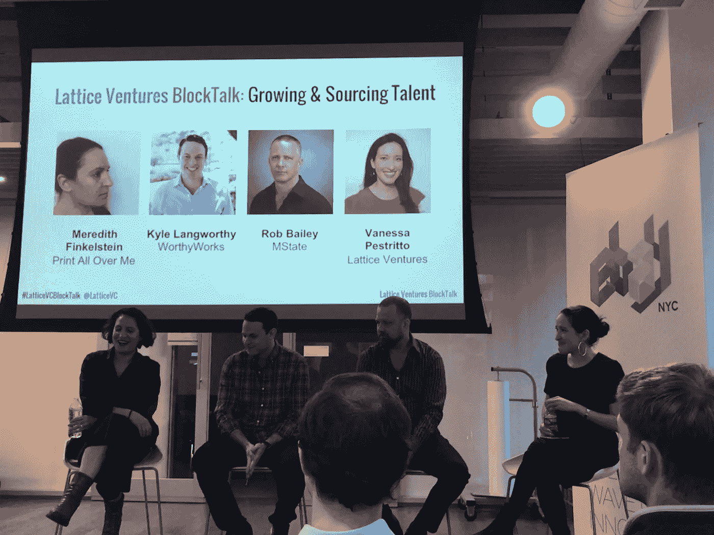

# 构建您的区块链团队

> 原文：<https://medium.com/hackernoon/building-your-blockchain-team-95d854fc6da8>

## 2017 年，区块链项目筹集了 50 多亿美元，现在缺少建造这些项目的人。

[Meredith](https://t.umblr.com/redirect?z=https%3A%2F%2Fwww.linkedin.com%2Fin%2Fmsrobot0%2F&t=NTI5ZTkwMDU2ZjYzNmYxMTJmNmNlMTY0NDQ2NDUyYTdhNzIwZDhhYix6NndOYkdUdw%3D%3D&b=t%3AGKriAc9xHnfGyzOfRkHLVQ&p=http%3A%2F%2Flikesandlaunch.com%2Fpost%2F173578038166%2Fbuilding-your-blockchain-team&m=0): CTO & Blockchain Engineer, [Kyle](https://t.umblr.com/redirect?z=https%3A%2F%2Fwww.linkedin.com%2Fin%2Fkylelangworthy%2F&t=OTY0MzdiNTU1NGViN2VhOGJjZDhlOGI2Yzk3NTBhMzgwZGZmM2Y5Yix6NndOYkdUdw%3D%3D&b=t%3AGKriAc9xHnfGyzOfRkHLVQ&p=http%3A%2F%2Flikesandlaunch.com%2Fpost%2F173578038166%2Fbuilding-your-blockchain-team&m=0): Blockchain Recruiter, [Rob](https://t.umblr.com/redirect?z=https%3A%2F%2Fwww.linkedin.com%2Fin%2Frobmbailey%2F&t=OWU2NmYyMDZlOGY3MDAxNTA1ZDIwM2ViNWRlNGU3MWNiZDMzMjA2Mix6NndOYkdUdw%3D%3D&b=t%3AGKriAc9xHnfGyzOfRkHLVQ&p=http%3A%2F%2Flikesandlaunch.com%2Fpost%2F173578038166%2Fbuilding-your-blockchain-team&m=0): Enterprise Blockchain Investor, [Vanessa](https://t.umblr.com/redirect?z=https%3A%2F%2Fwww.linkedin.com%2Fin%2Fvanessaalexandra%2F&t=ZDg2YmI3NjhlZjEwNGJmNGI4NjI5MTZlNmU4YWI2NTc1NzE4NDQyNSx6NndOYkdUdw%3D%3D&b=t%3AGKriAc9xHnfGyzOfRkHLVQ&p=http%3A%2F%2Flikesandlaunch.com%2Fpost%2F173578038166%2Fbuilding-your-blockchain-team&m=0) : Partner at Lattice Ventures

随着越来越多的区块链项目组建团队，对经验丰富的区块链人才的需求激增。有需求，但只有少量有经验的候选人。那么，区块链公司在组建团队时应该考虑什么呢？

在周一的 [Lattice VC BlockTalk](https://t.umblr.com/redirect?z=http%3A%2F%2Fwww.lattice.vc%2Fblog%2Fblockchaininvestor&t=ZDRlMmNhMGZjYzI5ZTQ5YTE0MTQ5NzI5YmQ2ZjFkNThlY2FlNTllOCx6NndOYkdUdw%3D%3D&b=t%3AGKriAc9xHnfGyzOfRkHLVQ&p=http%3A%2F%2Flikesandlaunch.com%2Fpost%2F173578038166%2Fbuilding-your-blockchain-team&m=0) 上，我们与一个专家小组坐下来，探讨区块链公司应该考虑怎样建立他们的团队。无论你是在制定建设计划，还是正在建设过程中，寻找人才是项目成功的重要因素。

以下是此次讨论的要点:

*   **为你需要的人才做计划。**大多数协议只需要 1-2 名协议工程师就可以启动，团队的其他成员通常负责市场战略、市场营销、智能合同结构和传统的 web 开发。
*   **起初，伟大的人才可能会追随金钱。**有许多优秀的协议工程师在从事糟糕的项目，或者更客气地说，是不太可行的长期项目。对于 ico 来说，现金可能是许多顶级工程师的驱动力。了解你面试的候选人的动机。
*   **有经验的协议人才稀缺，找平行经验**。具有构建较低技术基础设施经验的工程师非常适合，例如 MongoDB builders。花时间学习新语言的工程师是有潜力的。如果一个工程师为了好玩而学习 Elm 或 Rust，他们学习一门新语言应该不成问题。
*   在发布代码之前，你需要一个可靠的计划。创建新的智能合同可能需要 90%的白板规划和 10%的生产代码。在你的项目阶段雇佣员工，在需要创建代码之前先确定范围并做出明智的决定。特别是考虑到区块链技术的限制:缺乏测试、灵活性、回滚。
*   区块链教育工程项目是一个值得一看的好地方。 [【斯坦福】](https://t.umblr.com/redirect?z=https%3A%2F%2Ffsi.stanford.edu%2Fcyber&t=Y2JjY2NkZDZjYjhkOTA5Y2RkODBkZGZiMDc3MDMyMjRmOWU2MzNmNSx6NndOYkdUdw%3D%3D&b=t%3AGKriAc9xHnfGyzOfRkHLVQ&p=http%3A%2F%2Flikesandlaunch.com%2Fpost%2F173578038166%2Fbuilding-your-blockchain-team&m=0)[麻省理工](https://t.umblr.com/redirect?z=http%3A%2F%2Fblockchain.mit.edu%2F&t=YmYxMzAyNzY2MjFlNGYyMmJiMGUyYmJmM2RmNGY5M2MwYjkwYWI1OCx6NndOYkdUdw%3D%3D&b=t%3AGKriAc9xHnfGyzOfRkHLVQ&p=http%3A%2F%2Flikesandlaunch.com%2Fpost%2F173578038166%2Fbuilding-your-blockchain-team&m=0)[哥大](https://t.umblr.com/redirect?z=https%3A%2F%2Fcolumbiablockchainalliance.com%2F&t=YjE4NDg4YjhkY2M2ZmNiOGUzZTQ1YzFjMDQyMDc2ZTRkMzQ2YWZhYix6NndOYkdUdw%3D%3D&b=t%3AGKriAc9xHnfGyzOfRkHLVQ&p=http%3A%2F%2Flikesandlaunch.com%2Fpost%2F173578038166%2Fbuilding-your-blockchain-team&m=0)[NYU](https://t.umblr.com/redirect?z=http%3A%2F%2Fwww.stern.nyu.edu%2Fexperience-stern%2Fnews-events%2Fnew-york-blockchain-workshop&t=OTk2MGQxNjcyYTk4MzQ4YTgyNjFhMTc0NzNiOGVmM2U0NzgwNTZiZSx6NndOYkdUdw%3D%3D&b=t%3AGKriAc9xHnfGyzOfRkHLVQ&p=http%3A%2F%2Flikesandlaunch.com%2Fpost%2F173578038166%2Fbuilding-your-blockchain-team&m=0)[Coursera](https://t.umblr.com/redirect?z=https%3A%2F%2Fwww.coursera.org%2Fcourses%3Fquery%3Dblockchain&t=ZTQ2NjAwYzFmYTE3ODhjZjJkYjJmOTA0YjMxMWMzNTFkZmFmZTdjMix6NndOYkdUdw%3D%3D&b=t%3AGKriAc9xHnfGyzOfRkHLVQ&p=http%3A%2F%2Flikesandlaunch.com%2Fpost%2F173578038166%2Fbuilding-your-blockchain-team&m=0)只是几个有专门区块链教育项目的地方。编码训练营是好的，但并不是所有的都是平等的。除非工程师有工程经验，否则他们可能首先需要一个学徒期。
*   **期望给工程师同样的报酬。**工程人才需求量很大，在竞争激烈的市场上可能非常昂贵。好消息是，你不需要为优秀的人才支付额外费用，坏消息是，你正在与其他大大小小的公司争夺人才。
*   **走向市场策略师是最难雇佣的**。区块链生态系统有很多炒作，骗子，数十亿现金，监管，不能在大多数大平台上做广告。区块链公司无法复制 Web 2.0 的发展。找到将你的产品推向市场的人才比找到有经验的工程师更难。这也是我们将在 5 月 21 日的下一次 [BlockTalk 上邀请经验丰富的市场策略师的原因。](https://www.eventbrite.com/e/lattice-vc-blocktalk-blockchain-marketing-and-community-building-tickets-45801432317)
*   **开源和企业区块链需要不同类型的人才。**根据你是否在使用封闭式许可，区块链应该会对你招聘的经历类型产生影响。仍然需要相关的工程经验来服务于初创企业和企业。
*   多元化对所有初创公司都很重要，区块链 cos 也不例外。 [在你的团队中建立更多的多元化思维](/lessons-from-the-diversity-summit/how-to-start-talking-to-your-team-about-diversity-b60ac66876de)会创造更好的结果。小组成员在工程和其他领域遇到了令人难以置信的多样化人才，从头开始建立一个多样化的团队是合理的。不要等到第 20 次雇佣之后才开始考虑这个问题，这只会让事情变得更加困难。
*   **一个结构良好的招聘流程将帮助你赢得更优秀的人才。**计划如何赢得招聘。快速果断地行动很重要。对你的招聘过程和评估充满信心才是王道。如果你能在速度游戏中获胜，那是大公司做不到的。建议的范围从第一次联系到 2 周内提供，或者从第一次联系到不到 2 个月的开始日期。可靠的招聘流程是关键。

对区块链人才需求的更多思考？以下是我们在当前市场上看到的 Vanessa 提出的趋势概述:

# 分享区块链发展生态系统的最佳实践。

我写作是为了学习。我想听听你的意见、例子和反馈。请在评论或推文中留言 [@br_ttany](http://twitter.com/br_ttany) 。

如果你想继续讨论区块链、企业家的工具和投资，[点击这里加入每周对话。](https://t.umblr.com/redirect?z=http%3A%2F%2Ftinyletter.com%2FBr_ttany&t=MzBlOTFkZDhmZmNhMTk2YTUzYjIzOGMyNWM1OThjMzllMGExOGE2NCxJQldTaGdUUw%3D%3D&b=t%3AGKriAc9xHnfGyzOfRkHLVQ&p=http%3A%2F%2Flikesandlaunch.com%2Fpost%2F171199026921%2Funsolved-issues-moving-from-equity-to-tokens&m=0)

在纽约？[5 月 21 日加入我们，参加专注于营销的 Lattice VC BlockTalk】社区建设。](https://www.eventbrite.com/e/lattice-vc-blocktalk-blockchain-marketing-and-community-building-tickets-45801432317)

*最初发表于*[T5【likesandlaunch.com】](http://likesandlaunch.com/post/173578038166/building-your-blockchain-team)*。*