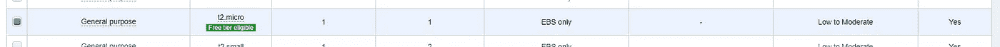

# 在 AWS 上构建您的私人近地天体网络(第 1 部分)

> 原文：<https://medium.com/hackernoon/building-your-private-neo-network-on-aws-part-1-c01525dadc1c>

上周，我们介绍了如何安装一个命令行界面来与公开的近地天体[区块链](https://hackernoon.com/tagged/blockchain)进行交互。但是，我们不能在这种环境下开发我们的合同——在这里部署将花费我们大约 500 汽油或大约 25000 美元！相反，部署我们自己的**私有 NEO** [**网络**](https://hackernoon.com/tagged/network) 并在那里测试我们的智能合约是一种很好的做法。要做到这一点，我们需要一台服务器…还有比亚马逊网络服务更好的地方吗！我们开始吧！

“Fans and wires on the back of a computer server” by [Thomas Kvistholt](https://unsplash.com/@freeche?utm_source=medium&utm_medium=referral) on [Unsplash](https://unsplash.com?utm_source=medium&utm_medium=referral)

**步骤 1:** 从 AWS 启动 EC2 实例

登录您的 [AWS 账户](https://aws.amazon.com/premiumsupport/knowledge-center/create-and-activate-aws-account/)，点击*服务* > *EC2 >启动实例*

choose the *Amazon Linux 2 AMI*

选择 t2.micro *(免费！如果这是你第一次也是唯一一次)*

点击*审核并启动>启动！*您将看到以下弹出窗口:

如果这是您的第一个实例，从下拉菜单中选择*创建新的密钥对*。将新的密钥对命名为> *下载密钥对*。**发射！**

**步骤 2:** 准备 SSH 的密钥对

如果您还没有这样做，[在此](https://www.chiark.greenend.org.uk/~sgtatham/putty/latest.html)下载 putty。

我们需要首先改变你的。pem 文件，转换成 putty 可以使用的东西(。ppk)。转到 Windows 开始，搜索 *PuTTYgen。*

一旦打开，点击*加载*下拉>为*所有文件(*。*) >选择 myfirstkeypair.pem.*

点击*保存私钥*。

*您确定要在没有密码的情况下保存此密钥吗？* **是**

**第三步:**找到你的公共实例的 IP

您的实例现在应该已经启动并运行了！回到 AWS 控制台，*服务> EC2。*点击*实例，*你应该看到以下内容:

记下**公共 DNS (IPv4)** 和 **IPv4 公共 IP。**

**第四步:** SSH 时间！

启动**油灰**。在**类别下**、*连接* > *SSH* >点击 *Auth。浏览以找到。你通过 PuTTYgen 生成的 ppk 文件。*

接下来返回到*会话*。在*主机名*下，放入**步骤 3** 中你的服务器的**公共 DNS** 。在*保存的会话*下，为您的服务器命名！点击*保存*！

点击打开！用户名:**ec2-用户**

我们暂时就此打住。如果你是亚马逊网络服务的新用户，那么它确实是一个改变行业的工具，我们今天仅仅触及了它的表面。启动单个微实例属于“免费层”,不应该花费您一分钱！务必小心:*添加额外的基础设施(EBS 卷、增加服务器大小……)会产生成本！*

[**nodis . io**](https://nodis.io)**是一个面向当地企业的营销平台，通过小型活动产生参与度，并向用户奖励加密货币，用户以后可以在这些商店消费。我们知道做一个独立的企业是困难的——no dis 不仅通过创建一个社区来帮助和参与解决这个问题，而且将这种努力表现为可消费的代币！**

**在 insta gram[和脸书](https://www.instagram.com/nodis.io/)和[上关注我们！](https://www.facebook.com/NodisGetNoticed/)**

****下周指南:**AWS 上的私人 NEO 网络(第二部分)。敬请期待！**