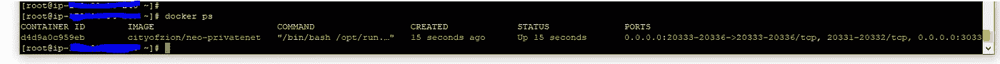
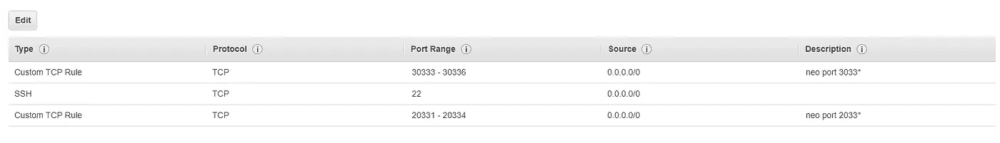

# 在 AWS 上构建您的私人近地天体网络(第 2 部分)

> 原文：<https://medium.com/hackernoon/building-your-private-neo-network-on-aws-part-2-4dc975744bf8>

[上周](https://hackernoon.com/building-your-private-neo-network-on-aws-part-1-c01525dadc1c)，我们创建了一个 AWS 帐户，部署了一个 EC2 Linux 实例，并学习了如何通过 SSH 连接到该服务器。在 Docker 的帮助下，我们将在刚刚创建的 linux AMI 中部署一个私有的 NEO [网络](https://hackernoon.com/tagged/network)！

那么什么是 **Docker** ？Docker 是容器化[技术](https://hackernoon.com/tagged/technology) —它帮助我们运行“映像”或包，在那里我们不必担心 NEO 节点、网络、依赖性和任何预配置。这是为我们写出来的 docker 图像，我们需要做的就是下载并运行它！

不过，让我们花点时间来理解我们特定的 Docker 形象。它包含 4 个[近地天体共识节点](http://docs.neo.org/en-us/basic/consensus/consensus.html)，这是建立一个工作的近地天体网络所需的最少节点，通过端口 30333-30336 TCP 进行内部通信。然后，我们将通过操纵我们的 AWS 安全组向外界公开 [**testNet** 通信端口](http://docs.neo.org/en-us/node/introduction.html)(20331–20334)。

查看 [**锡安公民**](https://cityofzion.io/) ，这是一个与 NEO 合作的开源社区。这是他们的 Docker 图像[源代码](https://github.com/CityOfZion/neo-privatenet-docker)，如果你想看看的话！

通过安全 shell 进入您的亚马逊 Linux 实例后，我们将安装 Docker …

**第一步:**安装 Docker

```
sudo yum update -y
sudo yum install -y docker
sudo service docker start
sudo usermod -a -G docker ec2-user
```

**步骤 2:** 检查并部署我们的 Docker NEO 网络映像

```
docker info #just a check
docker pull cityofzion/neo-privatenetdocker run --rm -d --name neo-privatenet --expose=20331-20334 --expose=30333-30336 -p 20333-20336:20333-20336/tcp -p 30333-30336:30333-30336/tcp cityofzion/neo-privatenet
```

检查您的映像是否正在运行！`docker ps`



**步骤 3:** 将端口 30331–30334 添加到您的安全组

登录 AWS 控制台，*服务* > *EC2。*在*网络&安全*下，点击*安全组*。在分配给实例的安全组上单击*编辑*。创建以下**入站**规则:



*这些规则立即适用！

**第四步:**从你的 **neo-prompt** 连接！

在本地打开命令提示符:

```
ubuntu
sudo -icd <location of neo-python>
source venv/bin/activate
```

还记得我们在上一篇文章中是如何记下公共 IP 的吗？让我们在这里使用它:

```
np-prompt -p <server IP>
```

太好了！我们完了！

**奖励命令**:重启 NEO 区块链。

根据我们的经验，由于服务器内存的限制，您的映像将需要每周重新启动。这样做的命令如下:

```
docker stop neo-privatenet
```

然后在你自己的 np-prompt (Ubuntu)上使用以下命令:

```
rm -rf /root/.neopython/Chains/
```

像往常一样，我会大声喊出我的项目: [Nodis.io](https://nodis.io) 是一个面向当地企业的营销平台，通过小型活动产生参与度，并向用户奖励加密货币，他们以后可以在这些商店消费。看看我们，并在 [Instagram](https://www.instagram.com/nodis.io/) 和[脸书](https://www.facebook.com/NodisGetNoticed/)上给我们反馈！

**下周指南:**部署 NEP-5 智能合同(第 1 部分)