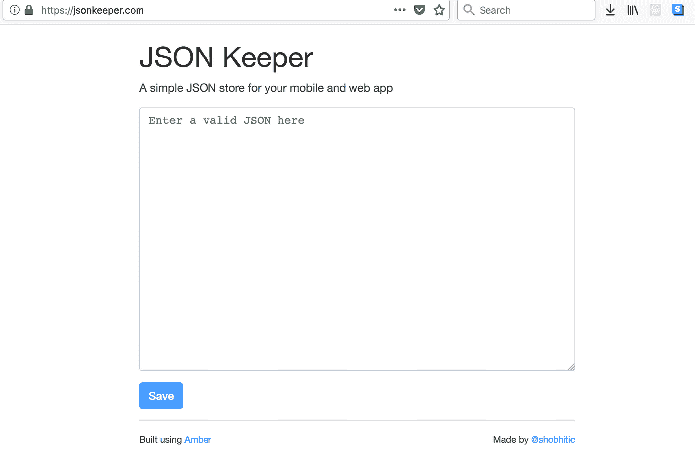

# 两天内构建并部署了一款琥珀应用

> 原文：<https://medium.com/hackernoon/built-and-deployed-an-amber-app-in-2-days-95be52887922>

昨天晚上，我将我的第一个 [Amber](https://hackernoon.com/tagged/amber) 应用程序投入生产。这是一个为你的手机和网络应用提供的 [JSON 托管服务。我叫它](https://jsonkeeper.com/) [JSON 门将](https://jsonkeeper.com/)。

这个应用程序现在非常简单明了。它只有一个屏幕，没有用户帐户。你只需进入网站，粘贴你的 [JSON](https://hackernoon.com/tagged/json) 并接收一个托管它的 URL。

构建应用程序与 [Rails](https://hackernoon.com/tagged/rails) 的体验非常相似。Amber 拥有良好的旧 MVC 结构，并定期在几微秒内发出响应。

我花了一些时间去理解它是在微秒内报告事情。我一直在比较 Amber 应用程序和 Rails 应用程序的响应时间。这有点令人失望，因为我看到 Rails 为 300 毫秒，Amber 应用程序为 300 秒。

后来，当我仔细观察时间单位时，一切都变得有意义了。

开发这个应用程序是一次令人耳目一新的经历。我担心强打字会影响工作效率，但这种情况很少发生。虽然我确实遇到了一个奇怪的 bug，它只在生产中出现，但那是以后的事了。

# 速度

是的，ruby 爱好者尝试新框架和语言的任何帖子都会引起速度比较，但这是真的。Crystal 是一种非常快速的语言，当通过创建一个优化的二进制文件进行部署时，其响应时间是惊人的。

正如我在几段前说过的，Amber 在不到 1 毫秒的时间内产生响应。想想吧！与 MRI 和 passenger 一起部署的一个类似的 Rails 应用程序需要 200 毫秒左右的时间来生成响应。

不用说，Crystal(和 Amber)真的给了我们很高的速度，让我们很愉快地与语言打交道。

“快如 C，滑如红宝石”是真的！

# 部署

[部署](https://hackernoon.com/tagged/deployment)体验琥珀色非常好。您可以构建一个二进制文件来复制粘贴(或“scp ”)到您的服务器，它有所有需要的文件和代码来运行服务器。不再需要在您的服务器上安装和维护依赖项。这也有助于我们与他人分享我们的应用程序。

这与 Go lang 部署 it 的方式非常相似。

在手动构建和部署的基础上，Amber 提供了一些现成的部署方法。目前它支持数字海洋和 Heroku，对 AWS，Azure，GCP 的支持即将推出。

这有点像 Capistrano 集成在框架本身中，具有本地支持和启动服务器的能力。虽然，我没有使用这个功能，因为我想体验部署琥珀/水晶应用程序的原生方式。

# 稳定性

稳定性可以通过两个不同的参数来衡量——服务器部署后的稳定性如何，以及框架/语言在新版本中引入突破性变化时的稳定性如何。

服务器似乎非常稳定。我对它做了一些负载测试，虽然 Ruby/Node 服务器开始响应缓慢，但我没有发现 Amber 有这样的问题。

不过这个框架和它的 API 大部分还在开发中。我自己对框架做了几个提交，通过阅读代码和讨论，你会发现框架，甚至可能是语言，将会在下一个版本中有突破性的改变。

公平地说，我用过 Amber v0.8.0 和 Crystal v0.25.0，所以这些东西是意料之中的。

# 结论

我对这两项小技术的未来感到非常兴奋。编写 Crystal 是一种乐趣，它提供了许多 Ruby 本身无法提供的东西。所有水晶(和琥珀)现在需要的是一个严重的企业支持，他们将会大受欢迎。

*原载于 2018 年 6 月 27 日*[*【www.pilanites.com*](https://www.pilanites.com/deployed-amber-crystal/)*。如果你喜欢读这篇文章，介意推荐这篇文章吗？很有帮助！*

*谢谢！*