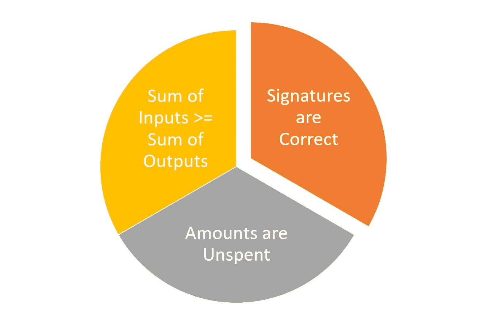
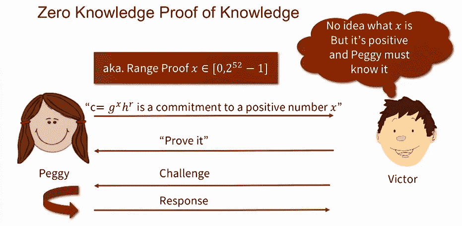
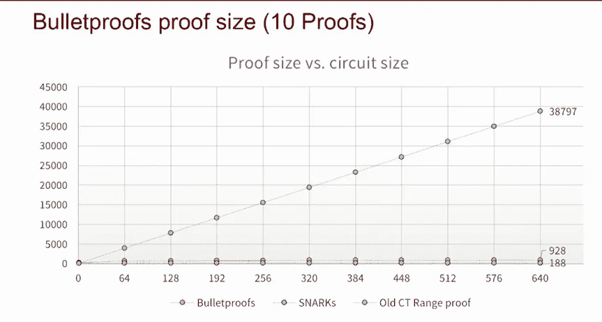
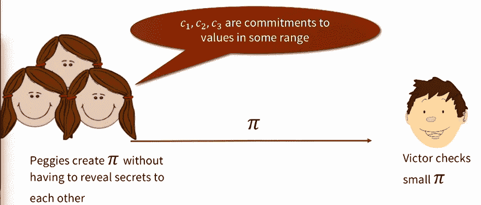

# Bulletproofs:区块链安全领域的新成员

> 原文：<https://medium.com/hackernoon/bulletproofs-the-new-kid-in-blockchain-security-land-e730fc0efe14>

KK

昨晚，[有消息称，作为区块链的一部分，Monero 将实施一个新的、更具扩展性的隐私协议。Bulletproofs 最初发表在斯坦福大学](https://www.coindesk.com/monero-to-become-first-billion-dollar-crypto-to-implement-bulletproofs-tech/)的 [2017 年白皮书中，并迅速成为区块链社区的一个研究领域。随着这一宣布，Monero 成为第一个采用 bulletproofs 作为隐私协议的加密货币。正如 zk-SNARKS 或安全多方计算等前辈一样，bulletproofs 拥有成为下一波区块链应用程序中最重要的隐私协议之一的所有要素。](https://web.stanford.edu/~buenz/pubs/bulletproofs.pdf)

Bulletproofs 不一定是密码学上的突破，而是现有技术的巧妙结合。具体来说，bulletproofs 起源于另一个隐私协议，如机密交易和零知识证明。事实上，理解 bulletproofs 最简单的方法是分析这两种其他加密方法的演变。

# 机密交易和零知识证明

如果我们考虑验证加密货币交易所需的步骤，它们可以总结为三个步骤:

**签名正确:**交易来自有效节点。

**未支出金额:**不存在重复支出问题。

**投入之和大于产出之和:**具体来说:产出=投入——交易费用。

虽然所有加密货币都有正确验证交易的方法，但大多数加密货币都是为了维护公众对信息的访问。2016 年，Greg Maxwell 引入了保密交易的概念，该概念有效地将交易金额替换为可由接收者验证的加密承诺。加密断言通常基于 [Pedersen commitments](https://en.wikipedia.org/wiki/Commitment_scheme) ，这是一种可以表达关于可验证值的声明同时隐藏值本身的方法。机密交易当然能够实现具有可验证签名和未用金额的安全交易，但是使得接收者不可能验证输入的金额大于输出的金额。这就是零知识证明发挥作用的地方。

知识的零知识证明通过允许接收者挑战发送者来证明特定的断言，扩展了机密的交易。虽然从隐私的角度来看，这种技术非常有效，但是它们极大地增加了交易的规模，并且通常需要可信的设置，这使得它难以大规模应用。STARKs 试图解决其中的一些限制，但实际上仍然不太可行。输入 bulletproofs。

# 什么是防弹？

从概念上讲，bulletproofs 可以被认为是一种更有效的零知识证明形式，它不需要可信的设置。Bulletproofs 是知识系统中一种新的零知识论证，用来证明秘密承诺值存在于给定区间。为了实现这一点，bulletproofs 利用了由 Jonathan Bottle 提出的一些优化方法来实现空间高效的零知识证明。瓶子能够创造证明大小增长的对数，而不是线性。然而，Bottle 论文背后的许多假设也导致了不切实际。

Bulletproofs 改进了 Bottle 的一些想法，创建了简短的、非交互式的零知识证明，甚至更有效的零知识证明形式，不需要可信的设置。实际上，Bulletproofs 是一种更加有效和安全的范围证明形式，它利用了 zk-SNARKS 和 STARKs 中所见的零知识证明方法，但不需要 zk-SNARKS 所要求的可信设置，也不像 STARKs 那么大。

Bulletproofs 比它的一些前辈更通用，理论上可以用来证明任何任意的陈述。bulletproofs 的对数级复杂度增量意味着它们比其他技术有效得多。例如，如果我们需要额外的 t 个证明，算法的复杂度将增加 log(t)的倍数，而不是线性增加 10 倍。下图清楚地说明了这个概念。

bulletproofs 的另一个优点是，通过利用多方计算(MPC)模型，它可以在多方环境中使用。具体来说，防弹 MPC 是该协议的一个变体，其中可以使用恒定数量的回合从不同方构造证明。

Bulletproofs 代表了一种比其他区块链隐私方法更快、更灵活、更健壮的替代方法。Monero 的实现无疑是朝着在区块链社区更广泛采用防弹系统迈出的一步，但我们应该期待更多的实现将很快推出。