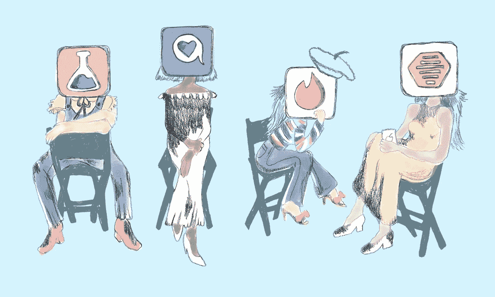

# 一触即发

> 原文：<https://medium.com/hackernoon/bumble-be-tinder-32d0209803a6>

## (利润丰厚的虚拟约会应用和网站)

Photo credit: www.manrepeller.com

我们所知道的约会已经改变了——这是一个价值数十亿美元的行业

2009 年，当我读到一篇 Inc.com 关于网站[鱼多多](https://www.pof.com/)及其创始人 Markus Frind 的报道时，我对约会网站的世界产生了过度的兴趣。然而，与大多数访问这个页面的人不同——我的兴趣不是爱情——而是金融、社会和文化。

## 财务和数字

当时，创始人 Markus Frind 估计该网站每年的净利润为 1000 万美元，而且他每周工作 10 个小时。他引起了我的注意。这是一个建立网站的人，唯一的目的是在他的简历上增加一个独立的科技企业。他从未想过网站会变成现在这个样子。引用他的话说“他不喜欢读书，所以他只用了两个星期就自己创建了这个网站”。Frind 在 2003 年启动了 Plentyoffish，作为一个附带项目。他在 2015 年 7 月 14 日将其卖给了[www.match.com](http://www.match.com)(火柴集团)的母公司——售价 5.75 亿美元。现金。

在创始人知道风险投资家这个术语的含义之前，这个网站已经赚了数百万美元。尽管他毕业于一所两年制大学，并获得了计算机编程学位，但在一年后从自己的公寓创办这个网站之前，他在 2002 年的大部分时间里都处于失业状态。在那之前，他“从一个失败的创业公司跳到另一个失败的创业公司”。他创建这个网站的目的从来不是为了寻找爱情。他形容自己“内向而笨拙”。

曾几何时，约会网站和应用程序本身会以同样的方式被描述。然而今天，据估计 POF 自诞生以来已经拥有超过 1 . 5 亿的用户。

尽管 Frind 和 POF 多年来一直保持着市场的最大份额，甚至超过了它的竞争对手和最终收购者[www.match.com，](http://www.match.com,)人们不禁认为他也在完美的时间出售了——因为流行的约会应用 Tinder 创建于 2012 年，是一个明显的游戏规则改变者。这是一个前所未闻的“滑动”功能，它让用户如暴风骤雨般席卷而来，允许他们迅速解雇或让其他用户知道他们感兴趣。没有更多的复杂的个人资料，没有更多的*多告诉我一点关于你自己的信息，*直奔主题。最多五张你最好的照片，你的社交媒体简介和一段关于你自己的文字。

Tinder 和大量的鱼现在都归 IAC 的子公司 Match Group 所有。据估计，Tinder 在全球拥有 5000 万用户，最近估值达到 30 亿美元，使 IAC 的总估值达到 46.8 亿美元左右。这种数字没有什么尴尬或内向的。

Tinder 现在占据了 IAC 60%的市场份额，证明 Frind 确实在正确的时间出售了它。Frind 自己也承认，他不喜欢改变网站，不听用户的意见，喜欢保持简单。一个创立了价值 5 亿美元公司的人很少会说的三件事。

这就把我们带到了一个叫做 Bumble 的热门约会应用。一个是由 Tinder 的早期员工惠特尼·沃尔夫·赫德(Whitney Wolfe Herd)创建的，它与 Tinder 本身非常相似，主要归功于滑动功能。

早在 2017 年 8 月，价值 10 亿美元的约会帝国 is Match Group 试图再次吞并竞争对手，并以 4.5 亿美元的价格收购 Bumble，Bumble 拒绝了这一收购要约。

两天前，Match Group 在德克萨斯州对 Bumble 提起诉讼，理由是专利侵权。Match Group 声称，Bumble 正在用自己的发明和商业秘密以及他们声称 Bumble 的创始人在 Tinder 工作期间了解到的信息与它竞争。Whitney Wolfe Herd 本人被指因性骚扰和歧视而离开 Tinder。声称人们在使用 Bumble 时不禁会想到这一点——这是一款要求女性采取第一步的应用程序，此后在一篇 *Me Too* America 的帖子中因“赋予女性权力”而受到公开称赞。

## 我的经验和观点

虽然我在 2009 年迷上了 POF，但我没有报名。那时候网上约会还是相当禁忌的。很多人都这样做了，只是他们没有公开谈论。我会看到那些 Match.com 的广告出现，只是畏缩。呃，不了，谢谢。

然后是 Tinder，比我的速度快多了。我承认，我很感兴趣。我报了名，开始刷卡。我很震惊上面居然有好看的女人。我内心的对话是这样的“这是新的标准吗？我可以告诉朋友是我下载的吗？等等，这些女人是真的吗？哦，妈的，我认识她，这些女人是真的。他妈的，她知道我现在很紧张。但是等等——她也是”。

然后是比赛和信息。Tinder 上的女性发现“嗨”是太无聊的第一条信息，但也不想让自己感觉像是刚刚对哈维·韦恩斯坦这样的人下手——作为一名男性，如果你先伸出手，你必须找到一个共同的中间立场来获得信息。

现实生活中我在 Tinder 上一共见过三个女人。其中两个是非常正常的人，其中一个我现在还时不时地和他聊天——还有一个我曾经短暂但诚实地考虑过申请保护令。

我们在星巴克见面，我给我们每人买了一杯咖啡。我不记得她点了什么——我只记得她过了一会儿就吐出来了。我问她是否喝了酒或服用了什么药物，她坚持说她没有，也没有。在她的建议下，我犹豫地把她带回了我的住处。我们一进门，她就像一只患了狂犬病的动物一样攻击我——然后很快地说我们“必须放慢节奏”——对此我完全同意并遵从。谢天谢地，在我们有进一步进展之前，我很快意识到她有多疯狂。我给她编了个名字叫优步之家。出于礼貌，我告诉她回家后给我发短信，这样我就知道她安全到达了。她到家后给我打了电话。三次，我都没有回答。她留了三条语音信息。没有一个短于三分钟。她提到，当她坐其中一辆车回家时，她会告诉妈妈“我们约会的一切”。第二天我给她回了短信，为错过她的电话道歉——这是个大错误。在接下来的一周里，我从这个女人那里收到的大量短信开始让我担心，主要是因为我在短信开始后不久就停止了回复。最终，谢天谢地，她放弃了。我敢肯定她找到了一个好男人，他可以让他们的另一半在收银台上吐出一杯 5 美元的咖啡。

尽管一开始我觉得 Tinder 很方便，但我最后的经历还是给我留下了不好的印象——实际上是字面上的意思。事实上，现在垃圾邮件似乎越来越多了。我知道有不少女性(我相信是她们)声称自己从未注册或下载过这款应用，她们的个人资料照片在 Tinder 上以不同的名字出现。他们会不会在撒谎，只是为了避免被发现主动欺骗配偶？绝对的。我只是认为这些账户更有可能是欺诈性的，希望填充统计数据，吸引更多男性用户使用该应用程序。

这又让我们回到了邦布尔。一个两周前我从没听说过的应用程序。我现在已经 30 多岁了，约会应用对我来说只是一种有趣的感觉。不过，当我听说女性必须主动时——我下载了它并开始刷卡——如果只是出于好奇的话。自从下载以来，我总共用了大概十分钟。正如我上面所说的，它是一个上面有 *Me Too spin* 的火绒。据我所知，我还没有收到消息，也没有真正的计划经常使用这个应用程序来看看这种情况是否会改变。

约会应用和网站正成为结识异性的新场所。早在 2012 年，POF 就被认为是“百万婴儿诞生”的罪魁祸首。那对我来说绝对是疯狂的。虽然我必须说，Tinder 是一个很好的选择，可以代替在我当地的酒吧认识女人。哎呀，你最近去过当地的酒吧吗？你可以在那里获得很多东西——妻子或丈夫可能不在其中。

最后，我想提一下，在这个时代，约会应用程序正成为男人们感到安全或舒适地接近女人的唯一方式。过去，我们担心的只是害怕被拒绝——接近一个女人并不会自动让你变得具有性攻击性。现在，在我们生活的世界里，男人们显然已经失去了通过约会软件先接近女人的特权。作为一个男人，我真的不知道对我的期望是什么。社会会告诉我要做一个绅士，而女人公开不喜欢太好又不够自信的男人。女权主义者会告诉我“只要像对待人类一样对待我们，我们就会回应”而“嘿，你好吗？”世界各地的人发送的信息遭到冷遇。显然，我对女人和约会的了解比我 13 岁的时候少，所以如果有人需要我，我就一个人在这里快乐地单身。