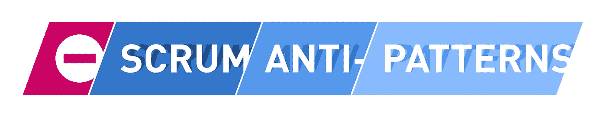

# 使用烧毁图表来发现 Scrum 反模式

> 原文：<https://medium.com/hackernoon/burn-down-charts-17a21ccfb986>

# TL；DR:使用烧毁图表来发现 Scrum 反模式

一张[燃尽图](http://www.scrumguides.org/scrum-guide.html#artifacts-productbacklog)通过可视化剩余工作与可用时间的对比来跟踪团队实现目标的进度。到目前为止，一切顺利。然而，比报告状态更有趣的是，燃尽图也可视化了团队或其组织的 scrum 反模式。

了解关于发现这些反模式的更多信息，这些反模式可以从系统问题，如团队影响范围之外的队列和其他组织债务，到团队在敏捷实践中的流畅性。

# 通过烧毁图表可视化的 Scrum 反模式

燃尽图已经变得流行，为团队成员和利益相关者提供一个容易理解的状态，一个 sprint 目标是否会被完成。(批评燃尽图的人可能会注意到，不管 sprint 目标是否可以实现，scrum 团队都应该有一种直觉。)

因此，这篇文章关注的是燃尽图的另一个有用的方面:它们同样适用于提供对各种障碍的额外见解，无论是在团队层面还是在组织层面。

下图直观地显示了四种典型的反模式，使用烧毁图表可以很容易地检测到这些反模式:

## 1.延迟承兑

产品负责人只在 sprint 的后期接受或拒绝任务:

这种行为可能源于各种问题，例如:

*   **不在的产品负责人**:产品负责人很少在团队澄清事情和接受工作。这就产生了一个人为的队列，通过延迟必要的任务澄清或者任务本身的交付，对团队交付价值的能力产生了递减的影响。(注:当产品所有者不愿意委派责任时，不易受此影响。)
*   **代理产品负责人**:团队在远程设置中工作，而产品负责人不在现场和团队的其他成员在一起。(注意:代理产品负责人通常不是解决方案，因为他或她只会增加反馈时间和沟通问题。)
*   **后果**:由于反馈回路没有提供足够的时间来解决冲刺阶段的问题，这可能会影响到下一次冲刺。团队可能无法实现冲刺目标。如果这不是一个孤立的事件，而是一个持续的模式，需要采取行动。

# Scrum 反模式指南

这本电子书涵盖了超过 160 种 Scrum 反模式，可以在这里免费获得。立即下载“Scrum 反模式指南”!

## 2.进展缓慢

在这种情况下，图表位于整个冲刺阶段的预期进度线的上方:

出现这种情况有几个原因:

*   **雄心勃勃的团队**:冲刺目标太过雄心勃勃，团队只是在冲刺阶段才意识到自己无法实现冲刺目标。(注意:追求高目标并失败是可以的，但是，这不应该成为常规模式，因为这会对组织对团队的信任产生负面影响。)
*   **顺从的团队**:从工程的角度来看，sprint 的目标过于雄心勃勃。然而，团队没有说出来，而是试图让它发生，因此在冲刺的最后失败了。
*   **能力问题**:冲刺开始后，团队的能力发生变化，比如团队成员生病，或者通知离开团队。(注意:无可否认，这无论如何都是不可规划的。)
*   优先级的改变:团队需要解决一个关键问题——可能是一个 bug——这会减少完成最初 sprint 目标的能力。(注意:根据干扰的大小，考虑取消酒精可能是有用的。至少，团队需要缩小最初的 sprint 范围——这可能需要中期的 sprint 重新规划，以确定减少的 sprint backlog 是否仍然能够交付最初的 sprint 目标。)
*   **外部依赖**:团队面临着在 sprint 规划期间不可预见的影响范围之外的依赖。(注:经典的全身机能障碍。)

## 请点击“拍手”👏，如果你觉得这篇文章有用——它对我来说意义重大！

***如果你更喜欢邮件通知，请*** [***注册我的每周简讯***](https://age-of-product.com/subscribe/?ref=Food4ThoughtMedium) ***，加入 14583 位同行。***

## 3.范围扩大

在冲刺阶段，工作范围会不断扩大:

大多数情况下，这种模式可以归因于准备不足:

*   **细化失败**:scrum 团队未能精确地细化任务，只是发现创造有价值的产品增量的努力高于最初的预期。(注意:如果这种情况在 sprint 中多次发生，那么团队在 sprint 中接受了他们还没有完全理解的故事。这指出了产品 backlog 细化过程或与产品所有者的总体合作中的严重问题。)
*   **动态 sprint backlog** :紧急任务被压或者无偿进入 sprint。(注:根据任务的大小，取消当前的冲刺，专注于显然更有价值的新问题可能是更好的选择。当然，除非这些新问题正在入侵冲刺计划的 scrum 过程。这种行为有几个例子:经理牵线搭桥，让他或她的任务进入冲刺阶段，或者任务被伪装成需要立即修复的关键错误。)

## 4.提前结束

团队比预期提前完成了冲刺目标:

当然，如果团队发现如何用比预期少得多的努力来交付任务，那么提前完成就是反反模式。或者可以用更少的计划任务来实现冲刺目标。

然而，积极的消息也可能暗示一些问题。再次，造成这种现象的原因是多方面的。我的两个最佳候选人是:

*   **过于谨慎的团队**:团队可能高估了努力，以确保其预测的安全。(注意:这可能表明管理层追踪，例如，速度作为团队成员贡献的重要度量，尽管它的用处有限。或者组织是以产出为导向的，不接受“失败”作为一个选项。在这些情况下，组织设置了错误的激励。参见[霍桑效应](https://en.wikipedia.org/wiki/Hawthorne_effect)。)
*   空闲时间的一种方法:团队包括缓冲时间，以便能够解决技术债务、配对需求或其他不经常受到关注的问题，因此设法提前完成。(注意:这可能表明当前的资源分配忽视了团队和代码库的长期健康。此外，要注意[功能工厂](https://hackernoon.com/12-signs-youre-working-in-a-feature-factory-44a5b938d6a2)综合症，团队利用率和产出比长期结果更重要。)

# 结论——使用烧毁图表来发现 Scrum 反模式

在下一次回顾中使用烧毁图表模式是一个好主意，因为它们很容易识别团队问题或系统功能障碍。在这种情况下，利用燃尽图甚至不需要切换到故事点本身——同样大小的故事可以被计数以创建 y 轴的维度。

使用额外的数据(例如，上下文和事件，以及交付周期和周期时间值)来增强烧毁图表，将会进一步增加烧毁图表的好处。

说到这里:在团队层面，我建议创建一个团队成员轮换方案，每天更新燃尽图。这是一个团队练习，不是 scrum 大师的工作。

最后，不管你使用燃尽图的目的是什么，都要避免落入一个常见的陷阱:开始计算子任务。这种计算会很快让你放弃你对“完成”的定义。相反，您将开始将任务标记为 90 %完成。欢迎使用 cargo cult 敏捷——它与瀑布方法有什么不同？

燃尽图可以揭示哪些 scrum 反模式缺失？请在评论中与我们分享。

# ✋，你想读更多这样的书吗？

好吧，那么:

*   📰*加入 14583 位同行和* [*报名我的每周简讯*](https://age-of-product.com/subscribe/?ref=Food4ThoughtMedium)
*   🐦*关注我的*[*Twitter*](https://twitter.com/stefanw)*并订阅我的博客* [*产品时代*](https://age-of-product.com)
*   💬*或者，免费加入* [*Slack 团队【动手敏捷】的 2500 多名同行*](https://goo.gl/forms/XIsABn0fLn9O0hqg2) *。*

[使用烧毁图表来发现 Scrum 反模式](https://age-of-product.com/burn-down-charts/)首次发表于《产品时代》。