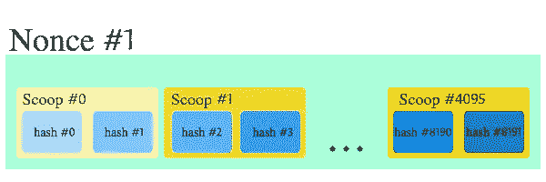

# BitcoinBurst —第 3 部分:容量证明，绿色替代方案？

> 原文：<https://medium.com/hackernoon/burst-part-3-proof-of-capacity-the-green-alternative-8e2651211671>

## 在工作证明很耗电，利益证明可能倾向于集中化的情况下，容量证明是区块链共识算法的圣杯吗？

Photo by [Thomas Kvistholt](https://unsplash.com/@freeche)

# 什么证据？

在阅读关于[比特币](https://hackernoon.com/tagged/bitcoin)或者其他[区块链](https://hackernoon.com/tagged/blockchain)技术的时候，经常会提到*工作证明*和*利益证明*这样的短语。以比特币为例，工作证明成为其天文数字能耗的原因之一。加密货币网络使用这些“证明”算法，在一个称为挖掘的过程中，对各自区块链的当前状态达成共识。简而言之，挖掘是一组不相关的分布式事务处理器验证网络上发生的事务的过程。在我进入 Burst 和它的*工作证明*算法意味着什么以及它为什么重要之前，我将描述这些其他“证明”算法意味着什么以及它们是如何产生的。

## 工作证明

*用户:比特币、莱特币、该死的附近其他人。*

Proof of Work

在 2008 年的比特币白皮书[中，工作证明(PoW)首次受到重视。当工作证明被宣布时，它的美妙之处在于它是第一个允许没有中央信任的分布式各方达成共识的机制。虽然现在我们有几个解决这个问题的方案，但在当时，这个基本问题的有效解决方案从未被提出过。](https://bitcoin.org/bitcoin.pdf)

**术语**

> 哈希:哈希是一个加密函数，是一个单向函数。哈希算法应该能够接受任意数量的数据，并返回固定长度的字符串，该字符串对于特定的输入应该是完全唯一的。
> 
> 随机数:随机数是只能使用一次的任意数字。
> 
> Miner:加密货币网络中的独立交易处理器之一，其目标是验证交易。有时也称为完整节点或节点。

通常，PoW 在比特币和许多其他加密货币中的运行方式如下:

1.  设定一个集体难度等级。这通常是指产生的“产品”或“答案”必须具有的一些特征(例如，产生的散列必须以 3 个连续的 0 开始)。
2.  每个挖掘器(或节点)开始对答案进行猜测。他们通过从当前未确认的事务、前一个块的散列和他们选择的随机数生成新的散列来测试他们的猜测。
3.  当一个挖掘器最终生成一个满足第一步条件的散列时，它会将其答案广播给网络的其余部分进行验证。如果答案被发现是有效的，则产生该答案的矿工被认为赢得了开采该区块的权利。

功耗问题开始发挥作用，因为矿工做出的每一个“猜测”都需要计算机产生一组微小的能量。目前整个比特币网络的哈希速率为 [~每秒 17，000，000 万亿次哈希](https://blockchain.info/charts/hash-rate)，即整个网络每秒 17，000，000，000，000，000 次猜测。进行这种计算所需的能量大致相当于[国匈牙利](https://digiconomist.net/bitcoin-energy-consumption)的消耗量。

## 利害关系证明

*用户:Dash、NEO、Lisk 等。*

Proof of Stake

2012 年，随着 [Peercoin](https://peercoin.net/assets/paper/peercoin-paper.pdf) 的推出，首次引入了股权证明。PoS 被视为解决 PoW 货币固有的浪费问题的一种方法。PoS 也解决了分布式共识的问题，尽管是通过不同的途径。

通常，PoS 的工作方式是使用随机算法，根据其公共属性(如年龄或节点拥有的本地货币数量)来选择挖掘节点。这使得挖掘过程至少在计算上比 PoW 算法便宜得多。请记住，这是一个非常简短的 PoS 概述，感兴趣的读者会发现这个主题比我在这里给出的更有深度和复杂性。

虽然它被认为比 PoW 更“绿色”,但在考虑 PoS 系统时也有一些缺点。其中最大的论点是，如果给予非常富有或古老的节点太多的权重，这种网络可能很快变得不公平。

## 能力证明

*用户:爆仓(不久* [*比特币矿石*](http://www.bitcoinore.org/) *)*

Proof of Capacity

容量证明，也被称为空间证明，于 2013 年在[空间证明白皮书](https://eprint.iacr.org/2013/796.pdf)中首次提出。

除了一个主要的区别之外，PoC 与 PoW 并没有太大的不同。在 PoC 中，不是为了验证每个模块而做大量的工作，而是在称为“绘图”的过程中预先完成工作，然后使用该过程的结果来验证每个模块。

从中得出的基本思想是，在 PoC 中,“工作”在绘图期间完成一次，而不是针对每个新块，从而允许 PoC 实现比电力系统更大的效率节省。矿工最终要做的“工作”量取决于他们可用于绘图过程的空闲磁盘空间量。

## 它是如何工作的？

如果你想避开 Burst 的 PoC 系统中绘图和挖掘工作的细节，请随意跳到下一节。

绘图是生成绘图文件的过程，绘图文件只是存储大量预先计算的散列的文件。每个*图*文件包含一组或多组 8192 个散列，这些组被称为*随机数。*一个nonce 的大小正好是 256KiB(每个哈希 8192 x 32 字节)。此外，每个随机数被分成 4096 对散列，这些对被称为*勺*。每个随机数也可以通过其索引号来识别，范围从 0 到 2^64.

绘图过程将矿工的突发地址作为输入，这确保了绘图文件只能由单个矿工使用。

如果想更深入地了解绘图文件是如何生成的，你可以阅读[这个](https://burstwiki.org/wiki/Technical_information_to_create_plot_files)。

一旦生成了绘图文件，就可以开始实际的挖掘过程。挖掘器将首先从钱夹中取出当前块的相关信息，这包括来自前一个块的称为“生成签名”的 32 字节散列、块高度(当前块的索引)以及基于最后 24 个块计算的称为“基本目标”的东西，并且可以被认为是块的“难度级别”。

有了这个信息，挖掘器就可以生成一个新的“生成散列”，它将使用这个散列来确定在每个 nonce 中检查哪个 scoop。对于每一个可应用的挖掘，挖掘器将在将散列除以基本目标之前用新一代签名执行额外的散列，这导致“最后期限”被返回。截止时间表示从开采前一区块开始到允许矿工开采下一区块的秒数。截止时间最短的矿工赢得开采下一个区块的权利。

见[这篇文章](https://burstwiki.org/wiki/Technical_information_about_mining_and_block_forging)对整个过程更详细的描述。

锻造下一个方块的矿工赢得“方块奖励”，在撰写本文时大约是 1200 次爆炸。

## 概念验证的演变

在最近的 Burst Dymaxion [白皮书](https://www.burst-coin.org/wp-content/uploads/2017/07/The-Burst-Dymaxion-1.00.pdf)中提到了 Burst PoC2 和 PoC3。作为 Dymaxion 工作的一部分，PoC2 的开发已经在进行中。PoC2 中的主要变化将被归入绘图文件的格式，以提供针对 SpaceMint [白皮书](https://eprint.iacr.org/2015/528.pdf)中概述的“时间-内存权衡”的保护。SpaceMint 论文的作者认为，一个矿工做一点额外的工作可能会比其他矿工有优势，同时占用更少的空间。

突发 PoC3 被认为是后 Dymaxion 变化。它建议以 PoC2 为基础，但具有存储双重用途数据(即突发图和非图数据)的能力。

## 为什么 PoC 很重要？

*   **证明能力是有效率的。**

当与使用 ASICs 来采矿电力矿工相比时，PoC 非常有效。[突发交易平均消耗的能量是每笔比特币交易的 1/500。](https://www.burst-coin.org/)

*   **能力证明便宜。**

你可以通过额外的笔记本电脑和外部硬盘来开始挖掘 Burst，而不是大多数 PoW mining 所需的昂贵的专用 ASIC 钻机或 GPU。

*   **能力证明已分发。**

因为过剩的存储空间是常见的，硬件是廉价的，并且竞争不那么激烈，所以更多样化的人群可以参与 PoC 挖掘，这意味着更分散的网络。

第 1 部分— [什么是 Burstcoin？](/@aclaytonscott/burst-part-1-what-is-burstcoin-d172561aba70)

第 2 部分— [macOS 钱包设置教程](/@aclaytonscott/burst-part-2-macos-wallet-setup-tutorial-2822bb029f54)

第 3 部分— [容量证明](https://hackernoon.com/burst-part-3-proof-of-capacity-the-green-alternative-8e2651211671)

第 4 部分— [网络分析](https://hackernoon.com/burst-part-4-network-analysis-a8c1305a5750)

第 5 部分— [如何购买爆裂](/@aclaytonscott/burst-part-5-how-to-buy-burst-5873b934ab2f)

第六部分— [突发动态解释](/@aclaytonscott/burst-part-6-the-burst-dymaxion-90f8e5c69a75)

捐款总是令人感激的

*Burst * * * Burst-Q944–2my 3–97ZZ-FBWGB*

BTC * * * 1 kumjdvx 8 fgtpsz 49 NX MML 9 up wux8g 6k 7